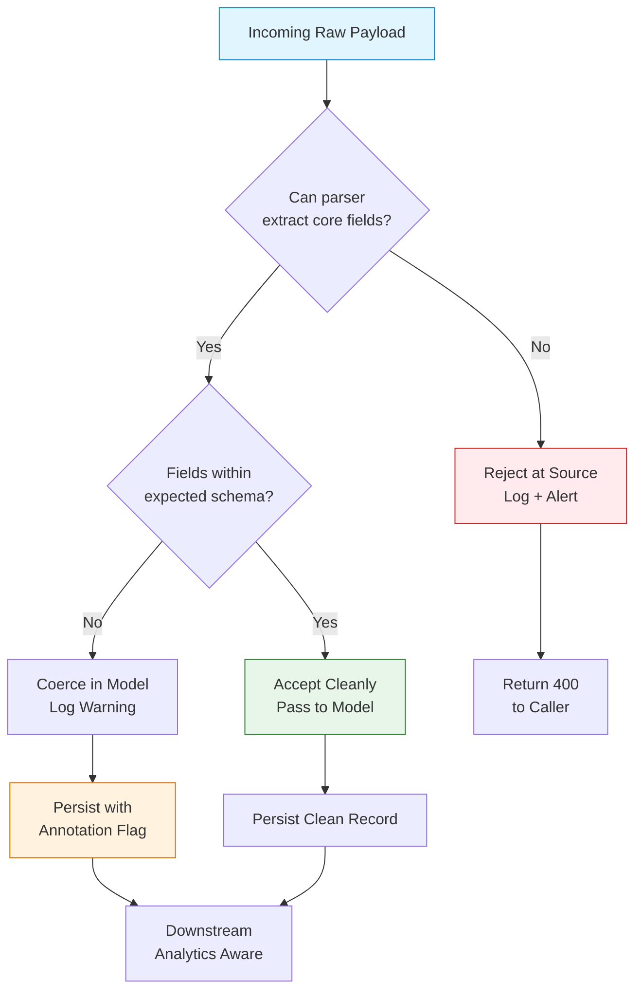

# Fix It in the Model or Fix It in the Source?

## Introduction

Last quarter, our payment ingestion pipeline silently accepted a batch of transactions where the `amount_cents` field arrived as `"1,299.00"` — a string with a comma. The parser, written to be "forgiving," stripped non-digits and stored `129900`. The downstream billing engine, expecting clean integers, charged customers $1,299.00 instead of $12.99. The bug survived three environments because every layer assumed the previous one had validated the data.

This is the classic tension: do you harden the boundary so the model never sees garbage, or do you make the model resilient enough to swallow the mess? Teams split into two camps, each convinced the other is building technical debt. The truth is neither extreme works in production. The answer depends on who owns the source, how critical the data is, and what your observability budget allows.

## Why This Matters

Data quality issues don't announce themselves with stack traces. They manifest as drifted analytics, corrupted ML training sets, and billing disputes that surface weeks later. A 2022 study by Monte Carlo Data found that data engineers spend 40% of their time firefighting quality issues — most originating at ingestion boundaries.

The decision between source-side rejection and model-side coercion shapes your entire error-handling strategy:

- **Source-side strictness** pushes complexity upstream. External providers (partners, legacy systems, third-party APIs) often cannot change quickly. You end up with versioning nightmares, rejection storms, and brittle contracts.
- **Model-side leniency** hides problems. Silent coercion turns `"twenty-five"` into `0` or `20`, and nobody notices until the quarterly report looks wrong. Debugging becomes archaeology.

The cost isn't theoretical. At a previous company, we lost a $2M contract because our "flexible" order model accepted negative quantities from a partner's buggy integration. The model coerced `-5` to `0`, the order shipped, and the partner invoiced us for returns that never happened. A strict boundary would have rejected the payload and triggered an alert within seconds.

## How It Works

The hybrid pattern — a **strange-filter gateway** — sits between raw ingestion and the domain model. It attempts structured coercion, logs every anomaly with context, and only rejects payloads that are fundamentally unparseable. The model stays clean but isn't fragile.



**Step-by-step breakdown:**

1. **Parse attempt** — The gateway tries to extract required fields using a strict parser. If the payload is missing required keys or the structure is unrecognizable (e.g., JSON parse error, missing `user_id`), it rejects immediately with a 400 and emits a structured alert.
2. **Schema validation** — For payloads that parse, each field is checked against its expected type and constraints. Fields within bounds pass cleanly.
3. **Controlled coercion** — Fields that fail validation but are *coercible* (e.g., `"25"` → `25`, `" 42 "` → `42`, `"3.14"` → `3` for an integer field) are transformed. Every coercion emits a warning log with the original value, coerced value, field path, and a correlation ID.
4. **Annotation flag** — Coerced records are persisted with a metadata flag (`_coerced_fields: ["age", "amount"]`). Downstream consumers (analytics, ML pipelines, audit) can filter or weight these records differently.
5. **Clean path** — Fully valid payloads flow through without overhead.

This isn't a compromise — it's a deliberate architecture that makes data quality *visible* rather than *hidden*.

## Core Concepts

### The Ingestion Boundary

The boundary is where external data becomes internal data. It's the only place you can enforce a contract without coupling to upstream implementations. In our systems, this boundary lives in a dedicated **ingestion service** — a thin, stateless layer that does nothing but parse, validate, coerce, and forward.

Key properties:
- **No business logic** — The gateway doesn't know what a "User" means. It only knows the schema.
- **Observability first** — Every decision (accept, coerce, reject) emits a structured log event with: `correlation_id`, `field_path`, `original_value`, `coerced_value`, `action_taken`.
- **Versioned schemas** — The gateway loads schemas from a registry (we use Confluent Schema Registry for Avro/Protobuf, but JSON Schema works too). This allows rolling updates without redeploying the gateway.

### Coercion Rules

Coercion is not "best effort." It's a defined, tested, and logged transformation. We categorize fields:

| Category | Example | Coercion Rule |
|----------|---------|---------------|
| **Numeric strings** | `"42"`, `" 3.14 "`, `"1,000"` | Strip whitespace, remove commas, parse as float → truncate/round per field spec |
| **Boolean-ish** | `"true"`, `"yes"`, `"1"`, `"on"` | Map to `true`; `"false"`, `"no"`, `"0"`, `"off"` → `false`; else reject |
| **Enum-like** | `"ACTIVE"`, `"active"`, `"Active"` | Case-insensitive match; log warning on mismatch |
| **Dates** | `"2024-01-15"`, `"01/15/2024"`, `"15-Jan-2024"` | Try ISO 8601 first, then a configured list of fallback formats |

Fields that don't match any rule (e.g., `"twenty-five"` for an integer) are **not coerced** — they trigger rejection. This prevents silent corruption.

### Annotation Flags

Every persisted record carries a `_meta` field:

```json
{
  "user_id": "usr_123",
  "age": 25,
  "_meta": {
    "ingested_at": "2024-03-15T14:22:11Z",
    "coerced_fields": ["age"],
    "source_ip": "10.0.3.44",
    "schema_version": "v3.2.1"
  }
}
```

Downstream systems *must* respect this flag. Our analytics pipeline, for example, excludes coerced records from training sets but includes them in operational dashboards with a "data quality" dimension.

## Examples & Code Walkthrough

### Source-Side Fix: Strict Rust Ingestion Service

This is the gateway's strict parser. It rejects anything that doesn't match the schema exactly. No coercion, no defaults.

```rust
// ingestion/src/parser.rs
use serde::{Deserialize, de::Error as DeError};
use thiserror::Error;

#[derive(Debug, Error)]
pub enum IngestionError {
    #[error("JSON parse error: {0}")]
    JsonParse(#[from] serde_json::Error),
    #[error("Missing required field: {field}")]
    MissingField { field: &'static str },
    #[error("Field '{field}' failed validation: {reason}")]
    Validation { field: &'static str, reason: String },
    #[error("Schema version mismatch: expected {expected}, got {actual}")]
    SchemaVersion { expected: String, actual: String },
}

/// Raw payload as it arrives on the wire — no assumptions.
#[derive(Debug, Deserialize)]
struct RawPayload {
    #[serde(rename = "schema_version")]
    schema_version: String,
    user_id: String,
    age_raw: String,        // intentionally string — we validate explicitly
    email_raw: String,
    amount_cents_raw: String,
}

/// Validated, typed output that the domain model receives.
#[derive(Debug, Clone)]
pub struct ValidatedPayload {
    pub user_id: String,
    pub age: u8,
    pub email: String,
    pub amount_cents: i64,
    pub schema_version: String,
}

/// Strict parser — fails fast, no coercion.
pub fn parse_strict(raw_json: &[u8]) -> Result<ValidatedPayload, IngestionError> {
    // 1. Parse JSON structure
    let raw: RawPayload = serde_json::from_slice(raw_json)?;

    // 2. Schema version gate — reject unknown versions immediately
    const SUPPORTED_VERSION: &str = "v3.2.1";
    if raw.schema_version != SUPPORTED_VERSION {
        return Err(IngestionError::SchemaVersion {
            expected: SUPPORTED_VERSION.to_string(),
            actual: raw.schema_version,
        });
    }

    // 3. Validate each field with precise error context
    let age = parse_age(&raw.age_raw)?;
    let email = validate_email(&raw.email_raw)?;
    let amount_cents = parse_amount_cents(&raw.amount_cents_raw)?;

    Ok(ValidatedPayload {
        user_id: raw.user_id,
        age,
        email,
        amount_cents,
        schema_version: raw.schema_version,
    })
}

fn parse_age(s: &str) -> Result<u8, IngestionError> {
    // Only accept pure digits, no whitespace, no sign
    if !s.chars().all(|c| c.is_ascii_digit()) {
        return Err(IngestionError::Validation {
            field: "age_raw",
            reason: format!("expected unsigned integer, got {s:?}"),
        });
    }
    s.parse::<u8>()
        .map_err(|_| IngestionError::Validation {
            field: "age_raw",
            reason: format!("value out of range for u8: {s}"),
        })
}

fn validate_email(s: &str) -> Result<String, IngestionError> {
    // Minimal RFC 5322 check — real impl would use a proper crate
    if s.contains('@') && s.len() <= 254 {
        Ok(s.to_lowercase())
    } else {
        Err(IngestionError::Validation {
            field: "email_raw",
            reason: format!("invalid email format: {s:?}"),
        })
    }
}

fn parse_amount_cents(s: &str) -> Result<i64, IngestionError> {
    // Strict: only digits, optional leading minus, no commas, no decimals
    let s = s.trim();
    if s.is_empty() {
        return Err(IngestionError::Validation {
            field: "amount_cents_raw",
            reason: "empty string".into(),
        });
    }
    s.parse::<i64>()
        .map_err(|_| IngestionError::Validation {
            field: "amount_cents_raw",
            reason: format!("expected integer cents, got {s:?}"),
        })
}
```

**Why this works:** The parser is fast (no regex, no fallback formats), deterministic, and every error includes the exact field and value. Upstream teams get actionable 400 responses. The domain model (`ValidatedPayload`) is guaranteed clean.

### Model-Side Fix: Python Domain Model with Coercion

This is what happens when you *don't* have a gateway — the model absorbs the mess. This pattern is common in Django/Flask apps where the ORM model doubles as the ingestion target.

```python
# domain/models/user.py
import logging
import re
from dataclasses import dataclass, field
from typing import Optional

logger = logging.getLogger(__name__)

@dataclass
class User:
    user_id: str
    age: int
    email: str
    amount_cents: int
    # Metadata populated by the coercion logic
    _coerced_fields: list[str] = field(default_factory=list, repr=False)

    @classmethod
    def from_raw(cls, raw: dict) -> "User":
        """
        Factory that coerces and logs. Never raises — always returns a User.
        Downstream callers MUST check _coerced_fields.
        """
        coerced = []

        # user_id: required, no coercion
        user_id = raw.get("user_id", "").strip()
        if not user_id:
            # We still create the object — but flag it
            user_id = "UNKNOWN"
            coerced.append("user_id")
            logger.warning("Coerced missing user_id to UNKNOWN", extra={"raw": raw})

        # age: try int, then float truncation, then default 0
        age_raw = raw.get("age_raw", "")
        age = 0
        try:
            # Handle " 25 ", "25.0", "25.9" -> 25
            age = int(float(str(age_raw).strip()))
        except (ValueError, TypeError):
            coerced.append("age")
            logger.warning(
                "Coerced invalid age to 0",
                extra={"field": "age_raw", "raw_value": age_raw, "coerced_value": 0}
            )

        # email: lowercase, strip, minimal validation
        email_raw = raw.get("email_raw", "")
        email = email_raw.strip().lower()
        if "@" not in email:
            coerced.append("email")
            logger.warning(
                "Coerced invalid email to placeholder",
                extra={"field": "email_raw", "raw_value": email_raw}
            )
            email = "invalid@example.com"

        # amount_cents: strip commas, handle decimals by truncating
        amount_raw = raw.get("amount_cents_raw", "")
        amount_cents = 0
        try:
            # Remove commas, underscores, whitespace
            cleaned = re.sub(r"[,_\s]", "", str(amount_raw))
            amount_cents = int(float(cleaned))
        except (ValueError, TypeError):
            coerced.append("amount_cents")
            logger.warning(
                "Coerced invalid amount to 0",
                extra={"field": "amount_cents_raw", "raw_value": amount_raw, "coerced_value": 0}
            )

        return cls(
            user_id=user_id,
            age=age,
            email=email,
            amount_cents=amount_cents,
            _coerced_fields=coerced,
        )

    def is_clean(self) -> bool:
        """Quick check for downstream consumers."""
        return len(self._coerced_fields) == 0
```

**The problem:** This model *looks* convenient. But notice:
- `age_raw: "twenty-five"` → `age: 0` (silent corruption)
- `amount_cents_raw: "1,299.00"` → `amount_cents: 129900` (the bug from the intro)
- No schema version check — a new field from upstream silently disappears
- Callers *must* remember to check `is_clean()` or inspect `_coerced_fields`. In practice, they don't.

### Hybrid Gateway: The Strange Filter

This is the production pattern we use. It lives in a separate service (Go, in our case) that sits between the load balancer and the domain services.

```go
// gateway/internal/coercer.go
package gateway

import (
	"context"
	"encoding/json"
	"fmt"
	"strconv"
	"strings"
	"time"

	"github.com/segmentio/kafka-go"
	"go.uber.org/zap"
)

type Coercer struct {
	logger       *zap.Logger
	schemaRegistry *SchemaRegistry
	producer     *kafka.Writer
}

type CoercionResult struct {
	Payload      map[string]any
	CoercedFields []string
	Rejected     bool
	RejectReason string
}

func (c *Coercer) Process(ctx context.Context, raw []byte, correlationID string) CoercionResult {
	// 1. Parse JSON — if this fails, reject immediately
	var rawMap map[string]any
	if err := json.Unmarshal(raw, &rawMap); err != nil {
		c.logger.Warn("JSON parse failed, rejecting",
			zap.String("correlation_id", correlationID),
			zap.Error(err),
		)
		return CoercionResult{Rejected: true, RejectReason: "malformed_json"}
	}

	// 2. Schema version check
	schemaVersion, _ := rawMap["schema_version"].(string)
	schema, err := c.schemaRegistry.Get(schemaVersion)
	if err != nil {
		c.logger.Warn("Unknown schema version, rejecting",
			zap.String("correlation_id", correlationID),
