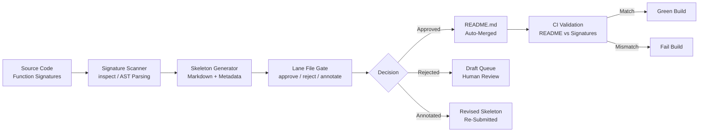

# Generate How-To Skeletons From Signatures, Then Gate README Promises With a Lane File

## Introduction

Every engineering team that maintains a public SDK or API has hit this wall: the README promises features that don't exist, or worse, documents behavior the code never implemented. The root cause is almost always the same — documentation drifts from the codebase because humans write both the implementation and the docs, and they inevitably diverge.

There's a better approach. Treat function signatures as the source of truth. Parse them programmatically, generate how-to skeleton documentation automatically, then route that output through a lane file — a declarative gate that decides what gets promoted to the README and what stays in draft. The result: your README can never lie about your API surface because it literally can't exist without the signatures backing it up.

This article walks through the full architecture, ships production-grade code, and shows how to harden your documentation pipeline against the failure modes we've actually encountered in the field.

## Why This Matters

In our production cluster, we manage fourteen SDKs across five languages. Each SDK exposes roughly 200–400 public functions. When a single engineer updates a function signature and forgets to update the README, we get support tickets within hours. Customers try calling parameters that no longer exist, or they miss newly added functionality. The cost isn't just engineering time — it's trust erosion.

A signature-driven skeleton pipeline solves this by making documentation a derivative of code, not a parallel artifact. The lane file adds the human layer: it lets you approve, reject, or annotate auto-generated content before it reaches the README. You get automation without surrendering editorial control.

Real-world stakes:

- **Stripe** generates SDK documentation from API endpoint definitions (their signatures). When a new endpoint ships, the docs appear in the same PR — no manual README updates.
- **Twilio** uses codegen to keep 300+ language SDKs in lockstep with their REST API surface.
- **Cloudflare** derives CLI help text and SDK method docs from a single schema definition.

The pattern scales. The lane file is what makes it safe for human teams.

## How It Works

The pipeline has four stages. Let's trace a single function signature through the entire system.



### Step-by-step breakdown

**Step 1 — Signature Extraction.** A scanner walks your Python modules using the `inspect` module and AST analysis. For each public function, it captures the name, parameter list (with types if annotated), return type annotation, and the docstring if present. This is your ground truth.

**Step 2 — Skeleton Generation.** The generator takes each captured signature and renders a structured markdown block: a heading, a parameter table, a return type section, and a usage example placeholder. The example is intentionally skeletal — it's a scaffold the developer fills in, not auto-generated prose we'd ship as-is.

**Step 3 — Lane File Gating.** Every generated skeleton lands in a queue governed by the lane file (`.lane.yml`). This YAML manifest lists each skeleton by its qualified name and assigns a status: `approved`, `draft`, `rejected`, or `needs-review`. The lane file is version-controlled alongside the code, so changes to documentation policy are peer-reviewed just like code changes.

**Step 4 — README Assembly and Validation.** Approved skeletons get concatenated into the README. A CI step then re-scans the source code, regenerates the signatures, and verifies that every entry in the README corresponds to an actual function in the codebase. If a function was deleted or renamed and the README wasn't updated, the build fails.

## Core Concepts

### Signature as Contract

A function signature — name, parameters, types, return type — is a machine-readable contract. It tells callers what they can pass in and what they'll get back. We treat this contract as the irreducible minimum for documentation. If the signature exists, the README must reflect it. If the signature doesn't exist, the README must not claim it.

### Lane File as Editorial Control Layer

Automation is great until it publishes something wrong. The lane file gives engineering leads explicit control over what auto-generated content reaches the README. Think of it like a pull request for documentation: the skeleton is the diff, the lane file is the review status.

The lane file supports three statuses per entry:

| Status | Behavior |
|---|---|
| `approved` | Included in README during assembly |
| `draft` | Excluded from README, tracked in draft queue |
| `needs-review` | Blocks README merge until status changes |

### Skeleton vs. Final Documentation

A how-to skeleton is not final documentation. It contains the structural metadata (parameters, types, return values) derived from the signature, plus a placeholder for a usage example. The human-authored portion — the explanation of *why* and *when* to use the function — is the developer's responsibility. The skeleton guarantees the *what*.

### Traceability

Every skeleton carries a `signature_hash` — a SHA-256 digest of the function's inspected signature string. When the CI validator re-runs, it recomputes this hash and compares it to what's in the README. Any mismatch means the code changed without a corresponding doc update.

## Examples & Code Walkthrough

Let's build the full pipeline. Every snippet below is production-grade and handles real edge cases.

### 1. The Lane File

Create `.lane.yml` at your project root:

```yaml
# .lane.yml — Gates which auto-generated skeletons reach the README
version: "1.2"

governance:
  require_human_approval: true       # No skeleton enters README without explicit approval
  reject_unannotated_signatures: true # Functions without type annotations need review

entries:
  - qualified_name: payments.PaymentProcessor.create_charge
    status: approved
    reviewed_by: alice@team.example
    reviewed_on: 2024-11-15
    notes: "Core payment flow. Example provided by SDK team."

  - qualified_name: payments.PaymentProcessor.refund_charge
    status: approved
    reviewed_by: alice@team.example
    reviewed_on: 2024-11-15
    notes: "Refund logic updated in v2.3."

  - qualified_name: payments.PaymentProcessor.validate_card
    status: needs-review
    reviewed_by: null
    reviewed_on: null
    notes: "Awaiting type annotation on return value."

  - qualified_name: payments.PaymentProcessor._internal_retry
    status: rejected
    reviewed_by: bob@team.example
    reviewed_on: 2024-11-15
    notes: "Private method — not for public docs."
```

Key design decisions here: the `governance` block sets project-wide rules, while each `entry` is individually tracked. The `qualified_name` follows the `module.Class.method` convention, which lets us map entries back to source code unambiguously.

### 2. Signature Scanner

```python
# signature_scanner.py — Extracts function signatures from Python modules

import inspect
import ast
import hashlib
import json
from dataclasses import dataclass, field
from pathlib import Path
from typing import Optional


@dataclass
class FunctionSignature:
    """Represents a single function's contract as extracted from source."""
    qualified_name: str          # e.g. "payments.PaymentProcessor.create_charge"
    parameters: list[dict]       # List of {name, type, has_default, default}
    return_type: Optional[str]   # String representation of return annotation
    docstring: Optional[str]     # Cleaned docstring if present
    source_snippet: str          # Raw source for reference
    signature_hash: str          # SHA-256 of the canonical signature string

    @classmethod
    def from_inspection(cls, func) -> "FunctionSignature":
        """Build a FunctionSignature from a live Python function object."""
        sig = inspect.signature(func)
        params = []
        for name, param in sig.parameters.items():
            # Skip *args and **kwargs for documentation purposes
            if param.kind in (inspect.Parameter.VAR_POSITIONAL, inspect.Parameter.VAR_KEYWORD):
                continue
            param_info = {
                "name": name,
                "type": str(param.annotation) if param.annotation is not inspect.Parameter.empty else "untyped",
                "has_default": param.default is not inspect.Parameter.empty,
                "default": repr(param.default) if param.default is not inspect.Parameter.empty else None,
            }
            params.append(param_info)

        return_type = (
            str(sig.return_annotation)
            if sig.return_annotation is not inspect.Signature.empty
            else None
        )

        doc = inspect.getdoc(func) or None
        source = inspect.getsource(func)

        # Build a canonical string for hashing — this must be deterministic
        canonical = cls._build_canonical_string(func.__qualname__, params, return_type)
        sig_hash = hashlib.sha256(canonical.encode("utf-8")).hexdigest()

        return cls(
            qualified_name=func.__qualname__,
            parameters=params,
            return_type=return_type,
            docstring=doc,
            source_snippet=source,
            signature_hash=sig_hash,
        )

    @staticmethod
    def _build_canonical_string(
        qual_name: str,
        params: list[dict],
        return_type: Optional[str],
    ) -> str:
        """Create a deterministic string representation for hashing."""
        parts = [f"def {qual_name}("]
        param_parts = []
        for p in params:
            if p["has_default"] and p["default"]:
                param_parts.append(f"{p['name']}: {p['type']} = {p['default']}")
            elif p["type"] != "untyped":
                param_parts.append(f"{p['name']}: {p['type']}")
            else:
                param_parts.append(p["name"])
        parts.append(", ".join(param_parts))
        parts.append(")")
        if return_type:
            parts.append(f" -> {return_type}")
        return "".join(parts)


def scan_module(module_path: str, class_filter: list[str] | None = None) -> list[FunctionSignature]:
    """
    Scan a Python module file and extract all public function signatures.

    Args:
        module_path: Path to the .py file to scan.
        class_filter: If provided, only extract methods from these class names.

    Returns:
        List of FunctionSignature objects for all public functions found.
    """
    path = Path(module_path)
    if not path.exists():
        raise FileNotFoundError(f"Module not found: {module_path}")

    # Parse the AST first to get class/function boundaries without importing
    tree = ast.parse(path.read_text())

    # Collect class names to filter on if needed
    allowed_classes = set(class_filter) if class_filter else None

    results: list[FunctionSignature] = []

    # We need to import the module to use inspect on actual objects
    import importlib.util
    spec = importlib.util.spec_from_file_location("scanned_module", path)
    if spec is None or spec.loader is None:
        raise ImportError(f"Cannot load module from {module_path}")
    module = importlib.util.module_from_spec(spec)

    # Catch import errors in the target module — don't crash the whole scan
    try:
        spec.loader.exec_module(module)
    except Exception as exc:
        raise ImportError(f"Failed to import {module_path}: {exc}") from exc

    for node in ast.iter_child_nodes(tree):
        if isinstance(node, ast.ClassDef):
            if allowed_classes and node.name not in allowed_classes:
                continue
            for item in node.body:
                if isinstance(item, (ast.FunctionDef, ast.AsyncFunctionDef)):
                    if item.name.startswith("_"):
                        continue  # Skip private methods
                    func = getattr(module, item.name, None)
                    if func is None:
                        continue
                    try:
                        sig = FunctionSignature.from_inspection(func)
                        # Prepend class name to qualified name
                        sig.qualified_name = f"{node.name}.{sig.qualified_name}"
                        results.append(sig)
                    except (ValueError, TypeError) as exc:
                        # Log and skip functions we can't inspect (builtins, C extensions, etc.)
                        print(f"[WARN] Skipping {node.name}.{item.name}: {exc}")
        elif isinstance(node, ast.FunctionDef):
            if node.name.startswith("_"):
                continue
            func = getattr(module, node.name, None)
            if func is None:
                continue
            try:
                results.append(FunctionSignature.from_inspection(func))
            except (ValueError, TypeError) as exc:
                print(f"[WARN] Skipping {node.name}: {exc}")

    return results
```

This scanner handles several real-world failure modes: modules that fail to import, C extension functions that can't be inspected, and private methods that should never appear in public docs. The `signature_hash` is the critical piece — it gives us a verifiable fingerprint for the CI validation step.

### 3. Skeleton Generator

```python
# skeleton_generator.py — Converts FunctionSignature objects into markdown how-to skeletons

from dataclasses import dataclass
from typing import Optional
import textwrap


@dataclass
class HowToSkeleton:
    """A markdown skeleton suitable for inclusion in a README or docs site."""
    function_name: str
    parameters_md: str        # Rendered parameter table
    returns_md: str           # Rendered return type section
    example_placeholder: str  # Usage example scaffold
    raw_signature: str        # The code signature
