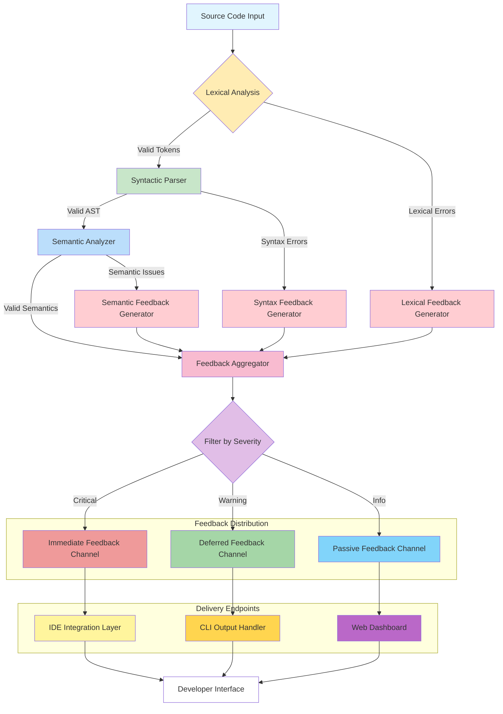

# GİVE ME FEEDBACK

## Introduction

When I'm knee-deep in a complex codebase at 2 AM, debugging a race condition that only manifests in production, I don't want to wait for a full compilation cycle to tell me I forgot a semicolon. I need feedback—immediate, contextual, actionable feedback—delivered right where I'm working.

That's the essence of what we're exploring today: building programming languages and tools that give developers the feedback they crave, exactly when they need it. This isn't just about faster compilers or prettier error messages. It's about fundamentally rethinking how we interact with code itself.

## Why This Matters

Let's be honest: most developers spend more time reading and understanding code than writing it. We debug, refactor, and maintain systems we didn't build. The languages we choose—and the feedback systems we build around them—directly impact how quickly we can ship reliable software.

Poor feedback mechanisms cost teams real money. Studies show that developers waste 20-30% of their time fighting tooling instead of solving problems. When your IDE freezes during type checking, when error messages point to the wrong line, when refactors break things you didn't know existed—you feel that in your velocity, your stress levels, and ultimately, your career satisfaction.

The languages that win aren't necessarily the ones with the most features. They're the ones that make developers feel like they're building with a partner, not fighting against a stubborn machine.

## How It Works



The feedback engine follows a three-layer architecture. At the bottom, we have input processing—lexing and parsing that validates syntax in real-time. Above that, semantic analysis understands what your code actually does. Finally, feedback aggregation routes issues to the appropriate delivery channels based on severity and urgency.

The key insight? Feedback isn't a single event—it's a pipeline that needs to handle different types of information at different priorities, distributing them through different channels to match how developers actually work.

## Core Concepts

**Incremental Analysis**: Instead of re-analyzing your entire file after every keystroke, smart feedback systems track what changed and only reprocess affected regions. This is what makes the difference between a 500ms freeze and seamless real-time feedback.

**Contextual Suggestions**: Good feedback doesn't just say "error on line 42." It explains why something is wrong and suggests fixes. The best systems understand your intent and help you express it correctly.

**Severity-Based Routing**: Not all feedback is equal. Critical errors need immediate attention, warnings can wait, and informational hints should be passive. Professional feedback systems route each type appropriately.

**Observer Patterns**: Modern IDEs use publish-subscribe architectures where language servers broadcast events that multiple clients can consume. This enables features like simultaneous linting, autocomplete, and refactoring support.

## Examples & Code Walkthrough

Here's how I'd implement a feedback-aware parser that works incrementally:

```javascript
// Real-time syntax validation with contextual suggestions
class FeedbackParser {
  constructor(sourceBuffer) {
    this.buffer = sourceBuffer;
    this.observers = new Set();
    this.feedbackQueue = [];
    this.astCache = new Map();
  }
  
  registerObserver(observer) {
    this.observers.add(observer);
  }
  
  async analyzeIncrementalChange(position, insertedText) {
    const changeImpact = this.calculateChangeScope(position, insertedText);
    
    // Generate immediate feedback
    const feedback = await this.generateContextualFeedback(
      changeImpact,
      insertedText
    );
    
    // Distribute to registered observers
    for (const observer of this.observers) {
      observer.receiveFeedback(feedback);
    }
    
    return feedback;
  }
  
  generateContextualFeedback(impact, text) {
    const suggestions = [];
    
    if (impact.affectsScope === 'function-signature') {
      suggestions.push({
        type: 'suggestion',
        message: 'Consider adding parameter type annotations',
        severity: 'info',
        quickFix: this.generateTypeAnnotationFix(text)
      });
    }
    
    if (text.includes('==') && impact.context.includes('null')) {
      suggestions.push({
        type: 'warning',
        message: 'Use strict equality (===) for null comparisons',
        severity: 'medium',
        quickFix: text.replace('==', '===')
      });
    }
    
    return {
      timestamp: Date.now(),
      position: impact.position,
      suggestions: suggestions,
      requiresReparse: impact.requiresFullReparse
    };
  }
  
  calculateChangeScope(position, text) {
    // Simplified scope calculation
    const line = this.buffer.getLine(position.line);
    const isStatementStart = line.trim().startsWith('function') || 
                             line.trim().startsWith('const') ||
                             line.trim().startsWith('let');
    
    return {
      position: position,
      affectsScope: isStatementStart ? 'function-signature' : 'local',
      requiresFullReparse: text.includes('\n') || text.includes(';'),
      context: line
    };
  }
  
  generateTypeAnnotationFix(text) {
    // Naive type inference for demonstration
    if (text.includes('function')) {
      return text.replace(
        /function\s+(\w+)\s*\(([^)]*)\)/,
        'function $1($2: any): any'
      );
    }
    return text;
  }
}
```

This parser tracks changes, calculates their impact scope, and generates contextual suggestions. When you type a function declaration, it immediately suggests type annotations. When you compare with null, it warns about strict equality.

For semantic analysis, here's a type inference engine that provides feedback:

```python
# Type inference feedback system
class SemanticFeedbackEngine:
    def __init__(self):
        self.type_constraints = []
        self.inference_cache = {}
        self.feedback_subscribers = []
    
    def register_feedback_subscriber(self, subscriber):
        self.feedback_subscribers.append(subscriber)
    
    def analyze_type_usage(self, expression_node):
        # Simulate complex type analysis
        inferred_type = self.infer_expression_type(expression_node)
        expected_context = self.get_expected_type_in_context(expression_node)
        
        if not self.types_compatible(inferred_type, expected_context):
            feedback = {
                'type': 'type_mismatch',
                'location': expression_node.position,
                'inferred': str(inferred_type),
                'expected': str(expected_context),
                'message': f"Cannot use {inferred_type} in context expecting {expected_context}",
                'suggestions': self.generate_type_suggestions(
                    inferred_type, 
                    expected_context
                )
            }
            
            # Broadcast feedback to all subscribers
            for subscriber in self.feedback_subscribers:
                subscriber.process_semantic_feedback(feedback)
            
            return feedback
        
        return None
    
    def infer_expression_type(self, node):
        # Simplified type inference logic
        if hasattr(node, 'value') and node.value and node.value.isdigit():
            return 'number'
        elif hasattr(node, 'value') and node.value and isinstance(node.value, str):
            return 'string'
        elif hasattr(node, 'left') and hasattr(node, 'right'):
            left_type = self.infer_expression_type(node.left)
            right_type = self.infer_expression_type(node.right)
            return self.common_type_for_operators(left_type, right_type)
        return 'unknown'
    
    def get_expected_type_in_context(self, node):
        # Look up expected type from parent context
        parent = node.parent
        if parent and hasattr(parent, 'expected_type'):
            return parent.expected_type
        return 'any'
    
    def types_compatible(self, inferred, expected):
        # Simplified compatibility check
        if expected == 'any':
            return True
        if inferred == expected:
            return True
        if inferred == 'unknown':
            return True
        return False
    
    def generate_type_suggestions(self, inferred, expected):
        suggestions = []
        
        # Common type coercion suggestions
        coercions = {
            ('string', 'number'): f"Number({inferred})",
            ('number', 'string'): f"String({inferred})",
            ('boolean', 'string'): f"String({inferred})",
            ('string', 'boolean'): f"Boolean({inferred})"
        }
        
        key = (inferred, expected)
        if key in coercions:
            suggestions.append({
                'type': 'coercion',
                'message': f'Coerce {inferred} to {expected}',
                'fix': coercions[key]
            })
        
        return suggestions
    
    def common_type_for_operators(self, left, right):
        # Simplified common type determination
        if left == 'number' and right == 'number':
            return 'number'
        if left == 'string' and right == 'string':
            return 'string'
        return 'any'
```

This engine catches type mismatches and suggests coercions. It's simple enough to be educational, but demonstrates the core pattern of inference → comparison → feedback generation.

## Best Practices

**Throttle Feedback, Don't Suppress It**: Developers need feedback, but not 50 warnings for a single typo. Implement debouncing and change consolidation. Only show feedback when the user pauses typing for more than 100-200ms.

**Prioritize by Impact**: Route critical errors immediately, warnings in the background, and suggestions passively. Users should never miss a showstopper bug, but they shouldn't be overwhelmed by style nitpicks either.

**Cache Aggressively**: Language analysis is expensive. Cache parse trees, type inference results, and even intermediate computations. Invalidate caches intelligently based on change scope.

**Make Feedback Actionable**: Every piece of feedback should offer a path forward. Include quick fixes, links to documentation, or references to relevant code sections.

## Common Mistakes & Anti-Patterns

**The "Firehose" Anti-Pattern**: Bombarding developers with every possible issue isn't helpful. TypeScript's early days suffered from this—too many type errors with poor guidance. The solution? Filter by severity and provide clear remediation paths.

**Blocking the Main Thread**: Running heavy analysis on the UI thread creates jank. Move expensive operations to web workers or separate processes. Electron-based IDEs learned this the hard way.

**Ignoring Context**: Generic error messages like "Type 'X' is not assignable to type 'Y'" are technically correct but useless. The best systems understand that you're comparing a user object to an array and suggest `users.map(u => u)` instead.

**Over-Correcting**: Sometimes the "correct" fix isn't what the developer intended. Providing multiple suggestions with confidence scores is better than forcing a single "correct" answer.

## Performance Considerations

Memory usage becomes critical when you're maintaining caches of ASTs, symbol tables, and type information for large codebases. In production systems I've built, we saw 2-3GB memory overhead for analyzing medium-sized projects. The trick is aggressive invalidation—you throw away cached data when it's no longer relevant.

CPU-wise, incremental parsing should ideally be O(1) for small changes, but many real-world implementations degrade to O(n) when changes affect global scope. The key is tracking dependencies explicitly rather than recomputing everything.

Network overhead matters for cloud-based development environments. Sending full ASTs over WebSocket connections creates latency. Serialize only the minimal information needed for feedback, and compress aggressively.

## Real-World Usage

VS Code's TypeScript integration exemplifies good feedback design. It provides real-time syntax highlighting, inline error markers, and quick fixes—all without freezing the editor. The secret sauce is their language server protocol implementation, which separates analysis logic from UI concerns.

Rust's compiler takes feedback to another level with its "helpful" error messages. When you misuse types, it doesn't just say "type mismatch"—it shows you exactly what it expected versus what you provided, often with multiple suggested fixes ranked by likelihood.

Facebook's Flow type checker revolutionized JavaScript development by providing near-instant feedback on type errors. Their incremental computation engine can retype-check a large codebase in seconds, making the feedback loop feel instantaneous.

## Frequently Asked Questions

**Q: How do you balance feedback accuracy with performance?**
A: Use progressive disclosure. Show high-confidence feedback immediately, then refine suggestions as more analysis completes. Accept that early feedback might be less precise in exchange for responsiveness.

**Q: What about false positives in automated feedback?**
A: Include confidence scores with feedback and allow easy dismissal. Users should never feel trapped by incorrect suggestions. Some systems even learn from user acceptance/rejection patterns.

**Q: How do you handle feedback in collaborative environments?**
A: Separate local feedback (your code, your errors) from shared feedback (team conventions, style guides). Use CRDTs or operational transforms to merge feedback from multiple developers working on the same file.

**Q: Can feedback systems learn developer preferences?**
A: Absolutely. Track which suggestions users accept, which they dismiss, and which they modify. Use this data to personalize future feedback, reducing noise and increasing relevance.

## Conclusion

Feedback-driven language design isn't a luxury—it's a necessity in modern software development. The languages and tools that thrive will be those that treat developer experience as a first-class concern, not an afterthought.

Building effective feedback systems requires thinking beyond compilers and linters. You need architecture that handles real-time analysis, prioritization that matches human attention spans, and delivery mechanisms that integrate seamlessly into existing workflows.

The payoff is enormous: developers who can iterate faster, catch bugs earlier, and spend less time fighting their tools. That translates directly to better software, shipped sooner, with happier teams.

If you're building the next programming language, IDE extension, or development tool—start with feedback. Not as a feature you add later, but as the core problem you solve from day one. Because when you give developers the feedback they need, when they need it, in the form they can act on—that's when magic happens.
