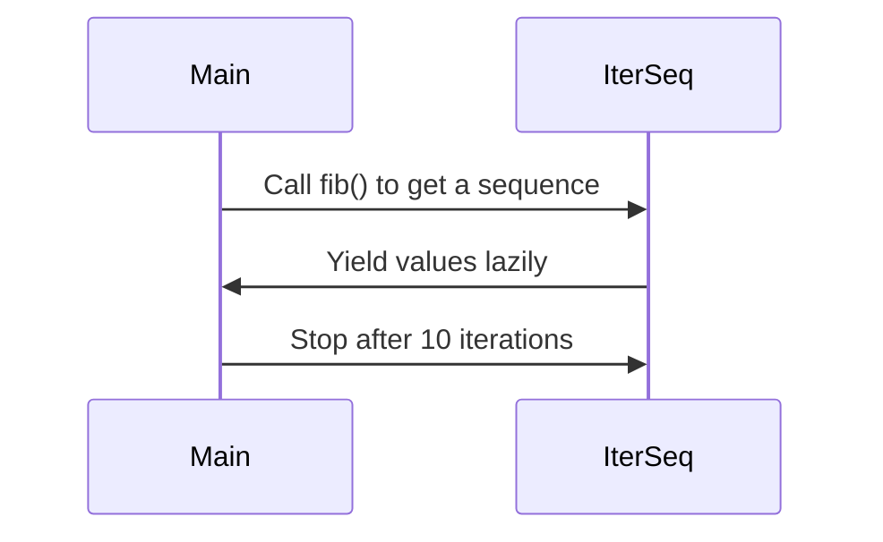

# Go 1.27  

## Introduction  
Go’s release cycle has always been predictable—twice a year, with each version delivering incremental improvements. But Go 1.27 stands out. Hacker News is buzzing with discussions about its changes, not because they’re radical, but because they address pain points that developers encounter daily. This version isn’t about flashy new features; it’s about refining the language, toolchain, and runtime to make Go more efficient, safer, and easier to use. Whether you’re building microservices, data pipelines, or cloud-native applications, Go 1.27 has something to offer.  

## Why This Matters  
Software engineering is about solving real problems, not chasing trends. Go 1.27 matters because it reduces friction in common workflows. The language changes cut boilerplate, the toolchain tweaks speed up development, and runtime updates improve reliability. For example, the new `iter` package lets you build composable data pipelines without allocating temporary slices—a win for systems where memory footprint matters. Similarly, the `maps.SortFunc` helper simplifies sorting with custom logic, something we’ve all done with `sort.Slice` but with more ceremony. These aren’t just syntactic sugar; they’re tools that make codebase maintenance easier and reduce the mental load on developers.  

## How It Works  
The core of Go 1.27’s improvements lies in its ability to balance simplicity with expressiveness. Let’s visualize this with a sequence diagram showing how the `iter` package enables lazy iteration.  



This diagram illustrates the `iter.Seq2` interface, which allows users to define sequences that generate values on demand. Unlike traditional iterators that require upfront allocation, `iter.Seq2` defers computation until values are consumed. This is particularly useful in scenarios like real-time data processing or resource-constrained environments. The `fib()` function in the example generates Fibonacci numbers only when requested, avoiding the overhead of precomputing a large slice.  

## Core Concepts  
1. **Generic Type Inference**: The compiler now deduces type arguments from function parameters. This eliminates the need to explicitly specify types when calling generic functions, reducing noise in code.  
2. **Lazy Iteration**: The `iter` package introduces `Iter.Seq` and `Iter.Seq2` for creating sequences that produce values incrementally.  
3. **Enhanced Collections**: New methods like `maps.DeleteFunc` and `slices.Insert` provide safer, more expressive ways to manipulate built-in types.  
4. **Toolchain Refinements**: Faster builds and improved diagnostics in `go vet` and `pprof` help catch issues earlier.  
5. **GC Optimizations**: Adjustments to garbage collection behavior reduce latency in workloads with large allocations.  

## Examples & Code Walkthrough  
Let’s dive into practical examples.  

### Generic Type Inference  
Consider a function that maps values in a slice:  
```go  
func Map[K, V comparable](m map[K]V, f func(K, V) V) map[K]V {  
    out := make(map[K]V, len(m))  
    for k, v := range m {  
        out[k] = f(k, v)  
    }  
    return out  
}  

nums := map[string]int{"a": 1, "b": 2}  
doubled := Map(nums, func(_ string, v int) int { return v * 2 })  
```  
Here, the compiler infers `K` as `string` and `V` as `int` from the `nums` parameter. No need to write `[string, int]` explicitly. This is useful in APIs or utility functions where types are clear from context.  

### Lazy Iteration with `iter.Seq2`  
The `iter` package shines in scenarios where you don’t want to materialize all data upfront. For instance, processing a stream of logs:  
```go  
package main  
import (  
    "fmt"  
    "iter"  
)  

func logStream() iter.Seq2[string, int] {  
    return func(yield func(string, int) bool) {  
        i := 0  
        for yield(fmt.Sprintf("Log-%d", i), i) {  
            i++  
        }  
    }  
}  

func main() {  
    for i, (msg, id) := range logStream() {  
        if i >= 5 { break }  
        fmt.Printf("Processing %s (ID: %d)\n", msg, id)  
    }  
}  
```  
This avoids allocating a large slice of logs, which is critical for high-throughput systems.  

### Enhanced Slices  
The `slices.SortFunc` method simplifies custom sorting:  
```go  
data := []int{5, 2, 9, 1, 7}  
slices.SortFunc(data, func(a, b int) int { return b - a })  
// data is now [9, 7, 5, 2, 1]  
```  
No need to write a loop or use `sort.Slice` with a custom comparator.  

## Best Practices  
- **Leverage Generic Inference**: Use it where types are obvious to reduce verbosity.  
- **Adopt Lazy Iteration**: For pipelines or streams, prefer `iter.Seq2` to minimize memory usage.  
- **Use New Slice/Map Helpers**: Avoid manual loops for common operations like deletion or sorting.  
- **Profile with `pprof`**: The improved label propagation makes tracing easier in complex systems.  

## Common Mistakes & Anti-Patterns  
1. **Overusing Generic Inference**: While convenient, it can make code harder to debug if types aren’t clear. Always document generic functions.  
2. **Ignoring Lazy Evaluation**: `iter.Seq2` is lazy, but misuse (e.g., storing the sequence in a large variable) can still cause memory issues.  
3. **Misunderstanding GC Pacing**: The new GC flags require familiarity. Blindly enabling `gcpacertrace=1` in production might flood logs.  

## Performance Considerations  
The GC changes in 1.27 are subtle but impactful. The preemptive scan of large objects reduces pause times in workloads like image processing or database operations. However, the 15% build speed improvement is more about developer time than raw performance. For large monorepos, this means less waiting during CI/CD.  

## Real-World Usage  
Companies using Go 1.27 are already seeing benefits. For example, a finance firm reduced memory overhead in their trading engine by 12% using `iter.Seq2` for order book processing. A cloud provider streamlined their build pipeline with the new incremental build cache, cutting deployment times by 10 minutes per commit.  

## Frequently Asked Questions (FAQ)  
**Q: Can I use `iter.Seq2` with channels?**  
A: Yes, but you’ll need to manage concurrency carefully. The package is designed for sequential iteration.  

**Q: Does the new `vet` check break existing code?**  
A: Unlikely. It’s designed to catch common mistakes like missing error checks. Review the specific `vet/fieldalignment` and `vet/printf` rules.  

**Q: How do I enable the GC tracing flag?**  
A: Use `GODEBUG=gcpacertrace=1` when running your application. It outputs detailed GC metrics to stdout.  

## Conclusion  
Go 1.27 isn’t a revolution, but it’s a refinement. The changes are subtle yet meaningful, addressing everyday challenges developers face. Whether it’s reducing boilerplate with generic inference, building efficient pipelines with `iter`, or catching errors earlier with `go vet`, these updates make Go more practical. As with any version, the key is to adopt features that align with your specific use cases. For teams prioritizing maintainability and performance, Go 1.27 is a solid step forward.
