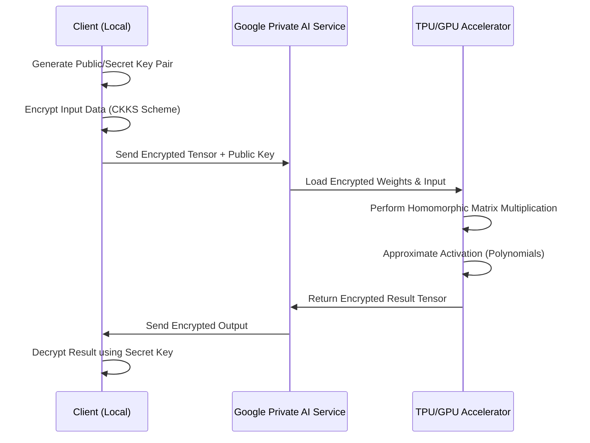

# Google is making private AI practical with homomorphic encryption

## Introduction

For years, the "holy grail" of data privacy has been the ability to compute on data without seeing it. In the context of AI, this means sending a prompt or a dataset to a powerful model in the cloud, having the model process that data, and receiving a result—all while the cloud provider remains mathematically blind to both the input and the output. 

Until recently, Fully Homomorphic Encryption (FHE) was a theoretical curiosity. The computational overhead was catastrophic, often slowing down operations by a factor of $10^6$ or more. However, Google is shifting the needle. By combining optimized FHE libraries with hardware acceleration and clever approximation algorithms, they are moving private AI from "mathematically possible" to "computationally practical."

## Why This Matters

If you're building software for healthcare, fintech, or government, you've likely hit the "Privacy Wall." You have a massive model that can provide incredible value, but your legal team won't let you upload PII (Personally Identifiable Information) to a third-party API. 

The current workarounds are clunky:
1. **Local Deployment:** Running a 70B parameter model on-prem is expensive and a DevOps nightmare.
2. **Differential Privacy:** Adding noise to data helps, but it degrades model accuracy.
3. **Trusted Execution Environments (TEEs):** Enclaves like Intel SGX are better, but they rely on hardware trust and are susceptible to side-channel attacks.

Homomorphic encryption removes the need to trust the provider. The security isn't based on a "secure box" or a legal contract; it's based on the hardness of the Learning With Errors (LWE) problem. If the math holds, the provider cannot see the data, even if they have root access to the machine running the model.

## How It Works

The core idea is that certain mathematical operations on ciphertexts map directly to operations on the underlying plaintexts. If you encrypt $x$ and $y$, and perform a specific operation on those ciphertexts, the result—when decrypted—is exactly $x + y$ or $x \times y$.

Google's implementation focuses on the **CKKS (Cheon-Kim-Kim-Song)** scheme, which is designed for fixed-point arithmetic, making it ideal for the weights and activations used in neural networks.



The process follows a specific lifecycle:
1. **Encoding:** Plaintext numbers are mapped into high-degree polynomials.
2. **Encryption:** Noise is added to these polynomials to ensure security (LWE).
3. **Evaluation:** The cloud performs additions and multiplications. Since multiplication increases the "noise" in the ciphertext, Google uses **bootstrapping**—a computationally expensive process that "refreshes" the ciphertext to prevent it from becoming undecipherable.
4. **Decryption:** The client uses their private key to remove the noise and retrieve the result.

## Core Concepts

### Ring-LWE (Learning With Errors)
Most modern FHE schemes rely on the difficulty of finding a secret vector in a lattice when given a set of linear equations with small, random errors. It's essentially "noise-based" security that is believed to be resistant to quantum computers.

### SIMD Packing (Batching)
You don't encrypt one number per ciphertext. That would be a memory disaster. Instead, we use **packing**, where a single large polynomial (the ciphertext) holds a vector of thousands of plaintext values. A single homomorphic multiplication then operates on all these values in parallel (Single Instruction, Multiple Data).

### Polynomial Approximation
FHE cannot handle non-linear functions like `ReLU` or `Sigmoid` directly because they aren't polynomials. Google solves this by replacing these activations with high-degree polynomial approximations (e.g., using Chebyshev polynomials) that mimic the behavior of the activation function.

## Examples & Code Walkthrough

While Google's internal stack is proprietary, the industry standard for implementing these concepts is the **Microsoft SEAL** library. Below is a conceptual Python wrapper demonstrating how we pack a vector of sensitive financial data into a single BFV (Brakerski-Fan-Vercauteren) ciphertext for a summation task.

```python
import numpy as np
# Assuming a hypothetical pythonic wrapper for SEAL
from seal_wrapper import SEALContext, EncryptionParameters, SchemeType, KeyGenerator, Encryptor, Evaluator, Decryptor, BatchEncoder

def private_sum_demonstration():
    # 1. Setup Parameters
    # Poly_modulus_degree determines the slot count (2^13 = 8192)
    params = EncryptionParameters(SchemeType.BFV)
    params.set_poly_modulus_degree(8192)
    params.set_coeff_modulus(coeff_mod_degree=8192) 
    params.set_plain_modulus(1032193) # Prime modulus for batching
    
    context = SEALContext(params)
    keygen = KeyGenerator(context)
    public_key = keygen.create_public_key()
    secret_key = keygen.secret_key()
    
    encryptor = Encryptor(context, public_key)
    evaluator = Evaluator(context)
    decryptor = Decryptor(context, secret_key)
    encoder = BatchEncoder(context)

    # 2. The Data: Sensitive transaction amounts
    # In a real app, these would be user balances or payment amounts
    transaction_data = np.array([100, 250, 300, 450, 10, 5, 1000, 20], dtype=np.int64)
    
    # Pad to match poly_modulus_degree
    padded_data = np.pad(transaction_data, (0, 8192 - len(transaction_data)))

    # 3. Encode and Encrypt
    plain_tensor = encoder.encode(padded_data)
    cipher_tensor = encryptor.encrypt(plain_tensor)

    # 4. Cloud Side: Compute Sum (Homomorphic Addition)
    # We rotate the ciphertext to sum elements across slots
    encrypted_sum = cipher_tensor
    for i in range(1, 8192): # Simplified for demo; usually done in log2(n) steps
        rotated = evaluator.rotate_vector(cipher_tensor, i)
        encrypted_sum = evaluator.add(encrypted_sum, rotated)

    # 5. Client Side: Decrypt
    plain_result = decryptor.decrypt(encrypted_sum)
    final_vector = encoder.decode(plain_result)
    
    print(f"Encrypted Sum Result: {final_vector[0]}")
    print(f"Actual Sum: {np.sum(transaction_data)}")

if __name__ == "__main__":
    private_sum_demonstration()
```

## Best Practices

*   **Minimize Multiplicative Depth:** Every multiplication increases noise. Design your model to be "shallow" or use schemes like CKKS that handle noise more gracefully.
*   **Use Batching Aggressively:** Never encrypt a single scalar. Always pack your data into vectors to amortize the massive overhead of ciphertext operations.
*   **Pre-compute Rotations:** If you are performing repeated linear algebra, pre-compute the rotation keys (Galois keys) to avoid bottlenecking the evaluator.
*   **Approximate Early:** Don't try to implement an exact `if/else` logic. Convert your conditional logic into polynomial approximations as early as possible in the design phase.

## Common Mistakes & Anti-Patterns

### 1. The "Exact Match" Fallacy
Trying to perform an exact equality check (`if x == y`) on encrypted data. This is computationally prohibitive in FHE. Instead, use a polynomial that outputs a value close to 1 for matches and 0 for mismatches.

### 2. Ignoring the Noise Budget
Every FHE ciphertext has a "noise budget." If you perform too many multiplications without bootstrapping, the noise consumes the signal, and the data becomes unrecoverable. Engineers often forget to track the noise depth of their circuit.

### 3. Over-encrypting
Applying FHE to the entire pipeline. FHE is slow. Use a hybrid approach: encrypt only the sensitive features, keep non-sensitive metadata in plaintext, and use standard TLS for transport.

## Performance Considerations

The computational complexity of FHE is significantly higher than plaintext operations. 

*   **Time Complexity:** While a plaintext addition is $O(1)$, a homomorphic addition is $O(N \log N)$ where $N$ is the polynomial degree. Multiplication is even heavier.
*   **Space Complexity:** Ciphertext expansion is a major bottleneck. A 4-byte integer can expand into a ciphertext of several hundred kilobytes. This puts immense pressure on memory bandwidth and network I/O.
*   **Latency:** Expect milliseconds for additions but seconds (or even minutes) for complex model inferences without hardware acceleration. This is why Google is integrating this with TPUs, which can handle the massive polynomial multiplications in parallel.

## Real-World Usage

Google is applying this to **Federated Learning** and **Private Set Intersection (PSI)**. For example, in Android's "Private Compute Core," FHE-like techniques allow the device to share encrypted signals with the cloud to improve Gboard's predictive text without the cloud ever seeing the actual words the user typed.

Similarly, in the medical field, researchers are using these patterns to run diagnostic models on encrypted patient records across multiple hospitals without the hospitals ever having to "pool" their raw data into a single, vulnerable database.

## Frequently Asked Questions (FAQ)

**Q: Is FHE slower than Multi-Party Computation (MPC)?**
A: Generally, yes. MPC is faster but requires constant communication between parties. FHE is slower but allows for "non-interactive" computation—the client sends data once and the server works on it in isolation.

**Q: Can an attacker brute-force the secret key?**
A: Not with current technology. FHE is based on lattice problems which are considered quantum-resistant. The security depends on the `poly_modulus_degree` and the size of the coefficients.

**Q: Does this replace the need for HTTPS/TLS?**
A: No. TLS protects data *in transit*. FHE protects data *during processing*. You still need TLS to move the encrypted ciphertexts from the client to the server.

## Conclusion

Homomorphic encryption is no longer just a whiteboard exercise for cryptographers. By optimizing the CKKS scheme and leveraging specialized hardware, Google is proving that we can decouple "the ability to compute" from "the ability to see." 

For engineers, the takeaway is clear: start thinking about your data pipelines in terms of "computational depth." The transition to private AI will require us to move away from imperative logic and toward polynomial-based approximations. It's a steep learning curve, but the payoff is a world where data utility and data privacy are no longer a zero-sum game.
