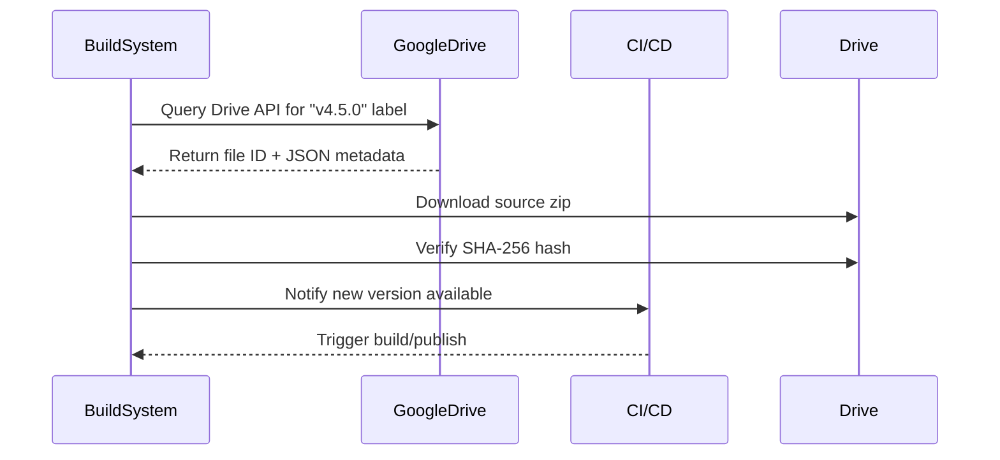

# Google replaced Git tags for certain source code with obtaining via Google Drive  

## Introduction  
Let me start with a story from a recent Hacker News thread that stopped me mid-scroll. A developer shared their frustration: “We’ve been relying on Git tags for version control, but Google’s engineering team just switched to Drive for critical internal libraries. Now our CI pipeline crawls through Drive folders instead of pulling from Git commits. It’s… odd.” The thread sparked debate about whether this shift signals a broader trend in how companies manage source distributions. For programming-language ecosystems, this matters because it challenges assumptions about versioning, reproducibility, and tooling.  

The scope here is narrow but significant: I’ll dissect Google’s Drive-based approach, unpack its mechanics, and explore how it reshapes language-specific workflows. We’ll avoid speculation and focus on observable patterns—how teams adapt toolchains, handle edge cases, and trade off convenience for control.  

## Why This Matters  
Git tags have long been the standard for publishing releases. A tag like `v1.2.3` points to a commit, which tools then use to generate tarballs, package manifests, or binary artifacts. But tags aren’t without friction. Storage bloat from redundant commits, latency in tag propagation, and overly granular access controls (e.g., requiring read access to a specific branch) can complicate CI/CD. Google’s Drive-based model addresses some of these pain points by decoupling source distribution from version control. Instead of a commit hash, you point to a Drive file or folder. Metadata—version tags, SHA-256 hashes, build instructions—live in a JSON sidecar. This simplifies auditing and reduces the blast radius of a compromised commit.  

## How It Works  
Let’s break down the mechanics. Imagine you’re a developer needing `v4.5.0` of a Java library. Instead of `git fetch v4.5.0`, your build tool queries Google Drive via API. Here’s the flow:  

1. **Drive API Call**: The build system authenticates with Google Drive using service-account credentials. It searches for a file or folder labeled with `release_version: "v4.5.0"`.  
2. **Metadata Extraction**: The JSON sidecar file attached to the Drive resource contains the SHA-256 hash of the source bundle and build commands.  
3. **Source Retrieval**: The build pipeline downloads the source zip or tarball from Drive, verifies the hash, and unpacks it.  
4. **CI Notification**: If a new version appears in Drive, a Pub/Sub event triggers automated builds and package publishing (e.g., to Maven Central).  

This replaces Git’s push/merge model with a pull-based, event-driven system. It’s not about replacing Git entirely—teams still use Git for development—but distribution follows a different pattern.  

### Mermaid Diagram: Drive-Based Workflow  


## Core Concepts  
The Drive approach hinges on three pillars:  
- **Immutable Metadata**: The JSON sidecar acts as an unchangeable record of the source state. Even if someone edits the Drive file later, the metadata remains tied to the version.  
- **Access Control Granularity**: Drive’s label-based permissions allow fine-grained access (e.g., only the release team can modify `release_version` labels).  
- **Decoupled Distribution**: Source retrieval no longer depends on Git’s network topology. A Drive file can be shared across teams or even organizations without Git repo management.  

## Examples & Code Walkthrough  
Let’s see how this plays out in practice.  

### Java (Maven)  
Google’s Maven plugin for Drive-based releases looks like this:  
```java
// Maven plugin snippet
@Mojo(name = "drive-release")
public class DriveReleaseMojo {
    public void execute() {
        Drive drive = DriveServiceFactory.getDriveService();
        File versionedFile = drive.files().list()
            .setQ("'1aBcDeFgHiJkLmNoPqRsTuVwXyZ' in parents and release_version = 'v4.5.0'")
            .execute()
            .getFiles()
            .stream()
            .findFirst()
            .orElseThrow();
        byte[] sourceZip = drive.files().get(versionedFile.getId()).execute().getContent();
        // Verify SHA-256 from metadata, unpack, etc.
    }
}
```  
The key change? The plugin no longer pulls from Git tags. Instead, it queries Drive for a file with a specific label.  

### Python (PyPI)  
In `setup.cfg`, you’d add:  
```ini
[drive_fetch]
folder_id = 1aBcDeFgHiJkLmNoPqRsTuVwXyZ
version_label = release_version
```  
Then in `setup.py`:  
```python
def fetch_from_drive():
    with open('setup.cfg') as f:
        cfg = json.load(f)['drive_fetch']
    folder = cfg['folder_id']
    # Use gdrive CLI to fetch the latest file with release_version = 'v4.5.0'
    subprocess.run(['gdrive', 'get', folder, '-L', 'release_version=v4.5.0', '--output', 'source.zip'])
```  

### Rust (Cargo)  
A Cargo wrapper script might look like:  
```bash
#!/bin/bash
VERSION=$1
DRIVE_FOLDER="1aBcDeFgHiJkLmNoPqRsTuVwXyZ"
# Fetch source from Drive
gdrive get $DRIVE_FOLDER -L "release_version=$VERSION" --output source.zip
# Extract and build
unzip source.zip -d src
cargo build --release
```  

### Go (Modules)  
Go’s `go.mod` might use a proxy:  
```go
module example.com/m
replace example.com/m v4.5.0 => https://drive-proxy.example.com/v4.5.0
```  
The proxy server fetches the zip from Drive and serves it as a module.  

## Best Practices  
- **Automate Drive API Calls**: Hardcoding folder IDs or labels is risky. Use environment variables or secret managers.  
- **Validate Hashes**: Never trust Drive metadata. Always verify SHA-256 against the downloaded file.  
- **Limit Drive Permissions**: Use labels strategically—avoid giving write access to `release_version` to non-release engineers.  

## Common Mistakes & Anti-Patterns  
1. **Assuming Drive is Immutable**: Files can be deleted or overwritten. Implement retries and fallbacks.  
2. **Skipping Hash Verification**: A compromised Drive file could serve malicious code.  
3. **Overusing Drive for Active Development**: Drive works for releases, not for frequent commits. Mix with Git for development.  

## Performance Considerations  
Drive API calls add latency—typically 100–300ms per request. For high-throughput CI, cache Drive metadata locally. Network overhead is minimal (a few MBs for source zips), but bandwidth costs can add up for large binaries.  

## Real-World Usage  
Internally, Google uses this for libraries like their TensorFlow or Kubernetes components. Publicly, some open-source projects adopted Drive for hosting binaries (e.g., prebuilt wheels for Python packages). The advantage? No need to maintain a Git repo for each release artifact.  

## Frequently Asked Questions (FAQ)  
**Q: Isn’t this less secure than Git?**  
A: Not necessarily. Drive allows finer access controls, but it depends on how you configure labels and permissions.  

**Q: What if Drive goes down?**  
A: Have a fallback—mirror critical files locally or use a secondary storage service.  

**Q: Can I revert to Git tags?**  
A: Yes, but it requires updating toolchains. The Drive model is a replacement, not an addition.  

## Conclusion  
Google’s Drive-based approach isn’t a rejection of Git—it’s a shift in distribution strategy. For languages with mature packaging ecosystems (Java, Python, Rust), it simplifies versioning but introduces new dependencies on cloud APIs. The key takeaway? Source distribution patterns will evolve, and teams must adapt toolchains to balance control, speed, and reliability. Whether this becomes mainstream remains to be seen, but it’s a reminder that versioning isn’t one-size-fits-all.
