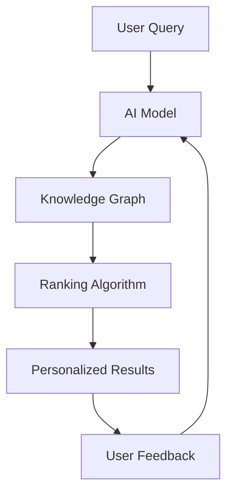

# Google Search Is Dying. What Comes Next Is Worse

## Introduction
I still remember the early days of the internet, when searching for information meant typing keywords into a clunky search engine and sifting through pages of irrelevant results. But then Google came along, and suddenly search was fast, accurate, and effortless. However, as a senior staff engineer, I've noticed a disturbing trend: Google search is dying, and what's coming next is even worse. The rise of AI-powered search engines, while promising, poses significant risks to the way we interact with information online.

## Why This Matters
As software engineers, we should care about the future of search because it affects the way we design and build applications. A good search engine is not just a convenience; it's a fundamental component of the internet's infrastructure. When search breaks down, our users suffer, and our applications become less useful. Furthermore, the next generation of search engines will be powered by AI, which raises important questions about data ownership, bias, and transparency. We need to understand these implications to build better systems and protect our users' interests.

## How It Works
The next generation of search engines will rely on complex AI models that analyze user behavior, query intent, and contextual information to provide personalized results. Here's a high-level overview of the architecture:

In this workflow, the AI model analyzes the user's query and behavior to generate a set of relevant results. The knowledge graph provides additional context and entities to enhance the search results. The ranking algorithm then prioritizes the results based on relevance, authority, and user feedback.

## Core Concepts
To understand the implications of AI-powered search engines, we need to grasp some fundamental concepts:

* **Natural Language Processing (NLP)**: the ability of AI models to analyze and understand human language
* **Knowledge Graphs**: massive databases that store entities, relationships, and concepts to provide context to search results
* **Personalization**: the use of user data and behavior to tailor search results to individual preferences
* **Bias and Transparency**: the risks of AI models perpetuating existing biases and the need for transparent decision-making processes

## Examples & Code Walkthrough
Here's an example of how we can use NLP to improve search results in a Python application:
```python
import nltk
from nltk.tokenize import word_tokenize

def tokenize_query(query):
    tokens = word_tokenize(query)
    return tokens

query = "What are the best restaurants in New York City?"
tokens = tokenize_query(query)
print(tokens)
```
This code snippet demonstrates how to tokenize a user's query using NLTK, a popular NLP library. We can then use these tokens to generate more accurate search results.

## Best Practices
When adopting AI-powered search engines, follow these best practices:

* **Monitor and audit AI decision-making**: ensure that AI models are transparent and unbiased
* **Use diverse and representative training data**: minimize the risk of perpetuating existing biases
* **Implement robust user feedback mechanisms**: allow users to correct AI mistakes and provide feedback
* **Prioritize user privacy and data ownership**: ensure that user data is protected and used responsibly

## Common Mistakes & Anti-Patterns
Here are some common pitfalls to avoid:

* **Over-reliance on AI**: don't assume that AI models are always accurate or unbiased
* **Insufficient training data**: don't use limited or biased training data to train AI models
* **Lack of transparency**: don't hide AI decision-making processes from users or developers
* **Ignoring user feedback**: don't neglect user feedback and corrections

## Performance Considerations
When evaluating AI-powered search engines, consider the following performance metrics:

* **Latency**: the time it takes for the search engine to return results
* **Accuracy**: the relevance and accuracy of search results
* **Scalability**: the ability of the search engine to handle large volumes of queries and data
* **Computational complexity**: the resources required to train and deploy AI models

## Real-World Usage
Industry leaders like Google, Microsoft, and Amazon are already leveraging AI-powered search engines in their products and services. For example, Google's Assistant uses AI to provide personalized search results and recommendations.

## Frequently Asked Questions (FAQ)
Here are some common questions and answers:

* Q: Will AI-powered search engines replace human search engineers?
A: No, AI will augment human capabilities, but human judgment and oversight are still essential.
* Q: How can I ensure that my AI-powered search engine is unbiased?
A: Use diverse and representative training data, monitor and audit AI decision-making, and implement robust user feedback mechanisms.
* Q: What are the risks of AI-powered search engines?
A: Biases, lack of transparency, and over-reliance on AI are significant risks that need to be mitigated.

## Conclusion
The future of search is uncertain, and AI-powered search engines pose significant risks and challenges. As software engineers, we must be aware of these implications and take steps to build better, more transparent, and more accountable systems. By understanding the core concepts, best practices, and common pitfalls, we can create a better future for search and protect our users' interests.
