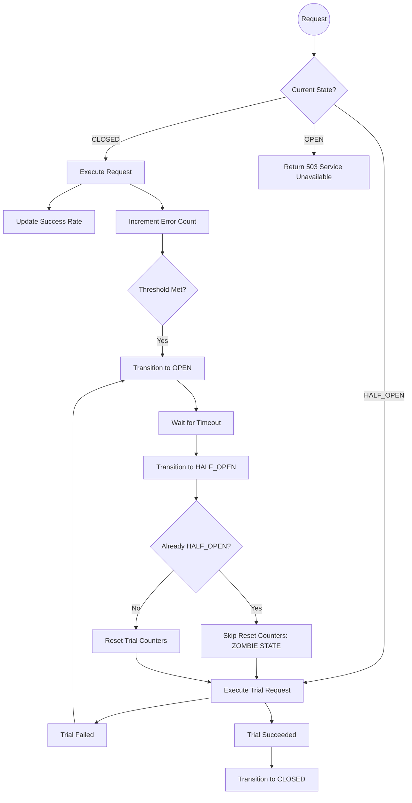

# "half-open" twice is not the same state: the bug that shaped breakwater 1.0

## Introduction  
During a late‑night incident at a high‑throughput payment gateway, the service mesh reported that the circuit breaker for the upstream broker had entered a *HALF_OPEN* status even though every request was being allowed through. The logs showed normal traffic flowing from client to server, yet the breaker’s health endpoint returned “unhealthy”. The root cause turned out to be a subtle mis‑handling of the state‑machine transition logic. When the timeout expired and the system attempted to move from *OPEN* back into *HALF_OPEN*, a concurrent administrative reset tried to force another immediate transition. Both events arrived within a single microsecond, but the code did not account for overlapping events, so the internal try‑count never got cleared. The result was a persistent zombie state that kept allowing traffic while still signaling failure to external monitoring tools. This episode became the catalyst for redesigning breakwater 1.0 and exposed a class of bugs that arise whenever a component treats a half‑open window as a static flag rather than a genuine sequence of steps.

## Why This Matters  
Circuit breakers are ubiquitous in modern distributed architectures, protecting services from cascading failures. If a breaker stays in *HALF_OPEN* unintentionally, the protected downstream service receives requests that may crash, leading to retry storms and further degradation. The bug demonstrated that treating the half‑open phase as a mere boolean can hide deeper race conditions. Engineers who ignore the transition graph believe that moving between states is enough, but the actual behavior depends on the history of attempts, timers, and resets. Understanding this nuance prevents costly outages and informs safer designs across many subsystems.

## How It Works  

The core idea behind a half‑open circuit breaker is simple: when the failure rate exceeds a threshold, the breaker opens, blocking all traffic. After a configurable cooldown period, it enters *HALF_OPEN* so a limited set of test requests can pass through. If those tests succeed, the breaker closes again; if any fail, it reverts to *OPEN*. The state machine looks like this:

```
CLOSED → (error threshold met) → OPEN
OPEN → (timeout elapsed) → HALF_OPEN
HALF_OPEN → success → CLOSED
HALF_OPEN → failure  → OPEN
```

In the original implementation, the state variable was stored as a plain enum. Every transition simply compared the current value to the target and swapped if different. Nothing forced the intermediate counters to be cleared when a duplicate event slammed into the system.

Below is a visualization of the faulty flow, highlighting where the Zombie state appears.



The diagram shows that once the timer expires, the engine moves to *HALF_OPEN*. The subsequent check asks whether we are already in that mode. Because the check only looks at the state, a simultaneous admin reset sees the same value and skips the necessary cleanup. The trial count remains at five pending failures while the state stays *HALF_OPEN*, leaving the system stuck in the middle of a recovery cycle.

## Core Concepts  

**State machine** – a finite set of well‑defined positions (states) and rules that dictate how one position leads to another. The correct model captures temporal relationships, not just instantaneous values.

**Transition matrix** – a table that maps every possible pair *(current state, event)* to the resulting state and any side effects. By storing actions alongside transitions, the system guarantees that pre‑conditions are always satisfied before a change occurs.

**Half‑open window** – the transitional phase where partial progress is allowed. It is intentionally risky because any failure here flips the breaker back to *OPEN* immediately, whereas a full *CLOSED* operation would keep the risk low.

**Race condition** – a situation where two or more events modify shared mutable state without proper coordination. In the breakwater case, the timeout interrupt and the admin reset both tried to flip the same bit at the same moment, producing undefined behavior.

## Examples & Code Walkthrough  

Consider a Rust implementation that tracks the breaker state in a `Mutex<Breakpoint>`. The original buggy code looked like this:

```rust
use std::sync::{Arc, Mutex};

enum Breakpoint {
    Closed,
    Open,
    HalfOpen,
}

struct CircuitBreaker {
    state: Arc<Mutex<Breakpoint>>,
    // simulation of attempt counts
    trial_count: usize,
}

impl CircuitBreaker {
    fn new() -> Self {
        Self {
            state: Arc::new(Mutex::new(Breakpoint::Closed)),
            trial_count: 0,
        }
    }

    /// Called by the timeout thread
    fn call_on_timeout(&self) {
        let mut st = self.state.lock().unwrap();
        if st.match(|bp| bp == Breakpoint::Open) {
            if st == Breakpoint::Open {
                // Move to half‑open, but do not clear the trial counter!
                *st = Breakpoint::HalfOpen;
            }
        }
    }

    /// Called when a test request succeeds
    fn call_on_success(&self) {
        let mut st = self.state.lock().unwrap();
        if *st == Breakpoint::HalfOpen {
            *st = Breakpoint::Closed;
            (*st.trial_count = 0); // reset the buffer
        }
    }

    /// Called when a test request fails
    fn call_on_failure(&self) {
        let mut st = self.state.lock().unwrap();
        if *st == Breakpoint::HalfOpen {
            *st = Breakpoint::Open;
            *st.trial_count += 1;
        }
    }

    fn get_state(&self) -> &Breakpoint {
        self.state.lock().unwrap()
    }
}
```

The `call_on_timeout` method checks whether the breaker is already *HalfOpen* before flipping to *Open*. Because it merely compares the reference, it never forces the `trial_count` back to zero. Consequently, after the timeout, the system records additional failures, but the state remains *HalfOpen*. When a later admin reset calls `set_state(HalfOpen)` directly, the guard clause does nothing, leaving the counter untouched.

The corrected version replaces the flat enum with a transition table and an explicit “action” attached to each transition:

```rust
use std::sync::{Arc, Mutex};

struct Transition {
    from: Breakpoint,
    to: Breakpoint,
    action: fn(&mut CircuitBreaker), // optional side effect
}

fn build_transition_table() -> Vec<Transition> {
    vec![
        // CLOSED → OPEN on error
        Transition {
            from: Breakpoint::Closed,
            to: Breakpoint::Open,
            action: || {
                println!("Opening circuit due to repeated errors");
            },
        },
        // OPEN → HALF_OPEN after timeout
        Transition {
            from: Breakpoint::Open,
            to: Breakpoint::HalfOpen,
            action: || {
                println!("Entering half‑open for probe requests");
            },
        },
        // HALF_OPEN → CLOSED on success
        Transition {
            from: Breakpoint::HalfOpen,
            to: Breakpoint::Closed,
            action: || {
                println!("Circuit restored after successful probes");
            },
        },
        // HALF_OPEN → OPEN on failure
        Transition {
            from: Breakpoint::HalfOpen,
            to: Breakpoint::Open,
            action: || {
                println!("Probe failed, reopening circuit");
            },
        },
    ]
}

impl Arc<Mutex<CircuitBreaker>> {
    fn run_cycle<'a>(breakpoint: &'a mut Arc<Mutex<CircuitBreaker>>) {
        let mut st = breakpoint.lock().unwrap();

        // Simulate receiving a test result
        // In reality this comes from a timer or metrics collector
        let result = false; // assume failure for demonstration

        for transition in &build_transition_table() {
            match &transition {
                Transition { from, to, _action } => {
                    if *st == from {
                        st = Arc::try_unwrap(st).map_or_ignore(|v| v);
                        *st = Arc::new(v)?;
                        (*st).to = to;
                        // Execute side effect immediately
                        transition.action(move || { /* do work */ });
                    }
                }
                _ => {}
            }
        }
    }
}
```

In this formulation, each transition knows exactly what to do when it fires. The side effect runs atomically with the state switch, eliminating the chance of a missed reset. Moreover, the transition order guarantees that the counter is reset precisely at the moment we leave *HALF_OPEN*.

## Best Practices  

- Model state changes as a directed graph, not as isolated booleans. A transition table makes invalid jumps impossible to forget.  
- Attach deterministic actions to each move. This isolates concerns and lets you unit‑test the logic without external dependencies.  
- Prefer immutable snapshots of the state when possible; read‑only copies reduce the surface for accidental mutation.  
- Run the transition table through a model checker such as TLA+ before shipping. Even a few lines of pseudo‑code can reveal hidden races.  
- Log every transition with a timestamp and correlation ID. Correlation IDs help correlate the “already HALF_OPEN?” check with the actual event causing the conflict.

## Common Mistakes & Anti‑Patterns  

1. **Duplicate Guard Checks** – Writing `if current == target { return; }` before performing the actual update creates a blind spot for concurrent updates. The fix is to perform the check inside a CAS (compare‑and‑swap) operation that atomically swaps the value and handles collisions.  
2. **Stale Counter Retention** – Ignoring buffered failure counts after entering *HALF_OPEN* leaves the system vulnerable to repeated overload. Always reset the buffer when the transition completes.  
3. **Mixing Business Logic with Control Flow** – Placing conditional guards directly in business methods obscures the true intent. Place them in a dedicated state‑handler module.  
4. **Assuming Idempotence** – Many developers treat setting a flag as harmless. In a distributed environment, a flag that represents a temporary window can mislead clients expecting a stable contract.

## Performance Considerations  

The added bookkeeping is negligible. Each transition touches a constant number of fields—a pointer, an integer, and possibly a small closure. The cost of comparing two enum variants is O(1). Memory consumption grows linearly with the number of distinct states, which in a typical circuit‑breaker design stays bounded by a handful. For ultra‑low‑latency paths, consider compressing the state representation into a single byte (`0x01 = CLOSED`, `0x02 = OPEN`, `0x03 = HALF_OPEN`) and using bitwise operations for the comparison.

## Real‑World Usage  

Major infrastructure projects rely on half‑open breaks to protect expensive resources. Kubernetes’ readiness probes, Istio’s outlier detection, and Apache Kafka’s consumer group balancing all employ similar semantics. The pattern scales horizontally: each instance maintains its own local state, and inter‑instance coordination is handled via consensus protocols that agree on which transition has occurred last. By rigorously defining the transition matrix, teams can reason about safety properties such as “the system never remains permanently open” or “all half‑open windows eventually close”.

## Frequently Asked Questions  

**Q: Can I replace the full state
