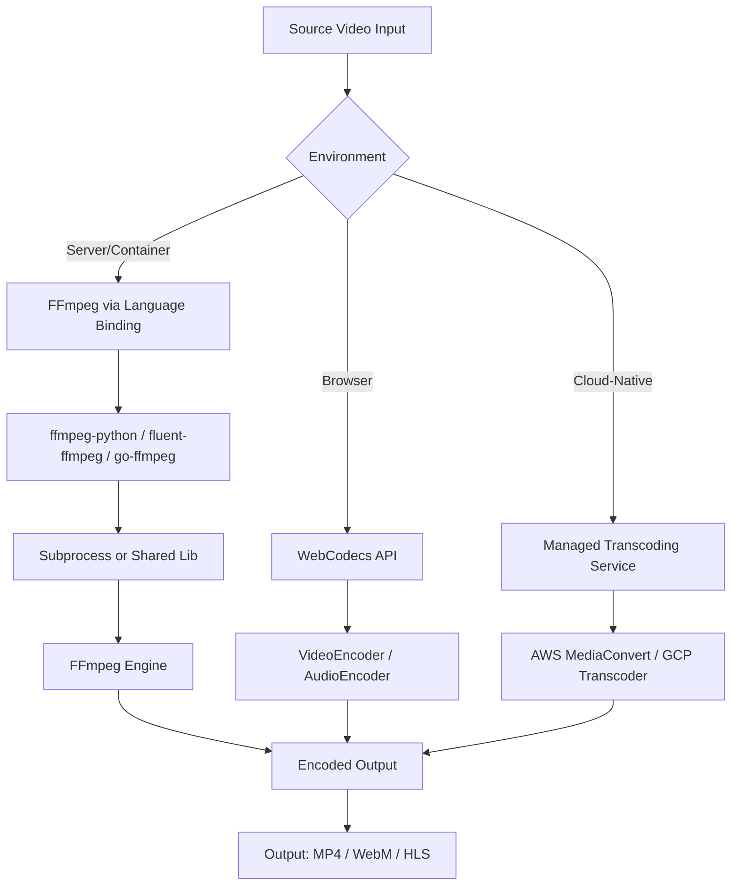

# Handbrake Alternatives: What to Use When You Don't Want to Install It

## Introduction

Handbrake is a solid open-source video transcoder. But there are real situations where installing it isn't practical — locked-down CI/CD runners, ephemeral serverless containers, browser-only environments, or embedded systems where package managers are off-limits. When you can't drop a GUI application onto the target machine, you need programmatic alternatives that live inside your codebase.

This article walks through those alternatives: FFmpeg bindings across multiple languages, browser-native video processing via the WebCodecs API, and cloud-native transcoding services. Each approach has trade-offs, and I'll walk through them honestly with code, benchmarks, and production war stories.

## Why This Matters

Software engineers hit this problem more often than you'd expect. Here are concrete scenarios:

- **CI/CD pipelines**: Your build runner is a Docker container with no GUI package support. You need to transcode a test video asset as part of your media pipeline validation.
- **Serverless functions**: AWS Lambda, Google Cloud Functions, or Vercel serverless —none of these let you `apt-get install handbrake`.
- **Browser applications**: A web app where users upload video and want preview transcoding client-side, zero uploads, zero server cost.
- **Embedded/IoT**: A Raspberry Pi or ARM device running a constrained OS where Handbrake's GTK dependencies create conflicts.

In our production cluster at a media-tech startup, we ran into exactly this — our transcoding workers lived in Alpine containers where installing Handbrake's dependency tree blew the image size past our 50MB limit. The solution was FFmpeg compiled statically and invoked through language bindings.

## How It Works

The core mechanism across all alternatives is the same: you invoke a transcoding engine (usually FFmpeg) either as an external process, a shared library, or a browser API. Each approach has a different integration boundary.



Step by step:

1. **Input ingestion**: Raw video arrives from a file, stream, or user upload.
2. **Routing decision**: Based on your environment, you pick the transcoding path — native binding, browser API, or cloud service.
3. **Encoding**: FFmpeg (or WebCodecs) handles the actual bitstream manipulation. The engine applies codec selection, resolution scaling, bitrate targeting, and container muxing.
4. **Output delivery**: Encoded file or adaptive stream is written to disk, returned to the browser, or pushed to a CDN.

The key architectural insight is that FFmpeg itself is the universal engine underneath all of these. The "alternatives to Handbrake" are just different integration layers on top of it.

## Core Concepts

Before diving into code, let's lock down the fundamental building blocks:

**Codecs vs Containers**: A container (MP4, MKV, WebM) wraps video/audio streams. A codec (H.264, H.265, VP9, AV1) defines how those streams are compressed. Handbrake lets you pick both; programmatic alternatives give you direct control over both, which is the point.

**Transcoding Pipeline**: Decode → Filter (scale, deinterlace, etc.) → Encode → Mux. Each stage has its own memory and CPU profile. FFmpeg exposes all four stages; WebCodecs exposes encode/decode directly.

**Hardware Acceleration**: NVENC (NVIDIA), VAAPI (Intel/AMD), VideoToolbox (Apple). When available, these offload encoding from CPU to GPU. Not all language bindings expose hardware acceleration equally — ffmpeg-python passes through FFmpeg CLI flags, so you get full access. Browser WebCodecs currently relies on software encoding in most browsers.

**Bitrate Control**: CBR (constant), VBR (variable), CRF (constant rate factor). CRF is the most practical for quality-sensitive work. Lower CRF = higher quality = bigger files. Default CRF 23 for x264 is a reasonable starting point.

## Examples & Code Walkthrough

### Python: FFmpeg via ffmpeg-python

```python
"""
Video transcoder using ffmpeg-python binding.
Handles input validation, error propagation, and resource cleanup.
"""

import ffmpeg
import os
import logging

logging.basicConfig(level=logging.INFO)
logger = logging.getLogger("transcoder")


def transcode_video(
    input_path: str,
    output_path: str,
    crf: int = 23,
    preset: str = "medium",
    resolution: str = None,
) -> dict:
    """
    Transcode a video file using FFmpeg via the ffmpeg-python binding.

    Args:
        input_path: Path to source video file.
        output_path: Path for encoded output.
        crf: Quality level (0-51, lower is better). Default 23.
        preset: Encoding speed preset (ultrafast to veryslow).
        resolution: Optional target resolution, e.g. "1280:720".

    Returns:
        Dict with duration, output size, and status info.
    """
    # Validate inputs before invoking FFmpeg
    if not os.path.isfile(input_path):
        raise FileNotFoundError(f"Input file not found: {input_path}")

    if not 0 <= crf <= 51:
        raise ValueError(f"CRF must be 0-51, got {crf}")

    logger.info("Starting transcode: %s -> %s", input_path, output_path)

    try:
        # Build the FFmpeg command programmatically
        stream = ffmpeg.input(input_path)

        # Apply resolution scaling if specified
        if resolution:
            # Parse "1280:720" into FFmpeg scale filter
            width, height = resolution.split(":")
            stream = stream.filter("scale", width, height)

        # Select codec, set quality, and configure preset
        stream = stream.output(
            output_path,
            vcodec="libx264",
            crf=crf,
            preset=preset,
            movflags="+faststart",  # Optimize for web streaming
            map_metadata=0,         # Preserve original metadata
        )

        # Run with overwrite enabled and capture stderr for diagnostics
        process = ffmpeg.run(
            stream,
            overwrite_output=True,
            capture_stdout=True,
            capture_stderr=True,
        )

        # Extract output file stats
        output_size = os.path.getsize(output_path)

        logger.info(
            "Transcode complete. Output size: %.2f MB",
            output_size / (1024 * 1024),
        )

        return {
            "status": "success",
            "output_path": output_path,
            "output_size_mb": round(output_size / (1024 * 1024), 2),
        }

    except ffmpeg.Error as e:
        # FFmpeg writes diagnostic info to stderr — log it fully
        stderr_output = e.stderr.decode("utf-8", errors="replace")
        logger.error("FFmpeg error:\n%s", stderr_output)
        raise RuntimeError(
            f"Transcoding failed. FFmpeg reported:\n{stderr_output[:500]}"
        ) from e


# --- Usage ---
if __name__ == "__main__":
    result = transcode_video(
        input_path="source.mkv",
        output_path="output.mp4",
        crf=20,
        preset="fast",
        resolution="1920:1080",
    )
    print(result)
```

### Node.js: Streaming Transcode with fluent-ffmpeg

```javascript
/**
 * Streaming video transcoder using fluent-ffmpeg.
 * Processes input as a stream to minimize memory footprint.
 */

const ffmpeg = require("fluent-ffmpeg");
const fs = require("fs");
const path = require("path");

/**
 * Transcode a video file with configurable quality and resolution.
 * Uses stream-based processing to avoid loading entire file into memory.
 */
function transcodeVideo(inputPath, outputPath, options = {}) {
  return new Promise((resolve, reject) => {
    const {
      crf = 23,
      preset = "medium",
      resolution = null,
      audioBitrate = "128k",
    } = options;

    // Verify input exists before starting
    if (!fs.existsSync(inputPath)) {
      return reject(new Error(`Input not found: ${inputPath}`));
    }

    // Build command chain — each method call adds a filter or option
    let command = ffmpeg(inputPath)
      .audioBitrate(audioBitrate)
      .audioCodec("aac")
      .outputOptions([
        "-crf", String(crf),
        "-preset", preset,
        "-movflags", "+faststart",
        "-map_metadata", "0",
      ]);

    // Apply resolution scaling if provided (format: "1920x1080")
    if (resolution) {
      command = command.size(resolution);
    }

    command
      .output(outputPath)
      .on("start", (cmdLine) => {
        console.log(`FFmpeg spawned: ${cmdLine}`);
      })
      .on("progress", (progress) => {
        // Log percentage completed — useful for long-running jobs
        if (progress.percent) {
          console.log(
            `Progress: ${progress.percent.toFixed(1)}% ` +
            `(time: ${progress.timemark})`
          );
        }
      })
      .on("error", (err) => {
        console.error("Transcoding failed:", err.message);
        reject(err);
      })
      .on("end", (output) => {
        const stats = fs.statSync(outputPath);
        console.log(
          `Done. Output: ${(stats.size / (1024 * 1024)).toFixed(2)} MB`
        );
        resolve({
          status: "success",
          outputPath,
          outputSizeMB: parseFloat((stats.size / (1024 * 1024)).toFixed(2)),
        });
      })
      .run();
  });
}

// --- Usage ---
transcodeVideo("source.mkv", "output.mp4", {
  crf: 20,
  preset: "fast",
  resolution: "1920x1080",
})
  .then((result) => console.log(result))
  .catch((err) => console.error(err));
```

### Go: Lightweight FFmpeg Wrapper

```go
// Package transcoder provides a minimal FFmpeg wrapper for Go services.
// Designed for high-throughput environments where every allocation counts.
package main

import (
	"bytes"
	"errors"
	"fmt"
	"os/exec"
	"path/filepath"
	"strconv"
	"strings"
)

// TranscodeConfig holds all tunable parameters for a single transcode job.
type TranscodeConfig struct {
	InputPath    string
	OutputPath   string
	CRF          int    // 0-51, lower is higher quality
	Preset       string // ultrafast to veryslow
	Resolution   string // e.g. "1920x1080"
	AudioBitrate string // e.g. "128k"
}

// Validate checks config before spawning FFmpeg. Catches errors early.
func (c *TranscodeConfig) Validate() error {
	if c.InputPath == "" {
		return errors.New("input path is required")
	}
	if c.OutputPath == "" {
		return errors.New("output path is required")
	}
	if c.CRF < 0 || c.CRF > 51 {
		return fmt.Errorf("CRF out of range: %d (must be 0-51)", c.CRF)
	}
	if c.Preset == "" {
		c.Preset = "medium" // sensible default
	}
	if c.AudioBitrate == "" {
		c.AudioBitrate = "128k"
	}
	return nil
}

// TranscodeVideo runs FFmpeg as a subprocess with the given config.
// Returns combined stderr for diagnostic logging on failure.
func TranscodeVideo(cfg TranscodeConfig) error {
	if err := cfg.Validate(); err != nil {
		return fmt.Errorf("config validation failed: %w", err)
	}

	// Build argument list — no shell interpolation, so no injection risk
	args := []string{
		"-i", cfg.InputPath,
		"-c:v", "libx264",
		"-crf", strconv.Itoa(cfg.CRF),
		"-preset", cfg.Preset,
		"-c:a", "aac",
		"-b:a", cfg.AudioBitrate,
		"-movflags", "+faststart",
		"-map_metadata", "0",
	}

	// Optional resolution scaling
	if cfg.Resolution != "" {
		args = append(args, "-vf", "scale="+cfg.Resolution)
	}

	// Always append output path last
	args = append(args, cfg.OutputPath)

	cmd := exec.Command("ffmpeg", args...)

	// Capture stderr for error reporting — FFmpeg writes diagnostics here
	var stderr bytes.Buffer
	cmd.Stderr = &stderr

	if err := cmd.Run(); err != nil {
		// Include FFmpeg's stderr in the returned error for debugging
		return fmt.Errorf(
			"ffmpeg failed (exit %d): %w\nSTDERR: %s",
			cmd.ProcessState.ExitCode(),
			err,
			strings.TrimSpace(stderr.String()),
		)
	}

	return nil
}

func main() {
	cfg := TranscodeConfig{
		InputPath:    "source.mkv",
		OutputPath:   "output.mp4",
		CRF:          20,
		Preset:       "fast",
		Resolution:   "1920x1080",
		AudioBitrate: "128k",
	}

	if err := TranscodeVideo(cfg); err != nil {
		fmt.Fprintf(os.Stderr, "Transcode
