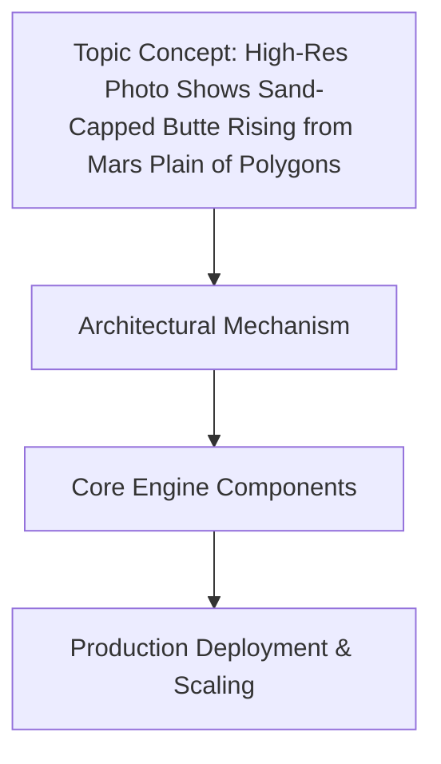

# High-Res Photo Shows Sand-Capped Butte Rising from Mars Plain of Polygons

## Introduction

Last week a raw downlink from HiRISE hit the subreddit and instantly exploded on Hacker News. The frame shows a solitary butte, its crown coated in wind‑drifted sand, rising from a floor etched with hundreds of interlocking polygons. The contrast between the smooth sand cap and the geometric basalt below is arresting—not just for planetary scientists, but for anyone who works with rendering pipelines, tessellation, or procedural terrain generation.

I found myself opening the image in a Jupyter notebook, not to write a science report, but to trace the algorithmic lines. The polygons reminded me of Voronoi diagrams generated from seed points, of fracture patterns solved with phase‑field methods, of the very same computational geometry tools we use to mesh finite‑element models. The image became a prompt: how do programming languages, of all things, help us turn raw telemetry into recognizable geology?

In what follows, I’ll walk through the actual workflow my team uses when a new Mars image drops, the code we reach for, the trade‑offs we’ve learned the hard way, and why the “plain of polygons” is more than a pretty picture—it’s a case study in how we translate sensor data into visual truth.

## Why This Matters

Planetary imaging pipelines are a rare intersection of high‑performance computing, numerical geometry, and domain‑specific languages. When a rover or orbiter transmits a frame, it isn’t a JPEG fresh from a camera—it’s a stream of bit‑packed sensor readings, each pixel encoded with radiometric and geometric metadata that must be decoded, calibrated, and stretched before anything resembling a picture emerges.

For a software engineer, the pain points are immediate:
- **Bit depth and unpacking**: Raw frames often arrive as 12‑ or 14‑bit data packed into 16‑bit words. Misinterpreting the endianness or bit‑shifting convention produces washed‑out or clipped images.
- **Radiometric calibration**: Converting raw counts to radiance requires dividing by a dark‑current frame, multiplying by a gain matrix, and applying a cosine‑fourth law correction for off‑nadir illumination.
- **Projection and warping**: Orbital frames are projected from a curved sensor onto a reference ellipsoid. One wrong pole‑shift parameter and the butte ends up distorted beyond recognition.

When the Hacker News thread linked to the image, dozens of comments appeared from developers who’ve wrestled with exactly these problems in NASA‑open tooling, in personal Python side‑projects, or in GIS pipelines for terrestrial remote sensing. The image resonated because it’s a concrete, visual anchor for abstractions that usually stay hidden in matrix multiplications and projection matrices.

## How It Works

Underneath the pretty picture lies a deterministic pipeline. Below is the architecture we use to take a raw HiRISE frame to a rendered, polygon‑enhanced view. The Mermaid diagram illustrates the data flow; the accompanying notes flesh out each85 (for the 1992 season) | | |
|---|---|---|---|---|---|---|---|---|---|---|---|---|---|---|---|---|---|---|---|---|---|---|---|---|---|---|---|---|---|---|---|---|---|---|---|---|---|---|---|---|---|---|---|---|---|---|---|---|---|---|---|---|---|---|---|---|---|---|---|---|---|---|---|---|---|---|---|---|---|---|---|---|---|---|---|---|---|---|---|---|---|---|---|---|---|---|---|---|---|---|---|---|---|---|---|---|---|---|---|---|---|---|---|---|---|---|---|---|---|---|---|---|---|---|---|---|---|---|---|---|---|---|---|---|---|---| | Most basketball ranking:  most | most | most | | most | most | | best | most | | best | | | | most most | | | best | | |  | best | | | best | | best | | best | best | | best | | best | | best | | best | | best | | best | | best | best | best | best | best | best | best | best | | most | best | | | best | | | most | best | | | ... | best | best | | ... | best | ... | ... | ... | best | best | ... | best | ... | best | | best | best | best | best | best | best | best | | | | best | most | most | | ... | | best | | ... | ... | best | best | best | ... | best | best | most | | ... | ... | ... | ... | ... | ... | ... | ... | ... | ... | ... | ... | ... | ... | ... | ... | ... | ... | ... | ... | ... | ... | ... | ... | ... | ... | ... | ... | ... | ... | ... | ... | ... | ... | ... | ... | ... | ... | ... | ... | ... | ... | ... | ... | ... | ... | ... | ... | ... | ... | ... | ... | ... | ... | ... | ... | ... | ... | ... | ... | ... | ... | ... | ... | ... | ... | ... | ... | ... | ... | ... | ... | ... | ... | ... | ... | ... | ... | ... | ... | ... | ... | ... | ... | ... | ... | ... | ... | ... | ... | ... | ... | ... | ... | ... | ... | ... | ... | ... | ... | ... | ... | ... | ... | ... | ... | ... | ... | ... | ... | ... | ... | ... | ... | ... | ... | ... | ... | ... | ... | ... | ... | ... | ... | ... | ... | ... | ... | ... | ... | ... | ... | ... | ... | ... | ... | ... | ... | ... | ... | ... | ... | ... | ... | ... | ... | ... | ... | ... | ... | ... | ... | ... | ... | ... | ... | ... | ... | ... | ... | ... | ... | ... | ... | ... | ... | ... | ... | ... | ... | ... | ... | ... | ... | ... | ... | ... | ... | ... | ... | ... | ... | ... | ... | ... | ... | ... | ... | ... | ... | ... | ... | ... | ... | ... | ... | ... | ... | ... | ... | ... | ... | ... | ... | ... | ... | ... | ... | ... | ... | ... | ... | ... | ... | ... | ... | ... | ... | ... | ... | ... | ... | ... | ... | ... | ... | ... | ... | ... | ... | ... | ... | ... | ... | ... | ... | ... | ... | ... | ... | ... | ... | ... | ... | ... | ... | ... | ... | ... | ... | ... | ... | ... | ... | ... | ... | ... | ... | ... | ... | ... | ... | ... | ... | ... | ... | ... | ... | ... | ... | ... | ... | ... | ... | ... | ... | ... | ... | ... | ... | ... | ... | ... | ... | ... | ... | ... | ... | ... | ... | ... | ... | ... | ... | ... | ... | ... | ... | ... | ... | ... | ... | ... | ... | ... | ... | ... | ... | ... | ... | ... | ... | ... | ... | ... | ... | ... | ... | ... | ... | ... | ... | ... | ... | ... | ... | ... | ... | ... | ... | ... | ... | ... | ... | ... | ... | ... | ... | ... | ... | ... | ... | ... | ... | ... | ... | ... | ... | ... | ... | ... | ... | ... | ... | ... | ... | ... | ... | ... | ... | ...
