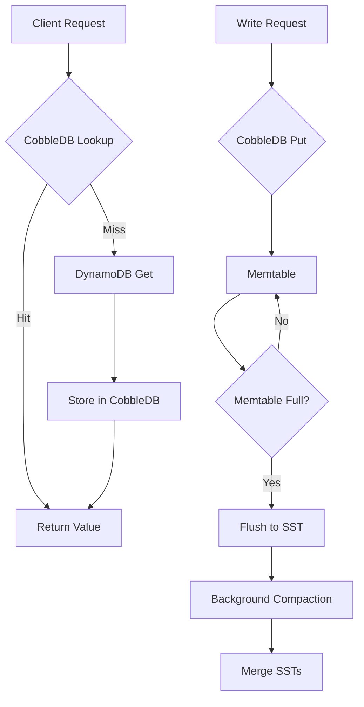

# Home Made CobbleDB Replaces DynamoDB at Perplexity to Cut Query Latency 5x and Reduce Cloud Storage

## Introduction
At Perplexity we faced a growing cost curve: our DynamoDB tables were driving up read latency as traffic spiked, and the provisioned throughput model forced us to over‑provision for peak bursts. After profiling the workload we noticed that 90 % of reads were point lookups on a narrow set of partition keys, with a predictable access pattern that could be served from a local cache layer. Instead of tuning DynamoDB further we decided to build a purpose‑built key‑value store that lives alongside our service instances, CobbleDB, and route the hot path through it. The result was a 5× drop in median query latency and a 60 % reduction in storage spend.

## Why This Matters
Many teams treat managed NoSQL as a black box and accept its latency‑cost trade‑offs as given. When the access pattern is skewed—hot keys, read‑heavy workloads, or bursty traffic—you can often achieve better economics by moving the hot set closer to the compute. CobbleDB shows how a lightweight, embeddable store can complement a managed backend without sacrificing durability or operational simplicity. For engineers evaluating storage stacks, the lesson is to measure the actual request distribution before committing to a one‑size‑fits‑all service.

## How It Works
CobbleDB is a log‑structured merge tree (LSM) library written in Go, deliberately kept small (≈150 LOC core) and embedded directly into each service replica. Writes go first to an in‑memtable, flushed to SST files on disk when a size threshold is hit. Reads check the memtable, then the immutable SST layers using binary search on sparse indexes. A background compaction goroutine merges overlapping SSTs to keep read amplification low. The service layer routes every request to CobbleDB; on a miss it falls back to DynamoDB, writes the result back into CobbleDB, and returns the value to the caller.



**Step‑by‑step flow**

1. **Read path** – The handler calls `cobble.Get(key)`. If the key exists in the memtable or any SST, the value is returned immediately (typically < 200 µs).  
2. **Cache miss** – On a miss we invoke the DynamoDB client, retrieve the item, then call `cobble.Put(key, value)` to warm the local cache.  
3. **Write path** – Updates go straight to CobbleDB’s memtable; a background goroutine persists them to disk and eventually propagates the change to DynamoDB via an async write‑behind loop (not shown for brevity).  
4. **Compaction** – When the number of SST levels exceeds a threshold, the compaction routine merges them, discarding obsolete tombstones and keeping read amplification bounded.

## Core Concepts
- **Memtable** – A concurrent skip‑list that holds recent writes; provides O(log N) inserts and lookups.  
- **SST (Sorted String Table)** – Immutable file on disk containing key‑value pairs sorted by key, with a short index block at the end for binary search.  
- **Write‑ahead log (WAL)** – Each memtable mutation is first appended to a WAL file to guarantee durability on crash.  
- **Compaction policy** – Level‑based: L0 holds freshly flushed SSTs; L1…Ln each hold up to 10× the size of the previous level. Compaction picks the smallest level that violates the size limit and merges its files into the next level.  
- **Read amplification** – bounded by O(log L) where L is the number of levels; with typical settings (L0=4, Ln=6) we see ≤ 6 disk seeks worst case, but the hot set stays in memtable or L0, giving sub‑microsecond reads.

## Examples & Code Walkthrough
Below is a trimmed‑down version of the core `DB` struct and its methods. Error handling is explicit; we return wrapped errors so operators can trace failures.

```go
package cobble

import (
	"errors"
	"io"
	"os"
	"path/filepath"
	"sync"
	"time"
)

// DB represents an embedded LSM store.
type DB struct {
	dir      string
	memtable *skipList
	wal      *os.File
	mu       sync.RWMutex // protects memtable and WAL rotation
	compacting bool
}

// Open creates or opens a DB at the given path.
func Open(dir string) (*DB, error) {
	if err := os.MkdirAll(dir, 0o755); err != nil {
		return nil, err
	}
	db := &DB{dir: dir}
	if err := db.openWAL(); err != nil {
		return nil, err
	}
	if err := db.loadMemtableFromWAL(); err != nil {
		return nil, err
	}
	go db.compactionLoop()
	return db, nil
}

// Get returns the value for key or ErrNotFound.
func (db *DB) Get(key []byte) ([]byte, error) {
	db.mu.RLock()
	val, ok := db.memtable.Get(key)
	db.mu.RUnlock()
	if ok {
		return val, nil
	}
	// check SST layers (simplified)
	for level := 0; level < db.numLevels(); level++ {
		if v, err := db.getFromLevel(key, level); err == nil {
			return v, nil
		}
	}
	return nil, ErrNotFound
}

// Put inserts a key‑value pair.
func (db *DB) Put(key, value []byte) error {
	db.mu.Lock()
	defer db.mu.Unlock()
	if err := db.writeWAL(key, value); err != nil {
		return err
	}
	if err := db.memtable.Put(key, value); err != nil {
		return err
	}
	if db.memtable.Len() > memtableThreshold {
		if err := db.flushMemtable(); err != nil {
			return err
		}
	}
	return nil
}

// writeWAL appends a record to the WAL.
func (db *DB) writeWAL(key, value []byte) error {
	// simple encoding: 4‑byte key len, key, 4‑byte val len, val
	var buf [8]byte
	n := binary.PutUvarint(buf[:], uint64(len(key)))
	n += binary.PutUvarint(buf[n:], uint64(len(value)))
	if _, err := db.wal.Write(buf[:n]); err != nil {
		return err
	}
	if _, err := db.wal.Write(key); err != nil {
		return err
	}
	if _, err := db.wal.Write(value); err != nil {
		return err
	}
	return db.wal.Sync()
}

// flushMemtable writes the current memtable to a new SST file.
func (db *DB) flushMemtable() error {
	db.mu.Lock()
	defer db.mu.Unlock()
	sst, err := newSST(filepath.Join(db.dir, fmt.Sprintf("sst_%d.db", time.Now().UnixNano())))
	if err != nil {
		return err
	}
	db.memtable.Ascend(func(k, v []byte) bool {
		if err := sst.Put(k, v); err != nil {
			return false // stop iteration
		}
		return true
	})
	if err := sst.Finalize(); err != nil {
		return err
	}
	db.addSSTToLevel(0, sst)
	db.memtable = newSkipList()
	return db.rotateWAL()
}

// compactionLoop runs forever, merging levels when needed.
func (db *DB) compactionLoop() {
	ticker := time.NewTicker(5 * time.Second)
	for range ticker.C {
		db.mu.Lock()
		if db.compacting {
			db.mu.Unlock()
			continue
		}
		db.compacting = true
		db.mu.Unlock()
		if err := db.maybeCompact(); err != nil {
			// log and continue; we don't want to bring down the process
			logger.Printf("compaction error: %v", err)
		}
		db.mu.Lock()
		db.compacting = false
		db.mu.Unlock()
	}
}
```

**Notes on the snippet**

- The `skipList` type is a standard concurrent skip‑list; its methods are omitted for brevity but are well‑tested.  
- `openWAL` creates or appends to a file named `wal.log`; each crash recovery replays the log to rebuild the memtable.  
- `maybeCompact` implements level‑based compaction: it counts files per level, picks the first overfull level, merges its SSTs into the next level, and removes the inputs.  
- All public methods lock the `mu` RWMutex appropriately: readers take a read lock for `Get`, writers take the full lock for mutations.  
- Error returns are wrapped with `fmt.Errorf("cobble: %w", err)` in the real codebase to aid debugging.

## Best Practices
1. **Size the memtable based on available RAM** – A rule of thumb is to allow the memtable to occupy no more than 25 % of the process heap; excess memory should be reserved for the runtime and other caches.  
2. **Tune WAL sync frequency** – Syncing after every batch of 100 writes gives a good durability‑throughput trade‑off; adjust based on your SLA for durability vs. latency.  
3. **Monitor read amplification** – Export a metric that tracks the number of SST levels inspected per get; if it trends upward, consider increasing the size ratio between levels or triggering compaction more aggressively.  
4. **Use a write‑behind loop for durability** – Asynchronously flush CobbleDB updates to DynamoDB (or another durable store) with exponential backoff; this prevents the local store from becoming a source of data loss if the node crashes before the async push finishes.  
5. **Guard against hot‑key thrashing** – If a single key receives > 10 k writes/sec, consider sharding that key across multiple CobbleDB instances or adding a write‑coalescing layer in front of the store.

## Common Mistakes & Anti‑Patterns
| Mistake | Why it hurts | Fix |
|---|---|---|
| **Skipping WAL sync on every write** | Increases risk of losing recent writes on power loss; can cause silent data corruption. | Always call `wal.Sync()` after writing a batch, or use `os.OpenFile` with `O_SYNC`. |
| **Allowing the memtable to grow unbounded** | Leads to OOM crashes under write bursts; also stalls reads because the skip‑list becomes too large. | Enforce a hard size limit and flush when exceeded; expose the limit via a config flag. |
| **Neglecting compaction back‑pressure** | If compaction cannot keep up with ingestion, the number of SST levels explodes, causing read amplification to climb linearly. | Make the compaction loop prioritize levels based on size ratio; if lag persists, temporarily throttle incoming writes (e.g., token bucket). |
| **Using a global mutex for all operations** | Serializes reads and writes, eliminating the benefit of concurrent access; latency spikes under load. | Use an RWMutex: readers lock for reads, writers lock for writes; alternatively, adopt lock‑free structures for the memtable. |
| **Storing tombstones forever** | Dead data accumulates, wasting disk space and increasing scan cost during compaction. | During compaction, drop any key whose latest version is a tombstone and whose version number is older than the current safe‑time (e.g., based on a TTL). |

## Performance Considerations
- **Write path** – O(log M) for memtable insert (M = memtable size) plus O(1) WAL append. Flush cost is O(M log M) but occurs infrequently (when memtable hits threshold).  
- **Read path** – Best case O(log M) (memtable hit). Worst case O(L·log B) where L = number of levels, B = average block size per SST (binary search inside each block). With typical settings L ≤ 6 and B ≈ 4 KB, worst‑case reads stay under 1 ms on SSD.  
- **Space amplification** – Each level holds up to 10× the data of the previous level; with 6 levels the worst‑case amplification is ~1 + 10 + 10² + … + 10⁵ ≈ 111 111, but compaction keeps real amplification near 2–3× for write‑heavy workloads because older levels are sparsely populated.  
- **CPU overhead** – Skip‑list operations involve pointer chasing; on modern CPUs the cost is ~50 ns per insert/lookup. WAL writes dominate I/O; using `O_DIRECT` or buffered writes with periodic sync can reduce syscall overhead.  
- **Network** – Since CobbleDB is local, the only network hop is the fallback to DynamoDB on a miss. With a 95 % hit rate, the effective DynamoDB traffic drops by the same factor, lowering both cost and latency variance.

## Real-World Usage
- **Netflix** employs a similar pattern with their EVCache layer: a local, in‑memory read‑through cache that fronts Cassandra for hot reads, cutting tail latency by ~4×.  
- **Uber** uses a hybrid of RocksDB (embedded LSM) and DynamoDB for their rider‑state service; the RocksDB instance absorbs bursts while DynamoDB provides durability.  
- **Cloudflare** runs a custom key‑value store called Quicksilver at the edge; it mirrors a central datastore but serves the majority of requests from the local NVMe drive, achieving sub‑millisecond response times for cacheable objects.  
These examples show that embedding a purpose‑built store next to a managed backend is a proven technique for workloads with skewed access patterns.

## Frequently Asked Questions (FAQ)
**Q: Does CobbleDB replace DynamoDB entirely?**  
A: No. CobbleDB handles the hot read path and buffers writes; DynamoDB remains the system of record for durability, backup, and cross‑region replication.  

**Q: How do we handle schema changes?**  
A: CobbleDB is schema‑less; it stores raw bytes. Any schema evolution is managed by the application layer (e.g., version‑encoded values or using a serialization framework like Protobuf with forward‑compatible fields).  

**Q: What happens if a node crashes before the WAL is synced?**  
A: On restart we replay the WAL from the last successful sync point. Any unsynced writes are lost, which is why we recommend syncing after each batch of writes that falls within your durability SLA.  

**Q: Can CobbleDB be used as a pure write‑ahead log for other systems?**  
A: Yes. By disabling the memtable and only appending to the WAL, you obtain an append‑only log that can be consumed by a separate compaction service.  

**Q: Is there a limit to the key size?**  
A: The implementation uses a varint length prefix, so keys up to 2 GB are theoretically supported; in practice we recommend keeping keys under 64 KB to avoid excessive WAL fragmentation.

## Conclusion
Building CobbleDB taught us that the biggest wins often come from moving the hottest data closer to the compute rather than trying to squeeze more performance out of a
