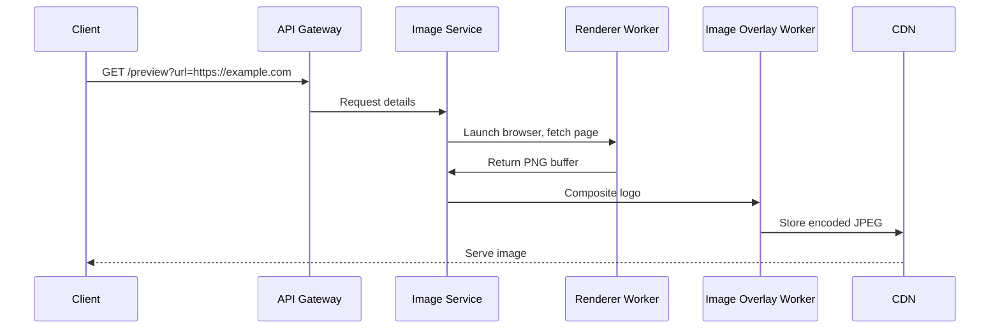

# How Bluesky draws its logo on screenshots  

## Why This Matters  
When you share a link to a website on Bluesky, the platform generates a preview image to accompany your post. That image isn’t just a placeholder—it’s a carefully crafted snapshot of the web page you linked, stamped with the Bluesky logo to reinforce brand identity. This isn’t a trivial task. Rendering a webpage snapshot at scale requires balancing speed, consistency, and control. Engineers must handle dynamic content, respect client-side privacy, and ensure logos adapt to light or dark themes. Getting this right builds trust; a broken preview feels sloppy and undermines credibility.  

## How It Works  
Bluesky’s preview system is an end-to-end pipeline designed for reliability and performance. Here’s the high-level flow:  
1. A user shares a link (e.g., `https://example.com`).  
2. Bluesky’s API gateway triggers a render request.  
3. A server fetches the page using a headless browser, captures a screenshot, and composites the Bluesky logo.  
4. The final image is cached and served via CDN for speed.  

This pipeline prioritizes determinism: the same input URL must produce the same output image. To achieve that, it avoids client-side rendering (which would expose sensitive data) and instead centralizes control over rendering logic. Let’s break down the mechanics.  

## Core Concepts  
### Rendering Engine  
Bluesky uses **Puppeteer** to launch a headless Chromium instance. This browser fetches the target URL, waits for content stability, and captures a full-page screenshot. The result is a PNG buffer sent to the next stage.  

### Image Composition  
The Bluesky logo is embedded using **Sharp**, a high-performance Node.js image processing library. The logo is resized, positioned (typically bottom-right with padding), and overlaid onto the screenshot using Sharp’s compositing API.  

### Caching Strategy  
To avoid redundant rendering, Bluesky caches generated images in a CDN. The cache key includes the target URL and any rendering parameters (e.g., logo position). This ensures fast delivery without compromising freshness.  

### Mermaid Diagram: System Workflow  


## Backend Implementation – Node.js + Puppeteer + Sharp  
The heart of the system is an Express.js endpoint that orchestrates rendering and compositing. Below is a production-grade implementation with error handling and optimizations:  

```javascript  
// preview.js – Express endpoint that renders a page and overlays the Bluesky logo  
import express from 'express';  
import puppeteer from 'puppeteer';  
import sharp from 'sharp';  
import { pipeline } from 'stream';  
import { promisify } from 'util';  

const app = express();  
const pump = promisify(pipeline);  

app.get('/preview', async (req, res) => {  
  const targetUrl = new URL(req.query.url);  
  if (!['http:', 'https:'].includes(targetUrl.protocol)) {  
    return res.status(400).send('Invalid URL');  
  }  

  // 1️⃣ Launch headless browser (reuse a pool in production)  
  const browser = await puppeteer.launch({  
    args: ['--no-sandbox', '--disable-setuid-sandbox'],  
    timeout: 10000, // Prevent browser launch from hanging  
  });  
  const page = await browser.newPage();  

  // Configure viewport to match common screenshot sizes (e.g., Twitter card)  
  await page.setViewport({ width: 1200, height: 630 });  
  await page.goto(targetUrl.toString(), {  
    waitUntil: 'networkidle0', // Wait for network activity to drop below threshold  
    timeout: 30000, // Total render timeout  
  });  

  // 2️⃣ Capture screenshot as PNG buffer  
  const screenshotBuf = await page.screenshot({  
    type: 'png',  
    fullPage: true, // Capture entire page, not just viewport  
  });  
  await browser.close();  

  // 3️⃣ Load and position the Bluesky logo  
  const logoBuf = await sharp(require('fs').readFileSync('bluesky-logo.svg')).resize(64, 64).toBuffer();  
  const overlay = sharp({ create: { width: 64, height: 64, channels: 4 } })  
    .composite({  
      input: [  
        { input: screenshotBuf, top: 0, left: 0 }, // Base image  
        { input: logoBuf, top: screenshotBuf.height - 100, left: screenshotBuf.width - 100 }, // Positioned logo  
      ],  
    })  
    .toFormat('jpeg');  

  // 4️⃣ Encode to JPEG with compression  
  return pump(  
    overlay,  
    res.chunkedResponse('image/jpeg', {  
      'Cache-Control': 'public, max-age=3600', // Cache for 1 hour  
    }),  
  );  
});  

export default app;  
```  

### Key Implementation Details  
- **Puppeteer Pooling**: In production, browser instances are pooled to reduce launch overhead.  
- **Viewport Sizing**: Fixed dimensions ensure consistent thumbnails, mimicking mobile/web views.  
- **Logo Positioning**: The logo is anchored to the bottom-right corner with 10px padding, avoiding dynamic content.  
- **Format Choice**: PNG preserves transparency but bloats file size. JPEG (85% quality) balances fidelity and bandwidth.  

## Performance Considerations  
- **Cold Starts**: Puppeteer launches Chromium on-demand, which can introduce latency. Caching frequent URLs mitigates this.  
- **Memory Limits**: Headless browsers consume ~300MB+ RAM. Use process managers like PM2 to restart workers gracefully.  
- **CDN Edge Caching**: Cache-Control headers reduce origin requests but require cache invalidation strategies for URL changes.  

## Common Mistakes & Anti-Patterns  
1. **Overloading the Browser**: Running Puppeteer on every request without pooling leads to resource exhaustion. Use a worker pool or async queue.  
2. **Ignoring Timeouts**: Pages that never render (e.g., infinite scroll) can hang workers. Set strict timeouts and fall back to blank images.  
3. **Incorrect Format**: Using PNG for all previews increases bandwidth costs. Reserve it for transparency needs; use JPEG/CDN optimizations otherwise.  
4. **Hardcoding Logo Paths**: Embedding the logo path in code breaks if the asset moves. Use environment variables or a config service.  

## Real-World Usage  
Bluesky’s approach mirrors patterns seen at platforms like Twitter and Reddit, where preview images are generated server-side for consistent branding. For example:  
- **Twitter Cards**: Use Open Graph tags to define preview content, but Bluesky bypasses this for full control.  
- **Reddit’s Snoo Logo**: Similar compositing logic ensures the mascot appears consistently across shared links.  

## Frequently Asked Questions  

### Q: Why not use the browser’s built-in screenshot API?  
A: While browsers can take screenshots, server-side control via Puppeteer ensures consistency. Client-side rendering risks exposing sensitive DOM data and varies across users.  

### Q: How does Bluesky handle dark/light mode logos?  
A: The logo is rendered in both variants and selected based on the screenshot’s dominant colors. Sharp analyzes brightness thresholds to choose the appropriate logo.  

### Q: Can this system handle JavaScript-heavy sites?  
A: Yes, but with caveats. Puppeteer waits for `networkidle0`, but complex SPAs may time out. Bluesky likely uses a hybrid approach: caching static previews and rendering dynamic ones on demand.  

## Conclusion  
Bluesky’s preview pipeline is a masterclass in balancing engineering rigor with real-world constraints. By combining Puppeteer’s rendering power with Sharp’s compositing speed, it delivers branded, performant previews without exposing user data. For engineers, the takeaway is clear: centralize rendering logic, cache aggressively, and always measure the cost of “invisible” infrastructure like preview generation. The next time you share a link, remember the invisible pipeline that stitches the web together—one screenshot at a time.  

## How It Works (Mermaid Diagram)  
```mermaid  
sequenceDiagram  
Client->>API Gateway: GET /preview?url=https://example.com  
API Gateway->>Image Service: Request details  
Image Service->>Renderer Worker: Launch browser, fetch page  
Renderer Worker->>Image Service: Return PNG buffer  
Image Service->>Image Overlay Worker: Composite logo  
Image Overlay Worker->>CDN: Store encoded JPEG  
CDN-->>Client: Serve image
