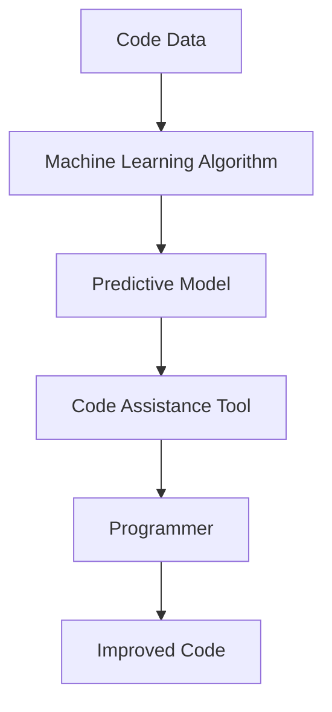

# How Can AI Help Lazy Programmers?
As a seasoned engineer, I've often found myself wondering if there's a way to automate some of the more mundane tasks that come with writing code. Whether it's debugging, testing, or simply writing boilerplate code, there are plenty of areas where AI can lend a helping hand. In this article, we'll explore how AI can assist lazy programmers like myself, making our lives easier and our code better.

## Introduction
The concept of using AI to aid in programming tasks is not new, but recent advancements have made it more accessible and practical. From code completion to bug detection, AI-powered tools are becoming increasingly sophisticated. As a programmer, it's exciting to think about how these tools can help us focus on the creative aspects of coding, rather than getting bogged down in tedious details.

## Why This Matters
So, why should we care about AI helping lazy programmers? The answer is simple: it saves time, reduces errors, and improves overall code quality. When we're able to automate routine tasks, we can focus on the complex problems that require human intuition and creativity. This, in turn, leads to more innovative solutions and better software. Moreover, with the ever-increasing demand for fast and reliable software development, any tool that can give us an edge is worth exploring.

## How It Works
At its core, AI-powered programming assistance relies on machine learning algorithms that analyze vast amounts of code data. These algorithms learn patterns, identify common errors, and develop predictive models that can be used to aid in coding tasks. Here's a high-level overview of how it works:

This process allows AI to provide real-time suggestions, detect potential bugs, and even automate certain coding tasks.

## Core Concepts
To understand how AI can help lazy programmers, it's essential to grasp some core concepts:

- **Machine Learning**: The ability of algorithms to learn from data without being explicitly programmed.
- **Natural Language Processing (NLP)**: A subset of AI that deals with the interaction between computers and humans in natural language.
- **Predictive Modeling**: The process of using statistical models to predict outcomes based on historical data.

## Examples & Code Walkthrough
Let's consider a practical example. Suppose we're building a web application and want to implement a feature that suggests potential fixes for common JavaScript errors. We could use an AI-powered code analysis tool to identify patterns in error logs and provide recommendations based on those patterns. Here's a simplified example using Python and the `transformers` library:
```python
from transformers import AutoModelForSequenceClassification, AutoTokenizer

# Load pre-trained model and tokenizer
model = AutoModelForSequenceClassification.from_pretrained("bert-base-uncased")
tokenizer = AutoTokenizer.from_pretrained("bert-base-uncased")

# Define a function to analyze code and suggest fixes
def suggest_fixes(code_snippet):
    # Tokenize the code snippet
    inputs = tokenizer(code_snippet, return_tensors="pt")
    
    # Use the model to predict potential fixes
    outputs = model(**inputs)
    
    # Return the top suggested fix
    return outputs.logits.argmax(-1)

# Test the function
code_snippet = "console.log('Hello World'); // This will throw an error"
print(suggest_fixes(code_snippet))
```
This example illustrates how AI can be used to analyze code and provide suggestions for improvement.

## Best Practices
When adopting AI-powered programming assistance, keep the following best practices in mind:

- **Start small**: Begin with simple use cases and gradually move to more complex tasks.
- **Evaluate tools carefully**: Choose tools that align with your specific needs and integrate well with your existing workflow.
- **Monitor performance**: Regularly assess the impact of AI assistance on your coding efficiency and accuracy.

## Common Mistakes & Anti-Patterns
Some common pitfalls to avoid when using AI-powered programming assistance include:

- **Over-reliance on AI**: Remember that AI is a tool, not a replacement for human judgment and oversight.
- **Ignoring false positives**: Be cautious of AI suggestions that may not always be accurate or relevant.
- **Failing to update models**: Regularly update your AI models to ensure they remain effective and adapt to changing coding patterns.

## Performance Considerations
When integrating AI-powered tools into your development workflow, consider the following performance factors:

- **Latency**: Ensure that AI assistance does not introduce significant delays in your coding process.
- **Resource usage**: Be mindful of the computational resources required by AI tools, especially in resource-constrained environments.
- **Scalability**: Choose tools that can scale with your project's growth and complexity.

## Real-World Usage
Industry leaders are already leveraging AI-powered programming assistance in various ways. For instance, companies like Google and Microsoft are using AI to improve code quality, reduce bugs, and enhance developer productivity. By adopting similar strategies, businesses can stay competitive in the fast-paced software development landscape.

## Frequently Asked Questions (FAQ)
Here are some common questions about AI-powered programming assistance:

- Q: Will AI replace human programmers?
A: No, AI is designed to augment human capabilities, not replace them.
- Q: How accurate are AI-powered code suggestions?
A: Accuracy varies depending on the tool and context, but high-quality tools can achieve accuracy rates of 80% or higher.
- Q: Can AI help with debugging?
A: Yes, AI can assist in identifying potential bugs and suggesting fixes based on patterns in code data.

## Conclusion
AI has the potential to revolutionize the way we write code, making us more efficient, accurate, and creative. By embracing AI-powered programming assistance, lazy programmers like myself can focus on the aspects of coding that bring us joy and fulfillment. As the technology continues to evolve, it's exciting to think about the possibilities it will unlock for software development.
