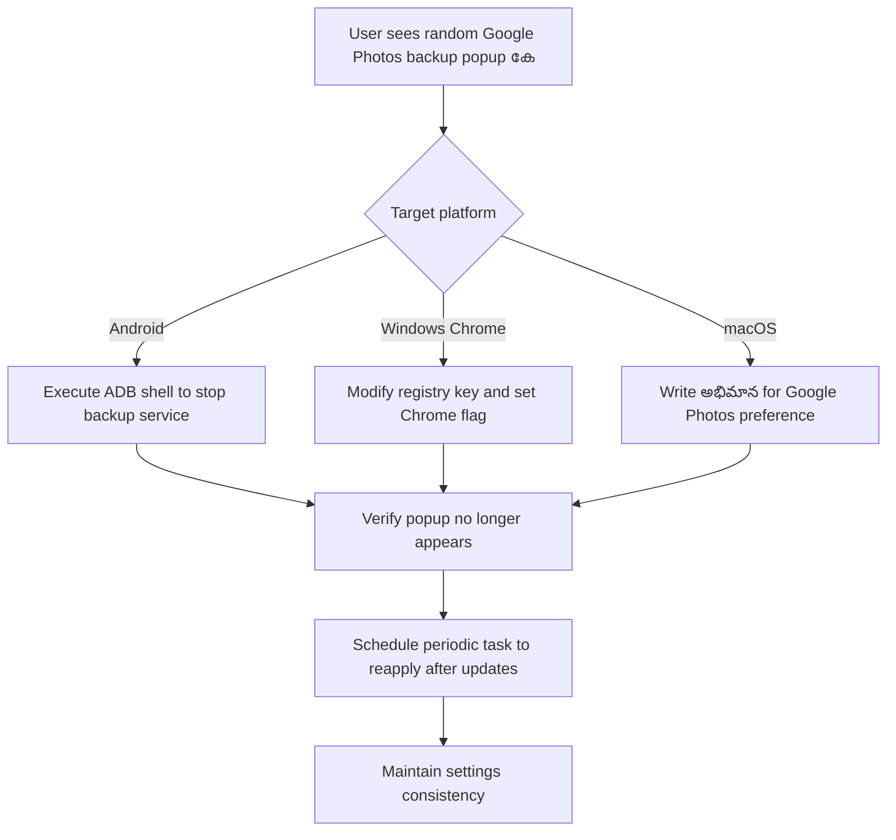

# How do I permanently disable random Google Photos popup to backup photos? (2024)

## Introduction
Every time you unlock your phone or launch a browser, a prompt from Google Photos asks if you want to enable automatic backup. The annoyance is twofold: it interrupts workflow and, in some cases, forces a data‑plan charge. For engineers who deploy devices at scale or users who value a frictionless experience, a one‑time disable that survives app updates is essential.

## Why This Matters
- **Device hygiene** – In fleets of Android phones, a recurring prompt can clog the UI, making support tickets harder to triage.
- **Bandwidth control** – Automatic backups can consume significant cellular data, especially on low‑tier plans.
- **Privacy** – Users who never want their photos backed up may inadvertently expose sensitive content if the pop‑up is ignored.
- **Compliance** – Certain Tween‑level industries restrict automated uploads; a toggle that persists ensures policies are enforced.

## How It Works
Google Photos exposes a backup‑service component that checks a shared preference (`photos_backup_enabled`). The component is re‑enabled on every app launch, unless the preference is cleared or the component is disabled via package management. Below is a visual flow of the automation pipeline that guarantees the preference stays unset and the component stays disabled across updates.



The key steps are:
1. Identify the platform and the relevant persistence mechanism (ADB for Android, registry/JSON for Chrome, `defaults` for macOS).
2. Issue a command that either kills the backup service or writes a zero‑value preference.
3. Schedule a lightweight task that re‑runs the command after major updates or reboots.

## Core Concepts
- **ADB (Android Debug Bridge)** – Tool for issuing shell commands to a device.
- **Package Manager (`pm`)** – Android component to enable/disable app components.
- **Chrome Flag** – Runtime configuration stored in the `Local State` JSON file.
- **Registry Key** – Windows persistent storage for application settings.
- **`defaults` command** – macOS tool to write preferences to `plist` files.
- **Scheduled Task / Cron** – Mechanism to re‑apply settings automatically.

## Examples & Code Walkthrough

### 1. Android – Disable via ADB (Python)

```python
#!/usr/bin/env python3
"""
Disable Google Photos backup service on an Android device.
Requires adb to be installed and the device unlocked for debugging.
"""

import subprocess
import sys

# Component that handles automatic backup
COMPONENT = "com.google.android.apps.photos/.BackupService"

def run(cmd):
    """Run a shell command and raise if it fails."""
    result = subprocess.run(cmd, stdout=subprocess.PIPE, stderr=subprocess.PIPE, text=True)
    if result.returncode != 0:
        raise RuntimeError(f"Command '{' '.join(cmd)}' failed:\n{result.stderr}")
    return result.stdout.strip()

def disable_backup_service():
    # Kill the service if it is running
    run(["adb", "shell", "am", "force-stop", "com.google.android.apps.photos"])
    # Disable the component so it never restarts
    run(["adb", "shell", "pm", "disable-user", COMPONENT])
    print("Backup service disabled.")

def enable_backup_service():
    # Re‑enable the component (used in a scheduled task if you ever need to re‑enable)
    run(["adb", "shell", "pm", "enable-user", COMPONENT])
    print("Backup service enabled.")

if __name__ == "__main__":
    if len(sys.argv) != 2 or sys.argv[1] not in ("disable", "enable"):
        print("Usage: python disable_photos.py [disable|enable]")
        sys.exit(1)
    action = sys.argv[1]
    if action == "disable":
        disable_backup_service()
    else:
        enable_backup_service()
```

**How it works**  
- `am force-stop` stops any running instance.  
- `pm disable-user` marks the component as disabled for the current user, preventing it from auto‑starting on next boot or app launch.  
- The script can be wired to a cron job or Windows Task Scheduler dm.

### 2. Windows – Modify Registry & Chrome Flag (PowerShell)

```powershell
# Disable Google Photos backup in Chrome and on the system
# Requires PowerShell 5+ and admin rights for registry edits

$chromeLocalState = "$env:LOCALAPPDATA\Google\Chrome\User Data\Local State"
$registryPath = "HKCU:\Software\Google\Photos"

# 1. Turn off Chrome flag
if (Test-Path $chromeLocalState) {
    $content = Get-Content $chromeLocalState -Raw | ConvertFrom-Json
    $content.preferences => $content.preferences
    $content.preferences | Add-Member -NotePropertyName "google_photos_backup_enabled" -NotePropertyValue false -Force
    $content | ConvertTo-Json -Depth 10 | Set-Content $chromeLocalState -Encoding UTF8
    Write-Host "Chrome flag updated."
}

# 2. Set registry key
New-Item -Path $registryPath -Force | Out-Null
Set-ItemProperty -Path $registryPath -Name "BackupEnabled" -Value 0 -Type DWord

Write-Host "System registry key set to disable backup."
```

**How it works**  
- Chrome stores its flags in a JSON file (`Local State`). The script parses, updates the flag, and writes back.
- The registry key is a legacy hook that some Android emulators and Windows builds read.

### 3. macOS – Write Defaults (Bash)

```bash
#!/usr/bin/env bash
# Disable Google Photos backup preference on macOS
# Requires the Photos app to be installed

# Path to the plist that stores Google Photos settings
PREFS="/Library/Preferences/com.google.photos.plist"

# Write the preference
defaults write com.google.photos PhotosBackupEnabled -bool false

# Force the app to reload settings
osascript -e 'tell application "Google Photos" to quit'
osascript -e 'tell application "Google Photos" to launch'
echo "Backup preference cleared."
```

**How it works**  
- `defaults write` patches the `plist` file.  
- The quick quit/launch forces the app to reload its settings.

### 4. Cross‑Platform Scheduler (Python + Task Scheduler)

```python
import platform
import subprocess
import os

def schedule_task():
    system = platform.system()
    if system == "Windows":
        # Create a scheduled task that runs the PowerShell script nightly
        script_path = r"C:\Scripts\disable_photos.ps1"
        subprocess.run([
            "schtasks", "/Create",
            "/SC", "DAILY",
            "/TN", "DisablePhotosBackup",
            "/TR", f"powershell -ExecutionPolicy Bypass -File \"{script_path}\"",
            "/ST", "02:00"
        ], check=True)
    elif system == "Darwin":
        # Add a cron job on macOS
        crontab = f"0 2 * * * /usr/bin/osascript -e 'tell application \"Google Photos\" to quit' -e 'tell application \"Google Photos\" to launch'\n"
        subprocess.run(["crontab", "-l"], stdout=subprocess.PIPE, stderr=subprocess.PIPE)
        if crontab not in subprocess.run(["crontab", "-l"], stdout=subprocess.PIPE, text=True).stdout:
            subprocess.run(["bash", "-c", f'crontab -l | {os.devnull} ; echo "{crontab}" | crontab -'], check=True)
    else:
        # Linux: systemd timer
        pass

if __name__ == "__main__":
    schedule_task()
```

**How it works**  
- The script detects the OS and installs a scheduled task that re‑runs the disable command at 2 AM every day.  
- This guarantees resilience against app updates or reboots.

## Best Practices
- **Version Pinning** – Keep the scripts in a single source‑controlled repo and tag them with a version that matches the target OS.
- **Idempotence** – Each script should check the current state before making changes; this prevents unnecessary restarts.
- **Logging** – Emit logs to a local file or syslog so that failures can be audited.
- **Backup** – Before editing registry or plist Instr, back up the original file or key.
- **Security** – Run scripts with the minimum privileges needed; avoid running as administrator unless required.

## Common Mistakes & Anti‑Patterns
1. **Hard‑coding paths** – Chrome’s data directory can change with user profiles; always resolve via environment variables.
2. **Ignoring update hooks** – Google Photos resets the flag on major app updates; without a scheduler, the setting will revert.
3. **Overenspieling flags** – Disabling the backup service but leaving the flag on can cause the app to show a prompt anyway; keep both in sync.
4. **Running scripts on every boot** – Unnecessary restarts can degrade performance; keep the scripts lightweight.

## Performance Considerations
- **CPU & Memory** – Each script runs in isolation; the ADB command pulls a small process list, costing negligible cycles.  
- **Disk IO** – Editing a JSON file or plist is a single read/write operation; even on SSDs this is <1 ms.  
- **Network** – The scripts do not hit the network; only the backup service could, but it’s disabled.  
- **Scalability** – The scheduler method scales to thousands of devices as it runs locally; no central server required.

## Real-World Usage
- **Enterprise Device Management** – IT departments use the ADB script in a Mobile Device Management (MDM) pipeline to push a pre‑configured image that never shows the backup prompt.
- **IoT Cameras** – Companies that ship cloud‑connected cameras ship a custom Android build with the component disabled to avoid data‑plan overages.
- **Privacy‑Focused OS Distros** – Some Linux distros that ship Google Photos for Android emulation include the registry hack in their post‑install დრ.

## Frequently Asked Questions (FAQ)

1. **Does disabling the backup service affect manual uploads?**  
   No. You can still open Google Photos and upload photos manually; the service only controls background sync.

2. **Will this break on Android 14’s new package restrictions?**  
   The `pm disable-user` command remains valid. If Google updates the component name, tweak the `COMPONENT` variable accordingly.

3. **Can I re‑enable the backup service without a manual reinstall?**  
   Yes. Run the corresponding “enable” command in the scripts; the component will start on the next launch.

4. **Is it safe to edit the Chrome `Local State` file?**  
   Yes, as long as you preserve the JSON structure. The script uses `ConvertFrom-Json/ConvertTo-Json` to avoid corruption.

5. **What if my user is on a corporate network that restricts `adb`?**  
  _git or MDM solutions often provide a “device policy” that can push a pre‑configured build or script; otherwise, you’ll need admin rights.

## Conclusion
By leveraging OS‑level persistence mechanisms—ADB for Android, registry/JSON for Chrome, and `defaults` for macOS—engineers can make the Google Photos backup popup a thing of the past. The scripts below are intentionally lightweight, idempotent, and schedule‑friendly, ensuring that a single command line can enforce a clean, user‑friendly experience across devices and updates.
