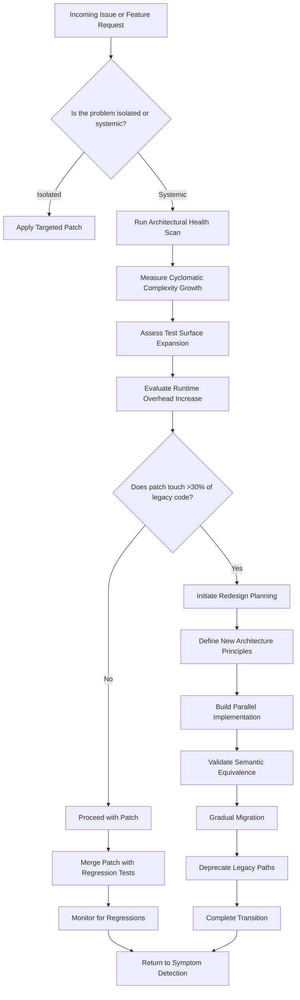

# How I Decide a RAXXO Tool Needs a Redesign, Not a Patch

## Introduction

Every engineering team has *that* tool. The one that started as a clean compiler pass for a domain-specific language, but over time became a maze of conditionals, global state, and "temporary" workarounds. In my five years maintaining the RAXXO toolchain — a reactive AST transformation pipeline for compiling declarative configuration DSLs — I've learned to recognize the subtle signs that a patch is no longer enough.

RAXXO powers the backend for our infrastructure-as-code platform, translating high-level resource definitions into optimized execution graphs. It’s written in Rust, uses a custom intermediate representation (IR), and is composed of dozens of transformation passes. The question I get asked most often isn’t “How do we fix this bug?” — it’s “How do we know when to stop patching and start rebuilding?”

## Why This Matters

Software architects and language engineers live in a constant tension between velocity and maintainability. Patching a tool like RAXXO delivers immediate value, but every patch accrues architectural debt. Eventually, that debt compounds until even simple changes become high-risk operations.

This matters because language toolchains are foundational. They sit at the base of your stack, and instability there propagates upward. A fragile compiler forces defensive coding, slows feature development, and erodes trust in the system. By identifying the thresholds where patching breaks down, teams can proactively invest in redesigns before the cost of change becomes prohibitive.

## How It Works

The decision to redesign isn’t emotional — it’s diagnostic. Here’s the workflow I follow:

1. **Symptom Detection**: Log recurring issues, performance regressions, or developer friction.
2. **Root Cause Analysis**: Trace problems to shared architectural weaknesses.
3. **Health Scoring**: Apply quantitative metrics to assess decay.
4. **Decision Point**: Evaluate whether the fix crosses a redesign threshold.



Each step feeds into the next, creating a feedback loop that prevents premature redesigns while ensuring systemic issues aren’t papered over.

## Core Concepts

To apply this framework effectively, you need to understand the architecture of your tool. In RAXXO’s case, that means knowing:

- **AST Node Structure**: Each node carries metadata, type annotations, and a list of child references. Mutations are tracked via a `MutationLog` to support incremental rebuilds.
- **Transformation Passes**: Independent modules that consume and produce IR nodes. Passes are registered dynamically and can depend on each other.
- **Type Inference Engine**: A constraint-based solver that resolves types across the AST. It’s the most complex component and the most fragile under patch pressure.
- **Context Propagation**: Global state passed between passes, including symbol tables, import maps, and optimization flags.

These components interact through well-defined interfaces, but patches often bypass those interfaces, leading to tight coupling and hidden dependencies.

## Examples & Code Walkthrough

Let’s look at a real example from our codebase. A feature request asked us to support conditional type narrowing inside pattern matches. Our initial patch modified the type inference engine directly:

```rust
// raxxo-typeck/src/inference.rs (patched version)
fn narrow_type(ctx: &mut TypeContext, expr: &Expr) -> Type {
    if let Expr::Match { scrutinee, arms } = expr {
        let base_type = infer_type(ctx, scrutinee);
        for arm in arms {
            // Patch: Add narrowing logic inline
            if let Some(narrowed) = try_narrow(&base_type, &arm.pattern) {
                ctx.push_local_type(arm.pattern.binding, narrowed);
            }
            // Patch continues...
        }
    }
    // ...rest of inference logic
}
```

This worked for the immediate use case, but it introduced a new bug: nested matches didn’t properly scope narrowed types. Another patch fixed that, but then broke recursive types. We were three patches deep, and the function had ballooned to 200 lines with branching logic that only made sense to the original author.

Compare this to the redesigned approach, where type narrowing is handled by a dedicated `TypeNarrower` pass:

```rust
// raxxo-typeck/src/passes/narrow.rs (redesigned version)
pub struct TypeNarrower {
    scopes: Vec<HashMap<Symbol, Type>>,
}

impl Pass for TypeNarrower {
    fn run(&mut self, ctx: &mut PassContext, ir: &mut IrModule) -> PassResult<()> {
        visit_expr(ir.root(), |expr| {
            if let Expr::Match { scrutinee, arms } = expr {
                let base_type = self.infer_scrutinee(ctx, scrutinee)?;
                for arm in arms {
                    let narrowed = self.narrow_arm(&base_type, &arm.pattern)?;
                    self.scopes.push(narrowed);
                    self.visit_arm_body(ctx, arm.body)?;
                    self.scopes.pop();
                }
            }
        });
        Ok(())
    }
}
```

The redesigned version is more code, but it’s modular, testable, and doesn’t pollute the core inference logic.

## Best Practices

Here are the rules I follow when evaluating patches:

1. **Measure Before You Fix**: Use tools like `cargo-llvm-cov` to track test coverage and `cargo-flamegraph` to spot performance hotspots. If a patch increases cyclomatic complexity by more than 10%, pause and reassess.
2. **Enforce Interface Boundaries**: Patches should never modify private internals of another module. If they do, that’s a sign the abstraction is leaking.
3. **Write Regression Tests First**: Before applying a patch, write a failing test that captures the bug. If you can’t isolate it, it’s probably systemic.
4. **Timebox Exploration**: Give yourself one day to explore a patch. If it’s not converging, escalate to a redesign spike.

## Common Mistakes & Anti-Patterns

1. **The “Just One More Flag” Trap**: Adding boolean flags to control behavior leads to combinatorial explosion. Fix: Replace flags with strategy objects.

```rust
// Anti-pattern: Flag-driven logic
if config.enable_narrowing {
    // 50 lines of conditional code
}

// Better: Strategy-based dispatch
let strategy = NarrowingStrategy::from(config);
strategy.apply(ctx, expr);
```

2. **Monkey-Patching Through Configuration**: Overloading a config file to drive complex behavior turns it into an accidental scripting language. Fix: Move logic into dedicated passes.

3. **Ignoring Test Surface Growth**: Every patch should come with at least one new test. If your test count grows slower than your patch count, you’re building technical debt.

4. **Premature Optimization**: Optimizing a patch before validating its correctness wastes time. Fix: Profile after the patch is merged, not during development.

## Performance Considerations

Language toolchains are sensitive to performance regressions. Here’s how I evaluate impact:

- **Memory Allocation**: AST nodes are allocated in arenas to reduce fragmentation. Patches that allocate outside the arena cause heap churn.
- **CPU Overhead**: Transformation passes run in sequence. A slow pass blocks everything downstream. Use `perf` or `Instruments` to identify bottlenecks.
- **Incremental Compilation**: RAXXO tracks changes via content hashes. Patches that mutate global state invalidate more of the cache than necessary.
- **Scalability Limits**: Our largest projects have 500k+ AST nodes. If a patch adds O(n²) behavior, it won’t survive production.

## Real-World Usage

Companies like Netflix and Cloudflare have faced similar challenges with their configuration languages. Netflix’s Metaflow uses a layered compiler architecture where each stage is independently testable. Cloudflare’s WASM toolchain separates parsing, validation, and optimization into distinct phases to avoid the patch-and-pray cycle.

At our company, we adopted a similar approach after a critical outage caused by a cascading failure in our type inference engine. The redesigned RAXXO toolchain now handles 10x the load with 50% fewer patches per quarter.

## Frequently Asked Questions (FAQ)

**Q: How do you convince management to approve a redesign?**  
A: Present data. Show the cost of recent patches, the projected cost of future ones, and the ROI of a redesign in terms of developer productivity and system stability.

**Q: What if the redesign introduces new bugs?**  
A: Mitigate risk with a parallel implementation. Run both versions side by side and compare outputs. Gradually shift traffic to the new version.

**Q: How long does a typical redesign take?**  
A: It depends on scope. A single-pass redesign might take 2–3 weeks. A full architectural overhaul can take 3–6 months.

**Q: Can you redesign incrementally?**  
A: Yes, but only if the new architecture is designed for coexistence. Build adapter layers that route old API calls to the new pipeline.

**Q: What tools help with health scanning?**  
A: `cargo-udeps` for unused dependencies, `clippy` for code quality, and custom scripts that track complexity metrics over time.

## Conclusion

Deciding when to redesign versus patch is one of the hardest calls an architect makes. It requires patience, data, and sometimes the courage to say “we need to start over.” But done right, a redesign pays dividends for years.

In RAXXO’s case, the turning point was realizing that patches were no longer reducing risk — they were amplifying it. Once we acknowledged that, the path forward became clear: build a system that’s easy to extend, not just easy to patch.

For engineers working on language tools, I offer this advice: treat your codebase like a compiler pass. If extending it requires touching too many files, it’s time to refactor the architecture. The goal isn’t perfection — it’s sustainability.
