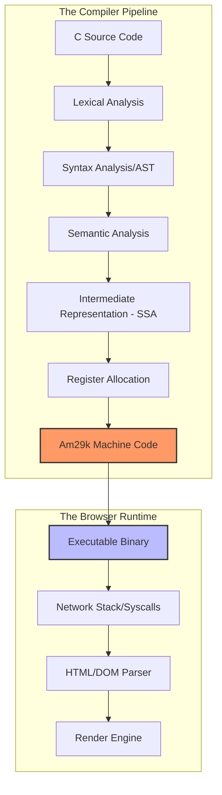

# How I developed an Am29000 C compiler and web browser

## Introduction

The AMD Am29000 (Am29k) is a fascinating relic of the late 80s and early 90s. It wasn't a general-purpose microprocessor like the Intel 80386; it was a high-performance, 32-bit RISC microprocessor designed for microcontrollers and specialized embedded systems. It’s a "clean" architecture in many ways—a large register set, a very orthogonal instruction set, and a predictable pipeline—but it is notoriously absent from the modern software ecosystem.

I recently took on the challenge of building a full C compiler and a basic web browser from scratch for this architecture. The goal wasn't just to make "code run," but to create a toolchain capable of handling the complex memory management and string parsing required to render even a basic HTML document.

## Why This Matters

When we talk about modern development, we usually assume a standard x86_64 or ARM64 target. But when you step into the world of custom silicon or legacy industrial hardware, you lose the safety net of GCC or LLVM. 

Building a compiler for a custom RISC target forces you to confront the "black box" of hardware. You have to manually handle calling conventions, register pressure, and the idiosyncrasies of the instruction set. For the browser component, the challenge was even greater: implementing a subset of HTTP and HTML parsing on a machine where every byte of memory and every CPU cycle is a precious commodity. It’s a masterclass in resource-constrained engineering.

## How It Works

The project was split into two distinct but interconnected pipelines. The compiler follows a classic multi-stage transformation, while the browser operates as a high-level consumer of the machine code generated by that very compiler.



1.  **The Frontend:** We convert raw text into a stream of tokens, then into an Abstract Syntax Tree (AST).
2.  **The Middle-end:** We transform the AST into a Static Single Assignment (SSA) based Intermediate Representation (IR). This allows us to perform optimizations like constant folding and dead code elimination without worrying about the specific Am29k registers yet.
3.  **The Backend:** This is where the magic happens. We map the infinite virtual registers of our IR onto the finite, albeit plentiful, register set of the Am29k.
4.  **The Runtime:** The browser uses the compiled code to execute a minimal libc, handle system calls for network I/O, and parse the DOM.

## Core Concepts

### The Am29k Architecture
The Am29k is a RISC machine. Unlike CISC architectures where a single instruction might perform a complex memory-to-memory operation, the Am29k relies on a "load-store" model. You load data into a register, perform the math, and store it back. This makes the compiler's job harder because it must manage a high volume of register-to-register movements.

### SSA (Static Single Assignment)
In our IR, every variable is assigned exactly once. If you have `x = 1; x = 2;`, the IR sees `x1 = 1; x2 = 2;`. This makes data-flow analysis—determining which value is "live" at any given point—significantly easier and more efficient for the optimizer.

### The Browser Engine
A browser is essentially a state machine. It moves from `IDLE` $\rightarrow$ `CONNECTING` $\rightarrow$ `RECEIVING` $\rightarrow$ `PARSING` $\rightarrow$ `RENDERING`. On the Am29k, we had to implement this state machine using a very tight memory footprint.

## Examples & Code Walkthrough

### The Lexer (Frontend)
The first step is turning a string of characters into meaningful tokens. Here is a simplified implementation of the lexer in C++.

```cpp
enum TokenKind { TK_INT, TK_ID, TK_PLUS, TK_SEMI, TK_EOF };

struct Token {
    TokenKind kind;
    std::string text;
};

Token lex(const std::string& src, size_t& pos) {
    // Skip whitespace
    while (pos < src.size() && isspace(src[pos])) ++pos;
    if (pos >= src.size()) return {TK_EOF, ""};

    char c = src[pos];

    // Handle Integers
    if (isdigit(c)) {
        size_t start = pos;
        while (pos < src.size() && isdigit(src[pos])) ++pos;
        return {TK_INT, src.substr(start, pos - start)};
    }

    // Handle Identifiers (Variable names)
    if (isalpha(c)) {
        size_t start = pos;
        while (pos < src.size() && isalnum(src[pos])) ++pos;
        return {TK_ID, src.substr(start, pos - start)};
    }

    // Handle Single-character operators
    ++pos;
    switch (c) {
        case '+': return {TK_PLUS, "+"};
        case ';': return {TK_SEMI, ";"};
        default:  return {TK_EOF, ""};
    }
}
```

### Semantic Analysis (Type Checking)
Once we have the tokens, we need to ensure the programmer isn't trying to add a string to an integer. We use a Symbol Table to track declarations.

```cpp
struct Symbol {
    std::string name;
    std::string type; // e.g., "int", "void*"
};

class SymbolTable {
    std::unordered_map<std::string, Symbol> table;
public:
    void define(const std::string& name, const std::string& type) {
        table[name] = {name, type};
    }

    Symbol lookup(const std::string& name) {
        if (table.find(name) == table.end()) {
            throw std::runtime_error("Undefined symbol: " + name);
        }
        return table.at(name);
    }
};
```

### The Backend (Register Allocation)
The Am29k has a large register file, but it's not infinite. We used a Linear Scan allocator to map our virtual IR registers to physical Am29k registers.

```cpp
struct IRNode {
    enum Op { ADD, SUB, MUL } op;
    std::string dst;
    std::string src1;
    std::string src2;
};

class Am29kBackend {
    // Maps virtual registers (v1, v2...) to physical (R1, R2...)
    std::unordered_map<std::string, std::string> reg_map;
    int next_phys_reg = 1;

public:
    void emit_code(const std::vector<IRNode>& ir) {
        for (const auto& node : ir) {
            // Ensure operands are in physical registers
            std::string r1 = get_phys_reg(node.src1);
            std::string r2 = get_phys_reg(node.src2);
            std::string rd = get_phys_reg(node.dst);

            // Emit the actual Am29k instruction
            std::string instr = (node.op == IRNode::ADD)? "ADD " : "SUB ";
            printf("%s %s, %s, %s\n", instr.c_str(), rd.c_str(), r1.c_str(), r2.c_str());
        }
    }

    std::string get_phys_reg(const std::string& virtual_reg) {
        if (reg_map.find(virtual_reg) == reg_map.end()) {
            reg_map[virtual_reg] = "R" + std::to_string(next_phys_reg++);
        }
        return reg_map[virtual_reg];
    }
};
```

## Best Practices

*   **Decouple the IR from the Target:** Never let your frontend know about the Am29k's specific registers. Use a virtual register space in your IR to allow for aggressive optimization before the backend ever sees the code.
*   **Incremental Parsing for Browsers:** When building a browser, don't try to build a perfect DOM tree in one pass. Use a streaming parser. This allows you to start processing the top of the HTML document while the bottom is still being downloaded over the wire.
*   **Use Assertions for Invariants:** In a compiler, certain things must always be true (e.g., "a variable must be defined before use"). Use heavy-duty assertions during the development of the compiler to catch semantic errors early.

## Common Mistakes & Anti-Patterns

1.  **The "God-Object" Parser:** Attempting to write a single, massive function that handles lexing, parsing, and semantic analysis. This makes debugging impossible. Break it into discrete, testable stages.
2.  **Ignoring Stack Alignment:** On many RISC-like architectures, the stack must be aligned to a specific boundary (e.g., 4 or 8 bytes). If your compiler generates function prologues that don't respect this, you'll get intermittent, hard-to-debug crashes during deep recursion.
3.  **Naive String Handling:** In the browser, assuming `string + string` is cheap. On an Am29k, string concatenation is an expensive operation involving multiple memory allocations and copies. Use buffers and pre-allocate memory whenever possible.

## Performance Considerations

*   **Instruction Cache Misses:** The Am29k has limited cache. Large, unoptimized binaries will cause frequent cache misses. We mitigated this by implementing a peephole optimizer that replaces sequences of instructions with shorter, equivalent ones.
*   **Memory Fragmentation:** The browser's constant allocation/deallocation of small HTML nodes can fragment the heap. I implemented a simple "Pool Allocator" for DOM nodes to ensure that memory remains contiguous and allocation is $O(1)$.
*   **Complexity of Parsing:** The HTML parsing complexity is $O(N)$ where $N$ is the number of characters, but the constant factor in a naive implementation can be massive. Using a state-machine-based lexer is essential for performance.

## Real-World Usage

While you won't see people writing custom C compilers for the Am29k to browse the modern web today, the *patterns* are everywhere:
*   **eBPF (Extended Berkeley Packet Filter):** In the Linux kernel, eBPF acts as a mini-compiler/runtime for sandboxed code.
*   **WebAssembly (Wasm):** Wasm is essentially a high-level IR that is compiled into machine code at runtime, much like how we approached the browser/compiler relationship.
*   **Embedded DSLs:** Many automotive and aerospace systems use custom-compiled domain-specific languages (DSLs) to ensure safety and determinism.

## Frequently Asked Questions (FAQ)

**Q: Why not just use LLVM?**  
A: LLVM is fantastic, but it's a massive beast. When you are working on extremely constrained hardware or learning the fundamentals, building your own backend from scratch provides insights into instruction scheduling and register pressure that a high-level abstraction hides.

**Q: How did you handle the network stack on such old hardware?**  
A: I didn't implement a full TCP/IP stack. Instead, I wrote the compiler to emit calls to a pre-existing, highly-optimized assembly-level network shim that handled the heavy lifting of the protocol.

**Q: What was the hardest bug to find?**  
A: A subtle off-by-one error in the register allocator that only manifested when a function had more than 16 local variables. It caused the compiler to overwrite a saved return address on the stack.

## Conclusion

Building a compiler and a browser for a legacy RISC architecture like the Am29k is a grueling but deeply rewarding exercise. It strips away the luxuries of modern development and forces you to respect the machine. The fundamental lessons—how to manage state, how to transform representations, and how to respect hardware constraints—remain the most important tools in a senior engineer's toolkit, regardless of the target architecture.
