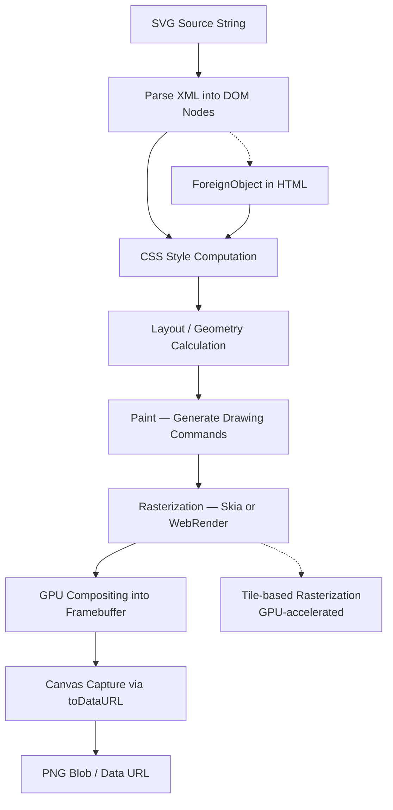

# How SVG-to-PNG Conversion Actually Works in the Browser

## Introduction

SVG is XML. PNG is a grid of pixels. Between those two formats sits one of the most underappreciated feats in browser engineering: real-time vector rasterization. When you hand an SVG string to a browser and ask for a PNG, nothing magical happens. The browser does what it always does — it parses, styles, lays out, paints, and then commits the final pixel buffer to a raster image. The conversion is just a side effect of rendering.

This article pulls back the curtain on that process. We'll trace the exact pipeline, write a production-grade converter from scratch, and talk about the failure modes that will bite you at 2 AM when your image export pipeline silently produces blank outputs.

## Why This Matters

If you've ever built a charting library, a social-card generator, or a serverless image service that accepts SVG payloads, you've hit this problem. The use cases are concrete and growing:

- **Dynamic thumbnail generation** — user-uploaded SVG icons need PNG variants at multiple resolutions for a CDN.
- **Serverless image pipelines** — AWS Lambda or Cloudflare Workers rendering SVG charts on demand without a headless browser dependency (well, sort of — more on that later).
- **Client-side report exports** — generating a downloadable PNG from an SVG-based invoice or certificate in the user's browser.
- **Social sharing cards** — the OG image meta tag needs a raster URL, not a vector one.

Most tutorials stop at "use `canvas.toDataURL()`." That's like saying "use a database" when someone asks how transactions work. There's a deep and interesting pipeline underneath, and understanding it saves you from mysterious bugs, memory leaks, and blank images in production.

## How It Works

The browser's rendering engine treats SVG nodes exactly like it treats HTML nodes after parsing. There is no separate "SVG renderer" — SVG elements enter the same render tree, the same style system, the same paint phases. When you want a PNG, you are simply capturing a frame of that pipeline and committing the pixels.

Here's the architectural flow:



Let's walk through each stage:

**1. Parse SVG DOM.** The browser parses the SVG string as XML. Each `<rect>`, `<path>`, `<text>` node becomes a DOM node in the SVG namespace (`http://www.w3.org/2000/svg`). These nodes carry attributes like `width`, `viewBox`, `fill`, and `transform`.

**2. Style Computation.** CSS rules apply to SVG elements just as they do to HTML. `fill`, `stroke`, `opacity` — all resolved against computed styles. CSS custom properties, media queries, and even `@font-face` rules participate here.

**3. Layout.** SVG has a different layout model than HTML. By default, SVG uses a coordinate system defined by `viewBox` and `preserveAspectRatio`. Elements are positioned absolutely within their coordinate space. No flexbox, no grid — just math.

**4. Paint.** The paint phase generates a sequence of drawing commands: fill rectangles, draw Bézier curves, render text glyphs, apply clip paths. These commands are recorded in a display list.

**5. Rasterization.** This is the critical step. In Chromium, the display list is broken into tiles (typically 256×256 pixels). Each tile is rasterized by Skia — Google's 2D graphics library — into GPU textures. In Firefox, WebRender handles a similar process, building a display list and sending it to the GPU. The result is a pixel buffer.

**6. Composite.** The GPU composites all tiles into the final framebuffer. At this point, the SVG is indistinguishable from any other rendered content on the page — it's just pixels.

**7. Canvas Capture.** When you draw an `` element (loaded with the SVG source) onto a `<canvas>`, the canvas reads the composited framebuffer pixels for that image's region and writes them into its own pixel buffer. Calling `canvas.toDataURL('image/png')` serializes that buffer into a PNG byte stream.

The key insight: **SVG-to-PNG conversion is not a special operation. It is capturing a frame of the normal rendering pipeline and serializing the pixels.**

## Core Concepts

### The SVG `` Element as a Bridge

You cannot pass an SVG string directly to `canvas.drawImage()` — well, not reliably. The browser needs an image source that it can decode. The `` element accepts SVG sources (via `src`, `data:` URIs, or `Blob` URLs) and acts as the decoder. When the image loads, its decoded bitmap is what the canvas reads.

```javascript
const img = new Image();
img.src = 'data:image/svg+xml;charset=utf-8,' + encodedSvg;
img.onload = () => {
  ctx.drawImage(img, 0, 0, canvas.width, canvas.height);
};
```

This is the bridge. Without it, the canvas has no SVG-aware rasterizer.

### `foreignObject` — The HTML-in-SVG Escape Hatch

SVG has a `<foreignObject>` element that allows embedding HTML inside an SVG document. This is powerful and dangerous. It lets you render HTML-styled content (divs, buttons, formatted text) inside an SVG, which then gets rasterized to PNG. The trade-off: `foreignObject` support is inconsistent across browsers, and it introduces layout complexity that can break your export.

### `devicePixelRatio` and Resolution Scaling

The canvas has a CSS size and an internal bitmap size. If you set the canvas to 200×200 CSS pixels but don't account for `window.devicePixelRatio`, you get a 200×200 pixel PNG on a standard display — or a blurry 200×200 PNG on a Retina display because the actual bitmap is only 200×200 while the screen expects 400×400. To produce a sharp export, you multiply canvas dimensions by `devicePixelRatio` and scale the context accordingly.

### CORS and Tainted Canvases

If your SVG references external resources — fonts loaded from a CDN, images embedded via `<image href="...">` — and those resources don't carry proper CORS headers, the canvas becomes "tainted." Calling `toDataURL()` on a tainted canvas throws a security error. This is the single most common reason SVG-to-PNG conversion fails silently or throws in production.

## Examples & Code Walkthrough

Here's a complete, production-grade SVG-to-PNG converter written from scratch. No dependencies. Handles scaling, background colors, CORS-safe foreign objects, and resolution control.

```javascript
// svgToPng.js — A minimal, dependency-free SVG-to-PNG converter.
// Uses the canvas.drawImage pipeline and handles resolution
// scaling via devicePixelRatio.

function svgToPng(svgString, options = {}) {
  const {
    scale = 2,
    backgroundColor = null,
    mimeType = 'image/png',
    canvasWidth = 512,
    canvasHeight = 512,
  } = options;

  return new Promise((resolve, reject) => {
    // Step 1: Serialize the SVG string with proper XML declaration
    // and encode it into a data URI that the browser can load.
    const svgWithDeclaration = svgString.startsWith('<?xml')
      ? svgString
      : `<?xml version="1.0" encoding="UTF-8"?>${svgString}`;

    const encodedSvg = svgWithDeclaration
      .replace(/#/g, '%23')
      .replace(/"/g, "'")
      .replace(/%/g, '%25')
      .replace(/</g, '%3C')
      .replace(/>/g, '%3E');

    const dataUri = `data:image/svg+xml;charset=utf-8,${encodedSvg}`;

    // Step 2: Load the SVG into an image element.
    const img = new Image();
    img.crossOrigin = 'anonymous'; // Attempt CORS-safe loading for embedded resources.

    img.onload = () => {
      // Step 3: Create a canvas at the target resolution.
      const dpr = scale;
      const width = canvasWidth * dpr;
      const height = canvasHeight * dpr;

      const canvas = document.createElement('canvas');
      canvas.width = width;
      canvas.height = height;

      const ctx = canvas.getContext('2d');

      // Step 4: Optionally fill a background before drawing.
      if (backgroundColor) {
        ctx.fillStyle = backgroundColor;
        ctx.fillRect(0, 0, width, height);
      }

      // Step 5: Draw the SVG image onto the canvas, scaling to fit.
      ctx.drawImage(img, 0, 0, width, height);

      // Step 6: Serialize the canvas to a PNG data URL.
      try {
        const dataUrl = canvas.toDataURL(mimeType);
        resolve(dataUrl);
      } catch (err) {
        reject(new Error(`Canvas export failed: ${err.message}`));
      }
    };

    img.onerror = () => {
      reject(new Error('Failed to load SVG image. Check for CORS issues or malformed SVG.'));
    };

    // Kick off the load.
    img.src = dataUri;
  });
}

// --- Usage Example ---

const mySvg = `
<svg xmlns="http://www.w3.org/2000/svg" viewBox="0 0 200 200" width="200" height="200">
  <defs>
    <linearGradient id="grad1" x1="0%" y1="0%" x2="100%" y2="100%">
      <stop offset="0%" stop-color="#ff6b6b" />
      <stop offset="100%" stop-color="#4ecdc4" />
    </linearGradient>
  </defs>
  <rect width="200" height="200" fill="url(#grad1)" rx="16" />
  <circle cx="100" cy="80" r="40" fill="white" opacity="0.9" />
  <text x="100" y="130" text-anchor="middle" font-family="sans-serif"
        font-size="24" fill="#333">Hello</text>
</svg>
`;

svgToPng(mySvg, {
  scale: 2,
  backgroundColor: '#ffffff',
  canvasWidth: 400,
  canvasHeight: 400,
})
  .then((dataUrl) => {
    const link = document.createElement('a');
    link.download = 'export.png';
    link.href = dataUrl;
    link.click();
  })
  .catch((err) => console.error('Conversion failed:', err));
```

### What's happening under the hood in this code

The `img.crossOrigin = 'anonymous'` line is critical. Without it, any `<image>` tag inside your SVG that points to an external domain will taint the canvas. With it, the browser sends a CORS request for those resources. But it only works if the remote server responds with `Access-Control-Allow-Origin: *` (or your origin). If the server doesn't, the image load fails silently and the canvas stays blank.

The `%23` encoding for `#` characters is another subtlety. In a data URI, `#` starts a fragment identifier. If your SVG contains `fill="#ff0000"`, the browser will truncate the URI at the `#` and the SVG will be incomplete. We encode every `#` as `%23` to prevent this.

The `scale` multiplier controls output resolution. A value of `2` means the canvas internal bitmap is twice the CSS dimensions in each direction, producing a PNG with four times the pixel density. This is how you get retina-quality exports.

## Best Practices

**1. Always set `viewBox` on your SVG.** Without a `viewBox`, the browser has no intrinsic coordinate system. The rendered output may be cropped, scaled incorrectly, or blank. If you control the SVG source, always include `viewBox` and omit fixed `width`/`height` attributes — let the canvas control the output size.

**2. Inline all fonts.** `@font-face` rules loaded from external URLs are the leading cause of missing glyphs in exported PNGs. Convert fonts to base64 data URIs and embed them in a `<style>` block inside the SVG, or use a system font stack as a fallback.

**3. Handle the tainted canvas gracefully.** Wrap `toDataURL()` in a try-catch and provide a fallback — perhaps a server-side rasterization fallback using a headless Chromium instance. Don't let a CORS error crash your export pipeline.

**4. Clean up Blob URLs.** If you use `URL.createObjectURL()` to create SVG image sources, call `URL.revokeObjectURL()` after the image loads. Otherwise you leak memory, and in long-running single-page applications this becomes a real problem.

**5. Test with complex SVGs early.** Filters (`<filter>`, `<feGaussianBlur>`), clip paths, masks, and `foreignObject` all have different support levels across browsers. Test your converter against a representative sample of SVG inputs before shipping.

**6. Avoid `requestAnimationFrame` for one-shot exports.** Some engineers reach for `requestAnimationFrame` to wait for the SVG to render before capturing the canvas. This is unnecessary and introduces latency. The `img.onload` callback is sufficient — by the time the image fires its load event, it has been fully decoded and is ready to draw.

## Common Mistakes & Anti-Patterns

### Mistake 1: Ignoring the XML Declaration

Passing an SVG string without `<?xml version="1.0" encoding="UTF-8"?>` to a data URI works in most modern browsers, but fails in older Safari versions and some WebView implementations. The XML declaration ensures the parser treats the content as XML, not as an unknown format. Always include it.

### Mistake 2: Double-Encoding the SVG

The `encodeURIComponent` function encodes characters for use in a URL. But when you're already building a `data:` URI, you need to be careful about double-encoding. If you pass the entire SVG through `encodeURIComponent` and then prepend `data:image/svg+xml;charset=utf-8,`, you get a valid URI. But if you also manually percent-encode characters beforehand, you'll end up with `%2523` instead of `%23` — the browser sees a literal `%25` (which is `%`), then `23` (which is `3`), and the SVG is corrupted. The code above handles this correctly by encoding once at the final step.

### Mistake 3: Setting Canvas Size via CSS

Setting canvas dimensions with CSS (`canvas { width: 512px; height: 512px; }`) does not change the internal bitmap resolution. The canvas has two size properties: the CSS display size and the internal bitmap size (controlled by `canvas.width` and `canvas.height` attributes). If these don't match, the browser stretches the bitmap to fit the CSS box, producing a blurry or pixelated export. Always set `canvas.width` and `canvas.height` in JavaScript.

### Mistake 4: Assuming `foreignObject` Works Everywhere

`foreignObject` is part of the SVG 1.1 spec but has historically had spotty support. Safari added it relatively late. Some browsers don't render `foreignObject` content when the SVG is loaded as an image source (e.g., via `img.src` or `Image()`). If you rely on `foreignObject` for your export, test on
