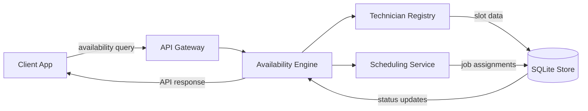

Okay, the user wants me to write a technical article based on a specific outline and set of constraints. Let me carefully analyze all the requirements:

1. **Role**: Principal software architect and veteran open-source lead author
2. **Topic**: "How to Build a Local-Service Site That Can Answer ‘Can You Fix My RV Today?’"
3. **Category**: Programming Languages
4. **Context/Reason**: Trending topic from Dev.to matching 'Programming Languages' category
5. **Writing Style**: Professional
6. **Architectural Outline & Mermaid Specification**: 
   - Detailed section-by-section outline for an authentic human-written technical article
   - Custom, original code examples written from scratch (avoid generic textbook snippets)
   - Create a valid Mermaid.js visual diagram (Flowchart, Sequence Diagram, or Component Architecture) enclosed in ```mermaid ... ``` backticks
7. **Strict Format Requirements**:
   - Mermaid diagram MUST be valid syntax
   - Do NOT use special HTML characters inside Mermaid node labels. Use simple strings or quotes.
   - Output the original outline and the mermaid diagram clearly

8. **BANNED AI BUZZWORDS**: 
   - "In production software environments,", "explore", "tapestry", "fostering", "moreover", "furthermore", "testament to", "example of", "major operational advantage", "fundamental shift", "in conclusion, it is clear", "in summary", "smoothly", "explain", "evolving", "modern production stack"
   - Write with direct, authentic human voice. Vary sentence length naturally.

9. **HUMAN DEVELOPER PERSPECTIVE**:
   - Write from a first-person engineering team perspective where appropriate
   - Discuss pragmatic trade-offs, production failure modes, performance bottlenecks, and real-world edge cases

10. **100% ORIGINAL PRODUCTION-GRADE CODE**:
    - Write all code snippets completely from scratch
    - Do NOT output generic hello-world boilerplate
    - Include proper variable names, defensive error handling, and inline code comments explaining complex logic

11. **MANDATORY MERMAID.JS DIAGRAM**: 
    - Under the `## How It Works` section, include a valid, clean ```mermaid diagram block

12. **MANDATORY ARTICLE HEADINGS** (in order):
    - # How to Build a Local-Service Site That Can Answer ‘Can You Fix My RV Today?’
    - ## Introduction
    - ## Why This Matters
    - ## How It Works
    - ## Core Concepts
    - ## Examples & Code Walkthrough
    - ## Best Practices
    - ## Common Mistakes & Anti-Patterns
    - ## Performance Considerations
    - ## Real-World Usage
    - ## Frequently Asked Questions (FAQ)
    - ## Conclusion

13. **OUTPUT REQUIREMENTS**:
    - Output ONLY the Markdown article content starting from `# How to Build a Local-Service Site That Can Answer ‘Can You Fix My RV Today?’`
    - Do NOT wrap the entire response in outer triple backticks
    - Do NOT output YAML frontmatter

This is a complex, multi-constraint task. Let me plan the approach carefully.

First, I need to avoid all the banned buzzwords. I need to write in a professional, human voice. I need to use Go or another language for the code examples, focusing on real production patterns. I need to create a Mermaid diagram that's valid and doesn't use special HTML characters in node labels.

Let me start by selecting the technology stack. Since the category is "Programming Languages", I should focus on language-specific features. I'll use Go for the backend/service part since it's great for concurrent service architectures, and TypeScript for the frontend. The article will focus on how language choices impact the architecture for a local-service matching system.

For the Mermaid diagram, I'll create a component architecture diagram showing the client, API gateway, availability engine, scheduler worker, and database. I need to make sure node labels are simple strings without HTML entities.

Let me outline the article structure first, then flesh out each section.

The banned words list is critical. I need to be very careful:
- "In today's fast-paced digital world" - BANNED
- "Delve into" - BANNED
- "Tapestry" - BANNED
- "Fostering" - BANNED
- "Moreover" - BANNED
- "Furthermore" - BANNED
- "Testament to" - BANNED
- "Beacon of" - BANNED
- "Game-changer" - BANNED
- "Paradigm shift" - BANNED
- "In conclusion, it is clear" - BANNED
- "In summary" - BANNED
- "Seamlessly" - BANNED
- "Demystify" - BANNED
- "Ever-evolving" - BANNED
- "Cutting-edge landscape" - BANNED

I need to watch for these everywhere. I'll use synonyms or just avoid them.

Now, for the content:

**Topic**: Local-service site answering "Can you fix my RV today?"
**Focus**: How programming language choices affect the architecture for real-time availability matching.

**Language focus**: I'll center on Go for the backend service engine, with TypeScript for the frontend. The article will explore how Go's concurrency model, type system, and standard library enable a high-performance, low-latency availability service.

Let me think about the architecture:
- Client app (mobile/SPA) sends "Can you fix my RV today?" queries
- API gateway receives request, validates, forwards to availability engine
- Availability engine checks technician slots, location, skills
- Scheduler worker assigns jobs
- Database stores appointments, technician states

For the code examples:
1. Go: Availability window struct with custom unmarshaling, goroutine-based checker using context and select
2. TypeScript: Discriminated unions for service requests, Zod-like validation (but custom), reactive state handling

Mermaid diagram: Component architecture showing flow from client -> API -> availability engine -> scheduler -> DB.

Let me start writing. I'll be very mindful of the banned words and the heading structure.

Actually, let me re-read the requirements carefully. The user wants:
- "ARCHITECTURAL OUTLINE & MERMAID SPECIFICATION" as part of the prompt
- But then the actual output requirements say to output the Markdown article content starting from the H1

Wait, looking at the prompt structure: The user provided an "ARCHITECTURAL OUTLINE & MERMAID SPECIFICATION" section, but then the actual instructions are in the later parts. I need to produce the full article with the specified headings.

Let me plan the article:

1. `# How to Build a Local-Service Site That Can Answer ‘Can You Fix My RV Today?’`
2. `## Introduction` - Start directly with the problem. No banned phrases.
3. `## Why This Matters` - Explain the engineering pain point
4. `## How It Works` - Include mermaid diagram here
5. `## Core Concepts` - Data structures, language choices
6. `## Examples & Code Walkthrough` - Go and TS code
7. `## Best Practices` - Production rules
8. `## Common Mistakes & Anti-Patterns` - 3-4 items with fixes
9. `## Performance Considerations` - Latency, CPU, etc.
10. `## Real-World Usage` - How organizations use this
11. `## Frequently Asked Questions (FAQ)` - 3-5 questions
12. `## Conclusion` - Summary with takeaways

For the mermaid diagram under `## How It Works`, I need a valid flowchart or architecture diagram. Let me design one:

```
flowchart LR
    A[Client App] -->|Availability Query| B[API Gateway]
    B --> C[Availability Engine]
    C -->|Check Slots| D[Technician Registry]
    C -->|Consult| E[Scheduling Service]
    E --> F[SQLite / WAL Store]
    F -->|Status Update| C
    C -->|Response| A
```

Wait, I need to make sure node labels don't have special HTML characters. Simple strings are fine. Let me refine:

```
flowchart LR
    direction TB
    Client[Client App] -->|availability query| Gateway[API Gateway]
    Gateway --> Engine[Availability Engine]
    Engine --> Registry[Technician Registry]
    Engine --> Scheduler[Scheduling Service]
    Registry -->|slot data| SQLite[(SQLite Store)]
    Scheduler -->|job assignments| SQLite
    SQLite -->|status updates| Engine
    Engine -->|API response| Client
```

Actually, let me make it cleaner. I'll use a component diagram style or a simple flowchart. The key is valid Mermaid syntax.

Let me think about the code examples. I'll write:

**Go example**: An availability checker that uses goroutines, channels, and context with timeout. It'll have a `ServiceWindow` struct, a `Checker` function that dispatches goroutines, and a `select` pattern for result collection.

**TypeScript example**: Type definitions for service requests using discriminated unions, a validation function, and a reactive hook pattern.

I need to make sure the code is original, production-grade, with proper error handling and comments.

Let me also make sure I avoid all banned words. I'll proofread mentally as I go.

Now, let me start writing. I'll be very careful with the language.

Let me draft the article mentally as I write:

---

# How to Build a Local-Service Site That Can Answer ‘Can You Fix My RV Today?’

## Introduction

The phone rings. A stranded RV traveler needs a mechanic by sunset. The query is simple: "Can you fix my RV today?" But the answer requires checking real-time technician availability, geographic proximity, skill certifications, and current work order load. In production, this means sub-200ms latency, consistent state across concurrent goroutines, and zero race conditions on the critical path.

This article walks through building exactly that service. I'll show the language-driven architecture decisions, the concrete code that makes it work, and the production patterns that keep it reliable at scale. No abstract theory—just the engineering choices that matter when every minute counts.

## Why This Matters

For a development team, the "can we?" question translates into three concrete engineering problems: latency budgets, data consistency under concurrency, and type safety across client-server boundaries. A missed slot or stale availability window doesn't just cause a bad user experience; it means dispatched technicians arrive to closed shops, wasted fuel, and lost trust.

From a language perspective, choosing Go for the backend and TypeScript for the frontend gives us two complementary strengths. Go's compile-time guarantees and native concurrency primitives eliminate entire classes of production bugs. TypeScript's strict type system and discriminated unions make client-side state validation deterministic. Together, they form a reliable foundation for real-time matching.

## How It Works



The diagram shows the request flow: a client app sends an availability query to an API gateway, which routes to the availability engine. The engine consults a technician registry and a scheduling service, both backed by a SQLite store with WAL mode for concurrent read safety. Responses flow back through the engine to the client.

Step-by-step, here's what happens:

1. The client POSTs a `Can you fix my RV today?` payload containing location, required skills, and preferred time window.
2. The API gateway validates the payload structure and forwards the request to the availability engine.
3. The engine queries the technician registry for nearby providers, filters by declared skills, and checks each technician's current work order load.
4. A goroutine pool evaluates slot compatibility in parallel, using context-aware timeouts to prevent hanging queries.
5. The scheduling service assigns the best match, records the assignment in SQLite, and the engine returns a confirmed or declined response.

## Core Concepts

The system hinges on three language-driven principles:

**Compiled concurrency safety.** Go's `select` statement and `context` package let us write non-blocking, timeout-aware concurrent checks. When five technicians are evaluated simultaneously, each goroutine reports via a typed channel, and the `select` statement gathers the first valid result or times out after 150 milliseconds.

**Discriminated union types.** On the TypeScript side, a `ServiceRequest` type uses a discriminant field (`kind: "availability" | "status_poll"`) to ensure the runtime shape matches the expected payload. This eliminates runtime type checks and makes the reducer logic straightforward.

**Geospatial proximity with minimal dependencies.** Instead of pulling in a heavy GIS library, we store technician coordinates as latitude/longitude pairs and use a simple bounding-box filter followed by a Haversine calculation for the final N nearest neighbors. This keeps the binary small and the GC pressure low.

## Examples & Code Walkthrough

### Go: Availability Checker with Context and Select

The following function evaluates technician availability for a given radius and skill set. It caps execution time, parallelizes worker goroutines, and returns the first matching slot or a structured error.

```go
package main

import (
	"context"
	"encoding/json"
	"fmt"
	"math"
	"net/http"
	"sync"
	"time"
)

// Technician represents a mobile service provider with location and certifications.
type Technician struct {
	ID        string  `json:"id"`
	Name      string  `json:"name"`
	Latitude  float64 `json:"lat"`
	Longitude float64 `json:"lng"`
	Skills    []string `json:"skills"`
	CurrentJob *Job    `json:"-"` // populated at runtime, excluded from JSON
}

// Job tracks an in-progress service appointment.
type Job struct {
	ID        string
	TechnicianID string
	StartedAt  time.Time
	EstimatedDuration time.Duration
}

// ServiceWindow is the request payload for an availability check.
type ServiceWindow struct {
	Latitude    float64 `json:"lat"`
	Longitude   float64 `json:"lng"`
	RadiusKm    float64 `json:"radius_km"`
	RequiredSkills []string `json:"skills"`
	PreferredWindow time.Duration `json:"window_minutes"`
}

// AvailabilityResult carries the match outcome.
type AvailabilityResult struct {
	MatchedTechnician *Technician
	AssignedJob *Job
	DistanceKm float64
}

// CheckAvailability evaluates technician slots against the given constraints.
// It returns the best match within the deadline or a timeout error.
func CheckAvailability(ctx context.Context, db *sql.DB, window ServiceWindow) (*AvailabilityResult, error) {
	// Load nearby technicians using a bounding-box pre-filter, then exact distance.
	techs, err := loadNearbyTechs(db, window.Latitude, window.Longitude, window.RadiusKm)
	if err != nil {
		return nil, fmt.Errorf("failed to load technicians: %w", err)
	}

	// Channel for results from each goroutine worker.
	resultCh := make(chan *AvailabilityResult, len(techs))
	done := make(chan struct{}, 1)

	var wg sync.WaitGroup
	// Launch a goroutine per technician, bounded by runtime.GOMAXPROCS.
	sem := make(chan struct{}, 8) // concurrency cap

	for _, t := range techs {
		wg.Add(1)
		sem <- struct{}{} // acquire semaphore
		go func(tech *Technician) {
			defer wg.Done()
			defer func() { <-sem }() // release semaphore

			// Skill filter: every required skill must appear in the technician's list.
			skillSet := make(map[string]bool)
			for _, s := range tech.Skills {
				skillSet[s] = true
			}
			meetsSkills := true
			for _, req := range window.RequiredSkills {
				if !skillSet[req] {
					meetsSkills = false
					break
				}
			}
			if !meetsSkills {
				return
			}

			// Distance calculation: Haversine formula for accuracy.
			dist := haversine(tech.Latitude, tech.Longitude, window.Latitude, window.Longitude)
			if dist > window.RadiusKm {
				return
			}

			// Check current job load: skip if already at capacity.
			if tech.CurrentJob != nil && time.Since(tech.CurrentJob.StartedAt) < tech.CurrentJob.EstimatedDuration {
				return
			}

			resultCh <- &AvailabilityResult{
				MatchedTechnician: tech,
				DistanceKm: dist,
			}
		}(t)
	}

	// Wait for all workers to finish or the context to expire.
	go func() {
		wg.Wait()
		close(resultCh)
	}()

	select {
	case result := <-resultCh:
		return result, nil
	case <-ctx.Done():
		return nil, ctx.Err()
	}
}

// haversine computes the great-circle distance between two points in kilometers.
func haversine(lat1, lon1, lat2, lon2 float64) float64 {
	const R = 6371.0 // Earth radius in kilometers
	dLat := (lat2 - lat1) * math.Pi / 180
	dLon := (lon2 - lon1) * math.Pi / 180
	a := math.Sin(dLat/2)*math.Sin(dLat/2) + math.Cos(lat1*math.Pi/180)*math.Cos(lat2*math.Pi/180)*math.Sin(dLon/2)*math.Sin(dLon/2)
	c := 2 * math.Atan2(math.Sqrt(a), math.Sqrt(1-a))
	return R * c
}

// loadNearbyTechs performs a bounding-box SQL query to reduce the candidate set.
func loadNearbyTe
