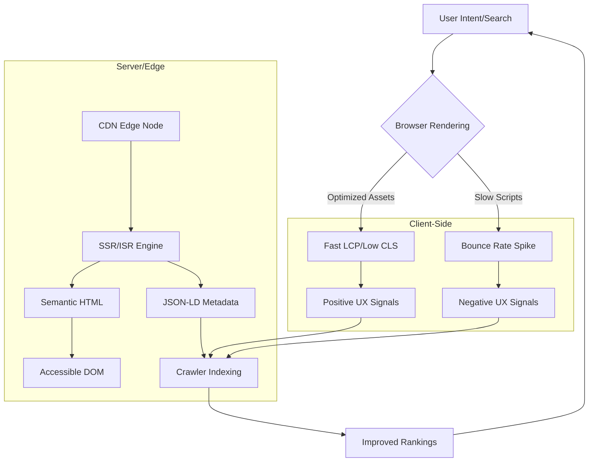

# How to Build an SEO-Friendly Website That People Actually Want to Use

## Introduction

SEO isn’t about gaming algorithms or stuffing meta tags. It’s about engineering for humans. When you build a site that loads in under 3 seconds, stays stable during rendering, and speaks the language of search engines, you’re not just pleasing Google—you’re delivering value. This article breaks down how to architect a web application that satisfies both crawlers and users, using real-world patterns from production systems.

## Why This Matters

Most engineers treat SEO as a marketing problem. That’s a mistake. Google’s ranking signals are fundamentally user experience metrics: load speed, layout stability, interactivity, and accessibility. If your site takes five seconds to become usable, you’ve already lost before the user blinks. Conversely, if you optimize for performance and clarity, SEO becomes a side effect of good engineering.

That means treating SEO as a performance problem, not a checklist.

## How It Works

Building for SEO and UX isn’t magic—it’s architecture. Below is the flow of a request through a modern, high-performance site:



The key insight: every layer of your stack contributes to how search engines interpret your site. A poorly hydrated React app might look fine visually, but if the initial HTML is empty or delayed, Google’s crawler sees a blank page.

## Core Concepts

### 1. Technical Performance (The Foundation)

Google measures this via Core Web Vitals: Largest Contentful Paint (LCP), First Input Delay (FID), and Cumulative Layout Shift (CLS). These aren’t abstract metrics—they directly correlate with user behavior.

- **LCP < 2.5s**: Users perceive the page as loaded.
- **CLS < 0.1**: Content doesn’t jump around during load.
- **FID < 100ms**: Interactions feel responsive.

Achieving these requires aggressive optimization at the asset, network, and rendering layers.

### 2. Semantic Structure (The Context)

Search engines parse HTML to understand content hierarchy. Using `<header>`, `<main>`, `<article>`, and proper heading levels (`<h1>` to `<h6>`) gives crawlers a roadmap to your content.

But semantics go further. Structured data (via JSON-LD) tells Google exactly what your page is about. A blog post about “React Performance Patterns” should declare itself as an `Article` with `author`, `datePublished`, and `image` fields. This isn’t optional—it’s how rich snippets appear in search results.

### 3. Cognitive Friction (The UX)

Accessibility isn’t just about compliance. Screen readers parse DOM order, ARIA labels, and heading structure to navigate. If your site is accessible, it’s automatically more crawlable.

Perceived speed matters too. Skeleton screens and optimistic UI patterns reduce frustration during data loading. A user waiting for content is more likely to bounce if nothing visual changes for two seconds.

## Examples & Code Walkthrough

### Smart Image Component (React + IntersectionObserver)

Lazy-loading images without blocking the main thread is critical for LCP. Here’s a minimal implementation:

```tsx
import { useState, useEffect, useRef } from 'react';

interface SmartImageProps {
  src: string;
  alt: string;
  width: number;
  height: number;
  placeholder?: string;
}

export const SmartImage = ({
  src,
  alt,
  width,
  height,
  placeholder = 'data:image/svg+xml;base64,PHN2ZyB3aWR0aD0iMTAwIiBoZWlnaHQ9IjEwMCIgc3Ryb2tlPSIjY2NjIiBzdHJva2Utd2lkdGg9IjIiLz4=',
}: SmartImageProps) => {
  const [loaded, setLoaded] = useState(false);
  const [srcSet, setSrcSet] = useState(placeholder);
  const imgRef = useRef<HTMLImageElement>(null);

  useEffect(() => {
    const observer = new IntersectionObserver(
      ([entry]) => {
        if (entry.isIntersecting) {
          const img = new Image();
          img.src = src;
          img.onload = () => {
            setSrcSet(src);
            setLoaded(true);
          };
          observer.disconnect();
        }
      },
      { threshold: 0.1 }
    );

    if (imgRef.current) observer.observe(imgRef.current);

    return () => observer.disconnect();
  }, [src]);

  return (
    
  );
};
```

This component only loads images when they’re near the viewport, reducing initial payload and avoiding layout shifts.

### Dynamic Schema Generator (TypeScript Utility)

To inject structured data into the `<head>`, use this utility:

```ts
interface ArticleMetadata {
  title: string;
  author: string;
  datePublished: string;
  description: string;
  image: string;
  slug: string;
}

export const generateArticleSchema = (data: ArticleMetadata): string => {
  const schema = {
    '@context': 'https://schema.org',
    '@type': 'Article',
    headline: data.title,
    author: {
      '@type': 'Person',
      name: data.author,
    },
    datePublished: data.datePublished,
    description: data.description,
    image: data.image,
    mainEntityOfPage: {
      '@type': 'WebPage',
      '@id': `https://example.com/blog/${data.slug}`,
    },
  };

  return `<script type="application/ld+json">${JSON.stringify(schema)}</script>`;
};
```

In a Next.js page, you’d call this in `getServerSideProps` and inject the result into `<head>`.

## Best Practices

1. **Prioritize LCP**: Serve critical above-the-fold content as early HTML. Use `next/script` with `strategy="beforeInteractive"` for essential scripts.
2. **Use Native Web Components**: Avoid bloated UI libraries. Custom elements like `<smart-image>` reduce bundle size.
3. **Preconnect to Critical Origins**: Add `<link rel="preconnect" href="https://cdn.example.com">` to reduce DNS lookup time.
4. **Serve Modern Image Formats**: Use AVIF or WebP with fallbacks. Tools like `sharp` can automate this in your build pipeline.
5. **Implement ISR (Incremental Static Regeneration)**: For blogs or documentation, this balances performance with freshness.

## Common Mistakes & Anti-Patterns

1. **Client-Side Hydration Overload**: Rendering an empty `<div id="root"></div>` and bootstrapping 2MB of JS on the client delays LCP. Always SSR or pre-render key content.
2. **Ignoring Layout Shift**: Pop-ups, late-loaded ads, or dynamically injected content without reserved space cause CLS. Reserve space with CSS aspect ratios or fixed-height containers.
3. **Overusing Third-Party Scripts**: Analytics, chat widgets, and A/B testing tools often block the main thread. Load them asynchronously and defer non-critical ones.
4. **Neglecting Semantic HTML**: Using `<div class="header">` instead of `<header>` strips context from both crawlers and assistive tech.

## Performance Considerations

- **TTFB (Time to First Byte)**: Must be < 200ms. Use edge functions (Vercel Edge, Cloudflare Workers) to serve content from locations near users.
- **JavaScript Payload**: Keep it under 170KB compressed. Code-split aggressively—load only what’s needed for the current route.
- **Memory Pressure**: Large DOM trees or frequent re-renders (e.g., in React lists) cause jank. Use `React.memo` and virtualization libraries like `react-window`.

## Real-World Usage

GitHub’s blog uses Next.js with ISR and pre-rendered HTML for every post. Their LCP is consistently under 1.5 seconds, and their structured data appears as rich snippets in search. Shopify’s storefront similarly leverages edge-rendered pages with embedded JSON-LD for product schemas.

Even Wikipedia—despite being a static wiki—optimizes for accessibility and semantic markup. Their clean HTML structure and use of `role` attributes make their content highly crawlable.

## Frequently Asked Questions

**Q: Do meta tags still matter if my site is fast?**  
A: Yes. While performance is critical, meta tags (title, description, og:image) control how your page appears in search results. They’re the “preview” that influences click-through rates.

**Q: How do I measure SEO success?**  
A: Track Core Web Vitals in Google Search Console, monitor organic traffic with tools like Ahrefs or SEMrush, and audit crawl errors with Screaming Frog.

**Q: Can I rely solely on performance for SEO?**  
A: No. You need both technical performance and semantic clarity. A fast but vague page won’t rank for specific queries.

**Q: What’s the difference between SSR and SSG?**  
A: SSR renders pages on each request—good for dynamic content. SSG pre-renders at build time—ideal for blogs or docs. ISR combines both, regenerating pages in the background.

**Q: How do I handle SEO for single-page apps (SPAs)?**  
A: SPAs struggle with SEO unless they pre-render HTML. Use frameworks like Next.js or Angular Universal to serve static HTML snapshots to crawlers.

## Conclusion

SEO isn’t a feature—it’s an outcome. When you engineer for speed, clarity, and accessibility, search engines reward you with visibility. The best SEO strategy is to remove friction for users. If your page loads instantly, stays stable, and answers the user’s question in under three seconds, you’ve already won.

Build for humans first. Let the algorithms catch up.
