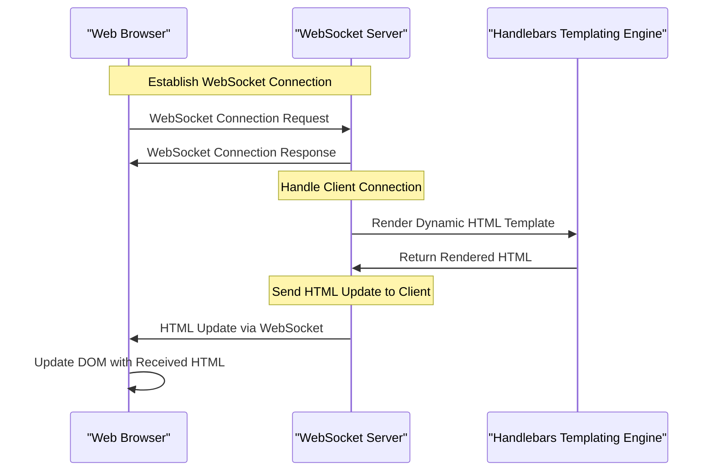

# HTML over WebSockets: real-time SPAs with barely any JavaScript

## Introduction
Single-Page Applications (SPAs) have become the norm for web development, offering a seamless user experience by dynamically updating content without requiring full page reloads. However, this approach typically relies heavily on JavaScript, which can lead to complex codebases and potential performance issues. What if we could achieve real-time updates in SPAs with minimal JavaScript usage? This is where HTML over WebSockets comes into play, allowing us to push real-time updates from the server to the client using WebSockets, while leveraging HTML for templating and rendering.

## Why This Matters
The concept of HTML over WebSockets matters because it simplifies the development process for real-time SPAs. By reducing the amount of JavaScript required, developers can focus on the core logic of their application without getting bogged down in complex frontend code. This approach also enables better separation of concerns, as the server handles the business logic and the client handles the rendering. Furthermore, HTML over WebSockets can improve performance by minimizing the amount of data transferred over the network, as only the updated HTML is sent to the client.

## How It Works
At its core, HTML over WebSockets relies on the WebSocket protocol to establish a bidirectional communication channel between the client and server. The client initiates a WebSocket connection, and the server responds with an HTML template. When the server needs to update the client, it sends the updated HTML via the WebSocket connection, and the client renders the new HTML. This process allows for real-time updates without the need for complex JavaScript logic.


## Core Concepts
To understand HTML over WebSockets, it's essential to grasp the core concepts involved:

*   **WebSockets**: A protocol that enables bidirectional, real-time communication between the client and server over a single connection.
*   **HTML Templating**: A technique used to render dynamic HTML content on the server-side, using templating engines like Handlebars.
*   **Real-time Updates**: The ability to update the client in real-time, without requiring a full page reload.

## Examples & Code Walkthrough
Let's consider a simple example of a real-time chat application using HTML over WebSockets. On the client-side, we establish a WebSocket connection and listen for incoming messages:
```javascript
// Client-side JavaScript for establishing a WebSocket connection
const socket = new WebSocket('ws://localhost:8080');
socket.onmessage = (event) => {
  const htmlUpdate = event.data;
  document.getElementById('root').innerHTML = htmlUpdate;
};
```
On the server-side, we handle the WebSocket connection and send updated HTML to the client:
```javascript
// Server-side Node.js code for handling WebSocket connections
const WebSocket = require('ws');
const wss = new WebSocket.Server({ port: 8080 });
wss.on('connection', (ws) => {
  // Handle client connection and send HTML updates
  ws.send('<h1>Hello, World!</h1>');
});
```
We can also use Handlebars templating to render dynamic HTML templates:
```handlebars
<!-- Handlebars template for dynamic HTML updates -->
<div>
  <h1>{{ title }}</h1>
  <p>{{ message }}</p>
</div>
```

## Best Practices
When implementing HTML over WebSockets, keep the following best practices in mind:

*   **Use a robust WebSocket library**: Choose a reliable WebSocket library that handles connection management and message passing.
*   **Optimize HTML updates**: Minimize the amount of data transferred over the network by only sending updated HTML fragments.
*   **Implement proper error handling**: Handle errors and disconnections on both the client and server sides to ensure a smooth user experience.

## Common Mistakes & Anti-Patterns
Some common pitfalls to avoid when using HTML over WebSockets include:

*   **Insufficient error handling**: Failing to handle errors and disconnections can lead to a poor user experience.
*   **Inefficient HTML updates**: Sending unnecessary or redundant HTML updates can result in performance issues.
*   **Inadequate security measures**: Neglecting to implement proper security measures, such as authentication and authorization, can compromise the security of your application.

## Performance Considerations
When using HTML over WebSockets, consider the following performance factors:

*   **Network latency**: The time it takes for data to travel between the client and server can impact the responsiveness of your application.
*   **HTML parsing and rendering**: The time it takes for the client to parse and render updated HTML can affect performance.
*   **Server load**: The number of concurrent WebSocket connections and the frequency of updates can impact server load and performance.

## Real-World Usage
HTML over WebSockets is used in various real-world applications, such as:

*   **Real-time collaboration tools**: Google Docs, Microsoft Office Online, and other collaborative editors use WebSockets to enable real-time updates and synchronization.
*   **Live updates and notifications**: Many web applications, such as news feeds, social media, and live scoreboards, use WebSockets to push real-time updates to users.
*   **Gaming and interactive applications**: WebSockets are used in online gaming and interactive applications, such as multiplayer games and live quizzes, to enable real-time communication and updates.

## Frequently Asked Questions (FAQ)

1.  **Q: What are the benefits of using HTML over WebSockets?**
    *   A: The benefits include simplified development, improved performance, and better separation of concerns.
2.  **Q: How does HTML over WebSockets handle errors and disconnections?**
    *   A: It's essential to implement proper error handling and disconnection detection on both the client and server sides to ensure a smooth user experience.
3.  **Q: Can HTML over WebSockets be used for real-time collaboration tools?**
    *   A: Yes, HTML over WebSockets is well-suited for real-time collaboration tools, such as Google Docs and Microsoft Office Online, which require real-time updates and synchronization.
4.  **Q: How does HTML over WebSockets impact network latency and performance?**
    *   A: HTML over WebSockets can minimize network latency and improve performance by sending only updated HTML fragments and optimizing HTML parsing and rendering.
5.  **Q: What are some common use cases for HTML over WebSockets?**
    *   A: Common use cases include real-time collaboration tools, live updates and notifications, gaming and interactive applications, and more.

## Conclusion
In conclusion, HTML over WebSockets offers a powerful approach to building real-time SPAs with minimal JavaScript usage. By leveraging WebSockets for bidirectional communication and HTML for templating and rendering, developers can simplify their development process, improve performance, and create a better user experience. As the web continues to evolve, HTML over WebSockets is likely to play a significant role in shaping the future of real-time web applications.
