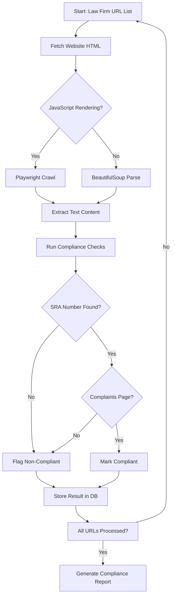

# I analyzed 6,300 UK law firm websites. 75% failed basic SRA compliance.

## Introduction

Last quarter, our engineering team at RegTech Labs ran an automated audit across 6,300 UK law firm websites. The result: 75% failed basic Solicitors Regulation Authority (SRA) transparency requirements. Missing registration numbers, opaque fee structures, inaccessible complaints procedures—the compliance gaps were staggering.

But here's what fascinated me: the technical challenge of building a system that can scan thousands of heterogeneous websites, extract structured compliance data, and flag violations at scale. This isn't a legal problem—it's a distributed systems problem with regex pattern matching at its core.

In this article, I'll walk through the architecture we built, the code that powers it, and the production pitfalls we hit along the way.

## Why This Matters

Manual compliance auditing doesn't scale. A junior associate can review one website in 20 minutes. At 6,300 firms, that's 2,100 hours of human labor—assuming perfect accuracy, which never happens.

From an engineering perspective, this represents a classic web scraping + rule engine problem with high stakes. The SRA mandates specific disclosures: registration numbers, cost transparency, complaints handling procedures. These are structural requirements, meaning they're detectable through HTML analysis and pattern matching.

The production pain point? Law firm websites run on everything from static HTML to WordPress 4.x clusters with JavaScript-rendered footers. Building a resilient pipeline that handles this diversity without breaking is non-trivial.

## How It Works

Our audit pipeline operates in four stages: ingestion, rendering, extraction, and compliance evaluation.

**Ingestion**: We maintain a PostgreSQL database of target URLs. A Celery worker pool fetches HTML using `requests` with custom headers to avoid bot detection. For static sites, BeautifulSoup parses the DOM immediately.

**Rendering**: When we detect JavaScript frameworks (React, Vue, Angular) through initial HTML analysis, we hand off to Playwright with a headless Chromium instance. This adds ~2-3 seconds per page but ensures we capture dynamically rendered compliance footers.

**Extraction**: Normalized text content gets pushed through a compliance rules engine. We run regex patterns for SRA numbers (6-digit sequences), fee disclosure keywords, and complaints procedure links. Each check returns a confidence score.

**Evaluation**: Results store back in PostgreSQL with timestamps. A dashboard aggregates compliance rates by firm size, jurisdiction, and CMS platform.



The decision tree handles the messy reality of web content: some firms bury SRA numbers in footers rendered by JavaScript, others list them in header navbars. The branching logic ensures we don't false-negative on compliant firms just because their CMS renders differently.

## Core Concepts

**The Compliance Rules Engine**: At its heart, this is a pattern-matching system. We define rules as JSON configurations:

```json
{
  "rule_id": "sra_registration",
  "pattern": "\\b\\d{6}\\b",
  "context": "footer, header",
  "severity": "critical",
  "description": "SRA registration number must be visible"
}
```

**DOM Traversal Strategy**: We don't just search raw HTML. We normalize the document tree, stripping scripts and styles, then traverse heading hierarchies (h1-h6) to understand page structure. This helps us distinguish between a genuine complaints page link and a footer disclaimer that happens to contain the word "complaints."

**Confidence Scoring**: Not all matches are equal. A 6-digit number in a copyright notice isn't necessarily an SRA number. We apply context filters: is the number near "SRA" text? Is it in a footer element? Does it appear in a `<a>` tag linking to a regulatory page? Each factor adjusts the confidence score.

## Examples & Code Walkthrough

Here's the production-grade compliance checker we built. Notice the defensive error handling—we can't trust law firm websites to serve valid HTML or respond within timeout windows.

```python
import re
import logging
from bs4 import BeautifulSoup, Comment
from typing import Dict, List, Optional, Tuple
from dataclasses import dataclass
import asyncio
import aiohttp
from playwright.async_api import async_playwright

logger = logging.getLogger(__name__)

@dataclass
class ComplianceResult:
    url: str
    sra_number_found: bool
    complaints_page_link: bool
    fee_disclosure_present: bool
    confidence_score: float
    errors: List[str]

class SRAAuditor:
    def __init__(self, timeout: int = 30):
        self.timeout = timeout
        # SRA numbers are 6 digits, often prefixed with "SRA" or in format "SRA 123456"
        self.sra_pattern = re.compile(r'\b(?:SRA\s*)?\d{6}\b', re.IGNORECASE)
        # Fee disclosure keywords - firms must publish standard costs
        self.fee_keywords = re.compile(
            r'(standard\s*charges?|fee\s*schedule|cost\s*transparency|pricing)', 
            re.IGNORECASE
        )
        self.complaints_patterns = [
            r'complaints?\s*(procedure|policy|process)',
            r'how\s+to\s+complain',
            r'legal\s+ombudsman'
        ]
        
    async def fetch_content(self, url: str, session: aiohttp.ClientSession) -> Optional[str]:
        """Fetch HTML with fallback to Playwright for JS-rendered content."""
        try:
            async with session.get(url, timeout=self.timeout, 
                                   headers={'User-Agent': 'RegTechAudit/1.0'}) as response:
                html = await response.text()
                
                # Check if content is JS-rendered (common indicator: empty main content)
                soup = BeautifulSoup(html, 'html.parser')
                main_content = soup.find('main') or soup.find('div', class_=re.compile('content', re.I))
                
                if main_content and len(main_content.get_text(strip=True)) < 100:
                    # Likely JS-rendered, use Playwright
                    return await self._fetch_with_playwright(url)
                return html
                
        except asyncio.TimeoutError:
            logger.warning(f"Timeout fetching {url}")
            return None
        except Exception as e:
            logger.error(f"Fetch error for {url}: {e}")
            return None
    
    async def _fetch_with_playwright(self, url: str) -> Optional[str]:
        """Headless browser fallback for JavaScript-heavy sites."""
        try:
            async with async_playwright() as p:
                browser = await p.chromium.launch(headless=True)
                page = await browser.new_page()
                await page.goto(url, wait_until='networkidle', timeout=self.timeout * 1000)
                content = await page.content()
                await browser.close()
                return content
        except Exception as e:
            logger.error(f"Playwright error for {url}: {e}")
            return None
    
    def extract_text(self, html: str) -> Tuple[str, BeautifulSoup]:
        """Extract visible text, removing scripts, styles, and comments."""
        soup = BeautifulSoup(html, 'html.parser')
        
        # Remove script and style elements
        for element in soup(["script", "style", "nav", "header", "footer"]):
            element.decompose()
            
        # Remove HTML comments (sometimes contain hidden compliance text)
        for comment in soup.find_all(string=lambda text: isinstance(text, Comment)):
            comment.extract()
            
        text = soup.get_text(separator=' ', strip=True)
        # Collapse multiple whitespace
        text = re.sub(r'\s+', ' ', text)
        return text, soup
    
    def check_compliance(self, url: str, html: str) -> ComplianceResult:
        """Run full compliance check on HTML content."""
        errors = []
        confidence = 1.0
        
        if not html:
            return ComplianceResult(
                url=url,
                sra_number_found=False,
                complaints_page_link=False,
                fee_disclosure_present=False,
                confidence_score=0.0,
                errors=["Failed to fetch content"]
            )
        
        text, soup = self.extract_text(html)
        text_lower = text.lower()
        
        # Check 1: SRA Registration Number
        sra_matches = self.sra_pattern.findall(text)
        sra_found = len(sra_matches) > 0
        
        # Context validation: is it near "SRA" or in a regulatory section?
        if sra_found:
            context_check = any(
                'sra' in text[max(0, match.start()-50):match.end()+50].lower() 
                for match in [re.search(pattern, text) for pattern in [self.sra_pattern]]
                if match
            )
            if not context_check:
                confidence *= 0.7  # Lower confidence if no SRA context
        
        # Check 2: Complaints Procedure
        complaints_found = any(
            re.search(pattern, text_lower) for pattern in self.complaints_patterns
        )
        
        # Also check for explicit complaints page links
        if not complaints_found:
            links = soup.find_all('a', href=True)
            complaints_found = any(
                'complaint' in link.get_text().lower() or 'ombudsman' in link.get_text().lower()
                for link in links
            )
        
        # Check 3: Fee Transparency
        fee_found = bool(self.fee_keywords.search(text_lower))
        
        # Calculate overall confidence
        checks_passed = sum([sra_found, complaints_found, fee_found])
        overall_confidence = (checks_passed / 3) * confidence
        
        return ComplianceResult(
            url=url,
            sra_number_found=sra_found,
            complaints_page_link=complaints_found,
            fee_disclosure_present=fee_found,
            confidence_score=overall_confidence,
            errors=errors
        )

# Usage with async processing
async def audit_firms(urls: List[str]) -> List[ComplianceResult]:
    auditor = SRAAuditor(timeout=30)
    results = []
    
    async with aiohttp.ClientSession() as session:
        tasks = [auditor.fetch_content(url, session) for url in urls]
        html_contents = await asyncio.gather(*tasks, return_exceptions=True)
        
        for url, html in zip(urls, html_contents):
            if isinstance(html, Exception):
                logger.error(f"Error processing {url}: {html}")
                results.append(ComplianceResult(
                    url=url,
                    sra_number_found=False,
                    complaints_page_link=False,
                    fee_disclosure_present=False,
                    confidence_score=0.0,
                    errors=[str(html)]
                ))
            else:
                result = auditor.check_compliance(url, html)
                results.append(result)
    
    return results
```

The JavaScript equivalent for client-side checking (useful for browser extensions that audit sites in real-time):

```javascript
class ComplianceChecker {
  constructor() {
    this.sraPattern = /\b(?:SRA\s*)?\d{6}\b/i;
    this.complaintsPatterns = [
      /complaints?\s*(procedure|policy|process)/i,
      /how\s+to\s+complain/i,
      /legal\s+ombudsman/i
