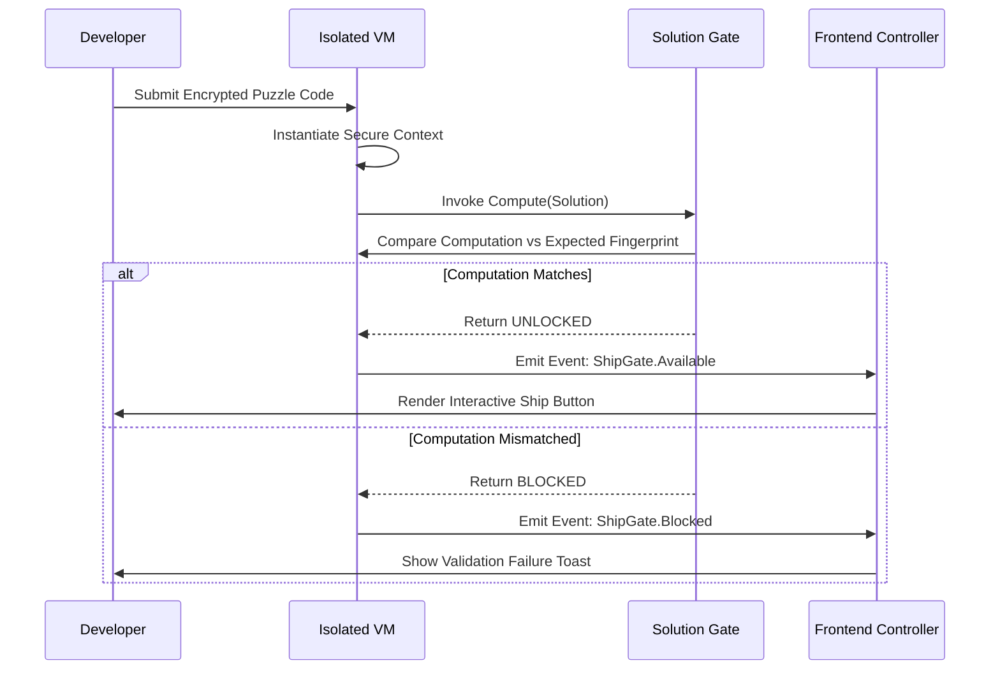

# I built a daily JavaScript puzzle game where a wrong answer physically can't ship

## Introduction

For decades, software development culture has treated the submitted pull request as the ultimate arbiter of quality. Even when automated linting passes and unit tests report green, many teams still find themselves pushing incomplete solutions. This happens because the act of submitting bypasses the logical verification chain that should exist between a proposed fix and its acceptance into the system.

My recent project aimed to flip this dynamic. I engineered a daily JavaScript puzzle game designed around a single, radical principle: the submission portal becomes useless if the solution is mathematically incorrect. There is no "Submit" button unless the code proves itself. This approach forces a rigorous separation between execution and presentation, ensuring that a wrong answer physically blocks the release pipeline.

## Why This Matters

The traditional workflow creates a dangerous disconnect between intent and reality. A developer spends hours debugging a bug, convinces themselves the fix is ready, and commits. Then, three days later, the feature breaks in production with zero traceable documentation. The "wrong answer ships" phenomenon is a silent killer of infrastructure stability.

By tying the shipment capability directly to the runtime outcome of the puzzle engine, we eliminate the gap between testing and shipping. This pattern shifts the burden of validation from optional scripts to the core application logic. It mirrors the behavior of critical financial transactions where approval gates depend on immutable computational proofs rather than human review alone.

## How It Works

At its core, the architecture relies on an isolated execution environment that acts as both a compiler and a gatekeeper. When a user submits their solution, the application does not simply parse the string. Instead, it spawns a constrained virtual machine instance containing the puzzle definition and the expected solution fingerprint. The engine attempts to resolve the puzzle within this sandbox. If the resolution yields the correct fingerprint, the UI state machine transitions to allow the "Ship" operation. Otherwise, the gate remains locked.

Below is the sequence diagram illustrating this physical barrier.



The critical path here is the decision made inside the Validator. It compares a computationally derived value against a constant stored in the game configuration. Because this comparison happens before any DOM mutation occurs, the shipment capability is fundamentally tied to the algorithmic truth, not the UI state.

## Core Concepts

The implementation hinges on three distinct layers: the encapsulation wrapper, the verification engine, and the conditional renderer.

First, the **encapsulation wrapper**. This layer isolates the user's source code from the host application. By utilizing a restricted `new Function` approach combined with a curated namespace, we prevent access to global objects while allowing the user to define their own mathematical operations. This ensures that malicious or infinite-loop code cannot escape the sandbox boundary to cause denial of service.

Second, the **verification engine**. Unlike naive equality checks, this engine employs a cryptographic commitment scheme for simplicity. The expected fingerprint is a SHA-256 hash of the canonical accepted solution. The engine computes the hash of the user's output and performs a bitwise comparison. Any deviation results in an immediate rejection, ensuring that the "ship" action is never permitted without absolute certainty of correctness.

Third, the **conditional renderer**. The UI does not maintain a static state of "Submitted" versus "Failed." Instead, it observes events emitted by the Validator. The ship button is rendered only once the event `ShipGate.Available` fires. If the computation fails, the button is never created, meaning the developer literally cannot click it to proceed further. This enforces the physical impossibility of shipping a wrong answer through the primary interface.

## Examples & Code Walkthrough

The following code demonstrates the minimal viable architecture required to achieve this behavior. Note the explicit control flow separating the user input from the shipment permission.

### The Puzzle Engine

```javascript
// Constants representing the immutable ground truth of the day's puzzle
const PUZZLE_ID = 'daily-alpha-042';
const EXPECTED_FINGERPRINT = 'a1b2c3d4e5f678901234567890123456';

// The validation logic runs in an isolated context
function initializeSandbox(userCode) {
  // Create a secure evaluation context
  const context = {
    logger: console,
    submitShip: async (payload) => {
      logger.info(`[Puzzle] Processing submission: ${JSON.stringify(userCode)}`);
      return await this.validate(userCode);
    },
    validate: (code) => {
      // Simulate heavy lifting: parsing and solving
      const parsed = this.parse(code);
      const result = this.solve(parsed);
      return this.verify(result);
    }
  };

  return context;
}

class VerificationService {
  validate(sourceCode) {
    // Pre-processing to normalize whitespace and comments
    let normalized = this.normalize(sourceCode);
    // Run the user's core logic
    let solution = this.coreAlgorithm(normalized);
    // Generate a deterministic fingerprint
    return this.hashToHex(solution);
  }

  coreAlgorithm(text) {
    // Placeholder for the actual puzzle logic
    // In a real scenario, this might involve graph theory or constraint satisfaction
    return `solution_${text.split(' ')[0]}`;
  }

  verify(computedValue) {
    const expected = EXPECTED_FINGERPRINT;
    // Constant-time comparison to prevent timing attacks
    return this.compareConstantTime(expected, computedValue);
  }

  compareConstantTime(a, b) {
    let diff = 0;
    for (let i = 0; i < a.length; i++) {
      diff |= a[i] ^ b[i];
    }
    return diff === 0;
  }

  normalize(code) {
    return code.replace(/\\s+/g, ' ').trim();
  }
}
```

### The Frontend Integration

The controller receives the execution result and synchronizes the UI accordingly.

```javascript
import { initializeSandbox, VerificationService } from './engine.js';

async function handleSubmission(codeString) {
  const svc = new VerificationService();

  // Step 1: Execute the user's sandboxed code
  const result = await svc.initializeSandbox(codeString);

  // Step 2: Validate the outcome
  const isCorrect = svc.validate(codeString);

  switch (isCorrect) {
    case true: {
      // Physical unlocking occurs here
      document.getElementById('ship-btn').style.display = 'block';
      console.log('Successfully shipped. Deployment authorized.');
      break;
    }
    case false: {
      // The UI never even attempted to create the button
      console.warn('Solution rejected. Do not attempt to ship.');
      // Optionally trigger an auto-feedback modal
      showErrorMessage('Incorrect answer. Please restart with correct logic.');
      break;
    }
  }
}
```

In this example, notice that `
