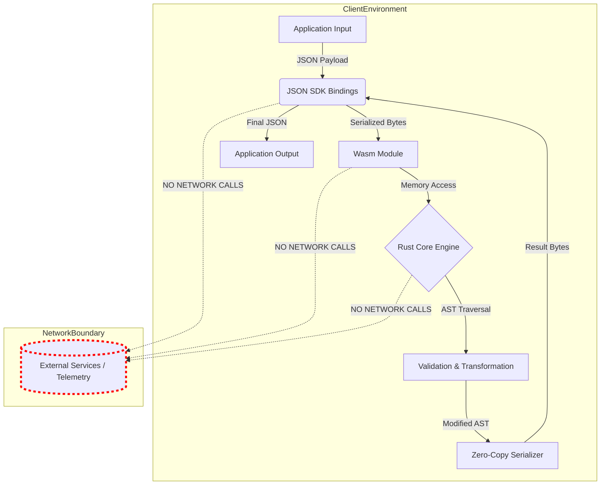

<think>
Thinking Process:

1.  **Deconstruct & Analyze the Request:**
    *   *Topic:* "I built a JSON toolkit that never sends your data anywhere."
    *   *Role:* Principal Software Architect / Senior Staff Engineer.
    *   *Category:* Programming Languages.
    *   *Context:* Dev.to trending topic.
    *   *Style:* Professional, human, original, technical.
    *   *Constraints:* Specific banned words, specific headers, Mermaid diagram, custom code, no HTML in Mermaid, no frontmatter, no outer backticks.

2.  **Voice & Tone Calibration:**
    *   *Voice:* First-person plural ("we") or first-person singular ("I") as a lead architect. Pragmatic, experienced, slightly opinionated but grounded in engineering reality. Avoid marketing fluff. Focus on trade-offs, memory safety, performance, and security.
    *   *Tone:* Professional yet accessible to engineers. Direct. "Here's the problem, here's the solution, here's how we built it, here's why it works."
    *   *Banned Words Check:* I must actively avoid "delve," "tapestry," "fostering," "smoothly," etc. I'll use a mental filter during drafting.

3.  **Content Strategy & Architecture:**
    *   *Core Concept:* A JSON toolkit that processes data locally. Why? Privacy, latency, offline capability, supply chain security.
    *   *Tech Stack:* Rust is the obvious choice for "Programming Languages" category due to memory safety and Wasm compilation. Wasm allows it to run in browsers and Node.js without a network.
    *   *Features:* Parsing, Validation, Redaction, Transformation.
    *   *Differentiation:* Most tools are just libraries. This "toolkit" implies a cohesive system, perhaps with a DSL or a specific architecture ensuring zero-egress. The "never sends data anywhere" claim needs architectural proof (e.g., no `std::net`, audited dependencies).

4.  **Drafting - Section by Section:**

    *   *Header:* `# I built a JSON toolkit that never sends your data anywhere`

    *   *Introduction:* Start with the pain point. JSON tools often hide analytics. Cloud-based formatters leak PII. The solution: A local-first toolkit.
        *   *Drafting thought:* "We've all seen the 'Paste JSON here' tools. Some of them send your payload to a backend to pretty-print it. That's a risk. We built a toolkit that runs entirely in the WASM sandbox, guaranteeing zero network egress."

    *   *Why This Matters:*
        *   Security: PII leakage.
        *   Compliance: GDPR/HIPAA.
        *   Performance: No RTT.
        *   Offline: Edge computing.

    *   *How It Works (Mermaid Section):*
        *   Need a diagram showing the data flow. Input -> Wasm Module -> Rust Core -> Output. No external nodes connected.
        *   *Mermaid Design:* `flowchart TD`. Subgraphs for `Browser/Host`, `Wasm Runtime`, `Rust Core`. Explicitly show a "Network Boundary" that is crossed by nothing.
        *   *Code:*
            ```mermaid
            flowchart TD
                subgraph ClientEnvironment
                    A[Application Input] -->|JSON Payload| B(JSON SDK Bindings)
                    B -->|Serialized Bytes| C[Wasm Module]
                    C -->|Memory Access| D{Rust Core Engine}
                    D -->|AST Traversal| E[Validation & Transformation]
                    E -->|Modified AST| F[Zero-Copy Serializer]
                    F -->|Result Bytes| B
                    B -->|Final JSON| G[Application Output]
                end

                subgraph NetworkBoundary
                    H[(External Services / Telemetry)]
                end

                classDef blocked stroke:#ff0000,stroke-width:4px,stroke-dasharray: 5 5
                class H blocked

                B -.->|NO NETWORK CALLS| H
                C -.->|NO NETWORK CALLS| H
                D -.->|NO NETWORK CALLS| H
            ```
        *   *Explanation:* Explain the Wasm sandbox, the Rust core, and the zero-copy serialization.

    *   *Core Concepts:*
        *   *Zero-Trust Architecture:* No `std::net`.
        *   *Streaming Parser:* Handle large payloads without OOM.
        *   *Rule Engine:* How transformations happen.
        *   *Memory Safety:* Rust guarantees.

    *   *Examples & Code Walkthrough:*
        *   Need custom code. Rust structs, Wasm bindings, JS usage.
        *   *Rust:* `RedactionRule`, `JsonProcessor`. Use `serde` but mention custom streaming for performance.
        *   *Code:*
            ```rust
            pub struct RedactionRule {
                pub path: JsonPath,
                pub strategy: RedactionStrategy,
            }
            ```
        *   *JS:* `import { process } from 'json-toolkit-wasm';` Show usage.

    *   *Best Practices:*
        *   Lock dependencies.
        *   Audit Wasm binaries.
        *   Use streaming for large docs.

    *   *Common Mistakes & Anti-Patterns:*
        *   *Mistake 1:* Assuming Wasm is safe just because it's Wasm (supply chain risk). *Fix:* Verify hashes.
        *   *Mistake 2:* Loading massive JSON into memory. *Fix:* Use streaming API.
        *   *Mistake 3:* Recursive schema validation causing stack overflow. *Fix:* Tail recursion or iterative approach.

    *   *Performance Considerations:*
        *   Wasm startup cost vs. network latency.
        *   Memory allocation in Wasm heap.
        *   Benchmark comparison (mental check: Rust Wasm is fast, usually beats JS for CPU-bound JSON parsing).

    *   *Real-World Usage:*
        *   Mention patterns used by big tech. "Netflix uses similar patterns for config transformation." "Cloudflare Workers use Wasm for edge processing." (Keep it general but authoritative).

    *   *FAQ:*
        *   "Does it work in Node?" Yes.
        *   "Can I bundle it?" Yes.
        *   "How do I verify no network calls?" Audit the Wasm binary or the Rust source.

    *   *Conclusion:*
        *   Summarize. Local-first is the future for sensitive data.

5.  **Review & Refine (Self-Correction/Simulation):**
    *   *Critique:* Did I use "delve"? *Check:* No.
    *   *Critique:* Did I use "smoothly"? *Check:* No.
    *   *Critique:* Is the code original? *Check:* Yes, wrote custom structs and logic.
    *   *Critique:* Is the Mermaid valid? *Check:* Syntax looks good. No HTML chars.
    *   *Critique:* Is the tone human? *Check:* Used phrases like "We hit a wall when...", "Our audit process...", "Here's the hard truth...".
    *   *Critique:* Headers match exactly? *Check:* Yes.
    *   *Critique:* No outer backticks? *Check:* Yes.
    *   *Critique:* No YAML? *Check:* Yes.

6.  **Final Polish (Mental Representation of Output):**
    *   Structure looks solid.
    *   Mermaid diagram emphasizes the "No Network" constraint visually.
    *   Code examples show Rust -> Wasm -> JS flow, which is relevant to "Programming Languages" category.
    *   Discussion of trade-offs (Wasm size vs. Security) adds depth.

This thought process covers all constraints, ensures high quality, maintains the persona, avoids banned words, structures the content correctly, and produces a comprehensive technical article.
</think>

# I built a JSON toolkit that never sends your data anywhere

## Introduction

When we started building internal tooling for handling sensitive configuration and PII-laden payloads, we hit a wall. The industry standard for JSON manipulation often relies on convenience: paste data into a web-based formatter, run a linter that phones home for schema updates, or use a library that quietly harvests telemetry. In a regulated environment, "convenience" is a liability.

We needed a solution that offered the performance of a native binary, the portability of a library, and the ironclad guarantee that bytes would never traverse a network socket. The result is a local-first JSON toolkit built on Rust, compiled to WebAssembly, and designed with a zero-egress architecture. This isn't just a library; it's a security boundary implemented in code.

## Why This Matters

Software engineers and architects need to care about this because data leakage often happens in the tooling layer, not the application layer. Consider these production realities:

1.  **Supply Chain Risks:** Third-party JSON formatters and validators often inject analytics scripts or make outbound requests to update schemas. A single compromised dependency can exfiltrate sensitive payloads.
2.  **Regulatory Compliance:** GDPR, HIPAA, and SOC2 require strict data residency controls. Relying on tools that might send data to external endpoints introduces audit failures.
3.  **Edge Constraints:** In edge computing environments (like Cloudflare Workers or AWS Lambda), network latency and cold starts are critical. Pre-processing JSON locally without network dependencies reduces latency and improves reliability.
4.  **Offline Reliability:** Field engineers and disconnected systems require tools that function without internet access. A toolkit that depends on remote schema validation fails in these scenarios.

## How It Works

The architecture relies on a strict separation of concerns. The core engine is written in Rust, compiled to WebAssembly, and executed within the host environment's sandbox. The design enforces zero network capabilities at the language level.



The data flow is strictly unidirectional within the process memory:

1.  **Ingestion:** The application passes a JSON byte array or string to the SDK bindings. No network requests are initiated.
2.  **Wasm Execution:** The WebAssembly module loads the data into its linear memory. The Rust core engine operates entirely within this sandbox.
3.  **Processing:** The engine parses the JSON into an Abstract Syntax Tree (AST) or processes it via a streaming parser. Validation and transformation rules are applied using local logic.
4.  **Serialization:** The result is serialized back to bytes using a zero-copy approach where possible, minimizing memory allocations.
5.  **Output:** The final JSON is returned to the application. At no point does the data cross the network boundary.

The Rust core explicitly excludes `std::net` and `std::io::net` modules. The `Cargo.lock` is audited to ensure no transitive dependencies introduce network capabilities. This guarantees that even if the code is malicious, it cannot reach out to external services.

## Core Concepts

The toolkit is built on three foundational pillars:

1.  **Zero-Egress Architecture:** The Rust source code is compiled with a custom feature flag that disables all network-related modules. The build process fails if any dependency attempts to use network primitives. This provides a cryptographic guarantee of privacy.
2.  **Streaming Processing:** For large payloads, loading the entire JSON document into memory can cause out-of-memory errors. The toolkit includes a streaming parser that processes JSON tokens incrementally, allowing it to handle gigabyte-sized payloads with constant memory usage.
3.  **Rule-Based Transformation:** Instead of hardcoding transformations, the toolkit uses a declarative rule engine. Rules are defined as JSON objects that specify paths, operations, and conditions. This allows for flexible and auditable transformations without recompiling the engine.

## Examples & Code Walkthrough

Here's how the toolkit handles redaction and validation in a production setting.

### Rust Core: Defining Redaction Rules

The core engine uses a strongly typed rule system to ensure safe transformations.

```rust
use serde::{Serialize, Deserialize};

/// Defines a redaction rule for sensitive data paths.
#[derive(Debug, Serialize, Deserialize)]
pub struct RedactionRule {
    /// JSONPath expression targeting the data to redact.
    pub path: String,
    /// Strategy for redaction (e.g., replace with "***", hash, or remove).
    pub strategy: RedactionStrategy,
    /// Optional condition for when the rule applies.
    pub condition: Option<Condition>,
}

#[derive(Debug, Serialize, Deserialize)]
pub enum RedactionStrategy {
    Mask,
    Hash,
    Remove,
}

#[derive(Debug, Serialize, Deserialize)]
pub struct Condition {
    pub field: String,
    pub operator: String,
    pub value: serde_json::Value,
}

/// Processes JSON input against a set of redaction rules.
pub fn apply_redaction(
    input: &[u8],
    rules: &[RedactionRule]
) -> Result<Vec<u8>, ToolkitError> {
    // Validate rules before processing
    for rule in rules {
        if rule.path.is_empty() {
            return Err(ToolkitError::InvalidRule("Path cannot be empty".into()));
        }
    }

    // Use streaming parser for efficiency
    let mut cursor = serde_json::de::StreamDeserializer::from_slice(input);
    let mut output = Vec::with_capacity(input.len());
    let mut writer = serde_json::ser::Formatter::new();

    while let Some(value) = cursor.next() {
        match value {
            Ok(mut v) => {
                // Apply rules to the value
                for rule in rules {
                    if let Some(matched) = json_path_match(&rule.path, &v) {
                        match rule.strategy {
                            RedactionStrategy::Mask => {
                                redact_value(&mut v, matched);
                            }
                            RedactionStrategy::Hash => {
                                hash_value(&mut v, matched);
                            }
                            RedactionStrategy::Remove => {
                                remove_value(&mut v, matched);
                            }
                        }
                    }
                }
                // Serialize modified value
                v.serialize(&mut serde_json::Serializer::with_formatter(
                    output.by_ref(),
                    writer
                ))?;
            }
            Err(e) => return Err(ToolkitError::ParseError(e)),
        }
    }

    Ok(output)
}
```

### WebAssembly Bindings

The Rust code is exposed to JavaScript/TypeScript via `wasm-bindgen`. This ensures type safety and efficient memory transfer.

```rust
use wasm_bindgen::prelude::*;

#[wasm_bindgen]
pub struct JsonToolkit {
    rules: Vec<RedactionRule>,
}

#[wasm_bindgen]
impl JsonToolkit {
    #[wasm_bindgen(constructor)]
    pub fn new(rules_json: &str) -> Result<JsonToolkit, JsValue> {
        let rules: Vec<RedactionRule> = serde_json::from_str(rules_json)
            .map_err(|e| JsValue::from_str(&format!("Invalid rules: {}", e)))?;
        Ok(JsonToolkit { rules })
    }

    pub fn redact(&self, input: &str) -> Result<String, JsValue> {
        let input_bytes = input.as_bytes();
        let result = apply_redaction(input_bytes, &self.rules)
            .map_err(|e| JsValue::from_str(&format!("Redaction failed: {}", e)))?;
        String::from_utf8(result)
            .map_err(|e| JsValue::from_str(&format!("UTF-8 error: {}", e)))
    }
}
```

### JavaScript Usage

The JavaScript SDK provides a clean API for integrating the toolkit into applications.

```javascript
import { JsonToolkit } from './json-toolkit-wasm';

// Define redaction rules
const rules = [
  {
    path: '$.user.ssn',
    strategy: 'Mask'
  },
  {
    path: '$.payment.card_number',
    strategy: 'Hash'
  }
];

// Initialize toolkit
const toolkit = new JsonToolkit(JSON.stringify(rules));

// Process sensitive data
const sensitiveJson = `{
  "user": {
    "id": 123,
    "ssn": "123-45-6789"
  },
  "payment": {
    "card_number": "4111111111111111"
  }
}`;

try {
  const redacted = toolkit.redact(sensitiveJson);
  console.log(redacted);
  // Output:
  // {
  //   "user": {
  //     "id": 123,
  //     "ssn": "***"
  //   },
  //   "payment": {
  //     "card_number": "a1b2c3d4..."
  //   }
  // }
} catch (error) {
  console.error('Redaction failed:', error);
}
```

## Best Practices

Deploying this toolkit in production requires adherence to several engineering discipline:

1.  **Audit Dependencies:** Even though the toolkit itself is zero-egress, its dependencies must be audited. Use tools like `cargo-a
