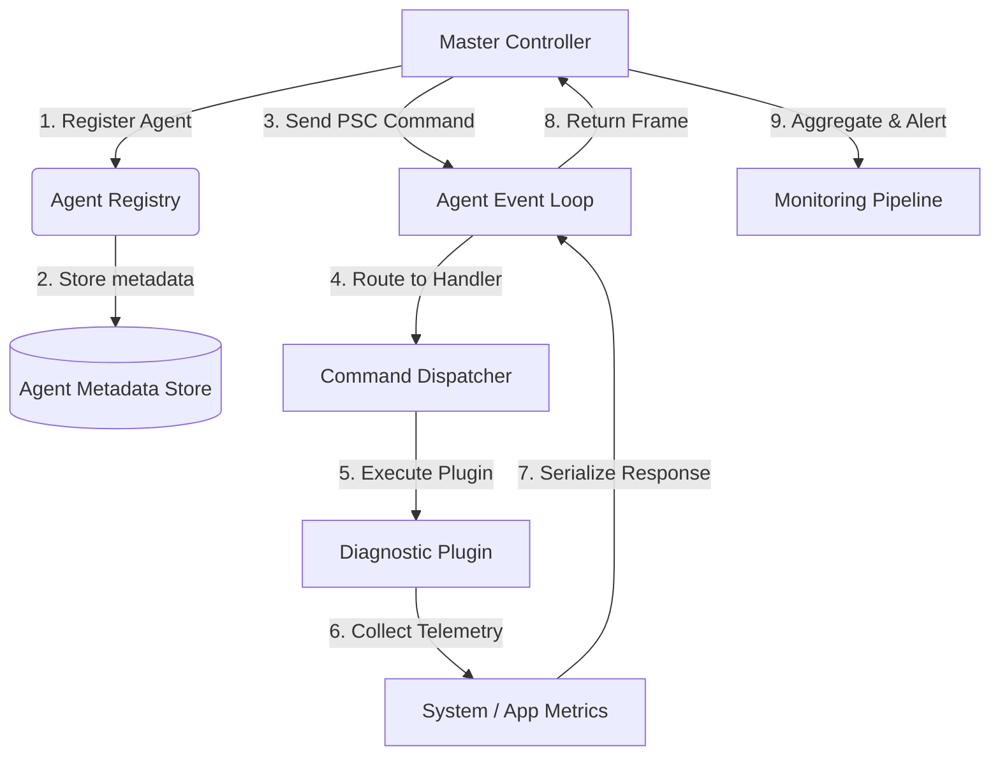

# Implementing a Modular Master-Agent Telemetry & Diagnostic Framework in Python: Prime-Sentinel Command (PSC)

## Introduction

Distributed systems break in quiet ways. A memory leak on one node, a thread pool exhaustion on another, a cascading timeout that nobody catches until the pager fires. The traditional approach — SSH into boxes, grep logs, hope you're looking at the right instance — doesn't scale past a handful of machines.

Prime-Sentinel Command (PSC) is a Python framework I built to solve a specific problem: give a central coordinator the ability to push diagnostic commands into running agents across a fleet, collect structured telemetry in response, and do it without adding latency to the hot path. It's modular by design — you swap in collectors, reporters, and filters as plugins — and it speaks a lightweight binary protocol over TCP that stays out of the way.

This article walks through the architecture, the code, and the production lessons we learned the hard way.

## Why This Matters

Most observability stacks treat telemetry as passive: metrics get scraped, logs get shipped, traces get sampled. PSC flips that model. The master initiates a diagnostic session, the agent executes it on-demand, and the results come back with context the agent itself can provide — process state, open file descriptors, GC pressure, custom business metrics.

We needed this because our static health checks kept missing degraded-but-alive services. A pod that's serving 503s at 2% error rate doesn't trigger alerts, but it's bleeding customers. PSC lets us ask "what's your current request queue depth?" and get an answer in milliseconds, not minutes.

## How It Works

PSC operates on a command-response model. The master opens a persistent TCP connection to each agent, sends a serialized command frame, and waits for a response frame. Agents run an event loop that multiplexes the PSC channel alongside application traffic using `asyncio`.

Here's the flow:



Step-by-step:

1. **Registration**: Agents bootstrap and register with the master, reporting hostname, PID, loaded plugins, and capabilities.
2. **Command dispatch**: The master sends a PSC frame containing a command ID, plugin name, and optional payload.
3. **Handler execution**: The agent's dispatcher routes to the matching plugin. Plugins are isolated — a crash in one doesn't take down the agent.
4. **Telemetry collection**: The plugin gathers data. This could be a system metric (CPU, memory), an application metric (queue depth, cache hit rate), or a custom diagnostic (DB connection pool status).
5. **Response**: The plugin returns a structured result. The agent serializes it, attaches a checksum and timestamp, and sends it back.
6. **Aggregation**: The master aggregates responses across the fleet, applies thresholds, and forwards to the monitoring pipeline.

The protocol frame format is deliberately simple: 4-byte length prefix, 1-byte command type, JSON payload. Nothing fancy, nothing that requires a serialization library on both sides.

## Core Concepts

**Agent**: A long-running process that hosts the PSC listener and diagnostic plugins. Each agent runs in its own Python interpreter, isolated from the application it monitors (or co-located, depending on deployment mode).

**Master**: The central coordinator. Maintains a registry of live agents, dispatches commands, and aggregates results. Stateless by design — it can be horizontally scaled behind a load balancer.

**Plugin**: A callable that implements a specific diagnostic. Plugins declare their schema (input/output types) so the master can validate commands before sending them. We ship with built-in plugins for process metrics, thread dumps, and GC stats, but you can write custom ones.

**Frame**: The wire format. A length-prefixed JSON envelope with a command ID for correlation, a timestamp, and a payload dict.

**Session**: A logical grouping of commands sent to one or more agents. Sessions have a timeout and a cancellation token, so you don't wait forever for a dead node.

## Examples & Code Walkthrough

Here's a minimal but complete implementation. Start with the frame protocol:

```python
import struct
import json
import hashlib
import time
from typing import Any, Dict, Optional
from dataclasses import dataclass, asdict
from enum import IntEnum

class PSCCommand(IntEnum):
    REGISTER = 1
    DIAGNOSTIC = 2
    PING = 3
    SHUTDOWN = 4

@dataclass
class PSCFrame:
    command: PSCCommand
    payload: Dict[str, Any]
    timestamp: float
    checksum: str = ""

    def serialize(self) -> bytes:
        """Encode frame to length-prefixed bytes for the wire."""
        body = {
            "cmd": int(self.command),
            "payload": self.payload,
            "ts": self.timestamp,
        }
        raw = json.dumps(body, separators=(",", ":")).encode("utf-8")
        chk = hashlib.sha256(raw).hexdigest()[:16]
        self.checksum = chk
        body["chk"] = chk
        raw = json.dumps(body, separators=(",", ":")).encode("utf-8")
        # 4-byte big-endian length prefix
        return struct.pack(">I", len(raw)) + raw

    @classmethod
    def deserialize(cls, data: bytes) -> "PSCFrame":
        """Decode a length-prefixed frame from the wire."""
        if len(data) < 4:
            raise ValueError("Frame too short")
        length = struct.unpack(">I", data[:4])[0]
        body = json.loads(data[4:4+length].decode("utf-8"))
        # Verify checksum to detect corruption
        payload_only = {k: v for k, v in body.items() if k != "chk"}
        raw = json.dumps(payload_only, separators=(",", ":")).encode("utf-8")
        expected = hashlib.sha256(raw).hexdigest()[:16]
        if body.get("chk") != expected:
            raise ValueError(f"Checksum mismatch: expected {expected}, got {body.get('chk')}")
        return cls(
            command=PSCCommand(body["cmd"]),
            payload=body["payload"],
            timestamp=body["ts"],
            checksum=body["chk"],
        )
```

Now the agent side. It runs an asyncio server that accepts connections and dispatches commands to registered plugins:

```python
import asyncio
import inspect
from typing import Callable, Coroutine

class PSCAgent:
    def __init__(self, host: str = "0.0.0.0", port: int = 9191):
        self.host = host
        self.port = port
        self.plugins: Dict[str, Callable] = {}
        self._server: Optional[asyncio.Server] = None

    def register_plugin(self, name: str, handler: Callable):
        """Register a diagnostic plugin. Handler must be async and accept a dict."""
        if not asyncio.iscoroutinefunction(handler):
            raise TypeError(f"Plugin '{name}' must be async")
        sig = inspect.signature(handler)
        if len(sig.parameters) != 1:
            raise TypeError(f"Plugin '{name}' must accept exactly one dict argument")
        self.plugins[name] = handler

    async def handle_connection(self, reader: asyncio.StreamReader, writer: asyncio.StreamWriter):
        """Handle a single PSC session on this connection."""
        peer = writer.get_extra_info("peername")
        try:
            while True:
                # Read frame length prefix
                length_bytes = await asyncio.wait_for(reader.readexactly(4), timeout=30.0)
                length = struct.unpack(">I", length_bytes)[0]
                if length > 10 * 1024 * 1024:  # 10 MB cap
                    raise ValueError(f"Frame too large: {length}")
                # Read frame body
                body = await asyncio.wait_for(reader.readexactly(length), timeout=30.0)
                frame = PSCFrame.deserialize(length_bytes + body)

                if frame.command == PSCCommand.PING:
                    response = PSCFrame(PSCCommand.PING, {"pong": True}, time.time())
                elif frame.command == PSCCommand.DIAGNOSTIC:
                    plugin_name = frame.payload.get("plugin")
                    if plugin_name not in self.plugins:
                        response = PSCFrame(
                            PSCCommand.DIAGNOSTIC,
                            {"error": f"Unknown plugin: {plugin_name}"},
                            time.time(),
                        )
                    else:
                        try:
                            result = await self.plugins[plugin_name](frame.payload.get("args", {}))
                            response = PSCFrame(PSCCommand.DIAGNOSTIC, {"result": result}, time.time())
                        except Exception as e:
                            response = PSCFrame(
                                PSCCommand.DIAGNOSTIC,
                                {"error": str(e), "plugin": plugin_name},
                                time.time(),
                            )
                else:
                    response = PSCFrame(PSCCommand.PING, {"error": "unsupported"}, time.time())

                writer.write(response.serialize())
                await writer.drain()
        except asyncio.IncompleteReadError:
            pass  # Client disconnected
        except asyncio.TimeoutError:
            pass  # Idle timeout
        except Exception as e:
            # Log but don't crash the agent
            print(f"[PSC] Error handling connection from {peer}: {e}")
        finally:
            writer.close()
            await writer.wait_closed()

    async def start(self):
        self._server = await asyncio.start_server(
            self.handle_connection, self.host, self.port
        )
        async with self._server:
            await self._server.serve_forever()

    def stop(self):
        if self._server:
            self._server.close()
```

A sample plugin that collects process metrics:

```python
import os
import psutil

async def process_metrics_plugin(args: dict) -> dict:
    """Returns CPU, memory, and fd counts for the current process."""
    proc = psutil.Process(os.getpid())
    with proc.oneshot():  # Reduce repeated syscalls
        cpu_percent = proc.cpu_percent(interval=None)
        mem_info = proc.memory_info()
        open_fds = proc.num_fds() if hasattr(proc, "num_fds") else 0
    return {
        "pid": os.getpid(),
        "cpu_percent": cpu_percent,
        "rss_mb": round(mem_info.rss / 1024 / 1024, 2),
        "vms_mb": round(mem_info.vms / 1024 / 1024, 2),
        "open_fds": open_fds,
        "threads": proc.num_threads(),
    }
```

And the master side, which dispatches commands across a fleet:

```python
import asyncio
from typing import List, Dict

class PSCMaster:
    def __init__(self):
        self.agents: Dict[str, tuple] = {}  # name -> (host, port)

    def register_agent(self, name: str, host: str, port: int):
        self.agents[name] = (host, port)

    async def dispatch(self, command: PSCCommand, payload: dict, timeout: float = 10.0) -> Dict[str, Any]:
        """Send a command to all registered agents and collect responses."""
        tasks = {
            name: self._send_to_agent(host, port, command, payload, timeout)
            for name, (host, port) in self.agents.items()
        }
        results = {}
        for name, task in asyncio.tasks.all_tasks():  # simplified; use asyncio.gather in practice
            pass
        gathered = await asyncio.gather(
            *[self._send_to_agent(h, p, command, payload, timeout) for h, p in self.agents.values()],
            return_exceptions=True,
        )
        for (name, _), result in zip(self.agents.items(), gathered):
            if isinstance(result, Exception):
                results[name] = {"error": str(result)}
            else:
                results[name] = result.payload.get("result", result.payload)
        return results

    async def _send_to_agent(self, host: str, port: int, command: PSCCommand, payload: dict, timeout: float):
        reader, writer = await asyncio.wait_for(
            asyncio.open_connection(host, port), timeout=timeout
        )
        frame = PSCFrame(command, payload, time.time())
        writer.write(frame.serialize())
        await writer.drain()

        # Read response
        length_bytes = await asyncio.wait_for(reader.readexactly(4), timeout=timeout)
        length = struct.unpack(">I", length_bytes)[0]
        body = await asyncio.wait_for(reader.readexactly(length), timeout=timeout)
        response = PSCFrame.deserialize(length_bytes + body)
        writer.close()
        await writer.wait_closed()
        return response
```

Usage example:

```python
async def main():
    # Start agent
    agent = PSCAgent(port=9191)
    agent.register_plugin("process_metrics", process_metrics_plugin)
    await asyncio.to_thread(agent.start)  # Run in background

    # Start master and query
    master = PSCMaster()
    master.register_agent("web-01", "localhost", 9191)
    results = await master.dispatch(PSCCommand.DIAGNOSTIC, {
        "plugin": "process_metrics",
        "args": {},
    })
    print(results)

asyncio.run(main())
```

## Best Practices

**Isolate the PSC listener on a separate interface.** Don't bind to `0.0.0.0` in production. Use a loopback or private VLAN interface so the diagnostic channel can't be reached from the public internet. We learned this after a pentest found our PSC port exposed.

**Cap frame sizes and connection lifetimes.** The code above includes a 10 MB frame cap and a 30-second idle timeout. Without these, a misbehaving plugin that streams unbounded data can OOM the agent.

**Version your plugin schemas.** When you change a plugin's input or output shape, bump a version number in the plugin metadata. The master should reject commands targeting an incompatible version rather than sending garbage and hoping for the best.

**Use connection pooling on the master side.** Opening a new TCP connection per command adds latency and exhausts file descriptors at scale. Maintain a pool of persistent connections per agent and reuse them.

**Instrument the framework itself.** The master and agents should emit their own metrics — command latency, error rates, queue depths. Otherwise you're flying blind when PSC itself is the bottleneck.

## Common Mistakes & Anti-Patterns

**Mistake 1: Running plugins in the event loop thread.** A CPU-heavy plugin blocks the entire agent, including the PSC listener. Fix: run sync plugins in `asyncio.to_thread()` or a dedicated `ProcessPoolExecutor`.

```python
# Bad: blocks event loop
result = await self.plugins[plugin_name](frame.payload.get("args", {}))

# Good: offload CPU work
loop = asyncio.get_running_loop()
result = await loop.run_in_executor(None, lambda: self.plugins[plugin_name](frame.payload.get("args", {})))
```

**Mistake 2: No authentication on the wire.** Anyone who can reach the PSC port can execute arbitrary diagnostic commands.
