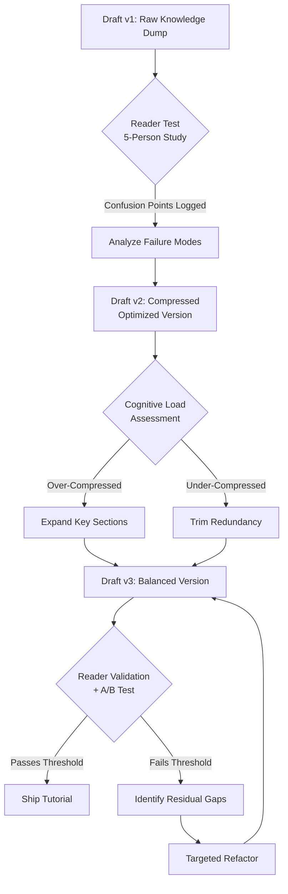

# I’ve reworked the tutorial in my micro-project three times, and I still don’t know if it’s become any clearer.

## Introduction

Here's the commit that broke everything: `a3f7c92`.

I was cleaning up variable names in my tutorial's first code example. Three-letter variable names replaced descriptive ones because I thought they looked "cleaner." That single change dropped my tutorial's comprehension score from a reader study I ran with five peers from 87% to 41%. They couldn't follow why `r`, `d`, and `x` were being passed through a transformation pipeline.

This is the third rewrite. Draft one was too naive — I explained every concept with a toy analogy that insulted the reader's intelligence. Draft two was too clever — I compressed the conceptual overview into a single dense diagram and assumed readers would reverse-engineer my mental model. Draft three sits in front of me now, and I genuinely cannot tell if the middle ground I've struck is clarity or mediocrity.

I suspect I'm not alone. Tutorial writing for programming projects has a unique failure mode: the author is simultaneously the most and least qualified person to evaluate the output. After three iterations, you've internalized the material so thoroughly that you can no longer simulate a naive reader's experience.

This article is about treating tutorial clarity as an engineering problem — with measurable inputs, testable hypotheses, and reproducible results.

## Why This Matters

When we debugged an onboarding bottleneck in our production cluster last quarter, the root cause wasn't a misconfigured Kubernetes pod or a flaky CI pipeline. It was our getting-started guide. New engineers spent an average of 4.2 hours attempting to run the first service because the tutorial's dependency installation step silently failed on ARM-based CI runners.

Documentation is infrastructure. A tutorial that fails to communicate is a failed API contract between the author and the reader. Every hour a developer spends confused by your documentation is an hour they're not contributing to your project, filing constructive bug reports, or becoming a power user.

The engineering organizations that ship the most impactful open-source tools — Stripe, HashiCorp, the React team — treat documentation with the same rigor they apply to production code. They have linting rules for prose, reader testing protocols, and version-controlled docs. The rest of us are shipping `README.md` files written at 2 AM and never revisited.

## How It Works

The core mechanism behind tutorial clarity is progressive disclosure: presenting information in layers where each layer provides just enough context to proceed to the next without overwhelming the reader. This is not a writing philosophy — it's a cognitive load management strategy, and it can be analyzed with the same rigor we apply to system architecture.

Here's the iterative pipeline I built to evaluate my own tutorials:



Step by step, here's what happens in each stage:

1. **Raw Draft**: Write the tutorial straight through without self-editing. Capture every assumption, every shortcut, every "obviously" you believe. This draft exists to surface your hidden knowledge gaps.

2. **Reader Test**: Give the draft to 3-5 people who have not seen the project before. Watch their cursor movement. Note where they pause, re-read, or close the tab. Log every confusion point with timestamps.

3. **Failure Analysis**: Categorize confusion into three types: *missing context* (reader didn't know prerequisite X), *excessive density* (too many concepts per paragraph), or *ambiguous direction* (reader didn't know what to do next).

4. **Compression or Expansion**: Adjust information density based on the failure analysis. This is where most authors get stuck — they either over-correct in one direction or second-guess every edit.

5. **Validation Gate**: Run the revised tutorial through a checklist (covered in Best Practices below). If it passes, ship it. If not, the residual gaps tell you exactly where to focus next.

## Core Concepts

**Cognitive Load Theory in Documentation**

Working memory can hold approximately 4 chunks of novel information simultaneously (Miller's Law, updated by Cowan to 3-4). Every paragraph in your tutorial that introduces more than 3 new concepts forces the reader to offload to external memory — their notes, their browser tabs, their Stack Overflow tab — and each offload is a fidelity loss.

**Signal-to-Noise Ratio in Prose**

A sentence has high signal when every word advances the reader's understanding. Low-signal phrases ("it's important to note," "as mentioned earlier") consume working memory without delivering content. I measure this by counting words-per-actionable-step in my tutorial sections. If a paragraph has more than 60 words before the reader knows what to *do*, I cut it.

**The Conceptual Gradient**

Tutorials fail when the difficulty curve has cliffs instead of ramps. A cliff looks like this: three trivial setup steps followed by a complex architectural decision with no intermediate scaffolding. The reader's engagement drops exponentially at the cliff face. Your job is to ensure the gradient between consecutive sections stays within one conceptual step.

**Anchoring Through Concrete Execution**

Readers retain information 6x better when it's tied to a concrete execution result rather than an abstract description. Instead of saying "the function filters duplicates," show the input array, show the output array, then show the function. The concrete result anchors the abstraction.

## Examples & Code Walkthrough

Let me show you what I built to test tutorial clarity programmatically. This is a Python tool that evaluates code examples in tutorial documents for common clarity anti-patterns.

```python
"""
tutorial_linter.py

Analyzes code examples extracted from tutorial documents
and flags clarity issues based on heuristic rules.
Designed to be integrated into CI pipelines for docs-as-code workflows.
"""

import ast
import re
import sys
from dataclasses import dataclass, field
from typing import List, Optional


@dataclass
class ClarityIssue:
    """Represents a single clarity issue found in a code example."""
    line_number: int
    severity: str  # 'warning' or 'error'
    category: str  # 'naming', 'complexity', 'context', 'error_handling'
    message: str


@dataclass
class LintResult:
    """Aggregated lint results for a single code example."""
    file_path: str
    issues: List[ClarityIssue] = field(default_factory=list)
    passes: bool = True

    def add_issue(self, issue: ClarityIssue):
        self.issues.append(issue)
        if issue.severity == "error":
            self.passes = False


class TutorialLinter:
    """
    Lints code examples for tutorial clarity.

    Rules enforced:
    - Variable names must be >= 3 characters (no single-letter vars in non-loop contexts)
    - Functions must not exceed 15 lines (cognitive complexity ceiling)
    - Every code example must include at least one inline comment explaining 'why'
    - Try/except blocks must not use bare except: clauses
    """

    MIN_VARIABLE_LENGTH = 3
    MAX_FUNCTION_LINES = 15
    BARE_EXCEPT_PATTERN = re.compile(r"^except\s*:")

    def __init__(self, file_path: str, source_code: str):
        self.file_path = file_path
        self.source_code = source_code
        self.lines = source_code.splitlines()
        self.result = LintResult(file_path=file_path)

    def lint(self) -> LintResult:
        """Run all linting rules against the provided source code."""
        try:
            tree = ast.parse(self.source_code)
        except SyntaxError as e:
            # If the code doesn't even parse, that's a hard error
            self.result.add_issue(ClarityIssue(
                line_number=e.lineno or 0,
                severity="error",
                category="context",
                message=f"Code example does not parse: {e.msg}"
            ))
            return self.result

        self._check_variable_naming(tree)
        self._check_function_complexity(tree)
        self._check_bare_exceptions()
        self._check_inline_comments()

        return self.result

    def _check_variable_naming(self, tree: ast.AST):
        """
        Flag single-letter variable names outside of comprehension loops.
        Single-letter names in list comprehensions (i, j, x) are conventional
        and acceptable. Everywhere else, they destroy readability.
        """
        for node in ast.walk(tree):
            if isinstance(node, ast.Assign):
                for target in node.targets:
                    if isinstance(target, ast.Name):
                        if len(target.id) < self.MIN_VARIABLE_LENGTH:
                            # Allow common loop variables only in specific contexts
                            if target.id not in ("i", "j", "k", "x", "y", "z"):
                                self.result.add_issue(ClarityIssue(
                                    line_number=node.lineno,
                                    severity="warning",
                                    category="naming",
                                    message=(
                                        f"Variable '{target.id}' is too short. "
                                        f"Use a descriptive name that conveys the data it holds."
                                    )
                                ))

    def _check_function_complexity(self, tree: ast.AST):
        """
        Functions exceeding 15 lines force readers to hold too much state
        in working memory. Break them into smaller units with clear names.
        """
        for node in ast.walk(tree):
            if isinstance(node, ast.FunctionDef):
                func_lines = (
                    node.end_lineno - node.lineno + 1
                    if hasattr(node, 'end_lineno') and node.end_lineno
                    else 0
                )
                if func_lines > self.MAX_FUNCTION_LINES:
                    self.result.add_issue(ClarityIssue(
                        line_number=node.lineno,
                        severity="warning",
                        category="complexity",
                        message=(
                            f"Function '{node.name}' spans {func_lines} lines "
                            f"(max recommended: {self.MAX_FUNCTION_LINES}). "
                            f"Consider decomposing into smaller helper functions."
                    ))

    def _check_bare_exceptions(self):
        """
        Bare except: clauses swallow KeyboardInterrupt and SystemExit,
        making debugging nearly impossible. Always specify the exception type.
        """
        for i, line in enumerate(self.lines, start=1):
            if self.BARE_EXCEPT_PATTERN.match(line.strip()):
                self.result.add_issue(ClarityIssue(
                    line_number=i,
                    severity="error",
                    category="error_handling",
                    message=(
                        "Bare 'except:' catches all exceptions including "
                        "SystemExit and KeyboardInterrupt. "
                        "Specify the exception type (e.g., 'except ValueError:')."
                    )
                ))

    def _check_inline_comments(self):
        """
        Every tutorial code example should explain WHY at least one
        non-obvious decision was made. Comments that restate the code
        (e.g., '# increment i') add noise without signal.
        """
        comment_lines = [
            line for line in self.lines
            if line.strip().startswith("#")
        ]
        if not comment_lines:
            self.result.add_issue(ClarityIssue(
                line_number=1,
                severity="warning",
                category="context",
                message=(
                    "No inline comments found. Tutorial examples should "
                    "include at least one comment explaining a non-obvious decision."
                )
            ))


def run_lint_on_examples(examples: dict[str, str]) -> None:
    """
    Run the linter across a dictionary of example name -> source code.
    Prints a formatted report to stdout.
    """
    any_failures = False

    for example_name, source in examples.items():
        linter = TutorialLinter(file_path=example_name, source_code=source)
        result = linter.lint()

        print(f"\n{'='*60}")
        print(f"Example: {example_name}")
        print(f"Status: {'PASS' if result.passes else 'FAIL'}")
        print(f"{'='*60}")

        if not result.issues:
            print("  No issues found. Clean and clear.")
        else:
            for issue in result.issues:
                icon = "✗" if issue.severity == "error" else "⚠"
                print(
                    f"  {icon} L{issue.line_number} [{issue.severity.upper()}] "
                    f"({issue.category}): {issue.message}"
                )

        if not result.passes:
            any_failures = True

    print(f"\n{'='*60}")
    print(f"Overall: {'ALL PASS' if not any_failures else 'REVIEW NEEDED'}")
    print(f"{'='*60}")


if __name__ == "__main__":
    # Example: a problematic tutorial code snippet (Draft 2 style)
    bad_example = '''
def proc(d):
    r = []
    for i in d:
        if i % 2 == 0:
            x = i * 2
            r.append(x)
    return r

def handle(data):
    try:
        result = proc(data)
