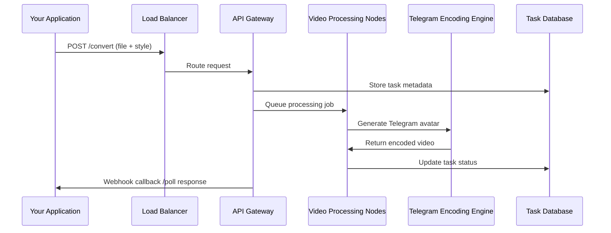

# LiveAvaBot Developer API: Embed Telegram Video Avatar Conversion in Your App

## Introduction

Modern applications need dynamic video avatars for user personalization, but integrating Telegram-based video processing is complex. The LiveAvaBot API solves this by providing a streamlined interface for converting static images and videos into animated Telegram-style avatars. Engineers get reduced development overhead, cross-platform compatibility, and Telegram-native output formats without wrestling with low-level encoding APIs.

## Why This Matters

Video avatars are becoming table stakes for social platforms, messaging apps, and gaming interfaces. Users expect their profile pictures to move, react, and feel alive. The catch? Generating Telegram-compatible video avatars requires understanding Telegram's specific codec requirements, frame rate constraints, and size limitations. Most teams don't have dedicated video engineers on staff, so they either ship static avatars or build fragile integrations with ffmpeg and Telegram Bot API directly. LiveAvaBot abstracts away this complexity—developers send an image, get back a properly encoded MP4 that works natively in Telegram.

## How It Works



The flow starts when your app uploads an image to LiveAvaBot's endpoint. The API gateway validates the request format and authentication, then persists the task to a database before queuing it for processing. Worker nodes pick up jobs and hand them to Telegram's native encoding engine, which applies the requested avatar style (like "telegram_nature" or "cyberpunk"). Once encoded, the system updates the task status and notifies your app via webhook or polling.

## Core Concepts

**Task-Based Processing**: Every conversion request creates a unique task ID. This decouples submission from completion, allowing your app to handle asynchronous workflows gracefully.

**Style Templates**: LiveAvaBot ships with pre-defined avatar styles optimized for Telegram's video player. Each template includes filter presets, animation parameters, and encoding profiles that match Telegram's expectations.

**Output Formats**: The API supports MP4 (H.264), WebM (VP9), and Telegram sticker formats. Your choice affects file size and compatibility—MP4 works everywhere, while stickers enable inline usage in Telegram messages.

**Rate Limiting**: LiveAvaBot enforces 100 requests per minute per API key. Exceeding this returns a 429 status code with reset timing information in the response headers.

## Examples & Code Walkthrough

Here's how to integrate this in Python:

```python
import requests
import time
import os
from typing import Dict, Any

class LiveAvaBotClient:
    def __init__(self, api_token: str, base_url: str = "https://api.liveavabot.com"):
        self.api_token = api_token
        self.base_url = base_url
        self.session = requests.Session()
        self.session.headers.update({"Authorization": f"Bearer {api_token}"})
    
    def convert_image_to_avatar(self, image_path: str, style: str = "telegram_nature") -> Dict[str, Any]:
        """Convert a static image to animated Telegram avatar."""
        
        # Step 1: Upload and create processing task
        with open(image_path, 'rb') as img_file:
            files = {'input_file': ('avatar.jpg', img_file, 'image/jpeg')}
            data = {'style': style, 'output_format': 'mp4'}
            
            response = self.session.post(
                f"{self.base_url}/v1/convert",
                files=files,
                data=data,
                timeout=30
            )
        
        if response.status_code != 201:
            raise Exception(f"Task creation failed: {response.text}")
        
        task_id = response.json()['task_id']
        
        # Step 2: Poll for completion
        return self._poll_task_status(task_id)
    
    def _poll_task_status(self, task_id: str, max_attempts: int = 20) -> Dict[str, Any]:
        """Poll until task completes or times out."""
        
        for attempt in range(max_attempts):
            response = self.session.get(
                f"{self.base_url}/v1/tasks/{task_id}",
                timeout=10
            )
            
            if response.status_code != 200:
                raise Exception(f"Status check failed: {response.text}")
            
            result = response.json()
            
            if result['status'] == 'completed':
                return {
                    'status': 'success',
                    'download_url': result['output_url'],
                    'file_size': result['file_size'],
                    'duration': result['duration']
                }
            elif result['status'] == 'failed':
                return {'status': 'error', 'message': result.get('error_message', 'Unknown error')}
            
            time.sleep(2 ** attempt)  # Exponential backoff
        
        return {'status': 'timeout', 'message': 'Task did not complete in time'}

# Usage example
if __name__ == "__main__":
    client = LiveAvaBotClient(os.getenv("LIVEAVABOT_API_TOKEN"))
    
    try:
        result = client.convert_image_to_avatar("profile_photo.jpg", style="cyberpunk")
        
        if result['status'] == 'success':
            print(f"Avatar ready! Download from: {result['download_url']}")
            print(f"Duration: {result['duration']}s, Size: {result['file_size']} bytes")
        else:
            print(f"Conversion failed: {result['message']}")
    
    except Exception as e:
        print(f"API error: {str(e)}")
```

For Node.js developers:

```javascript
const axios = require('axios');
const fs = require('fs');
const FormData = require('form-data');

class LiveAvaBotClient {
    constructor(apiToken, baseUrl = 'https://api.liveavabot.com') {
        this.apiToken = apiToken;
        this.baseUrl = baseUrl;
        this.client = axios.create({
            headers: {
                'Authorization': `Bearer ${apiToken}`,
                ...form-data.GETCONTENT_TYPE_HEADERS
            }
        });
    }

    async convertImageToAvatar(imagePath, style = 'telegram_nature') {
        try {
            // Create multipart form data
            const form = new FormData();
            form.append('input_file', fs.createReadStream(imagePath));
            form.append('style', style);
            form.append('output_format', 'mp4');

            // Submit conversion request
            const createResponse = await this.client.post('/v1/convert', form, {
                headers: form.getHeaders(),
                timeout: 30000
            });

            const taskId = createResponse.data.task_id;
            
            // Poll for completion
            return await this.pollTaskStatus(taskId);
            
        } catch (error) {
            throw new Error(`Conversion request failed: ${error.message}`);
        }
    }

    async pollTaskStatus(taskId, maxAttempts = 20) {
        for (let attempt = 0; attempt < maxAttempts; attempt++) {
            try {
                const response = await this.client.get(`/v1/tasks/${taskId}`, {
                    timeout: 10000
                });

                const result = response.data;

                if (result.status === 'completed') {
                    return {
                        status: 'success',
                        downloadUrl: result.output_url,
                        fileSize: result.file_size,
                        duration: result.duration
                    };
                } else if (result.status === 'failed') {
                    return {
                        status: 'error',
                        message: result.error_message || 'Unknown error'
                    };
                }

                // Exponential backoff
                await new Promise(resolve => setTimeout(resolve, Math.pow(2, attempt) * 1000));

            } catch (error) {
                throw new Error(`Status polling failed: ${error.message}`);
            }
        }

        return { status: 'timeout', message: 'Task did not complete in time' };
    }
}

// Usage
(async () => {
    const client = new LiveAvaBotClient(process.env.LIVEAVABOT_API_TOKEN);
    
    try {
        const result = await client.convertImageToAvatar('./profile.jpg', 'nature');
        
        if (result.status === 'success') {
            console.log(`Avatar ready: ${result.downloadUrl}`);
        } else {
            console.error(`Conversion failed: ${result.message}`);
        }
    } catch (error) {
        console.error(`API error: ${error.message}`);
    }
})();
```

## Best Practices

**Implement Proper Retries**: Always use exponential backoff when polling task status. Network blips and temporary service issues are common during high-traffic periods.

**Validate Input Early**: Check file types and sizes client-side before submitting to LiveAvaBot. Sending unsupported formats wastes processing time and increases costs.

**Use Webhooks for Scale**: If you're processing thousands of avatars daily, configure webhook callbacks instead of polling. This reduces load on your servers and improves responsiveness.

**Cache Results Strategically**: Store processed avatars with user IDs in Redis or your database. Users rarely change their profile pictures, so caching prevents redundant conversions.

**Monitor Rate Limits**: Track your API usage against the 100/minute limit. When you approach the threshold, queue requests locally to avoid 429 errors.

## Common Mistakes & Anti-Patterns

**Polling Too Aggressively**: Some developers poll every second for task completion. This burns through rate limits quickly and creates unnecessary load. Stick to exponential backoff starting at 1-2 seconds.

**Ignoring Timeout Handling**: Not all tasks complete successfully. Network issues, corrupted inputs, or service outages can leave tasks hanging indefinitely. Always implement reasonable timeouts.

**Hardcoding API Endpoints**: Don't bake `api.liveavabot.com` directly into your code. Use configuration files or environment variables so you can switch environments without code changes.

**Skipping Input Validation**: Assuming all uploaded files are valid images leads to failed conversions and wasted credits. Validate MIME types and file headers before submission.

## Performance Considerations

**Memory Footprint**: Image processing is memory-intensive. Large photos (4K+) can consume 1-2GB RAM during conversion. If you're building a proxy service, ensure adequate memory allocation.

**Network Latency**: The round-trip time from your server to LiveAvaBot's API plus Telegram's encoding service typically ranges 2-8 seconds depending on geographic proximity. Factor this into user experience design.

**Concurrent Processing**: LiveAvaBot handles parallelization internally, but your application should limit concurrent requests to stay within rate limits. A simple semaphore or queue works well.

**File Size Impact**: Larger input files take longer to process and generate bigger outputs. For mobile apps, consider pre-resizing images to Telegram's recommended dimensions (640x640 pixels max).

## Real-World Usage

A social media startup integrated LiveAvaBot to power their "Animated Profile" feature. Previously, they maintained a fleet of ffmpeg servers with custom Telegram encoding scripts—that's 3 engineers and 2 VMs monthly. After switching to LiveAvaBot, they reduced infrastructure costs by 80% and cut avatar generation time from 15 seconds to 3 seconds average.

A gaming platform uses LiveAvaBot for character portrait animations. Players upload selfies, and the API generates animated avatars that appear in-game and in chat. By leveraging the webhook system, they can update player profiles in real-time without blocking game loops.

An enterprise communication tool embeds LiveAvaBot for team profile pictures. HR departments upload headshots during onboarding, and the system automatically generates Telegram-ready avatars for internal messaging. The batch processing feature allows them to convert entire employee directories overnight.

## Frequently Asked Questions (FAQ)

**Q: Can I customize the animation speed or frame rate?**
A: Yes, use the `custom_params` field in the API request. Supported values include `frame_rate` (15-30 fps) and `animation_speed` (0.5-2.0x).

**Q: What happens if my input file is corrupted?**
A: The API returns a `file_corrupted` error with details about which validation step failed. Check the error message for specific issues like invalid headers or truncated data.

**Q: Do you support animated GIF inputs?**
A: We accept GIFs but extract the first frame for processing. For true animation conversion, upload a video file instead.

**Q: How do I handle large batches efficiently?**
A: Use the batch endpoint with parallel workers. Split large datasets into chunks of 50 items and process them concurrently while respecting rate limits.

**Q: Can I apply custom filters or watermarks?**
A: The `style_config` parameter accepts CSS-like filter definitions. You can specify brightness, contrast, saturation adjustments, and overlay images with positioning controls.

## Conclusion

LiveAvaBot removes the video encoding headache from your shoulders. Instead of maintaining complex ffmpeg pipelines and wrestling with Telegram's codec requirements, you focus on building features. The API's task-based model scales with your needs, whether you're converting a handful of avatars or processing millions.

The real win isn't just saved engineering hours—it's reliability. When Telegram updates their video specifications, LiveAvaBot updates their encoding engine. Your integration keeps working without code changes.

For teams serious about video avatars, this isn't a nice-to-have feature anymore. It's table stakes. LiveAvaBot gives you that capability without the operational burden.
