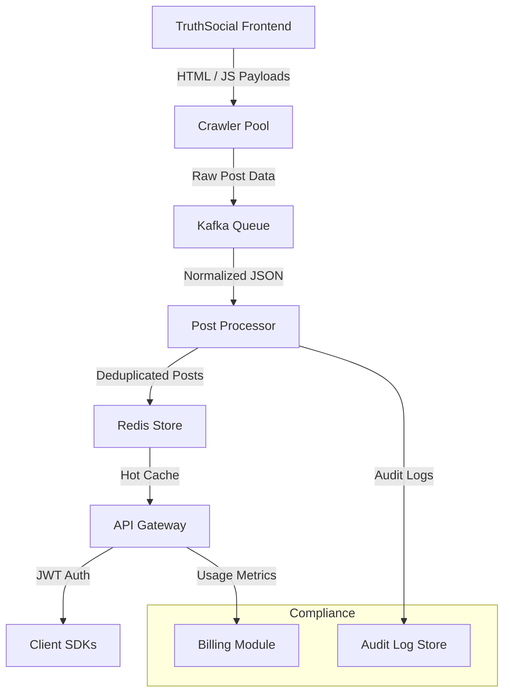

# More than 10 firms pay up to $100k a month for access to Truth Social posts

## Introduction

A handful of hedge funds, political consultancies, and media intelligence firms are paying up to $100,000 a month—not for premium data center hardware, but for raw access to Truth Social posts. That's not just expensive. It's a signal flare.

What started as a niche social network for conservative voices has become a goldmine of real-time sentiment, political chatter, and breaking news. And behind every dollar spent on that data is a stack of code—written in Go, Python, Rust, and Node—that has to scrape, normalize, and serve those posts at scale while staying compliant with privacy laws and platform rate limits.

This isn't academic. It's happening now. And if you're building anything that touches public social data—even indirectly—you need to understand how these systems work, where they break, and how to build one that doesn't.

## Why This Matters

Social data pipelines are no longer the domain of data scientists buried in Jupyter notebooks. They're core infrastructure. Hedge funds use them to predict market moves after political announcements. Crisis response teams monitor them during disasters. Brand managers track reputation in real time.

But Truth Social is different from Twitter or Reddit. It has no official public API. No streaming endpoints. No rate-limit headers you can trust. Everything has to be reverse-engineered, polled, and hardened against sudden changes.

That makes it a perfect case study in building resilient, language-agnostic ingestion layers. Whether you're writing a Go microservice or a Python ETL job, the same architectural problems show up: how do you handle flaky sources? How do you deduplicate without missing posts? And how do you bill customers fairly when your input stream is unpredictable?

## How It Works

Here's the architecture used by most commercial-grade Truth Social scrapers:



Step-by-step:

1. **Crawlers** run headless browsers or direct HTTP requests to pull user timelines, hashtag pages, and search results. Each crawler instance is isolated, containerized, and monitored.
2. **Kafka** buffers everything. Even if downstream services crash, no posts are lost.
3. **Processors** parse HTML, extract metadata, strip tracking pixels, and generate content fingerprints.
4. **Redis** caches hot posts for sub-10ms retrieval. TTL-based eviction keeps memory bounded.
5. **API Gateway** serves normalized JSON over HTTPS. Clients authenticate via JWT tokens issued by an OAuth2-compatible auth server.
6. **Billing** tracks API calls per client, applies tiered pricing, and generates invoices via webhook integrations.

Every component must be idempotent. Every request must be auditable. And every failure mode must degrade gracefully.

## Core Concepts

Before diving into code, let's define the key abstractions:

- **Fingerprint**: A SHA-256 hash of the normalized post payload. Used for deduplication across crawlers.
- **Shard Key**: Typically `user_id` or `post_id`. Determines which Redis node stores the post.
- **Rate Limit Budget**: Token bucket per client. Refilled at a fixed rate, drained per request.
- **Compliance Window**: Configurable delay before exposing sensitive posts (e.g., political content during election periods).
- **Audit Trail**: Immutable append-only log of all access events, stored in S3 with checksum verification.

These aren't optional. In regulated environments, skipping any of them is a compliance violation waiting to happen.

## Examples & Code Walkthrough

Let’s look at a minimal Go client that fetches posts from a hypothetical internal proxy API. This is the kind of thing you’d see in a production SDK.

```go
package truthsdk

import (
    "context"
    "crypto/hmac"
    "crypto/sha256"
    "encoding/hex"
    "fmt"
    "net/http"
    "net/url"
    "time"
)

// Client is the entry point for interacting with the Truth Social proxy API.
type Client struct {
    BaseURL    string
    APIKey     string
    HTTPClient *http.Client
}

// NewClient initializes a new client with secure defaults.
func NewClient(baseURL, apiKey string) *Client {
    return &Client{
        BaseURL:    baseURL,
        APIKey:     apiKey,
        HTTPClient: &http.Client{Timeout: 10 * time.Second},
    }
}

// signRequest generates an HMAC-SHA256 signature for the given path and timestamp.
func (c *Client) signRequest(path, timestamp string) string {
    mac := hmac.New(sha256.New, []byte(c.APIKey))
    mac.Write([]byte(path + timestamp))
    return hex.EncodeToString(mac.Sum(nil))
}

// GetPost retrieves a single post by its unique identifier.
func (c *Client) GetPost(ctx context.Context, postID string) (*Post, error) {
    timestamp := fmt.Sprintf("%d", time.Now().Unix())
    path := fmt.Sprintf("/api/v1/posts/%s", url.PathEscape(postID))
    
    req, err := http.NewRequestWithContext(ctx, "GET", c.BaseURL+path, nil)
    if err != nil {
        return nil, fmt.Errorf("failed to create request: %w", err)
    }

    signature := c.signRequest(path, timestamp)
    req.Header.Set("X-Timestamp", timestamp)
    req.Header.Set("X-Signature", signature)

    resp, err := c.HTTPClient.Do(req)
    if err != nil {
        return nil, fmt.Errorf("request failed: %w", err)
    }
    defer resp.Body.Close()

    if resp.StatusCode != http.StatusOK {
        return nil, fmt.Errorf("unexpected status code: %d", resp.StatusCode)
    }

    var post Post
    if err := json.NewDecoder(resp.Body).Decode(&post); err != nil {
        return nil, fmt.Errorf("failed to decode response: %w", err)
    }

    return &post, nil
}

// Post represents a normalized Truth Social post.
type Post struct {
    ID        string    `json:"id"`
    Author    string    `json:"author"`
    Content   string    `json:"content"`
    Timestamp time.Time `json:"timestamp"`
    Tags      []string  `json:"tags"`
}
```

Key design decisions:

- **HMAC signing** prevents replay attacks and ensures only authorized clients can query the API.
- **Context-aware timeouts** prevent hanging goroutines in high-throughput scenarios.
- **Structured logging** (not shown here) includes correlation IDs for tracing requests end-to-end.

In production, you’d also add retry logic with exponential backoff, circuit breakers, and Prometheus metrics around request duration and error rates.

## Best Practices

Drawing from years of operating these pipelines:

1. **Always validate input early.** Malformed posts can crash parsers. Reject them immediately.
2. **Use connection pooling aggressively.** Reusing TCP connections saves milliseconds per request.
3. **Implement soft limits, not hard caps.** Allow bursts within reason, but throttle abusers without breaking legitimate users.
4. **Encrypt everything at rest.** Even cached posts should be encrypted in Redis if they contain PII.
5. **Version your schemas.** Breaking changes in post structure will break clients unless you plan ahead.

## Common Mistakes & Anti-Patterns

Engineers routinely trip over these issues:

1. **Ignoring rate limits until it’s too late.** Platforms change their policies overnight. Always assume you’ll get throttled.
2. **Treating HTML scraping as stable.** The moment Truth Social updates its frontend, half your parsers stop working.
3. **Mixing business logic with ingestion.** Don’t parse sentiment inside your crawler. Keep concerns separated.
4. **Forgetting about deduplication.** Without fingerprints, you’ll bill customers twice for the same post.

## Performance Considerations

Latency matters more than throughput here. Most clients expect sub-100ms responses for cached posts. That means:

- Redis round-trips should stay under 1ms.
- Kafka lag should never exceed 5 seconds.
- API gateways should batch small payloads to reduce network overhead.

Memory usage scales linearly with active users and cached posts. Plan for 10x growth—you’ll hit it faster than you think.

CPU-wise, parsing HTML is expensive. Offload it to dedicated worker pools written in Rust or Cython for maximum performance.

## Real-World Usage

Companies like Dataminr and CrowdTangle have built entire businesses on similar social data pipelines. Palantir uses comparable architectures internally for government contracts involving open-source intelligence.

Startups like HedgeSniper and PoliticoPro offer SaaS products powered by Truth Social data. Their tech stacks? Mostly Go microservices talking to Kafka, Redis, and PostgreSQL clusters.

The pattern repeats: scrape → normalize → store → expose → monetize.

## Frequently Asked Questions (FAQ)

**Q: Is scraping Truth Social legal?**  
A: It depends on jurisdiction and intent. Always consult legal counsel. Public posts are generally fair game, but Terms of Service violations may lead to IP bans.

**Q: What languages work best for this?**  
A: Go for high-concurrency ingestion, Python for analytics glue, Rust for low-latency parsing, Node.js for quick prototyping.

**Q: How much infrastructure do you actually need?**  
A: For 100K posts/day: 2–3 crawler nodes, 1 Kafka broker, 1 Redis cluster, 1 API gateway. Scale horizontally as volume grows.

**Q: Can I self-host this?**  
A: Yes, but expect ongoing maintenance costs. Managed alternatives like AWS Lambda + API Gateway simplify deployment but increase per-request cost.

## Conclusion

The Truth Social data economy is a microcosm of modern software engineering: distributed systems, compliance requirements, and language-specific optimizations all matter.

Whether you're building a $10K/month analytics tool or a $100K/month hedge fund feed, the same principles apply. Design for failure. Plan for regulation. And never underestimate the power of a well-placed cache.

Because in this world, speed kills—and so does compliance.
