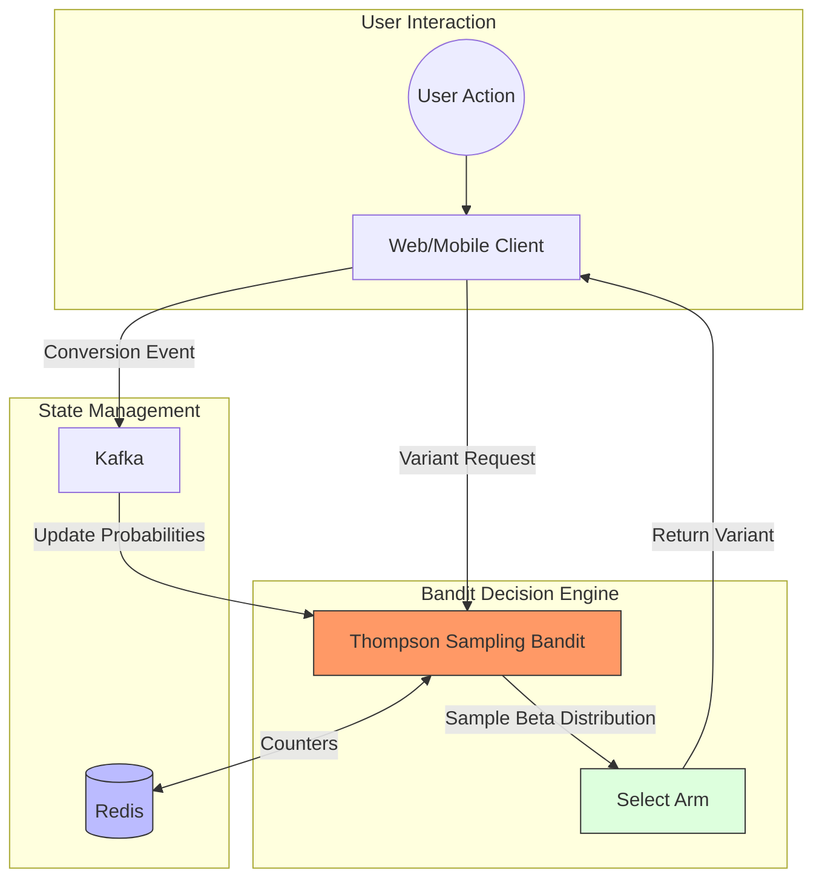

# Multi-Armed Bandit Testing: How It Works and When to Use  

## Introduction  
Imagine running an e-commerce platform where a new product recommendation algorithm is being tested. Traditional A/B testing might allocate 50% of users to the control group and 50% to the variant for weeks—only to realize half your traffic is on a underperforming version. What if you could dynamically shift traffic to the better performer *while* the test runs? That’s the promise of Multi-Armed Bandit (MAB) testing.  

This article isn’t another math-heavy lecture on probability distributions. Instead, we’ll focus on why MAB matters as an engineering trade-off tool. We’ll explore when to use it, how to implement it in production, and why it’s not just a "statistical curiosity" but a necessity for high-velocity systems.  

---

## Why This Matters  
Software engineers care about MAB because it solves a painfully common problem: **the tension between learning and shipping**. A/B testing is great for validating hypotheses with statistical significance, but it’s inherently slow. In fast-moving environments—like ad tech, recommendation engines, or pricing optimization—waiting for a p-value of 0.05 can mean losing millions in revenue.  

MAB flips this script. It treats testing as an optimization problem in real time. By balancing exploration (trying new options) and exploitation (using what works best), it minimizes "regret"—the lost opportunity cost of sticking with a suboptimal choice. For engineers building systems that must adapt quickly, MAB is a pragmatic solution to a real-world problem.  

---

## How It Works  
At its core, MAB is about making sequential decisions under uncertainty. Think of it as a slot machine where each "arm" represents a variant (e.g., a UI layout, ad copy, or pricing model). The goal isn’t to find a single "best" variant through brute-force testing but to maximize cumulative rewards over time.  

The magic happens in the **exploration-exploitation trade-off**. Here’s how it works in practice:  

1. **Exploration**: Randomly sample arms to gather data.  
2. **Exploitation**: Favor arms with proven high rewards.  
3. **Feedback Loop**: Update probabilities based on real-time outcomes.  

Unlike A/B testing, which treats arms as static, MAB continuously adjusts its strategy. This makes it ideal for systems where user behavior changes rapidly.  

### The Mermaid Workflow Diagram  


**Key Insight**: The diagram shows a real-time feedback loop. Every user action triggers a variant selection, which updates the bandit’s state immediately. This eliminates the lag of traditional A/B testing.  

---

## Core Concepts  
### The Exploration-Exploitation Dilemma  
Exploration and exploitation aren’t just buzzwords—they’re competing forces. Too much exploration wastes resources on poor performers. Too little exploitation misses opportunities to maximize rewards. MAB’s genius lies in its ability to dynamically adjust this balance.  

For example, a newsfeed algorithm might start by showing users a mix of content (exploration) but quickly favor trending posts once their engagement rates are proven (exploitation).  

### Thompson Sampling: The Production Standard  
While algorithms like ε-Greedy (random exploration) or UCB (confidence intervals) exist, **Thompson Sampling** is the gold standard for production. Here’s why:  

- **Bayesian Inference**: It models each arm’s reward as a probability distribution (e.g., Beta distribution for binary outcomes).  
- **Adaptive Learning**: Samples from these distributions to decide which arm to pull. Over time, high-performing arms get more samples.  
- **No Fixed Exploration Rate**: Unlike ε-Greedy, it automatically reduces exploration as confidence grows.  

This makes Thompson Sampling ideal for systems where data is sparse or changing.  

---

## Examples & Code Walkthrough  
Let’s build a minimal Thompson Sampling engine in Python. This code is designed for clarity and extensibility, not theoretical perfection.  

```python
import numpy as np
from scipy.stats import beta

class Arm:
    def __init__(self):
        self.successes = 0
        self.failures = 0

    def pull(self):
        # Sample from Beta distribution (α=successes+1, β=failures+1)
        return beta.rvs(self.successes + 1, self.failures + 1)

class BanditController:
    def __init__(self, num_arms):
        self.arms = [Arm() for _ in range(num_arms)]

    def choose_arm(self):
        # Sample from each arm's distribution and pick the highest
        samples = [arm.pull() for arm in self.arms]
        return np.argmax(samples)

    def update(self, chosen_arm, reward):
        if reward:  # 1 for success, 0 for failure
            self.arms[chosen_arm].successes += 1
        else:
            self.arms[chosen_arm].failures += 1
```

**How It Works in Production**:  
1. Each `Arm` tracks successes/failures.  
2. `choose_arm()` uses Thompson Sampling to select an arm based on posterior distributions.  
3. `update()` adjusts counters based on real-time feedback (e.g., a user click or conversion).  

This code runs in a distributed system, with state stored in Redis for scalability.  

---

## Best Practices  
1. **Start Small**: Begin with 2-3 arms to avoid combinatorial explosion.  
2. **Warm-Up Period**: Allow initial exploration before heavy exploitation.  
3. **Monitor Regret**: Track cumulative regret to ensure the bandit isn’t stuck in a local optimum.  
4. **Use Distributed State**: Leverage Redis or similar for shared state across services.  

---

## Common Mistakes & Anti-Patterns  
- **Ignoring Cold Starts**: New arms need extra exploration. Failing to account for this biases results.  
- **Over-Optimization**: Excessive exploitation can lead to "regret spikes" if user behavior shifts.  
- **No Fallback**: Always have a baseline arm (e.g., control group) to compare against.  

---

## Performance Considerations  
- **Latency**: Redis calls add overhead. Use caching or batch updates if possible.  
- **Scalability**: Thompson Sampling is O(n) per request, where n is the number of arms. Keep arms limited.  
- **Cold Data**: Avoid long-running bands without fresh data—stale distributions degrade performance.  

---

## Real-World Usage  
Netflix uses MAB for content recommendations, dynamically shifting users to trending shows. Uber employs it for surge pricing optimization, balancing driver availability and rider demand. Even small e-commerce sites use MAB to test product placement or email subject lines.  

---

## Frequently Asked Questions (FAQ)  
**Q: When should I use MAB over A/B testing?**  
A: Use MAB for short-term, high-velocity decisions (e.g., ad placements, UI tweaks). Use A/B for long-term structural changes (e.g., pricing models).  

**Q: How do I handle multiple bands (e.g., multiple variants)?**  
A: Extend the algorithm to sample from all arms’ distributions. Complexity grows linearly with arms.  

**Q: What if my data is noisy?**  
A: Thompson Sampling naturally handles noise by averaging over distributions. UCB may overreact to outliers.  

---

## Conclusion  
Multi-Armed Bandit testing isn’t a silver bullet—it’s a tool for engineers who need to act fast without sacrificing learning. By embracing the exploration-exploitation trade-off, MAB turns testing into a dynamic optimization engine. For systems where regret minimization matters more than statistical certainty, MAB is the pragmatic choice.  

The next time you design an experiment, ask yourself: *Can I afford to wait?* If the answer is no, MAB might be your best bet.
