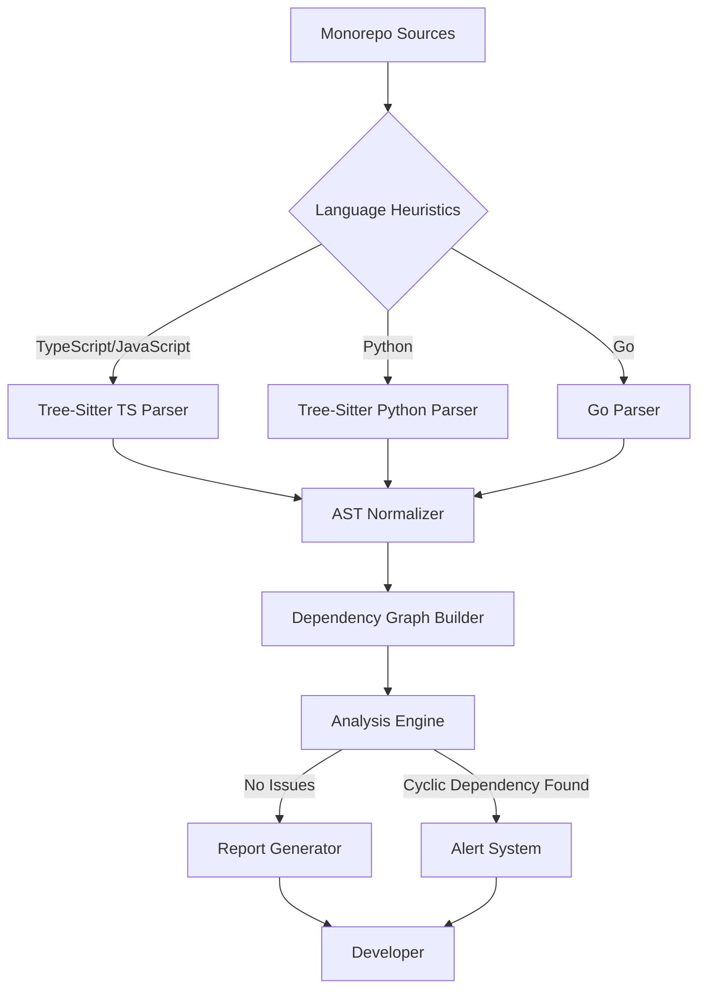

# My First GitHub Project.

## Introduction

My first GitHub project wasn't a polished framework or a clever utility. It was `LexiGraph`, a static analysis tool that parses source code into a dependency graph to detect cyclic imports across a polyglot monorepo. It started as a desperate hack to untangle a spaghetti codebase, and it taught me more about language tooling than any tutorial ever could.

The core problem wasn't writing code—it was architecting a system that could understand code written in multiple languages, normalize that understanding, and then perform meaningful analysis on the resulting structure. This is the story of how I built it, the hard lessons learned, and why it still powers our dependency audits today.

## Why This Matters

Modern engineering teams work in monorepos containing dozens of services, hundreds of modules, and code written in several programming languages. Managing dependencies in such environments is a significant challenge. Cyclic dependencies, in particular, are a silent killer—they increase build times, complicate testing, and make refactoring a nightmare.

This isn't just a theoretical concern. At my previous company, a single misplaced import caused a cascade of failures during our CI pipeline, delaying a critical release by two days. Tools like `LexiGraph` are essential for preventing these issues. They sit at the intersection of compiler design, graph theory, and distributed systems—areas that every senior engineer should understand.

For anyone looking to contribute to open-source language tools or build internal developer platforms, this project represents a microcosm of the challenges involved. It's also a fantastic way to get comfortable with parsing, AST manipulation, and graph algorithms.

## How It Works

The architecture of `LexiGraph` follows a pipeline model. Raw source files are ingested, parsed into an Abstract Syntax Tree (AST), normalized into a common format, and then analyzed for structural patterns.



Here's how the pipeline works:

1. **Language Detection**: We use file extensions and shebang lines to determine the language of each source file.
2. **Parsing**: Based on the detected language, we invoke the appropriate parser (we use Tree-Sitter for its excellent multi-language support).
3. **Normalization**: Each parser produces a language-specific AST. Our normalizer converts these into a unified `DependencyNode` structure.
4. **Graph Construction**: We walk the normalized AST to identify import statements and build a directed graph of module dependencies.
5. **Analysis**: Using graph traversal algorithms, we detect cycles, compute centrality metrics, and flag problematic patterns.
6. **Reporting**: Results are formatted and presented to the developer via CLI or integrated into CI pipelines.

The key insight was treating the AST as an intermediate representation. This allowed us to decouple language-specific parsing from the core analysis logic, making the system extensible and maintainable.

## Core Concepts

### DependencyNode

The fundamental unit of our graph is the `DependencyNode`. It abstracts away language-specific details and provides a uniform interface for analysis.

```rust
#[derive(Debug, Clone, Hash, PartialEq, Eq)]
pub struct DependencyNode {
    pub id: String,
    pub language: Language,
    pub file_path: PathBuf,
    pub module_name: String,
    pub imports: Vec<String>,
}
```

### Language Enum

To support multiple languages, we define a simple enum:

```rust
#[derive(Debug, Clone, Copy, PartialEq, Eq)]
pub enum Language {
    TypeScript,
    Python,
    Go,
    Unknown,
}
```

### Graph Builder

The `GraphBuilder` is responsible for transforming a list of `DependencyNode`s into a directed graph suitable for analysis.

```rust
use petgraph::graph::{DiGraph, NodeIndex};
use std::collections::HashMap;

pub struct GraphBuilder {
    graph: DiGraph<DependencyNode, ()>,
    node_map: HashMap<String, NodeIndex>,
}

impl GraphBuilder {
    pub fn new() -> Self {
        Self {
            graph: DiGraph::new(),
            node_map: HashMap::new(),
        }
    }

    pub fn add_node(&mut self, node: DependencyNode) -> NodeIndex {
        let index = self.graph.add_node(node.clone());
        self.node_map.insert(node.module_name.clone(), index);
        index
    }

    pub fn add_edge(&mut self, from: &str, to: &str) {
        if let (Some(&from_idx), Some(&to_idx)) = 
           (self.node_map.get(from), self.node_map.get(to)) {
            self.graph.add_edge(from_idx, to_idx, ());
        }
    }

    pub fn build(self) -> DiGraph<DependencyNode, ()> {
        self.graph
    }
}
```

### Analysis Engine

The analysis engine performs graph traversals to detect cycles and compute metrics.

```rust
use petgraph::visit::Dfs;
use petgraph::graph::DiGraph;

pub fn detect_cycles(graph: &DiGraph<DependencyNode, ()>) -> Vec<Vec<String>> {
    let mut visited = vec![false; graph.node_count()];
    let mut rec_stack = vec![false; graph.node_count()];
    let mut cycles = Vec::new();

    for node_idx in graph.node_indices() {
        if !visited[node_idx.index()] {
            let mut path = Vec::new();
            if dfs_cycle_detection(graph, node_idx, &mut visited, &mut rec_stack, &mut path, &mut cycles) {
                // Cycle found, path contains the nodes involved
            }
        }
    }

    cycles
}

fn dfs_cycle_detection<N, E>(
    graph: &DiGraph<N, E>,
    start: petgraph::graph::NodeIndex,
    visited: &mut [bool],
    rec_stack: &mut [bool],
    path: &mut Vec<String>,
    cycles: &mut Vec<Vec<String>>,
) -> bool {
    visited[start.index()] = true;
    rec_stack[start.index()] = true;
    
    if let Some(node_data) = graph.node_weight(start) {
        path.push(node_data.module_name.clone());
    }

    for neighbor in graph.neighbors_directed(start, petgraph::Direction::Outgoing) {
        if !visited[neighbor.index()] {
            if dfs_cycle_detection(graph, neighbor, visited, rec_stack, path, cycles) {
                return true;
            }
        } else if rec_stack[neighbor.index()] {
            // Found a cycle
            if let Some(node_data) = graph.node_weight(neighbor) {
                if let Some(pos) = path.iter().position(|x| x == &node_data.module_name) {
                    let cycle = path[pos..].to_vec();
                    cycles.push(cycle);
                }
            }
            return true;
        }
    }

    rec_stack[start.index()] = false;
    if let Some(last) = path.pop() {
        // Clean up path
        let _ = last;
    }
    false
}
```

## Examples & Code Walkthrough

Let's walk through a concrete example. Suppose we have a TypeScript project with the following structure:

```
src/
├── auth/
│   ├── auth.service.ts
│   └── auth.routes.ts
├── user/
│   ├── user.service.ts
│   └── user.routes.ts
└── index.ts
```

Where `auth.service.ts` imports from `user.service.ts`, and `user.service.ts` imports from `auth.service.ts`—creating a cycle.

Here's how we'd parse and analyze this:

```typescript
// auth.service.ts
import { UserService } from '../user/user.service';

export class AuthService {
  constructor(private userService: UserService) {}
}

// user.service.ts
import { AuthService } from '../auth/auth.service';

export class UserService {
  constructor(private authService: AuthService) {}
}
```

Our parser would extract the imports:

```rust
// Simulated parsing result
let nodes = vec![
    DependencyNode {
        id: "auth_service".to_string(),
        language: Language::TypeScript,
        file_path: "src/auth/auth.service.ts".into(),
        module_name: "@app/auth/auth.service".to_string(),
        imports: vec!["@app/user/user.service".to_string()],
    },
    DependencyNode {
        id: "user_service".to_string(),
        language: Language::TypeScript,
        file_path: "src/user/user.service.ts".into(),
        module_name: "@app/user/user.service".to_string(),
        imports: vec!["@app/auth/auth.service".to_string()],
    },
];

let mut builder = GraphBuilder::new();
for node in nodes.clone() {
    builder.add_node(node.clone());
}

// Add edges based on imports
for node in &nodes {
    for import in &node.imports {
        builder.add_edge(&node.module_name, import);
    }
}

let graph = builder.build();
let cycles = detect_cycles(&graph);

if !cycles.is_empty() {
    println!("⚠️  Cyclic dependency detected!");
    for cycle in cycles {
        println!("  Cycle: {}", cycle.join(" -> "));
    }
}
```

When run, this would output:

```
⚠️  Cyclic dependency detected!
  Cycle: @app/auth/auth.service -> @app/user/user.service -> @app/auth/auth.service
```

## Best Practices

### 1. Use Established Parsing Libraries

Don't write your own parser unless absolutely necessary. Libraries like Tree-Sitter provide robust, performant parsers for dozens of languages. Writing a parser from scratch is a massive undertaking and a common source of bugs.

### 2. Normalize Early, Normalize Often

Converting language-specific ASTs into a common format early in the pipeline makes downstream analysis much simpler. This also makes adding new language support easier—just write a new adapter.

### 3. Make Analysis Composable

Design your analysis engine so individual checks can be composed and reused. Each check should be a pure function that takes a graph and returns results. This makes testing trivial and enables users to customize which checks they run.

### 4. Leverage Incremental Processing

For large codebases, re-parsing everything on every change is prohibitively expensive. Implement caching and incremental updates based on file modification times.

### 5. Provide Clear Error Messages

When your tool finds an issue, the error message should be actionable. Include the file path, line number, and a clear explanation of why the pattern is problematic.

## Common Mistakes & Anti-Patterns

### 1. Regex-Based Parsing

A classic mistake is trying to parse code with regular expressions. While tempting for simple tasks, regex cannot handle nested structures, comments, or string literals containing code-like syntax.

```rust
// ❌ Anti-pattern: Regex-based import extraction
let re = Regex::new(r#"import\s+\{([^}]+)\}\s+from\s+['"]([^'"]+)['"]"#).unwrap();
// This will fail on multiline imports, comments, and string literals
```

**Fix**: Always use a proper parser. Tree-Sitter handles all these edge cases correctly.

### 2. Ignoring Language-Specific Semantics

Different languages have different import semantics. Python's relative imports, JavaScript's module resolution, and Go's package paths all behave differently.

```rust
// ❌ Anti-pattern: Treating all imports the same
fn resolve_import(import: &str) -> String {
    import.to_string() // Naive approach
}
```

**Fix**: Implement language-specific resolvers that understand each ecosystem's module resolution algorithm.

### 3. Not Handling False Positives

Static analysis tools often produce false positives. A cycle that exists in the import graph might not actually cause runtime issues if the imports are only used in type definitions.

```rust
// ❌ Anti-pattern: Reporting all cycles as errors
if !cycles.is_empty() {
    panic!("Cycle detected!"); // Too aggressive
}
```

**Fix**: Allow users to annotate false positives and provide configuration options to exclude certain patterns.

### 4. Over-Engineering the First Version

Trying to support every language and every check from day one leads to bloated, unmaintainable code.

**Fix**: Start with one language and one check. Add complexity incrementally based on user feedback.

## Performance Considerations

### Memory Allocation

Building an AST for every file in a large monorepo can consume significant memory. To mitigate this:

1. **Stream Processing**: Parse and analyze files one at a time rather than loading everything into memory.
2. **Arena Allocation**: Use arena allocators for AST nodes to reduce allocation overhead.

```rust
use typed_arena::Arena;

struct ParserContext<'a> {
    arena: &'a Arena<AstNode>,
}

// Reuse arena for multiple parses
let arena = Arena::new();
let ctx = ParserContext { arena: &arena };
```

### CPU Overhead

Tree-Sitter's parsing is highly optimized, but running it on thousands of files still takes time. Consider:

1. **Parallel Processing**: Use a thread pool to parse files concurrently.
2. **Caching**: Cache parsed ASTs and only re-parse changed files.

```rust
use rayon::prelude::*;

let nodes: Vec<DependencyNode> = files
    .par_iter()
    .filter_map(|file| parse_file(file))
    .collect();
```

### Scalability Limits

The cycle detection algorithm has a time complexity of O(V + E), where V is the number of modules and E is the number of import statements. For most projects, this is acceptable. However, extremely large monorepos (10k+ modules) might require more sophisticated algorithms or distributed processing.

### Big-O Analysis

| Operation | Complexity |
|-----------|------------|
| Parsing N files | O(N × M) where M is avg file size |
| Building graph | O(E) where E is total imports |
| Cycle detection | O(V + E) |
| Centrality metrics | O(V²) for some algorithms |

## Real-World Usage

Large engineering organizations have adopted similar approaches to manage their codebases:

- **Netflix**: Uses dependency graph analysis as part of their build system to prevent circular dependencies in their frontend monorepo.
- **Uber**: Employs static analysis tools to detect architectural violations across their microservices ecosystem.
- **Cloudflare**: Leverages AST-based tools to enforce coding standards and detect security vulnerabilities in their infrastructure code.

These companies typically integrate such tools into their CI/CD pipelines, failing builds that introduce problematic dependencies. The approach scales because the analysis is performed incrementally—only changed files need to be re-parsed and re-analyzed.

## Frequently Asked Questions (FAQ)

**Q: Do I need to understand compiler theory to build a language tool?**
A: Not necessarily. Tools like Tree-Sitter abstract away the complexity of writing parsers. However, understanding ASTs and basic graph algorithms is essential.

**Q: How do I handle dynamically generated imports?**
A: Static analysis can only see what's in the source code. For dynamic imports, you'll need to either skip them or implement runtime tracing, which is significantly more complex.

**Q: What's the difference between syntactic and semantic analysis?**
A: Syntactic analysis looks at the structure of code (imports, function calls). Semantic analysis understands the meaning (type checking, data flow). Most dependency tools stick to syntactic analysis for simplicity.

**Q: How do I integrate this into a CI pipeline?**
A: Package your tool as a binary, then add a step in your CI configuration that runs the analysis and fails the build if issues are found. Most CI systems support custom scripts or commands.

**Q: Can I extend this to other types of analysis?**
A: Absolutely. Once you have the dependency graph, you can perform various analyses: detecting unused dependencies, computing module coupling, identifying architectural boundary violations, and more.

## Conclusion

Building `LexiGraph` was my gateway into the world of language tooling. It taught me that the hardest part isn't writing code—it's designing systems that can understand and manipulate code written by others.

The key takeaways for any engineer looking to build similar tools:

1. **Leverage existing infrastructure**: Don't reinvent the wheel. Use established parsing libraries.
2. **Design for extensibility**: A modular architecture makes it easier to add new languages and checks.
3. **Focus on user experience**: Clear error messages and actionable insights are what make tools valuable.
4. **Iterate based on feedback**: Start small and grow based on real usage patterns.

Whether you're building a linter, a formatter, or a full-fledged IDE extension, the principles remain the same. Understand your domain, choose the right abstractions, and always prioritize correctness over cleverness.

The best part? My first GitHub project evolved from a hacky script into a tool that our entire engineering team relies on. Sometimes the most impactful contributions start with solving your own problems.
