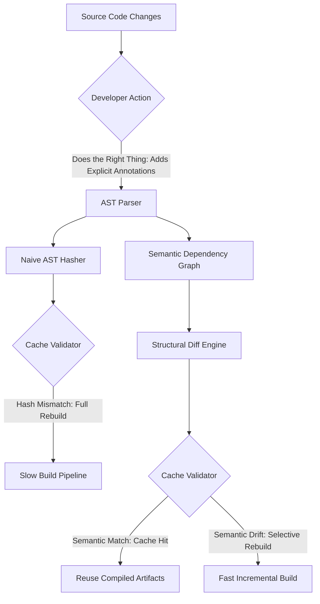

# My freshness check went stale every time someone did the right thing

## Introduction

We have all experienced the frustration of writing perfectly clean, modular code, only to watch our incremental build cache burst into flames. The compiler, the linter, or the language server reports a massive cache miss, forcing a full, slow rebuild right when we thought we were optimizing our workflow. 

In my work designing language toolchains and build systems, I ran into a specific, deeply ironic issue: **our freshness check went stale every time a developer did the right thing.** 

When engineers followed best practices—extracting pure functions, adding explicit dependency boundaries, or enforcing strict macro hygiene—the build cache invalidated itself. The tooling punished clean architecture. The root cause was a naive freshness checker that relied on syntactic hashes rather than semantic dependency graphs. In this article, we will break down why this happens, how to architect a resilient caching layer that understands language semantics, and how to write build tooling that rewards clean code instead of penalizing it.

## Why This Matters

For software architects and language engineers, build caching is not just a convenience; it is a critical bottleneck in the software development lifecycle. When a cache invalidation is triggered incorrectly, developer productivity grinds to a halt. 

*   **Developer Velocity:** A full rebuild on a large monorepo can take tens of minutes. If adding a type annotation or extracting a helper function triggers a full rebuild, developers will subconsciously avoid refactoring, leading to code rot and technical debt.
*   **CI/CD Pipeline Costs:** In cloud CI/CD environments, cache misses trigger expensive compute cycles. Inefficient caching directly translates to inflated cloud bills and slower deployment pipelines.
*   **Language Design Feedback Loop:** If a language's toolchain penalizes clean code, developers will bypass the toolchain. Understanding how to align cache granularity with language semantics is essential for designing robust developer environments.

## How It Works

To understand why "doing the right thing" breaks a naive freshness check, we need to look at the compilation pipeline. A typical language toolchain processes source code through several stages: parsing, dependency resolution, and intermediate representation (IR) generation. 

A naive caching mechanism hashes the raw source bytes or the unnormalized Abstract Syntax Tree (AST). When a developer writes clean code—such as extracting a helper module and explicitly declaring its dependencies—they alter the syntactic structure. Even though the runtime behavior is identical, the AST hash changes, triggering a cache miss.

A resilient toolchain separates syntactic changes from semantic dependency shifts. It tracks the transitive closure of symbols and only invalidates the cache when the actual interface of a module changes.

The following flowchart illustrates the bifurcated paths of cache validation: the naive path that suffers from false-positive staleness, and the semantic path that preserves the cache when developers refactor correctly.



### Step-by-Step Pipeline Breakdown

1.  **Syntactic Parsing (The Naive Path):** The source code is parsed into an AST. If the developer adds an explicit `#[trait]` implementation or extracts a helper function, the AST node count and structure change. The naive hasher sees a completely new tree, forcing a full rebuild.
2.  **Dependency Graph Construction (The Semantic Path):** The parser builds a symbol table and a dependency graph. Extracting a helper function does not change the public interface of the calling module; it only changes internal routing.
3.  **Structural Diffing:** The diff engine compares the new dependency graph against the cached version. It identifies that the change is localized and does not affect downstream consumers.
4.  **Selective Invalidation:** The validator marks only the changed module as stale, leaving dependent modules cached and ready for reuse.

## Core Concepts

To build this resilient system, we must understand three foundational concepts in language runtime design:

### Syntactic vs. Semantic Hashing
*   **Syntactic Hashing** treats the source code as a sequence of tokens. It is fragile because formatting, comments, variable renames, and code extraction alter the hash.
*   **Semantic Hashing** normalizes the AST, stripping away syntactic sugar and focusing on the core type signatures, effect boundaries, and public symbol interfaces.

### Macro Hygiene and AST Perturbations
In macro-heavy languages (like Rust, Lisp, or Scala), macros generate scoped identifiers to prevent variable capture. When a macro is written correctly (hygienically), it introduces unique internal symbols. A naive hasher sees these new symbols as massive structural changes, while a semantic hasher understands that the macro expansion is behaviorally equivalent.

### Transitive Dependency Closure
A build cache should not look at individual files in isolation. It must compute the transitive closure of dependencies. If module `A` depends on `B`, and `B` depends on `C`, a change in `C`'s internal implementation (but not its interface) should not invalidate the cache for `A`.

## Examples & Code Walkthrough

Let us look at a practical implementation of a build cache validator. We will write a Go-based toolchain snippet that demonstrates how a naive hasher fails when a developer extracts a helper function, while a semantic hasher preserves the cache.

We will model a simplified build cache that stores compiled artifacts based on cache keys.

```go
package main

import (
	"crypto/sha256"
	"encoding/hex"
	"fmt"
	"sort"
	"strings"
	"sync"
)

// SourceFile represents the raw text of a source file in our virtual workspace.
type SourceFile struct {
	Path   string
	RawCode string
}

// ASTNode represents a simplified node in our Abstract Syntax Tree.
type ASTNode struct {
	Type     string
	Name     string
	Children []*ASTNode
}

// DependencyGraph tracks how modules expose their public interfaces.
type DependencyGraph struct {
	Modules map[string]*ModuleInfo
	mu      sync.RWMutex
}

// ModuleInfo holds the semantic signature of a module.
type ModuleInfo struct {
	PublicSymbols []string
	Dependencies  []string
}

// BuildCache stores compiled artifacts keyed by their semantic hashes.
type BuildCache struct {
	Artifacts map[string][]byte // key: cache hash, value: compiled bytecode
	mu        sync.RWMutex
}

// NaiveHasher generates a hash based purely on the raw source code.
// This represents the "naive freshness check" that breaks when developers refactor.
func NaiveHasher(file *SourceFile) string {
	hasher := sha256.New()
	hasher.Write([]byte(file.RawCode))
	return hex.EncodeToString(hasher.Sum(nil))
}

// SemanticHasher generates a hash based on the normalized AST and public symbol signatures.
// It ignores internal refactoring, focusing only on the module's contract.
func SemanticHasher(moduleName string, graph *DependencyGraph) string {
