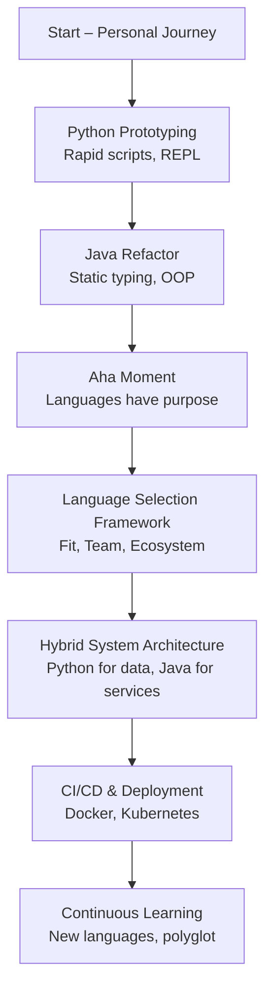

# My Life as a Dev III - (From Python to Java , And the Moment I Realized Languages Have a Purpose)

## Introduction
In 2015 I wrote my first line of code to clean a messy CSV log. The script was just a few lines, but it showed me how a language can feel like an extension of thought. Python’s dynamic nature let me iterate quickly, and the REPL made experimentation feel natural. Years later, a production requirement for strong static typing and reliable deployment pushed me toward Java, and that shift sparked the realization that each language is built for a specific purpose.

## Why This Matters
Engineers often lock into a single language because it feels comfortable, yet production systems span many domains. Choosing the wrong tool can cause performance bottlenecks, hard‑to‑maintain code, or deployment friction. Understanding the intent behind each language helps teams allocate effort where it matters most and avoid costly rewrites.

## How It Works
Languages are designed with particular problem spaces, runtime characteristics, and team dynamics in mind. When a project demands rapid prototyping, a dynamic language shines; when it needs heavy concurrency, strong contracts, or low‑latency throughput, a statically typed language may be more appropriate. The “aha” moment arrived while reading a paper on language design that emphasized fit over fashion. The diagram below captures the mental model I built.



The flow shows how a project can start with a lightweight script, evolve into a robust service, and finally be assembled from multiple language‑specific components.

## Core Concepts
- **Typing model** – Dynamic vs. static typing influences runtime flexibility and compile‑time safety.  
- **Runtime characteristics** – Interpreted vs. JIT‑compiled affect latency, memory use, and CPU efficiency.  
- **Ecosystem maturity** – Libraries, package managers, and community support dictate how quickly you can solve problems.  
- **Team expertise** – Leveraging existing skill sets reduces onboarding time and error rates.  
- **Deployment model** – Containers, serverless functions, or traditional JVM containers each have distinct language expectations.

## Examples & Code Walkthrough

### Python log‑summary script
```python
def summarize_log(path):
    """Read a log file, count total lines and lines containing ERROR."""
    total = 0
    errors = 0
    try:
        with open(path, "r", encoding="utf-8") as f:
            for line in f:
                if "ERROR" in line:
                    errors += 1
                total += 1
    except FileNotFoundError:
        print(f"File not found: {path}")
        return None, None
    except OSError as e:
        print(f"Unable to read {path}: {e}")
        return None, None
    return total, errors

if __name__ == "__main__":
    total, errors = summarize_log("app.log")
    if total is not None:
        print(f"{total},{errors}")
```
The function isolates file handling, returns `None` on failure, and prints a simple CSV‑style result.

### Java log‑summary class
```java
import java.io.IOException;
import java.nio.file.*;
import java.util.stream.Stream;

public class LogSummary {
    public static void main(String[] args) throws IOException {
        if (args.length == 0) {
            System.err.println("Usage: java LogSummary <path>");
            System.exit(1);
        }
        Path path = Paths.get(args[0]);
        long total = 0;
        long errors = 0;
        try (Stream<String> lines = Files.lines(path)) {
            lines.forEach(line -> {
                if (line.contains("ERROR")) errors++;
                total++;
            });
        }
        System.out.println(total + "," + errors);
    }
}
```
Streams provide a declarative way to process each line while keeping the code concise.

### Interop: calling Python from Java
```java
ProcessBuilder pb = new ProcessBuilder("python", "summarize.py", "app.log");
pb.redirectError(ProcessBuilder.Redirect.PIPE);
Process proc = pb.start();
try (BufferedReader br = new BufferedReader(new InputStreamReader(proc.getInputStream()))) {
    String line = br.readLine(); // "1234,56"
    if (line != null) {
        String[] parts = line.split(",");
        long total = Long.parseLong(parts[0]);
        long errors = Long.parseLong(parts[1]);
        // use total and errors in further logic
    }
}
proc.waitFor();
```
The Java side launches the Python script, captures its stdout, and parses the result for downstream processing.

## Best Practices
1. **Match language to domain** – Use Python for data wrangling, Java for high‑throughput services.  
2. **Version API contracts** – When languages communicate, treat the interface as a stable contract; use semantic versioning.  
3. **Automate contract tests** – Write tests that verify data exchanged between language boundaries.  
4. **Keep interop boundaries explicit** – Encapsulate process calls or serialization logic; avoid scattering raw string parsing throughout the codebase.  
5. **Profile runtime costs** – Even a “simple” script can become a hotspot when run at scale; measure memory and CPU usage early.

## Common Mistakes & Anti-Patterns
1. **Forcing static typing on quick prototypes** – Writing verbose Java classes for a one‑off script adds unnecessary complexity. Use Python or another dynamic language for exploratory work.  
2. **Ignoring language‑specific performance limits** – Relying on a dynamic language for CPU‑intensive loops can cause latency spikes; profile and consider a compiled alternative.  
3. **Tight coupling across language boundaries** – Directly embedding Python objects in Java objects leads to fragile code; instead, use well‑defined messages or files.  
4. **Neglecting concurrency models** – Using a single‑threaded Python script in a high‑concurrency service can become a bottleneck; adopt async I/O or move the work to a threaded Java component.

Fixes involve selecting the right tool first, defining clear contracts, and isolating language‑specific concerns behind thin adapters.

## Performance Considerations
- **Memory allocation** – Python objects carry overhead; repeated list growth can trigger many allocations. Java’s garbage collector is tuned for large heap sizes but may add pause times.  
- **CPU overhead** – Interpreted code incurs per‑instruction cost; JIT‑compiled Java often achieves near‑C speeds for hot loops.  
- **Network latency** – Interprocess communication (e.g., via `ProcessBuilder`) adds latency; batch results or use shared memory when possible.  
- **Big‑O complexity** – Algorithmic efficiency matters regardless of language; a poorly written O(n²) Python loop can outperform a tight O(n) Java implementation if the data size is modest.

Measure with tools like `cProfile` for Python and VisualVM or Java Flight Recorder for Java to identify real bottlenecks.

## Real-World Usage
- **Netflix** runs its recommendation engines in Java for low‑latency serving while using Python for data preprocessing pipelines.  
- **Uber** employs Go for request handling but delegates heavy data analysis to Python notebooks that feed into its service layer written in Java.  
- **Cloudflare** leverages Rust for edge performance but uses Python for configuration scripts and monitoring dashboards.  
These examples illustrate that large‑scale systems routinely combine languages to exploit each language’s strengths.

## Frequently Asked Questions (FAQ)

**Q1: Can I replace Java with Kotlin in existing services?**  
A: Kotlin runs on the JVM, so you can adopt it gradually. However, the core benefit comes from static typing and concise syntax, not from the language name itself. Evaluate whether the added expressiveness justifies the migration effort.

**Q2: Is it safe to call a Python script from a high‑traffic Java service?**  
A: Yes, if you isolate the call, limit its execution time, and handle errors robustly. Prefer lightweight processes over embedding interpreters, which can introduce memory leaks.

**Q3: How do I keep my CI pipelines fast when using multiple languages?**  
A: Cache dependencies, use language‑specific build tools (e.g., `pipenv` for Python, Gradle for Java), and parallelize independent jobs. Docker layers help reduce rebuild times.

**Q4: Should I always prefer one language for the whole stack?**  
A: No. A polyglot approach lets you select the best tool for each job, improving productivity and performance. The key is maintaining clear boundaries and automated tests across those boundaries.

## Conclusion
The journey from a few lines of Python to a full Java service taught me that languages are not interchangeable tools; they are purpose‑built solutions. By understanding each language’s design intent, matching it to the problem, and structuring interop carefully, teams can build systems that are both performant and maintainable. Audit your stack, ask “What purpose does this language serve?” and embrace a purposeful, multi‑language mindset.
