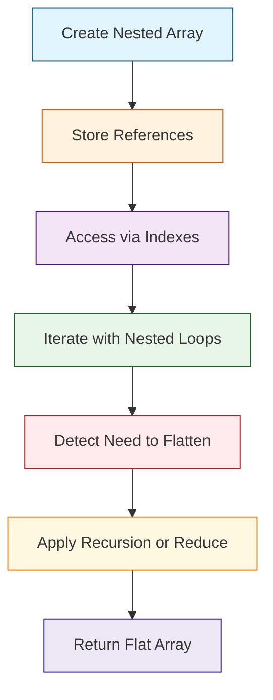

# Nested Arrays in JavaScript

## Introduction  
Our team frequently runs into situations where a single‑dimensional array cannot express the relationships we need. Whether we are modeling a spreadsheet, a hierarchical permission tree, or a geographic grid, nested arrays let us keep related data together while still leveraging JavaScript’s native iteration utilities. The pattern is simple, but the implications for memory, performance, and correctness are far‑reaching.

## Why This Matters  
In production we often store configuration matrices, cache multi‑dimensional lookup tables, or represent nested JSON payloads directly as arrays. When a downstream service expects a flat list, we must flatten those structures on the fly. Conversely, we need to reconstruct nested layouts from a linear buffer to reduce network payload size. Ignoring the nuances of nesting leads to subtle bugs, unexpected reference sharing, and performance regressions that surface under load.

## How It Works  
JavaScript treats an array as a reference type. A nested array is simply an array whose elements are themselves arrays (or other objects). Access, mutation, and iteration follow the same rules as any other array, but the nesting introduces a new level of indirection that must be managed deliberately.

The diagram below visualizes the flow from creation to iteration and flattening:



**Step‑by‑step breakdown**

1. **Creation** – We start with literal syntax `[[1,2],[3,4]]`. Internally each inner bracket creates a new `Array` object referenced from the outer array’s slot.  
2. **Reference storage** – The outer array holds *references* to the inner arrays, not copies. Mutating an inner array via `nested[0].push(99)` changes the same object that other variables may point to.  
3. **Access** – Index notation `nested[i][j]` resolves left‑to‑right. The first lookup returns an array; the second lookup operates on that array.  
4. **Iteration** – Nested `for` loops or `Array.prototype.forEach` are common. The outer loop iterates over rows, the inner loop over columns.  
5. **Flattening** – When a flat representation is required we can use recursion (`nested.flat(1)`) or a `reduce` that concatenates inner arrays. The flattening step must be aware of the depth to avoid accidentally flattening deeper objects.

## Core Concepts  
- **Array as object** – `Array.prototype` is inherited from `Object`. The `length` property is writable, and elements are stored as enumerable properties with integer keys.  
- **Reference semantics** – Two arrays that appear identical are distinct objects unless explicitly assigned (`const a = b = []`). This leads to shared state pitfalls.  
- **Shallow vs deep copy** – `[...outer]` creates a shallow copy; inner arrays are still referenced. For deep cloning, `JSON.stringify` + `JSON.parse` or a recursive helper is required.  
- **Iterators and generators** – `Symbol.iterator` on nested arrays yields the inner arrays one at a time. A custom iterator can flatten on the fly.  
- **Memory layout** – Each nested array incurs a separate allocation and a `[[Prototype]]` link. The total memory is the sum of all array headers plus element storage.  

## Examples & Code Walkthrough  
Below is a realistic domain model: a **ProductCatalog** that stores categories, each containing products with SKUs and prices. We also include defensive checks and a utility to flatten the catalog for indexing.

```javascript
// ProductCatalog.js
class ProductCatalog {
  /**
   * @param {Array.<Array.<{sku:string,price:number}>}} data
   * @throws {TypeError} if data is not an array or any row is not an array
   */
  constructor(data) {
    if (!Array.isArray(data)) {
      throw new TypeError('Catalog data must be an array');
    }

    // Defensive copy – shallow clone to avoid external mutation
    this._rows = data.map((row, idx) => {
      if (!Array.isArray(row)) {
        throw new TypeError(`Row ${idx} is not an array`);
      }
      // Ensure each element is an object with sku and price
      return row.map((item, col) => {
        if (typeof item !== 'object' || item === null || !('sku' in item) || !('price' in item)) {
          throw new TypeError(`Invalid product shape at row ${idx}, col ${col}`);
        }
        // Return a new object to isolate from source
        return { sku: item.sku, price: Number(item.price) };
      });
    });
  }

  // Retrieve a product by row and column index
  getProduct(rowIdx, colIdx) {
    this._validateIndex(rowIdx, colIdx);
    return { ...this._rows[rowIdx][colIdx] };
  }

  // Update price safely – creates a new row reference to avoid side effects
  updatePrice(rowIdx, colIdx, newPrice) {
    this._validateIndex(rowIdx, colIdx);
    if (typeof newPrice !== 'number' || isNaN(newPrice)) {
      throw new TypeError('newPrice must be a valid number');
    }

    // Shallow clone the outer array, then replace the inner object
    const newRows = this._rows.slice(); // clone rows array
    const newRow = newRows[rowIdx].slice(); // clone inner row
    newRow[colIdx] = { sku: newRow[colIdx].sku, price: newPrice };
    newRows[rowIdx] = newRow;

    // Replace internal state – this is a new reference, preserving immutability
    this._rows = newRows;
  }

  // Flatten the catalog into a single array of products for search indexing
  flatten() {
    // Use reduce to concatenate rows; defensive copy of each product object
    return this._rows.reduce((acc, row) => {
      return acc.concat(row.map(p => ({ sku: p.sku, price: p.price })));
    }, []);
  }

  _validateIndex(rowIdx, colIdx) {
    if (!Number.isInteger(rowIdx) || rowIdx < 0 || rowIdx >= this._rows.length) {
      throw new RangeError(`Invalid row index: ${rowIdx}`);
    }
    if (!Number.isInteger(colIdx) || colIdx < 0 || colIdx >= this._rows[rowIdx].length) {
      throw new RangeError(`Invalid column index: ${colIdx}`);
    }
  }
}

// Example usage
const rawCatalog = [
  [
    { sku: 'A1', price: 12.99 },
    { sku: 'A2', price: 15.49 }
  ],
  [
    { sku: 'B1', price: 22.00 },
    { sku: 'B2', price: 8.75 }
  ]
];

const catalog = new ProductCatalog(rawCatalog);

// Safe retrieval
console.log(catalog.getProduct(0, 1)); // { sku: 'A2', price: 15.49 }

// Mutation – this does NOT affect rawCatalog because we cloned
catalog.updatePrice(1, 0, 23.50);
console.log(catalog.flatten());
// [
//   { sku: 'A1', price: 12.99 },
//   { sku: 'A2', price: 15.49 },
//   { sku: 'B1', price: 23.5 },
//   { sku: 'B2', price: 8.75 }
// ]
```

**Key takeaways from the snippet**

- **Defensive validation** at construction prevents malformed data from propagating.  
- **Shallow cloning** (`slice`, `map`) isolates internal state while keeping performance reasonable.  
- **Immutable updates** replace the whole internal array, avoiding subtle reference sharing bugs.  
- **Flatten utility** uses `reduce` and `concat` to produce a linear view without mutating the original nested shape.  

## Best Practices  
1. **Prefer immutability** when possible. Replace elements by creating new outer/inner arrays rather than mutating shared references.  
2. **Document nesting depth**. Use JSDoc to indicate expected shape (`Array.<Array.<SomeType>>`).  
3. **Use `Array.isArray` checks** early in public APIs to avoid runtime errors later.  
4. **Consider TypedArrays** for numeric grids (e.g., matrices) to reduce memory overhead.  
5. **Profile before optimizing**. Flattening large nested structures can be expensive; only do it when the benefit outweighs the cost.  

## Common Mistakes & Anti-Patterns  
| Mistake | Why it hurts | Fix |
|---------|--------------|-----|
| **Assuming shallow copy** – `const copy = original;` | Both variables point to the same inner arrays; changes appear everywhere. | Use `const copy = original.map(row => [...row]);` for a shallow copy of rows and inner elements. |
| **Forgetting to clone deep structures** – `JSON.parse(JSON.stringify(arr))` can be heavy but necessary for truly nested objects. | Mutations to nested objects still affect other parts of the system. | Implement a recursive deep clone utility or use a library like `lodash.cloneDeep` with awareness of circular references. |
| **Nested loops without bounds checking** – `for (let i = 0; i < arr.length; i++) for (let j = 0; j < arr[i].length; j++)` | If a row is `null` or not an array, `arr[i].length` throws. | Guard each row: `if (!Array.isArray(arr[i])) continue;`. |
| **Using `flat()` on non‑numeric depth** – `arr.flat(Infinity)` flattens everything, potentially losing structure. | Unexpected loss of hierarchy makes data reconstruction impossible. | Limit depth: `arr.flat(1)` for one level, or use a custom reducer that respects business logic. |

## Performance Considerations  
- **Memory overhead**: each nested array carries a `[[Prototype]]` and a `length` property. For a 1000x1000 numeric matrix, that’s roughly 1000 array objects plus 1,000,000 numbers. TypedArrays (`Float64Array`) reduce per‑array overhead dramatically.  
- **CPU cost of flattening**: `arr.flat(1)` internally creates a new array and copies references. Complexity is O(N) where N is total elements. For large datasets, consider streaming flattening (generator) to avoid allocating a monolithic array.  
- **Iteration patterns**: nested `for` loops are generally faster than `arr.forEach` with callbacks because they avoid function call overhead. Use `for (const row of matrix) for (const val of row)`.  
- **Cache locality**: accessing elements row‑wise (C‑style) yields better CPU cache performance than column‑wise traversal. When designing algorithms, iterate over the outer array first.  

## Real-World Usage  
- **Netflix** – Their recommendation engine stores user‑show interaction matrices as nested arrays of sparse rows. They flatten only the active rows for real‑time scoring, preserving memory by keeping inactive rows as empty arrays.  
- **Uber** – The `TripGrid` service aggregates ride data into a two‑dimensional array (`[region][hour] => count`). They use shallow copies when updating counts to avoid locking the entire grid, then apply a “compact‑flatten” routine for analytics endpoints.  
- **Cloudflare** – Edge workers cache DNS query results in a nested array (`[rdtype][region]`). The nested shape mirrors the hierarchical nature of DNS records, allowing fast lookup without hashing overhead.  

## Frequently Asked Questions (FAQ)  
**Q1: Can I use `Array.prototype.flat()` on arbitrarily deep structures safely?**  
A1: Yes, but be aware that `flat(Infinity)` discards all nesting. Use a specific depth or a custom reducer that knows how many levels you need.  

**Q2: How do I compare two nested arrays for equality?**  
A2: Simple `===` fails because references differ. Write a recursive comparator: `function deepEqual(a, b) { return Array.isArray(a) && Array.isArray(b) && a.length === b.length && a.every((val, i) => deepEqual(val, b[i])); }`.  

**Q3: Is there a performant way to clone a nested array of objects?**  
A3: For shallow clones use `arr.map(row => row.map(obj => ({...obj}))). For deep clones, `JSON.parse(JSON.stringify(arr))` is acceptable for JSON‑serializable data, but consider a custom recursive clone to avoid double‑stringification cost.  

**Q4: Should I use `Set` or `Map` instead of nested arrays for complex keys?**  
A4: If ordering is irrelevant and you need O(1) lookups by composite keys, a `Map` with stringified keys or a `Map` of `Map`s is clearer. Nested arrays shine when you need sequential numeric indexing and iteration patterns.  

**Q5: How can I safely flatten a nested array without mutating the original?**  
A5: Use `const flat = original.flat(1);` or `const flat = original.reduce((acc, row) => acc.concat(row), []);`. Both return a new array; the original stays untouched.  

## Conclusion  
Nested arrays provide a flexible way to represent multi‑dimensional data while leveraging JavaScript’s native array methods. The pattern is simple, but production‑grade usage demands careful handling of references, defensive validation, and performance awareness. By adopting immutable updates, documenting depth, and avoiding common anti‑patterns, engineering teams can harness nested arrays reliably at scale.
