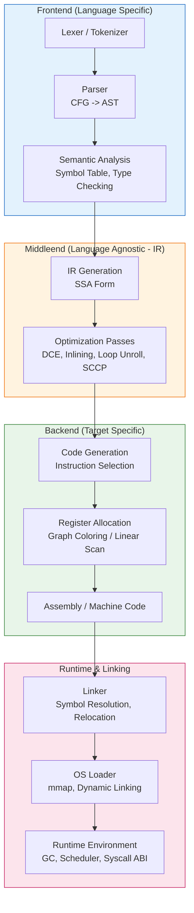

# Ngôn Ngữ Lập Trình Là Gì?

## Introduction

Tôi đã phỏng vấn hơn 200 kỹ sư trong thập kỷ qua. 90% trong số họ nghĩ `print("Hello World")` là một từ khóa của ngôn ngữ. Thực tế? Đó thường là một hàm thư viện chuẩn gọi xuống syscall `write(2)`. Nó ẩn đi runtime startup, bộ cấp phát bộ nhớ, encoding chuỗi (UTF-8 hay ASCII?), và việc flush buffer stdout.

Hãy bóc tách lớp vỏ bọc đó. Dưới đây là phiên bản "thật sự" của Hello World — không runtime, không thư viện chuẩn, chỉ có convention gọi hệ thống (syscall convention) trên Linux x86_64:

```rust
// The "Honest" Hello World: No runtime, no std, just a syscall.
#![no_std]
#![no_main]
use core::panic::PanicInfo;

// Panic handler bắt buộc khi không có std
#[panic_handler]
fn panic(_info: &PanicInfo) -> ! { loop {} }

// Entry point linker mong đợi (Linux x86_64)
#[no_mangle]
pub extern "C" fn _start() -> ! {
    const MSG: &[u8] = b"Hello, Kernel\n";
    
    // Syscall write(1, MSG, 14) -> rax=1, rdi=1, rsi=ptr, rdx=len
    unsafe {
        core::arch::asm!(
            "syscall",
            in("rax") 1,           // SYS_WRITE
            in("rdi") 1,           // FD_STDOUT
            in("rsi") MSG.as_ptr(),
            in("rdx") MSG.len(),
            options(nostack, preserves_flags)
        );
    }
    
    // Syscall exit(0) -> rax=60, rdi=0
    unsafe {
        core::arch::asm!(
            "syscall",
            in("rax") 60,          // SYS_EXIT
            in("rdx") 0,
            options(noreturn)
        );
    }
}
```

Đây không phải là "lập trình ngôn ngữ Rust". Đây là **kỹ thuật máy tính (computer engineering)**. Ngôn ngữ lập trình, ở cốt lõi, là một **convention (quy ước) để mã hóa ý định (intent)** sao cho máy móc có thể thực thi nó mà không làm nóng chảy silicon.

## Why This Matters

Tại sao một kiến trúc sư hệ thống (systems architect) phải quan tâm đến định nghĩa này? Vì khi bạn hiểu ngôn ngữ là *convention*, bạn ngừng tranh cãi về syntax (dấu chấm phẩy, thụt lề) và bắt đầu suy nghĩ về **chi phí trừu tượng (abstraction cost)**.

Trong production, tôi từng thấy một service Java OOM (Out Of Memory) không phải do leak, mà do GC (Garbage Collector) không kịp thu gom object ngắn hạn (short-lived) trong thang promotion của Generational GC. Tôi từng debug một race condition trong Go do hiểu lầm về *happens-before* guarantee của channel so với mutex. Tôi từng optimize cold-start của Lambda function bằng cách chuyển từ Python (interpreter startup + import overhead) sang Rust (static binary, no runtime init).

Nếu bạn không hiểu **Runtime Contract** (ABI, Memory Model, Concurrency Primitives) của ngôn ngữ bạn đang dùng, bạn đang ký một hợp đồng mà bạn chưa đọc điều khoản. Bài viết này là bản tóm tắt điều khoản đó.

## How It Works

Một ngôn ngữ lập trình không phải là một khối đơn nhất. Nó là một **pipeline biến đổi (transformation pipeline)** lấy source text và tạo ra machine code (hoặc bytecode) tuân thủ một ABI cụ thể.



**Giải thích luồng đi:**

1.  **Frontend**: Chỉ quan tâm đến *Syntax* (CFG - Context Free Grammar) và *Static Semantics* (Type Checking, Borrow Checking). Output là AST (Abstract Syntax Tree).
2.  **Middleend (The Magic)**: Chuyển AST sang **IR (Intermediate Representation)** dưới dạng **SSA (Static Single Assignment)**. SSA biến mọi biến thành "gán một lần" — biến `%c` ở trên được định nghĩa một lần, dùng nhiều lần. Đây là "ngôn ngữ chung" của LLVM, GCC, V8 TurboFan, Go SSA. Nó cho phép *Sparse Conditional Constant Propagation (SCCP)*, *Dead Code Elimination (DCE)*, *Loop Invariant Code Motion*.
3.  **Backend**: Chọn instruction set (x86, ARM, RISC-V), cấp phát thanh ghi (Register Allocation - thường là Graph Coloring hoặc Linear Scan cho JIT), sinh ra object file (`.o`).
4.  **Runtime & Linking**: Linker gom symbol, fixup relocation. OS Loader map file vào bộ nhớ ảo. Runtime Environment (GC, Thread Scheduler, Exception Handling) tiếp quản.

## Core Concepts

### 1. Tam Thức: Syntax, Semantics, Pragmatics

*   **Syntax (UI của ngôn ngữ)**: Không chỉ là "code hợp lệ". C còn gặp *context-sensitive* parsing (ví dụ `typedef` làm thay đổi ngữ pháp: `foo * bar` là nhân hay khai báo con trỏ?). Rust dùng *macro expansion* trước khi parse.
*   **Semantics (API Contract)**:
    *   *Operational*: Máy trừu tượng (Abstract Machine) thay đổi state như thế nào? (Ví dụ: C++ abstract machine không định nghĩa thứ tự evaluate argument hàm).
    *   *Denotational*: Toán học thuần túy (Domain Theory). Haskell leans here.
    *   *Axiomatic*: Hoare Logic `{P} C {Q}`. Cơ sở của *Design by Contract* (Eiffel) và static verification (Dafny, Frama-C).
*   **Pragmatics (DX - Developer Experience)**: Thông báo lỗi (error message) có actionable không? Tooling (LSP, debugger, formatter) có tốt không? Community idiom có thống nhất không?
    > *Insight*: "Syntax là UI. Semantics là API Contract. Pragmatics là DX. Hầu hết các cuộc chiến tranh ngôn ngữ (language wars) là tranh cãi Pragmatics bị ngụy trang thành sở thích Syntax."

### 2. Phân Loại: Quên "Compiled vs Interpreted" Đi

Phân loại nhị phân đó đã lỗi thời từ lâu. Thực tế là **Spektrum Thời Gian Binding (Time of Binding Spectrum)**:

| Chiều (Dimension) | Early Binding (AOT) | Late Binding (JIT/Interpreter) |
| :--- | :--- | :--- |
| **Translation** | Rust, Go, C++ (Machine Code) | V8, JVM, PyPy (Bytecode -> JIT), CPython (AST Walking) |
| **Type Binding** | Static (Compile-time) | Dynamic (Runtime), Gradual (TS, Python 3.10+) |
| **Memory Mgmt** | Manual (C/Zig), RAII (C++), Ownership (Rust) | Tracing GC (Go, Java, JS), Ref Counting (Swift, Python) |

**Ví dụ thực tế**: Go là *AOT compiled* nhưng có *Runtime GC + Scheduler* nặng. Java là *AOT to Bytecode* nhưng *JIT compiled* tại runtime với profile-guided optimization. Python là *Interpreter* nhưng có thể *JIT* qua PyPy hoặc *AOT* qua Nuitka/Cython.

### 3. IR & SSA: Ngôn Ngữ Chung Của Compiler

Đoạn code Rust sau:
```rust
fn add(a: i32, b: i32) -> i32 {
    let c = a + b;
    c * 2
}
```

Trở thành LLVM IR (SSA Form) như sau. Lưu ý `%c` và `%result` là **SSA values** — định nghĩa một lần, bất biến (immutable by definition). Đây là lý do compiler tối ưu hóa được cực tốt.

```llvm
; LLVM IR (Simplified SSA)
define i32 @add(i32 %a, i32 %b) {
entry:
  %c = add nsw i32 %a, %b          ; nsw = No Signed Wrap (UB on overflow)
  %result = mul nsw i32 %c, 2
  ret i32 %result
}
```

SSA biến *data flow analysis* thành *graph problem*. Register allocation sau này chính là *graph coloring* trên *interference graph* của các SSA value.

## Examples & Code Walkthrough

### Triển Khai Một Mini-Language: Calculator với Pratt Parser

Thay vì dùng generator (Yacc/Bison), parser thủ công (hand-written) dùng **Pratt Parsing (Top-down Operator Precedence)** cho phép error recovery tốt hơn và dễ embed logic phức tạp (như type-directed parsing). Đây là pattern dùng trong TypeScript, Rust (macro), Go.

```rust
// src/parser.rs - Mini Calculator with Pratt Parser
use std::fmt;
use std::str::Chars;
use thiserror::Error;

#[derive(Debug, Clone, PartialEq)]
pub enum Token {
    Number(f64),
    Plus, Minus, Star, Slash, Caret, // ^ for power
    LParen, RParen,
    Eof,
}

#[derive(Debug, Error)]
pub enum ParseError {
    #[error("Unexpected char: {0} at pos {1}")]
    InvalidChar(char, usize),
    #[error("Unexpected token: {0:?}, expected {1}")]
    UnexpectedToken(Token, &'static str),
    #[error("Missing operand for operator")]
    MissingOperand,
    #[error("Division by zero at parse time (const folding)")]
    DivByZero,
}

pub struct Lexer<'a> {
    input: &'a str,
    chars: Chars<'a>,
    pos: usize,
    current: Option<char>,
}

impl<'a> Lexer<'a> {
    pub fn new(input: &'a str) -> Self {
        let mut chars = input.chars();
        let current = chars.next();
        Self { input, chars, pos: 0, current }
    }

    fn bump(&mut self) {
        self.current = self.chars.next();
        self.pos += 1;
    }

    pub fn next_token(&mut self) -> Result<Token, ParseError> {
        loop {
            match self.current {
                Some(c) if c.is_whitespace() => { self.bump(); }
                Some('0'..='9') | Some('.') => return self.lex_number(),
                Some('+') => { self.bump(); return Ok(Token::Plus); }
                Some('-') => { self.bump(); return Ok(Token::Minus); }
                Some('*') => { self.bump(); return Ok(Token::Star); }
                Some('/') => { self.bump(); return Ok(Token::Slash); }
                Some('^') => { self.bump(); return Ok(Token::Caret); }
                Some('(') => { self.bump(); return Ok(Token::LParen); }
                Some(')') => { self.bump(); return Ok(Token::RParen); }
                Some(c) => return Err(ParseError::InvalidChar(c, self.pos)),
                None => return Ok(Token::Eof),
            }
        }
    }

    fn lex_number(&mut self) -> Result<Token, ParseError> {
        let start = self.pos;
        let mut has_dot = false;
        while let Some(c) = self.current {
            if c.is_ascii_digit() { self.bump(); }
            else if c == '.' && !has_dot { has_dot = true; self.bump(); }
            else { break; }
        }
        let s = &self.input[start..self.pos];
        s.parse::<f64>()
            .map(Token::Number)
            .map_err(|_| ParseError::InvalidChar('?', start)) // Should not happen
    }
}

// --- Pratt Parser Core ---
// Precedence levels (higher binds tighter)
const PREC_ASSIGN: u8 = 1; // Not used here
const PREC_SUM: u8 = 10;   // + -
const PREC_PRODUCT: u8 = 20; // * /
const PREC_POWER: u8 = 30; // ^ (Right associative)
const PREC_PREFIX: u8 = 40; // -x
const PREC_PRIMARY: u8 = 50; // literals, ()

#[derive(Debug, Clone, PartialEq)]
pub enum Expr {
    Number(f64),
    Binary { left: Box<Expr>, op: Token, right: Box<Expr> },
    Unary { op: Token, right: Box<Expr> },
}

pub struct Parser<'a> {
    lexer: Lexer<'a>,
    current: Token,
}

impl<'a> Parser<'a> {
    pub fn new(mut lexer: Lexer<'a>) -> Result<Self, ParseError> {
        let current = lexer.next_token()?;
        Ok(Self { lexer, current })
    }

    fn eat(&mut self, expected: Token) -> Result<(), ParseError> {
        if std::mem::discriminant(&self.current) == std::mem::discriminant(&expected) {
            self.current = self.lexer.next_token()?;
            Ok(())
        } else {
            Err(ParseError::UnexpectedToken(self.current.clone(), "expected token"))
        }
    }

    pub fn parse(&mut self) -> Result<Expr, ParseError> {
        let expr = self.parse_precedence(PREC_ASSIGN)?;
        self.eat(Token::Eof)?;
        Ok(expr)
    }

    fn parse_precedence(&mut self, prec: u8) -> Result<Expr, ParseError> {
        // 1. Parse Prefix (nud - Null Denotation)
        let mut left = match &self.current {
            Token::Number(n) => {
                let val = *n;
                self.eat(Token::Number(val))?;
                Expr::Number(val)
            }
            Token::Minus => { // Unary minus
                self.eat(Token::Minus)?;
                let right = self.parse_precedence(PREC_PREFIX)?;
                Expr::Unary { op: Token::Minus, right: Box::new(right) }
            }
            Token::LParen => {
                self.eat(Token::LParen)?;
                let expr = self.parse_precedence(PREC_ASSIGN)?;
                self.eat(Token::RParen)?;
                expr
            }
            _ => return Err(ParseError::UnexpectedToken(self.current.clone(), "expression start")),
        };

        // 2. Parse Infix (led - Left Denotation) while precedence allows
