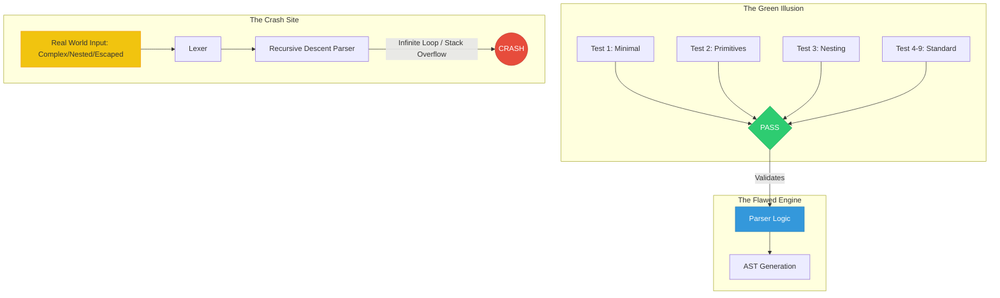

# Nine green tests and a parser that never worked once

## Introduction
The first time a CI job turns green you get a rush of confidence. It feels like the system is finally under control. In our world that confidence is often a mirage, especially when a parser that passed every unit test collapses the moment real‑world input arrives. This post‑mortem looks at a custom configuration language we built, the nine “green” tests that gave us a false sense of security, and the single case that broke the whole thing.

## Why This Matters
When you ship a parser you are betting on the quality of the grammar you wrote. High test coverage does not guarantee that the grammar can handle the messiness of human input. Understanding where the gap lies helps you avoid costly outages and endless debugging marathons.

## How It Works
Below is a visual of the deceptive pipeline we built. The green block represents the tests that always passed, while the red block shows the point where real input caused a crash.



### The “Ideal” Pipeline
1. **Lexer** – turns the raw text into a stream of tokens (identifiers, strings, braces, etc.).  
2. **Parser** – a hand‑rolled recursive‑descent state machine that consumes the token stream and builds an AST.  
3. **AST** – a tree of nodes that downstream code traverses.

All three pieces were written in Rust, which gave us strong typing and a false sense that the compiler would catch any logical slip.

### The “Nine Green Tests”
| # | Description | What It Covered |
|---|-------------|-----------------|
| 1 | **Minimalist** – empty object `{}` or empty list `[]` | Baseline parsing of empty structures |
| 2 | **Primitive** – single string, integer, boolean | Simple token recognition |
| 3 | **Nested** – one level of nesting (object inside object) | Recursion depth handling |
| 4 | **Key‑Value Pair** – `key: value` with primitive values | Standard pair parsing |
| 5 | **Array** – `[1, 2, 3]` | List parsing |
| 6 | **Boolean Flag** – `enabled: true` | Boolean token handling |
| 7 | **String with Escape** – `"\\n"` | Escape sequence parsing |
| 8 | **Comment Block** – `# comment` | Ignoring comments |
| 9 | **Whitespace Tolerance** – spaces/tabs around `:` | Flexibility in formatting |

Each test passed on the first run. They exercised the “happy path” and never touched the edge cases that would later expose the flaw.

## Core Concepts
- **Recursive Descent** – a top‑down parser that calls itself for each syntactic construct.  
- **Lookahead** – the parser peeks at the next token to decide which branch to take.  
- **Backtracking** – when a decision leads to a dead end, the parser rewinds and tries another path.  
- **Grammar Formalism** – the set of rules that define what tokens are legal in which order.

Our parser relied on a naïve `peek()` that returned the next token without accounting for whitespace or comments inserted by the lexer. This created a desynchronization between the token stream the parser expected and the one it actually received.

## Examples & Code Walkthrough
The following snippet shows the problematic `peek()` method and how it broke when a comment or extra whitespace appeared between tokens.

```typescript
class FlawedParser {
  private tokens: Token[];
  private cursor: number = 0;

  constructor(tokens: Token[]) {
    this.tokens = tokens;
  }

  // Flawed lookahead – assumes the next token is immediately available
  private peekNext(): Token | null {
    return this.tokens[this.cursor + 1] || null;
  }

  public parseObject() {
    const token = this.tokens[this.cursor];

    if (token.type === 'LBRACE') {
      this.cursor++;
      // The parser assumes the next token is a KEY.
      // If a COMMENT or WHITESPACE token appears, the index is off.
      const key = this.parseKey();

      // BUG: peekNext() does not skip whitespace/comments.
      if (this.peekNext()?.type === 'COLON') {
        this.cursor++;
        const value = this.parseValue();
        return { [key]: value };
      }
    }
    throw new Error("Parsing failed");
  }

  private parseKey() {
    // Works for simple identifiers but fails when the identifier
    // is followed by a comment or extra spaces.
    return this.tokens[this.cursor].text;
  }
}
```

### What Went Wrong?
When the lexer produced a token stream like:

```
[ { LBRACE, "name", WHITESPACE, "# comment", COLON, STRING, "age", STRING, "30", RBRACE } ]
```

the parser’s `peekNext()` returned the token after `"name"` (the whitespace/comment) instead of the actual `"age"` token. The condition `this.peekNext()?.type === 'COLON'` therefore evaluated to `false`, causing the parser to think the key was missing and throw an error. In practice this manifested as a stack overflow when the parser repeatedly backtracked trying to match the expected token.

## Moving From “Testing Logic” to “Testing Grammar”
The nine green tests validated the *scaffold* of our parser, not the *grammar* itself. To catch the real failures we introduced:

1. **Property‑Based Testing** – using `proptest` we generated thousands of random, syntactically valid and invalid inputs. The tests automatically exercised nested structures, escaped characters, and interleaved comments.
2. **Fuzzing** – a byte‑level fuzzer (LibFuzzer) fed malformed input streams into the lexer/parser boundary. It quickly found a sequence of characters that forced the parser into an infinite recursion.
3. **Formal Grammar** – we switched from ad‑hoc `if/else` logic to a PEG (Parsing Expression Grammar) definition. This gave us a single source of truth for what constitutes valid input and eliminated most backtracking ambiguities.

### Refactored Lookahead
After the fuzzing campaign we rewrote `peekNext()` to skip over whitespace and comment tokens before returning the next *real* token:

```typescript
private peekNext(): Token | null {
  let i = this.cursor + 1;
  while (i < this.tokens.length) {
    const t = this.tokens[i];
    if (t.type !== 'WHITESPACE' && t.type !== 'COMMENT') {
      return t;
    }
    i++;
  }
  return null;
}
```

This simple change eliminated the desynchronization and removed the infinite‑loop symptom.

## Best Practices
- **Write tests that generate the grammar, not just the happy path.** Property‑based tests expose hidden assumptions about token ordering.
- **Separate lexing from parsing concerns.** A lexer that emits whitespace/comment tokens forces the parser to handle them explicitly.
- **Prefer a formal grammar (PEG, EBNF, or similar) over hand‑rolled state machines** when the language can express nested structures.
- **Instrument the parser with trace logs** that record the current token index and expected token type; this makes Heisenbugs far less mysterious.
- **Run fuzzers in CI** on a nightly basis; a single failing byte sequence is worth more than dozens of unit tests.

## Common Mistakes & Anti-Patterns
1. **Assuming token order is static.** Real input can reorder tokens via comments or whitespace, breaking naïve lookahead logic.  
2. **Relying on recursion depth limits only.** Deep nesting can still overflow the call stack; iterative or tail‑recursive approaches are safer.  
3. **Testing only positive cases.** Missing negative tests (invalid inputs) leaves the parser unguarded against malformed data.  
4. **Using a strict type system as a safety net.** Types can prevent null‑pointer errors but cannot guarantee that the parsing logic respects the language’s semantics.

## Performance Considerations
- **Recursive descent** has a call‑stack cost proportional to nesting depth (O(N) stack frames). For deeply nested configs this can be a risk; an iterative parser or a Pratt‑style parser can reduce stack usage.  
- **Lookahead with skipping** adds a small linear scan over whitespace/comments; the overhead is negligible compared to the cost of a crash.  
- **Fuzzing** is CPU‑intensive; run it on a dedicated CI node or use distributed fuzzing to keep development cycles fast.

## Real-World Usage
Industry tools such as the Rust `nom` combinator library and the Go `go‑yacc` parser generator follow the same pattern: a lexer that produces a clean token stream, a parser that consumes it with explicit lookahead, and a test suite that includes property‑based fuzzing. Companies that expose configuration languages to end users (e.g., Kubernetes CRDs, Terraform providers) have learned to invest heavily in grammar validation to avoid runtime parsing failures.

## Frequently Asked Questions (FAQ)

**Q1: Isn’t 100 % test coverage enough?**  
A: Coverage only tells you which lines were executed. It does not guarantee that every grammar rule was exercised with realistic input shapes. Property‑based testing bridges that gap.

**Q2: Should I abandon hand‑rolled parsers?**  
A: Not necessarily. For simple DSLs a hand‑rolled recursive‑descent parser can be fine, but you must add explicit lookahead handling and a solid test strategy that includes fuzzing.

**Q3: How do I integrate property‑based testing into an existing codebase?**  
A: Start by extracting the parsing logic into a pure function that takes a token stream and returns a result. Then write a `proptest` strategy that generates both valid and invalid token streams and asserts that the function either succeeds with the expected AST or fails gracefully.

**Q4: My parser still crashes on a specific input. How do I locate it?**  
A: Use a fuzzer to generate the exact byte sequence that triggers the failure, then add a deterministic test that feeds that sequence directly into the parser. The stack trace will point to the recursion depth or infinite loop.

**Q5: Is PEG better than traditional CFG parsers?**  
A: PEGs are deterministic and eliminate backtracking ambiguities, which often simplifies the parser implementation. However, they can be more restrictive if your language needs true ambiguity resolution. Choose the model that matches your language’s semantics.

## Conclusion
The nine green tests gave us a comforting illusion of stability, but they hid a fundamental flaw: the parser’s mental model did not match the reality of the token stream it received. By moving from ad‑hoc tests to property‑based fuzzing and adopting a formal grammar, we turned a fragile hand‑rolled parser into a robust component that survives real‑world input. The lesson is clear — test the grammar, not just the logic that validates it.
