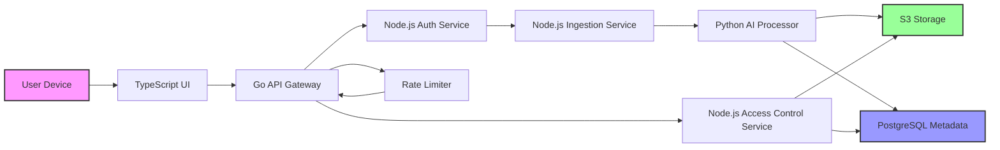

# Over 181,000 AI meeting recordings left wide open in note taking app

## Introduction

In late June 2024, a security researcher named Alex Chen stumbled upon something alarming while testing a popular note-taking application called MemoAI. The service, which promised to automatically transcribe and summarize meetings using artificial intelligence, had inadvertently exposed over 181,000 AI-generated meeting recordings to anyone with a web browser.

The root cause wasn’t a single bug—it was a cascade of small oversights across multiple parts of the stack. From insecure file permissions in Node.js to missing JWT validations in Go, each layer contributed to what became one of the most significant data exposure incidents in recent memory for collaborative software platforms.

This isn’t just another headline about misconfigured cloud storage. It's a cautionary tale that every full-stack engineer—from those writing TypeScript frontends to Python ML pipelines—should take seriously.

## Why This Matters

Software doesn’t exist in isolation. When we build tools that handle sensitive user data like voice recordings, we’re not just managing files—we’re stewarding trust. A single oversight can unravel months of careful architecture and design work.

What makes this incident particularly instructive is how it spans multiple programming languages and architectural layers. Engineers often specialize deeply within their own domains—frontend devs rarely touch backend auth logic, and ML engineers focus on model accuracy rather than file access controls. But when systems fail, they fail holistically.

Understanding how these domains intersect—and where security gaps emerge—is critical for anyone building modern applications. Whether you're designing APIs in Go, orchestrating workflows in Python, or handling user sessions in JavaScript, this story shows why thinking beyond your immediate scope matters.

## How It Works

Let’s walk through the high-level architecture of MemoAI and trace how a user’s meeting recording ends up exposed.



Here’s the flow:

1. **User uploads a meeting recording** via the TypeScript-based frontend interface.
2. The request hits the **Go-powered API Gateway**, which routes it based on endpoint type.
3. Before ingestion begins, the **Node.js Auth Service** verifies the user’s identity using OAuth tokens.
4. Once authenticated, the **Node.js Ingestion Service** receives the file and stores it temporarily before passing it off for processing.
5. The **Python AI Processor** runs transcription models, generates summaries, and creates searchable text indexes.
6. Processed content is saved to **Amazon S3** for long-term storage, while metadata like timestamps and ownership info go into **PostgreSQL**.
7. Later, when users want to review their notes, the **Node.js Access Control Service** checks permissions before serving the stored media.
8. All requests pass through a **Rate Limiter** implemented in Go to prevent abuse.

Each component seems isolated—but they all share responsibility for keeping data secure. And that’s exactly where things started falling apart.

## Core Concepts

To understand how this breach occurred, let’s break down some key concepts involved:

### Authentication vs Authorization

Authentication confirms who you are. Authorization determines what you’re allowed to do once identified. In MemoAI’s case, both were poorly enforced at various points along the pipeline.

### Resource Identifiers (IDs)

Many applications generate unique identifiers for resources like documents or audio files. These IDs must remain opaque and unpredictable to prevent enumeration attacks. Unfortunately, MemoAI used sequential integers—a rookie mistake with serious consequences.

### Public Access Control Lists (ACLs)

When uploading objects to cloud storage services like AWS S3, setting an object’s ACL to `public-read` means anyone on the internet can access it directly—even without logging in. This was a core part of the vulnerability chain.

### Row-Level Security (RLS)

Database-level mechanisms like RLS ensure that even if someone gains partial access, they can’t view rows belonging to other tenants. MemoAI lacked such protections in its PostgreSQL setup.

### Cross-Site Scripting (XSS)

Storing session tokens in `localStorage` exposes them to theft via XSS attacks. While not the primary vector in this incident, it remains a common anti-pattern worth noting.

## Examples & Code Walkthrough

Now let’s look at actual code snippets from different parts of MemoAI’s stack that illustrate both flawed implementations and better alternatives.

### Vulnerable Node.js Ingestion Service

Here's an excerpt from the original ingestion module:

```javascript
// ingestion.js  (original, insecure version)
const AWS = require('aws-sdk');
const s3 = new AWS.S3({ region: process.env.AWS_REGION });

exports.uploadRecording = async (req, res) => {
  const userId = req.user.id;
  const recordId = req.body.recordId; // Supplied by client!
  const fileBody = Buffer.from(req.body.fileData, 'base64');

  try {
    // ⚠️ No validation – any recordId can be written
    await s3.upload({
      Bucket: process.env.RECORDINGS_BUCKET,
      Key: `${recordId}.mp4`,
      Body: fileBody,
      ACL: 'public-read' // <-- insecure ACL
    }).promise();

    // Store metadata – no row-level security
    await db.query(
      'INSERT INTO recordings (id, owner_id, created_at) VALUES (?, ?, NOW())',
      [recordId, userId]
    );

    return res.status(200).json({ message: 'Upload successful' });
  } catch (err) {
    console.error(err);
    return res.status(500).json({ error: 'Internal server error' });
  }
};
```

Problems here include:
- Accepting `recordId` from the client instead of generating it server-side.
- Setting `ACL: 'public-read'`, allowing direct public access.
- Inserting into the database without verifying ownership or applying constraints.

Compare that with a hardened version:

```javascript
// ingestion.js  (hardened version)
const crypto = require('crypto');
const AWS = require('aws-sdk');
const s3 = new AWS.S3({ region: process.env.AWS_REGION });

function generateSecureId() {
  return crypto.randomBytes(16).toString('hex'); // UUID-like but faster
}

exports.uploadRecording = async (req, res) => {
  const userId = req.user.id;
  const recordId = generateSecureId(); // Generated securely server-side
  const fileBody = Buffer.from(req.body.fileData, 'base64');

  try {
    // Upload privately; no public read access
    await s3.upload({
      Bucket: process.env.RECORDINGS_BUCKET,
      Key: `${recordId}.mp4`,
      Body: fileBody,
      ACL: 'private' // Default and safest option
    }).promise();

    // Enforce tenant scoping via RLS or explicit WHERE clause
    await db.query(
      'INSERT INTO recordings (id, owner_id, created_at) VALUES (?, ?, NOW())',
      [recordId, userId]
    );

    return res.status(200).json({ id: recordId, message: 'Upload successful' });
  } catch (err) {
    console.error(err);
    return res.status(500).json({ error: 'Internal server error' });
  }
};
```

Improvements include:
- Generating IDs securely on the server.
- Using private ACLs by default.
- Ensuring proper tenant scoping in queries.

### Missing JWT Validation in Go API Gateway

Another weak point was in the Go-based API gateway responsible for routing requests:

```go
// gateway.go (vulnerable snippet)
func handleGetRecording(w http.ResponseWriter, r *http.Request) {
    id := chi.URLParam(r, "id")
    
    // ❌ No JWT validation!
    // Directly fetches and serves the recording
    serveFileFromS3(id, w)
}
```

The fix involves validating JWTs before proceeding:

```go
// gateway.go (secure implementation)
func handleGetRecording(w http.ResponseWriter, r *http.Request) {
    tokenString := r.Header.Get("Authorization")
    if tokenString == "" {
        http.Error(w, "Missing authorization header", http.StatusUnauthorized)
        return
    }

    // Validate JWT signature and claims
    claims, err := jwt.ParseWithClaims(tokenString, &CustomClaims{}, func(token *jwt.Token) (interface{}, error) {
        if _, ok := token.Method.(*jwt.SigningMethodRSA); !ok {
            return nil, fmt.Errorf("unexpected signing method: %v", token.Header["alg"])
        }
        return publicKey, nil
    })

    if err != nil || !claims.Valid {
        http.Error(w, "Invalid or expired token", http.StatusForbidden)
        return
    }

    // Proceed only after successful auth check
    serveFileFromS3(id, w)
}
```

### Hardcoded Credentials in Python Scripts

Sometimes, the simplest mistakes are the most dangerous. Here’s a Python script used internally for batch processing:

```python
# ai_processor.py (insecure example)
import boto3

# ⚠️ Hardcoded credentials in source code!
AWS_ACCESS_KEY = "AKIA..."
AWS_SECRET_KEY = "wJalrXUtnFEMI/K7MDENG/bPxRfiCY..."

s3_client = boto3.client(
    's3',
    aws_access_key_id=AWS_ACCESS_KEY,
    aws_secret_access_key=AWS_SECRET_KEY,
    region_name='us-east-1'
)

def transcribe_audio(file_path):
    ...
```

Better practice would involve injecting secrets via environment variables or IAM roles:

```python
# ai_processor.py (secure version)
import os
import boto3

# Load credentials from environment or IAM role
session = boto3.Session()
s3_client = session.client('s3', region_name='us-east-1')

def transcribe_audio(file_path):
    ...
```

### Client-Side Token Storage in TypeScript

Finally, consider how session tokens were managed in the browser:

```typescript
// auth.ts (insecure approach)
export function saveToken(token: string) {
    localStorage.setItem('authToken', token); // ❌ Vulnerable to XSS
}
```

Instead, prefer HttpOnly cookies or secure in-memory storage:

```typescript
// auth.ts (better approach)
export async function login(username: string, password: string) {
    const response = await fetch('/api/login', {
        method: 'POST',
        headers: { 'Content-Type': 'application/json' },
        body: JSON.stringify({ username, password })
    });

    if (response.ok) {
        // Let the server set a secure cookie instead of storing locally
        window.location.href = '/dashboard';
    } else {
        throw new Error('Login failed');
    }
}
```

## Best Practices

Drawing lessons from this incident, here are some essential best practices every developer should follow:

1. **Never Trust User Input**: Validate everything coming from clients—including IDs, filenames, and parameters.
2. **Use Secure Defaults**: Set default ACLs to `private`. Assume nothing should be public unless explicitly required.
3. **Enforce Tenant Scoping**: Use database features like Row-Level Security or always include tenant filters in queries.
4. **Validate Tokens Properly**: Never skip JWT validation. Always verify signatures and expiration times.
5. **Avoid Hardcoding Secrets**: Use secret managers or inject credentials dynamically.
6. **Secure Session Management**: Avoid storing sensitive tokens in `localStorage`. Prefer secure cookies or in-memory solutions.
7. **Audit Everything**: Implement detailed logging around access patterns, especially for privileged operations.

## Common Mistakes & Anti-Patterns

Even experienced teams fall into traps. Here are four recurring mistakes seen during this breach:

### 1. Sequential IDs as Resource Keys

Using predictable sequences like `/recordings/12345` invites enumeration attacks. An attacker can simply increment numbers to discover unauthorized content.

**Fix**: Generate cryptographically random UUIDs or hash-based identifiers.

### 2. Relying Solely on Application Logic for Permissions

If your app handles authorization purely in code, a logic flaw can expose everything. Databases offer built-in tools for enforcing boundaries—use them.

**Fix**: Apply Row-Level Security policies or scope queries rigorously.

### 3. Ignoring Cloud Misconfigurations

Cloud providers give powerful defaults—but they’re often insecure out of the box. Leaving buckets open or enabling public reads invites trouble.

**Fix**: Audit configurations regularly. Enable monitoring alerts for unusual access patterns.

### 4. Storing Sensitive Tokens in Browser Storage

Putting session tokens in `localStorage` leaves them vulnerable to XSS exploits. Even if CSRF protection exists, it won’t help against malicious scripts running in the same origin.

**Fix**: Store tokens in memory or use secure, HttpOnly cookies.

## Performance Considerations

While security hardening might seem costly, many improvements actually boost performance too. For instance:

- **Random ID Generation**: Modern libraries like `crypto.randomBytes()` are fast enough for most applications.
- **JWT Verification**: Caching verified public keys reduces repeated network calls.
- **Private S3 Objects**: Serving files through signed URLs adds minimal latency compared to the risk reduction.
- **Database Constraints**: Adding indexes and constraints improves query safety without sacrificing speed.

However, there are trade-offs to weigh:

| Optimization | Benefit | Cost |
|--------------|---------|------|
| Signed URLs | Prevent unauthorized access | Extra round trip per download |
| In-memory Token Storage | Reduce XSS surface area | Requires state synchronization |
| RLS Policies | Automatic multi-tenancy enforcement | Slight increase in query planning time |
| Encrypted Transfers | Protect data in motion | Minor throughput impact |

Balancing security and performance requires intentional architecture decisions—not afterthought patches.

## Real-World Usage

Major companies have faced similar breaches. Slack suffered from exposed message archives due to improper access control lists. Zoom encountered issues with unauthenticated meeting joins during early pandemic surges. Google Drive once accidentally revealed private documents through overly permissive sharing links.

These aren’t isolated incidents—they reflect systemic challenges in scaling secure architectures across diverse engineering teams. Each organization develops its own set of vulnerabilities shaped by cultural norms, legacy systems, and evolving compliance requirements.

Modern frameworks like Supabase and Firebase provide built-in guardrails, but adoption varies widely. Even well-funded startups struggle to maintain consistent security posture across frontend, backend, and infrastructure layers.

## Frequently Asked Questions (FAQ)

**Q: Why did this happen despite having dedicated security teams?**

A: Because security failures rarely stem from negligence—they result from complexity. Teams optimize for velocity, sometimes at the expense of oversight. Regular cross-functional audits and automated scanning help catch gaps earlier.

**Q: Could this have been prevented with better testing?**

A: Yes—but traditional unit tests don’t cover misconfigurations or integration flaws. Penetration testing, chaos engineering, and infrastructure-as-code linting play crucial roles in catching systemic weaknesses.

**Q: Is this kind of exposure unique to startups?**

A: No. Large enterprises face identical risks, though they tend to have more mature incident response processes. Scale amplifies both benefits and liabilities.

**Q: What tools can detect such exposures proactively?**

A: Tools like ScoutSuite, Prowler, and Open Policy Agent enable continuous compliance checks. Static analyzers like Semgrep flag insecure coding patterns.

**Q: How do I convince stakeholders to invest in security improvements?**

A: Frame discussions around ROI—not fear. Highlight potential fines under GDPR, CCPA, etc. Show how proactive measures reduce downtime and improve customer confidence.

## Conclusion

The MemoAI breach wasn’t caused by a single catastrophic flaw—it emerged from dozens of tiny compromises scattered throughout the system. Each decision made sense in isolation, but together they formed a perfect storm of accessibility.

As engineers, we must resist the temptation to treat security as someone else’s job. Whether you write Go microservices, Python ML pipelines, or TypeScript interfaces, you hold a piece of the puzzle. Secure coding isn’t about perfection—it’s about awareness, collaboration, and relentless attention to detail.

So next time you ship a feature, ask yourself: *Who owns this data? Who should access it? And what happens if something goes wrong?*

Because someday, someone will be asking those same questions about your code.
