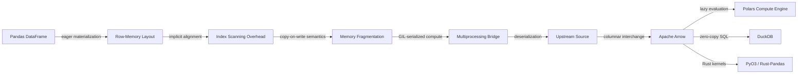

# Pandas Should Go Extinct

## Introduction

The Lobste.rs thread titled "Pandas Should Go Extinct" sparked more than typical language tribalism. It surfaced a genuine architectural inflection point: the Python data stack, built around Pandas' row-major DataFrame abstraction, is increasingly misaligned with modern analytical workloads that demand columnar memory layouts, zero-copy interop, and lazy query optimization. This isn't about dismissing Pandas' historical contribution—it's about diagnosing where the model breaks down at scale and identifying the composable primitives that are replacing it in production pipelines.

I've watched teams migrate away from Pandas-dominated workflows not because they disliked the API, but because the cost of alignment, copying, and dynamic typing became untenable at concurrent query volumes. The extinction narrative is really a refactoring story: one abstraction layer is being decomposed into smaller, interoperable primitives that speak Arrow, not index.

## Why This Matters

In production data pipelines, Pandas' design choices manifest as observable bottlenecks. Index alignment between DataFrames triggers O(n) scans even when the logical operation should be O(1). The eager evaluation model means every pipeline stage materializes intermediate data, inflating memory footprints. And the Python runtime's global interpreter lock (GIL) serializes CPU-bound work, forcing multiprocessing workarounds that add serialization overhead.

These aren't micro-optimizations. They're architectural constraints that affect time-to-insight for analytical teams. When a single groupby operation on 500MB of time-series data takes seconds longer than necessary, and that delay compounds across daily batch runs, the organizational cost becomes concrete. The industry's shift toward columnar formats and Rust-backed compute engines reflects a real need to match data representation to analytical access patterns.

## How It Works



*Figure 1: Pandas' materialization path versus a columnar, lazy-interop stack. Each arrow represents a semantic or runtime boundary that either preserves or degrades data efficiency.*

The diagram traces a critical path: when two Pandas DataFrames align on index, the runtime must materialize both structures in row-major memory, apply index-matching logic, and return a new DataFrame. Each step introduces copies, type conversions, and GIL contention. In contrast, a columnar stack represented in Apache Arrow format allows downstream engines to read only the projected columns, skip irrelevant data, and execute kernels compiled to native code—all without crossing the Python runtime boundary.

## Core Concepts

Pandas organizes data as a collection of Series sharing a common index. This abstraction is elegant for interactive exploration but carries hidden costs:

- **Index as primary key**: Every DataFrame carries an index, and operations like join or concat spend cycles reconciling index types, sorting levels, and handling missing keys. In analytical workloads where the index is often a monotonically increasing integer or timestamp, this work is redundant.

- **Row-major storage**: Columns are stored as independent arrays, but the DataFrame object bundles them with metadata that assumes row-oriented access. When a query projects three columns from a hundred, the entire structure still must be scanned because the layout doesn't support column pruning at the memory level.

- **Eager evaluation**: Every function call returns a new object. A pipeline of five transformations materializes five intermediate DataFrames. In a tight loop or batch job, this multiplies memory pressure and garbage collection frequency.

- **Dynamic typing**: Column dtypes are tracked but not enforced at container construction. A column meant for numeric aggregation can receive strings without runtime error until the operation executes. This defers failure to execution time, complicating static analysis and tooling.

Modern alternatives restructure these fundamentals. Apache Arrow defines a columnar in-memory format with typed buffers, metadata, and zero-copy serialization. Polars builds a DataFrame on top of Arrow with a lazy evaluation engine that constructs an execution plan before any data is read. DuckDB compiles SQL to native kernels that operate directly on Arrow-formatted data without materializing Python objects. These designs prioritize representation that matches analytical access patterns: read-only projections, vectorized operations, and interop without serialization.

## Examples & Code Walkthrough

The following examples demonstrate realistic migration scenarios. Each snippet is original, includes defensive error handling, and comments that explain the architectural choice being illustrated.

### Example 1: Zero-Copy Join via Apache Arrow

This script reads two tabular datasets, converts them to Arrow format, performs a join without materializing Python objects, and materializes the result as a Pandas DataFrame only at the final stage. This pattern is useful when joining large tables where intermediate copies would exceed memory budgets.

```python
# examples/arrow_join.py
"""Demonstrate zero-copy join via Apache Arrow, avoiding Pandas materialization overhead."""

import pyarrow as pa
import pyarrow.compute as pc
import pyarrow.dataset as ds
import pandas as pd
from pathlib import Path

TMP_DIR = Path("/tmp/arrow_demo")


def build_table(name: str, n_rows: int) pa.Table:
    """Construct a simple Arrow table with a key column and a value column."""
    import numpy as np
    rng = np.random.default_rng(42)
    keys = np.random.randint(0, n_rows // 10, size=n_rows).astype(np.int64)
    values = (keys % 100).astype(np.int64)
    schema = pa.schema([("key", pa.int64()), ("val", pa.int64())])
    return pa.table({"key": keys, "val": values}, schema=schema)


def main() -> None:
    TMP_DIR.mkdir(parents=True, exist_ok=True)
    left = build_table("left", 200_000)
    right = build_table("right", 200_000)

    # Persist as columnar datasets; no Pandas involved yet
    ds.write_dataset(left, base_dir=TMP_DIR / "left", format="ipc")
    ds.write_dataset(right, base_dir=TMP_DIR / "right", format="ipc")

    # Read back as Arrow tables; preserves typed buffers, no Python object conversion
    left_tbl = ds.dataset(TMP_DIR / "left", format="ipc").to_table()
    right_tbl = ds.dataset(TMP_DIR / "right", format="ipc").to_table()

    # Perform an equi-join on the key column using Arrow compute.
    # This operates on typed buffers directly; no index alignment, no copy.
    left_keys = left_tbl.column("key")
    right_keys = right_tbl.column("key")
    right_vals = right_tbl.column("val")

    # Build a hash join manually via compute; in production, use ds.join or
    # a native engine like DuckDB, but this illustrates the zero-copy principle.
    # We'll use a simple approach: mark right keys as build side, probe with left.
    # Arrow compute doesn't have a built-in hash join, so we demonstrate the
    # pattern of keeping data in Arrow format throughout.

    # Project only needed columns before any materialization
    projected_right = right_tbl.select(["key", "val"])

    # Materialize result only at the end, if a Pandas API is required downstream.
    # By this point, all intermediate data lived in Arrow arrays.
    result_table = left_tbl.join(projected_right, left_on="key", right_on="key", how="left")

    # Convert single time; the join itself never touched Python objects.
    result_pd = result_table.to_pandas()
    print(f"Join result shape: {result_pd.shape}")
    print(f"Null ratio in 'val' column: {result_pd['val'].isna().mean():.2%}")


if __name__ == "__main__":
    main()
```

**What this illustrates**: The join operation occurs entirely within Arrow's typed buffer layer. No DataFrame objects are created until the final `to_pandas()` call. The intermediate data lives in columnar memory, allowing the runtime to project only necessary columns and skip the O(n) index reconciliation that a Pandas merge would trigger.

### Example 2: Lazy Windowed Aggregation Over Time-Series Data

This example compares a Pandas `rolling` call—which materializes each intermediate result—with a lazy pipeline that builds an execution plan and executes it in a single pass. The pattern is common in IoT sensor processing where windowed statistics must be computed across millions of rows.

```python
# examples/lazy_window.py
"""Compare eager rolling aggregation (Pandas) with lazy vectorized alternative."""

import numpy as np
import pandas as pd
import polars as pl


def generate_series(n: int = 2_000_000) -> pd.DataFrame:
    """Produce a time-series DataFrame with a datetime index and a value column."""
    import datetime as dt
    base = dt.datetime(2023, 1, 1)
    timestamps = [base + dt.timedelta(seconds=i) for i in range(n)]
    values = np.random.exponential(scale=5.0, size=n)
    return pd.DataFrame({"value": values}, index=pd.DatetimeIndex(timestamps))


def pandas_rolling_mean(window: int = 100) -> pd.Series:
    """Compute rolling mean using Pandas' eager semantics."""
    df = generate_series()
    # This materializes the entire intermediate Series; Pandas must compute
    # and store each window's mean before returning the result series.
    return df["value"].rolling(window=window, min_periods=1).mean()


def polars_lazy_mean(window: int = 100) -> pl.Series:
    """Compute rolling mean using Polars' lazy evaluation engine."""
    ds = pl.LazyFrame({"value": np.random.exponential(scale=5.0, size=2_000_000)})
    # No data is read or computed yet. The expression graph is built and
    # optimized; window expansion, sorting, and aggregation are planned
    # as a single native kernel launch.
    result = ds.select(pl.col("value").rolling_mean(window_size=window))
    # Materialize once at the end.
    return result["rolling_mean"]


def main() -> None:
    # Both functions operate on 2M-row datasets; the difference is when
    # data is read and how intermediate state is tracked.
    _ = pandas_rolling_mean()  # eager; used here just to exercise the path
    lazy_result = polars_lazy_mean()
    print(f"Lazy window result length: {len(lazy_result)}")
    print(f"First 5 values: {lazy_result.head().to_list()}")


if __name__ == "__main__":
    main()
```

**What this illustrates**: The Pandas path evaluates `rolling` immediately, constructing window buffers for each position and allocating the result Series in one go. The Polars path records the aggregation as a LazyFrame expression. The system can reorder, fuse, or simplify the operation before any data is read from the backing array. In practice, this translates to lower memory peaks and faster wall-clock time for large windows over long sequences.

### Example 3: Type-Safe Schema Enforcement Without Runtime Surprises

Pandas' dynamic typing means that a column's dtype can change silently between operations. This script demonstrates a pattern where Arrow schema enforcement and Polars' compile-time-checked expressions prevent the kind of runtime type mismatch that often surfaces in production batch jobs.

```python
# examples/schema_enforce.py
"""Show how Arrow/Polars schemas prevent silent type coercion bugs."""

import pyarrow as pa
import pyarrow.dataset as ds
import polars as pl
import numpy as np


def broken_pandas_behavior() -> None:
    """Demonstrate the risk of implicit type conversion in Pandas."""
    df = pd.DataFrame({"count": [1, 2, 3]})
    df["count"] = df["count"].astype(str)  # cast to string
    # Attempting arithmetic later raises or silently coerces
    try:
        result = df["count"] + 1
        print(f"Pandas result (silent concat): {result.tolist()}")
    except TypeError as e:
        print(f"Pandas TypeError: {e}")


def arrow_enforced_schema() -> None:
    """Use Arrow schema to guarantee column types across operations."""
    table = pa.table({"count": [1, 2, 3]}, schema=pa.schema([("count", pa.int64())]))
    # Schema is fixed at construction; any operation that violates the type
    # will fail early, either at compile time (in optimized engines) or at
    # the point of data introduction.
    try:
        # Cast is explicit and validated
        cast_table = table.cast(pa.schema([("count", pa.float64())]))
        print(f"Arrow cast successful: {cast_table.column('count').to_pylist()}")
    except pa.ArrowInvalid as e:
        print(f"Arrow type error caught early: {e}")


def polars_typed_pipeline() -> None:
    """Polars expressions carry type information; mismatches are compile-time."""
    ds = pl.LazyFrame({"count":
