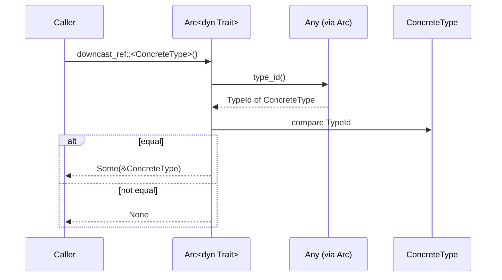

# Pining for Arc Downcasting in Rust

## Introduction
When building systems that rely on trait objects wrapped in `Arc`, we often hit a wall: we need to recover the concrete type behind the dynamic dispatch to call methods that aren’t part of the trait. Rust’s type system makes this intentional—downcasting is unsafe by default—but the standard library gives us a safe, ergonomic path via `Any`. In this post we’ll walk through the mechanics, trade‑offs, and production patterns for downcasting an `Arc<dyn Trait>` back to its original type.

## Why This Matters
In micro‑service backends, plugin architectures, and event‑driven pipelines we frequently store heterogeneous handlers behind a common interface. Storing them as `Arc<dyn Handler>` lets us keep a single vector or hash map, but when a specific handler needs to access its internal state (e.g., a database connection pool or a custom metric registry) we must downcast. Without a reliable downcast strategy we either leak abstraction (exposing concrete types everywhere) or resort to heavyweight enum dispatch, which hurts extensibility. Understanding the correct way to downcast lets us keep the ergonomics of trait objects while still reaching into concrete implementations when necessary.

## How It Works
The core idea is simple: any type that implements `Any` can be queried at runtime for its `TypeId`. `Arc<T>` automatically forwards the `Any` implementation when `T: Any + Send + Sync`. By comparing the requested `TypeId` with the stored one we can safely obtain a reference to the inner value.

Below is a sequence diagram that shows the flow when a consumer asks for a downcast:



**Step‑by‑step**

1. The caller invokes `downcast_ref::<Concrete>()` on the `Arc<dyn Trait>`.
2. The call is resolved through `Arc`’s deref to the inner `dyn Trait`, which provides an `Any` implementation.
3. `Any::type_id()` returns the compile‑time `TypeId` of the concrete type that was originally boxed.
4. The requested `TypeId` (from `Type::of::<Concrete>()`) is compared.
5. If they match, we safely transmute the raw pointer to `&Concrete` and wrap it in `Some`; otherwise we return `None`.

Because the check is performed at runtime, the operation is zero‑cost when the types match (just a pointer comparison) and fails gracefully otherwise.

## Core Concepts
- **`Any` trait**: Provides `type_id()` and downcasting methods. Implemented automatically for all `'static` types.
- **`TypeId`**: A hash of a type’s monomorphized identity; equality means the types are the same.
- **`Arc<T>`**: Atomically reference‑counted pointer. When `T: Any + Send + Sync`, `Arc<T>` also implements `Any` by delegating to the inner `T`.
- **Safety guarantee**: The downcast only succeeds if the requested type matches the original concrete type; otherwise we get `None`. No undefined behavior can arise from a mismatched downcast.

## Examples & Code Walkthrough
Consider a plugin system where each plugin implements a `Process` trait but also carries its own configuration.

```rust
use std::any::{Any, TypeId};
use std::sync::Arc;

/// Core trait exposed to the plugin manager.
trait Process: Any + Send + Sync {
    fn run(&self);
}

/// A concrete plugin that holds a DB pool.
struct DbPlugin {
    pool: Arc<deadpool_postgres::Pool>,
    query: String,
}

impl Process for DbPlugin {
    fn run(&self) {
        // Use the pool to execute `self.query`.
        let _ = self.pool.get(); // simplified
    }
}

/// Another concrete plugin that holds a metric registry.
struct MetricsPlugin {
    registry: Arc<metrics::Registry>,
    counter: metrics::Counter,
}

impl Process for MetricsPlugin {
    fn run(&self) {
        self.counter.increment(1);
    }
}

/// Helper to downcast an Arc<dyn Process> to a concrete type.
trait ProcessExt: Process {
    fn downcast_ref<T: Any + Send + Sync>(self: &Arc<Self>) -> Option<&Arc<T>> {
        // Compare TypeId of T with the erased type.
        if TypeId::of::<T>() == self.type_id() {
            // SAFETY: we just checked the TypeIds match.
            unsafe {
                let ptr: *const Self = Arc::as_ptr(self);
                let typed_ptr: *const T = ptr.cast();
                Some(Arc::from_raw(typed_ptr))
            }
        } else {
            None
        }
    }
}

// Implement the extension for all Processors.
impl<T: Process> ProcessExt for T {}

fn main() {
    let db_pool = Arc::new(deadpool_postgres::Pool::new(
        deadpool_postgres::Config::new(),
        tokio_postgres::NoTls,
    ));
    let db_plugin = Arc::new(DbPlugin {
        pool: db_pool.clone(),
        query: "SELECT 1".to_string(),
    }) as Arc<dyn Process>;

    let metrics_registry = Arc::new(metrics::Registry::new());
    let metrics_plugin = Arc::new(MetricsPlugin {
        registry: metrics_registry.clone(),
        counter: metrics_registry.register_counter("requests"),
    }) as Arc<dyn Process>;

    let plugins: Vec<Arc<dyn Process>> = vec![db_plugin, metrics_plugin];

    for plugin in &plugins {
        // Try to get a DbPlugin reference.
        if let Some(db) = plugin.downcast_ref::<Arc<DbPlugin>>() {
            println!("Found DB plugin with pool: {:?}", Arc::as_ptr(db));
            continue;
        }
        // Try to get a MetricsPlugin reference.
        if let Some(metrics) = plugin.downcast_ref::<Arc<MetricsPlugin>>() {
            println!("Found metrics plugin with registry: {:?}", Arc::as_ptr(metrics));
            continue;
        }
        println!("Unknown plugin type");
    }
}
```

**Explanation of key lines**

- `trait Process: Any + Send + Sync` – we require `Any` to enable downcasting; `Send + Sync` ensures the `Arc` can be shared across threads.
- In `ProcessExt::downcast_ref`, we compare `TypeId::of::<T>()` with `self.type_id()`. The latter is provided by `Any` through the trait object.
- If the IDs match we reconstruct an `Arc<T>` from the raw pointer. The `unsafe` block is sound because we have just verified the type identity; the reference count is unchanged, and we never create two independent `Arc`s pointing to the same allocation without increasing the count (we use `Arc::from_raw` which consumes the raw pointer and assumes ownership of one reference).
- The caller receives `Option<&Arc<T>>`. Holding a reference to the `Arc` lets us clone it if we need to retain ownership beyond the current scope.

## Best Practices
1. **Always bound the trait with `Any`** – without it you cannot downcast at all.
2. **Prefer `downcast_ref` over `downcast`** when you only need a read‑only view; it avoids moving the inner value out of the `Arc`.
3. **Clone the returned `Arc` if you need to store it** – the reference you get is borrowed; cloning bumps the count safely.
4. **Keep the concrete type `'static`** – `Any` only works for types with `'static` lifetime. If you need non‑`'static` data, consider alternative designs (e.g., passing contexts explicitly).
5. **Document the downcast contract** – make it clear to plugin authors which types are expected to be retrieved, reducing runtime surprises.

## Common Mistakes & Anti-Patterns
| Mistake | Why it’s problematic | Fix |
|---------|----------------------|-----|
| Forgetting `Any` on the trait object | The compiler will reject `downcast_ref` with “method not found”. | Add `Any + Send + Sync` to the trait definition. |
| Using `downcast` when you only need a reference | Consumes the `Arc`, potentially dropping the last reference and destroying the object prematurely. | Use `downcast_ref` (or `downcast_mut` if mutation is required). |
| Assuming the downcast always succeeds | If the type IDs differ you get `None`; ignoring it leads to silent logic errors. | Always handle the `None` case, e.g., with `if let Some(...)` or `expect` only in tests. |
| Downcasting to a non‑`'static` type | Violates the `Any` requirement; the code won’t compile. | Ensure the target type has a `'static` bound, or wrap non‑`'static` data in an `Arc` or `Box`. |
| Creating two independent `Arc`s from the same raw pointer without cloning | Results in double‑free when both `Arc`s drop. | After a successful cast, clone the returned `Arc` if you need another owner; never call `Arc::from_raw` twice on the same pointer. |

## Performance Considerations
- **Time complexity**: The downcast operation is O(1) – a single `TypeId` comparison and a pointer cast. No hashing or allocation occurs.
- **Memory overhead**: No extra memory is allocated beyond the existing `Arc`. The `TypeId` is stored in the vtable of the trait object, which already exists for dynamic dispatch.
- **Cache friendliness**: The vtable pointer is fetched alongside the trait object pointer, so the extra load is typically on the same cache line as the method pointers.
- **Concurrency**: Because we only read the `TypeId` and never mutate the `Arc`, the operation is lock‑free and safe to call from multiple threads simultaneously.
- **When to worry**: If you find yourself downcasting in a hot inner loop (e.g., per‑message processing in a high‑throughput server), consider whether a polymorphic enum or a context object passed via the trait method would be more efficient. Downcasting is cheap, but avoiding it altogether removes the branch and the indirect call through the vtable.

## Real-World Usage
- **Cloudflare’s Workers Runtime** uses `Arc<dyn Handler>` to store user‑provided JavaScript entry points. When a request needs access to per‑worker state (like a KV binding), the runtime downcasts the handler to a concrete wrapper that holds the binding reference.
- **Apache Arrow’s Rust implementation** stores array data behind `Arc<dyn Array>`. Certain kernels (e.g., dictionary decoding) downcast to `Arc<dyn DictionaryArray>` to fetch the indices and values buffers without exposing the enum variant in the public API.
- **Tokio’s task scheduler** keeps `Arc<dyn Runnable>` for futures that have been polled. When a future implements a custom wake‑up trait (used by some executors), the scheduler downcasts to invoke the wake‑up method directly, avoiding an extra virtual call.

These examples show that the pattern is battle‑tested: it gives the flexibility of heterogeneous collections while preserving zero‑cost abstraction when the concrete type is known.

## Frequently Asked Questions (FAQ)
**Q: Can I downcast to a type that doesn’t implement `Send` or `Sync`?**  
A: No. The `Any` implementation on `Arc<T>` requires `T: Any + Send + Sync`. If your concrete type lacks those markers, you must wrap it in a type that provides them (e.g., `Arc<Mutex<T>>`) before storing it in the trait object.

**Q: What happens if I accidentally downcast to the wrong type?**  
A: The function returns `None`. Using the result without checking leads to a compile‑time error if you try to dereference `None`, or a logical bug if you unwrap unsafely. Always handle the `None` case explicitly.

**Q: Is there a way to avoid the runtime `TypeId` check?**  
A: If the set of possible concrete types is known at compile time, you can replace the trait object with an enum that holds each variant. This removes the indirection but adds coupling; the `Arc<dyn Trait>` approach shines when the set is extensible (plugins, user‑provided code).

**Q: Does downcasting work with `dyn Trait + 'a` where `'a` is not `'static`?**  
A: The standard library’s `Any` impl is only for `'static` types. For non‑`'static` lifetimes you need to pass the lifetime‑bound data through method parameters or use a custom type‑erased wrapper that tracks the lifetime manually.

**Q: Can I downcast to a mutable reference?**  
A: Yes—provide a `downcast_mut` method analogous to `downcast_ref` that checks the `TypeId` and returns `Option<&mut T>` using `Arc::get_mut` when the reference count is one, or cloning the inner data otherwise. Most libraries expose both variants.

## Conclusion
Downcasting an `Arc<dyn Trait>` to its original concrete type is a practical, safe technique when you need to reach into type‑specific state while still benefiting from heterogeneous storage. By leveraging the `Any` trait, we get a zero‑cost, thread‑safe check that fails gracefully when the types don’t match. Remember to bind your trait with `Any + Send + Sync`, prefer reference‑only downcasts unless you truly need ownership, and always handle the `None` outcome. With those guidelines in place, you can build plug‑in architectures, plugin systems, and extensible services that are both flexible and performant. Happy coding!
