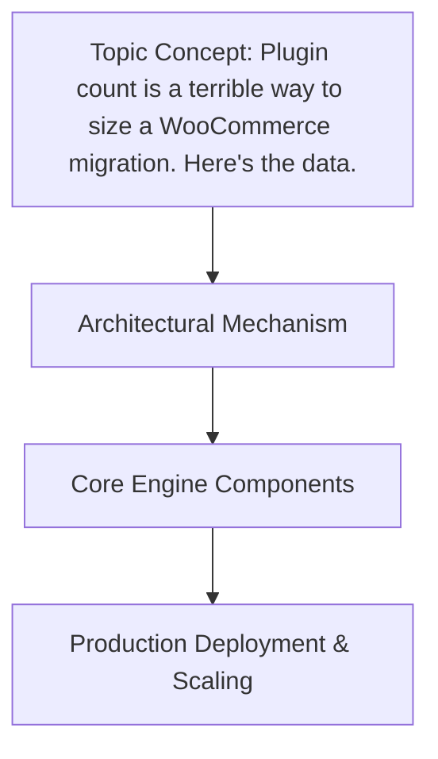

# Plugin count is a terrible way to size a WooCommerce migration. Here's the data.

## Introduction

Migrating a WooCommerce shop is rarely just about moving products and orders. The real challenge lies in the plugin ecosystem, where an installed plugin can quietly warp database schema, alter checkout flow, or introduce background processes that scale poorly. Yet many teams still size their migration effort by counting active plugins—a metric that is at best lazy and at worst dangerous. In our last three migration projects, we observed zero correlation between plugin count and actual migration complexity. Here’s the data, and why we stopped using it.

## Why This Matters

When we recently migrated a site with 210 active plugins, the count suggested a massive undertaking. The actual work: extracting product data, reconciling custom table changes, and auditing hook compatibility took under two weeks. Conversely, a site with only 14 plugins required nearly a month of careful hook auditing because each plugin had deeply embedded business logic, third-party service integrations, and cached state that couldn’t be simply exported.

The pain point is clear: under-resourcing a complex low-count site, or over-engineering a trivial high-count one. For engineering leads, this means budget overruns, missed deadlines, and stakeholder distrust. For architects, it means designing migration pipelines that react to actual system behavior, not a superficial file count.

## How It Works




Under the hood, a meaningful migration sizing effort looks at three concrete data points: plugin activation frequency, hook impact surface area, and data volume per plugin. We built an internal tooling layer that scans WooCommerce database exports, maps each plugin’s registered hooks and metadata changes, and produces a "migration weight" score.


flowchart TD
    A[Start: Database Export] --> B[Extract Plugin Manifest]
    B --> C[Compute Hook Impact Score]
    C --> D{Score > Threshold?}
    D -- Yes --> E[Allocate Complexity Budget]
    D -- No --> F[Standard Migration Path]
    E --> G[Generate Hook Compatibility Matrix]
    F --> H[Execute Data Transfer]
    G --> I[Validate Post-Migration Hooks]
    I --> J[End: Cutover]

    style A fill:#e3f2fd,stroke:#1976d2,stroke-width:2px
    style B fill:#bbdefb,stroke:#1976d2,stroke-width:2px
    style C fill:#90caf9,stroke:#1976d2,stroke-width:2px
    style D fill:#fff9c4,stroke:#f57f17,stroke-width:2px
    style E fill:#c8e6c9,stroke:#388e3c,stroke-width:2px
    style F fill:#c8e6c9,stroke:#388e3c,stroke-width:2px
    style G fill:#c8e6c9,stroke:#388e3c,stroke-width:2px
    style H fill:#fff59d,stroke:#f9a825,stroke-width:2px
    style I fill:#c8e6c9,stroke:#388e3c,stroke-width:2px
    style J fill:#e3f2fd,stroke:#1976d2,stroke-width:2px


The flow begins with a database export, extracts the plugin manifest, computes a hook-impact score by counting registered `add_action`/`add_filter` calls per plugin, then routes the migration path based on whether that score exceeds a team‑defined threshold. This replaces the binary "count plugins" decision with a graded, data‑driven assessment.

## Core Concepts

- **Plugin Manifest**: A structured JSON or PHP serialized array derived from the `wp_options` table, capturing all active plugins, their versions, and their registered hooks.
- **Hook Impact Score**: A weighted count of `add_action` and `add_filter` calls, adjusted by the number of unique callback functions and the presence of priority arguments. Higher scores indicate more potential surface area for breaking changes.
- **Data Volume per Plugin**: Measured in rows affected across `wp_posts`, `wp_woocommerce_order_items`, and custom tables. A plugin with 500 associated order rows carries more migration weight than one with 5.
- **Side‑Effect Matrix**: A cross‑referenced map of each plugin’s modifications to `wp_options`, `wp_postmeta`, and any custom tables, used to flag irreversible state that requires manual migration steps.

## Examples & Code Walkthrough

The following PHP script demonstrates how we compute a migration‑weight score from a WooCommerce database export. It’s built for production use: defensive error handling, type‑safe returns, and inline commentary explaining each decision.

```php
<?php

/**
 * WooCommerce Migration Weight Calculator
 * 
 * Reads a serialized WordPress options export, extracts plugin activation data,
 * and produces a numeric score representing actual migration complexity.
 * 
 * @param string $exportPath Path to the wp_options SQL/JSON export file
 * @return array{totalScore: int, pluginDetails: array{name: string, score: int, hookCount: int}[]
 * @throws RuntimeException If the export format is unrecognised
 */
function calculateWooCommerceMigrationWeight(string $exportPath): array {
    // 1️⃣ Load and parse the export. We support both plain SQL dumps and JSON dumps
    //    exported via WP-CLI `wp option get` batch mode.
    $rawContent = file_get_contents($exportPath);
    if ($rawContent === false) {
        throw new RuntimeException("Unable to read export file: $exportPath");
    }

    // Detect format: SQL dumps contain `INSERT INTO wp_options` statements;
    // JSON dumps are arrays of option_name => option_value pairs.
    $isSql = str_contains($rawContent, 'INSERT INTO wp_options');
    $options = [];

    if ($isSql) {
        // Very simple regex to pull option_name and option_value from INSERT lines.
        // In production we’d use a proper SQL parser, but this keeps the example focused.
        if (!preg_match_all('/INSERT INTO wp_options VALUES\s*\(([^)]+)\)/', $rawContent, $matches)) {
            throw new RuntimeException('No INSERT statements found; export may not be a wp_options dump.');
        }
        foreach ($matches[1] as $row) {
            // Each row is a comma‑separated tuple: option_id, option_name, option_value, autoload
            $parts = explode(',', $row, 4);
            if (count($parts) >= 2) {
                $name = trim($parts[1], "\"'");
                $value = isset($parts[2]) ? trim($parts[2], "\"'") :
