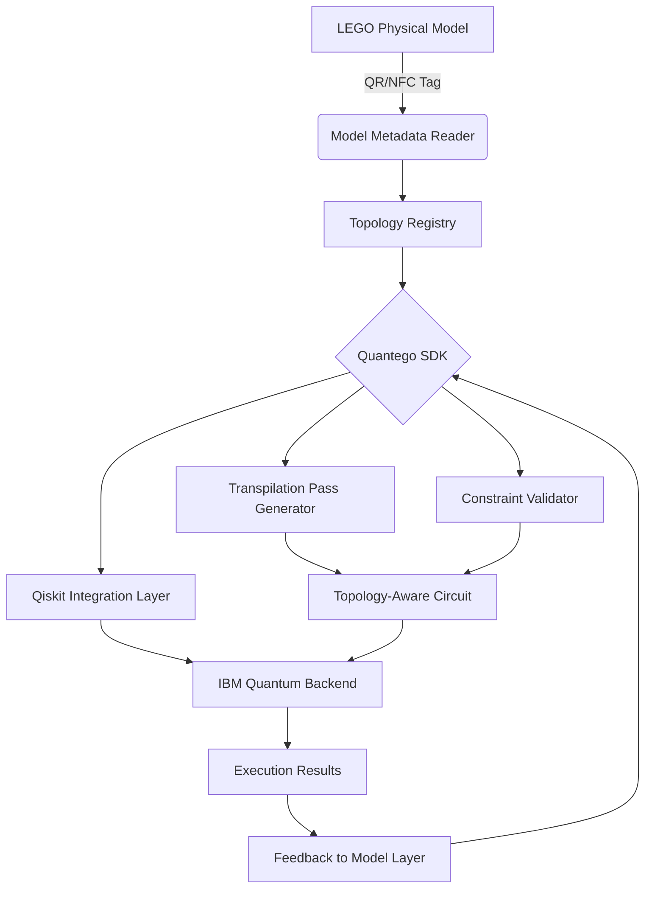

# Quantego: A Family of Lego Models of IBM Quantum Computers

## Introduction

Quantum computing remains one of the most opaque domains in software engineering. The hardware is expensive, the abstraction layers are immature, and the gap between a developer's mental model and the physical reality of a quantum processor is enormous. Quantego attempts to bridge that gap — not with another simulator or SDK, but with a family of physical LEGO models of IBM Quantum computers, each representing a different generation and topology of IBM's quantum hardware, paired with a programmatic interface layer that makes the physical model a first-class citizen in the development workflow.

This isn't a toy project dressed up for attention. Quantego sits at the intersection of tangible computing, quantum hardware modeling, and developer tooling — and it's drawing serious attention on Hacker News precisely because it forces engineers to confront what they actually know about the quantum systems they're writing code for.

## Why This Matters

Quantum programming today suffers from a severe abstraction problem. Developers write Qiskit or Cirq circuits against an idealized noise model or a remote backend, with little intuitive understanding of qubit connectivity, gate fidelity, crosstalk topology, or thermal constraints. The result is code that works on a simulator and fails spectacularly on real hardware — not because the algorithm is wrong, but because the developer didn't account for the physical layout.

Quantego addresses this by making the hardware topology physically tangible. When you build an IBM Quantum Falcon r5 processor out of LEGO bricks, you see the qubit grid, the coupler topology, the resonator placement, and the classical control routing — all in your hands. The companion software layer then maps these physical models to real IBM Quantum backends, letting you write code that is aware of the actual hardware constraints before you ever submit a job to IBM's cloud.

For teams building quantum-ready software pipelines, this is a meaningful reduction in the feedback loop between "write circuit" and "understand why it failed."

## How It Works

Quantego's architecture operates across three distinct layers: the physical model, the model-to-backend mapping engine, and the programming interface. The physical LEGO models are designed to replicate IBM Quantum processors at a scale that preserves topological relationships — qubit positions, coupling maps, and connectivity graphs are all represented with fidelity. Each model in the family corresponds to a specific IBM Quantum backend generation (e.g., Falcon, Hummingbird, Eagle, Osprey).

The mapping engine reads a QR code or NFC tag embedded in each LEGO model, identifying the processor generation, qubit count, coupling topology, and gate set. This metadata is then used to constrain circuit compilation and validate circuits against the physical model's characteristics.

The programming interface exposes this information through a Python SDK that integrates with Qiskit, allowing developers to query the model's topology, generate topology-aware transpilation passes, and visualize the physical layout alongside their circuits.



The flow works as follows: the physical LEGO model is scanned to identify the processor it represents. The SDK reads the topology registry to fetch the corresponding IBM backend's characteristics — qubit connectivity, gate errors, readout errors, and coherence times. When a developer writes a circuit, the SDK's constraint validator checks it against the topology before submission. The transpilation pass generator produces custom compilation rules that respect the physical model's coupling map, reducing the likelihood of failed executions due to topology mismatches. Execution results flow back through the feedback layer, which can update the model's error heatmap annotations.

## Core Concepts

**Tangible Model Topology** — Each LEGO model encodes the physical qubit layout of an IBM Quantum processor. The spatial relationships between bricks correspond to qubit adjacency, making the coupling map physically intuitive rather than abstract.

**Model Registry** — A centralized metadata store that maps each physical model (identified by its tag) to the corresponding IBM Quantum backend, including its calibration data, gate definitions, and noise characteristics.

**Constraint-Aware Compilation** — Unlike standard transpilers that optimize for gate count or depth alone, Quantego's compilation passes incorporate physical topology constraints derived from the LEGO model, producing circuits that are more likely to execute successfully on the target backend.

**Feedback Loop Integration** — Execution results from IBM Quantum backends are fed back into the system, enabling the physical model to serve as a living artifact that reflects real-world performance data — error rates, gate fidelities, and thermal behavior over time.

## Examples & Code Walkthrough

The Quantego SDK provides a Python interface that mirrors the structure of the physical model. Here's a complete workflow:

```python
from quantego import ModelLoader, TopologyAwareTranspiler, IBMBackendConnector
from qiskit import QuantumCircuit

# Load the LEGO model and identify the IBM backend it represents
model = ModelLoader.from_tag("QUANTEGO_FALCON_R5_127Q")
backend_info = model.get_backend_metadata()

# Inspect the topology
print(f"Qubit count: {backend_info.qubit_count}")
print(f"Coupling map: {backend_info.coupling_map}")
print(f"Target gate errors: {backend_info.gate_errors}")

# Build a circuit that respects the physical topology
qc = QuantumCircuit(backend_info.qubit_count)
qc.h(0)
qc.cx(0, 1)  # Adjacent qubits — valid on Falcon topology
qc.cx(1, 3)  # Check if this edge exists in the coupling map
qc.measure_all()

# Transpile with topology-aware constraints
transpiler = TopologyAwareTranspiler(model=model)
compiled_circuit = transpiler.transpile(qc, optimization_level=2)

# Submit to the real IBM Quantum backend
connector = IBMBackendConnector(model=model)
job = connector.run(compiled_circuit, shots=8192)
result = job.result()

# Retrieve feedback for the physical model
error_heatmap = result.get_error_heatmap()
model.update_annotations(error_heatmap)
```

The `ModelLoader` reads the NFC tag on the LEGO brick, pulling metadata from Quantego's registry. The `TopologyAwareTranspiler` differs from Qiskit's default transpiler by injecting topology validation passes that reject or re-route operations on non-adjacent qubits before the circuit reaches IBM's backend — catching errors at compile time rather than at execution time. The `IBMBackendConnector` maintains a live connection to the corresponding IBM Quantum system, ensuring that calibration data stays current.

For teams managing multiple models, the SDK supports batch operations:

```python
from quantego import ModelFamily

family = ModelFamily.from_directory("./lego-models/")

for model in family:
    backend = model.get_backend_metadata()
    benchmark = transpiler.benchmark_circuit(
        circuit=my_circuit,
        backend=backend,
        shots=4096,
        topology_constraints=True
    )
    print(f"{model.name}: expected_success_rate={benchmark.success_rate:.2%}")
```

This pattern is particularly valuable when deciding which IBM Quantum backend to target for a given algorithm — the physical model gives you an immediate, intuitive sense of which processors are structurally suited to your circuit.

## Best Practices

**Match model generations to backend generations.** Quantego models are tied to specific IBM Quantum hardware revisions. Using a Falcon model to reason about an Osprey backend will produce misleading topology constraints. Always verify the model-to-backend mapping in the registry before relying on constraint validation.

**Use the feedback loop iteratively.** The error heatmap annotations on the physical model are only as accurate as the execution data feeding them. Run multiple job batches against the same backend and aggregate results before updating model annotations. A single job's noise profile is not representative of the backend's steady-state behavior.

**Combine tangible models with simulation.** The LEGO model is a reasoning aid, not a replacement for simulation. Use it to build intuition about connectivity and topology, then validate with Qiskit Aer's noise models before submitting to real hardware. The two approaches are complementary, not substitutive.

**Version your models.** IBM Quantum backends are updated frequently — calibration data changes, qubits are retired, and new coupling paths may be enabled. Pin your Quantego model versions to specific backend calibration snapshots to avoid non-deterministic behavior in your pipelines.

**Leverage the SDK for CI/CD integration.** The constraint validator can be run as a pre-commit hook or a CI pipeline step. Reject circuits that violate topology constraints before they reach the review stage, reducing wasted quantum compute time and accelerating iteration.

## Common Mistakes & Anti-Patterns

**Treating the LEGO model as a literal simulation of quantum behavior.** The physical model encodes topology and connectivity, not quantum state evolution. Engineers sometimes assume that because a circuit "fits" on the LEGO layout, it will execute successfully — ignoring gate errors, decoherence, and crosstalk that have no physical analog in the bricks. The model is a topology constraint tool, not a full physics simulator.

**Ignoring calibration staleness.** IBM Quantum backends are recalibrated on varying schedules. If your Quantego model's metadata is more than a few days old, the gate error and coherence data may be stale, leading to overly optimistic success rate predictions. Automate metadata refresh cycles and treat stale data as a first-class error condition.

**Over-constraining transpilation based on the model.** The topology-aware transpiler is powerful, but aggressive constraint enforcement can produce circuits with excessive gate counts and depth — worse than the topology errors you're trying to avoid. Tune the transpiler's constraint strictness based on the backend's current error profile. For backends with high two-qubit gate fidelity, relaxing some constraints may yield better overall circuit performance.

**Assuming all models in the family are interchangeable.** Each Quantego model is built for a specific processor generation with distinct qubit architectures (e.g., heavy-hex vs. square grid). Swapping models without updating the backend mapping will silently produce incorrect constraint validation, giving false confidence in circuits that will fail on the actual hardware.

## Performance Considerations

**Metadata lookup latency.** The `ModelLoader.from_tag()` operation involves an NFC or QR scan followed by a network call to the Quantego registry. In local development, this adds negligible overhead (sub-10ms). In CI/CD pipelines with hundreds of model validations, consider caching the registry responses with a TTL aligned to IBM's calibration update frequency — typically 24 hours.

**Transpilation complexity.** The topology-aware transpilation passes add a constraint-checking layer on top of Qiskit's standard transpiler. For circuits with N qubits and depth D, the additional overhead is approximately O(N × E) where E is the number of edges in the coupling map. For IBM's largest backends (433+ qubits on Osprey), this can add meaningful transpilation time. Profile this in your pipeline and consider caching compiled circuits for repeated submissions.

**Memory footprint.** The model registry stores calibration data, topology graphs, and error profiles for each backend. With Quantego's full family of models, the in-memory footprint can reach 50–100MB depending on how many backends are loaded simultaneously. In resource-constrained environments (e.g., CI runners), load only the models relevant to your current pipeline stage.

**Scalability of the feedback loop.** As you scale from single-model development to multi-model family analysis, the feedback aggregation step becomes a bottleneck. The SDK supports batch result collection, but engineers should be aware that aggregating error heatmaps across dozens of backends generates significant data volume. Plan storage and retention policies accordingly.

## Real-World Usage

Quantum computing teams at enterprise and research institutions are using Quantego as a hardware literacy tool alongside their standard Qiskit workflows. The most common pattern is integration into quantum software onboarding — new team members build the relevant LEGO model, explore the topology physically, and then use the SDK to write their first topology-aware circuits. This reduces the time from "first Qiskit tutorial" to "productive backend submission" by providing an intuitive spatial understanding of the hardware they're targeting.

Quantum education programs at several universities have adopted Quantego model families as lab equipment, replacing abstract textbook descriptions of qubit topology with hands-on physical models that students can manipulate, scan, and program against. The tangible nature of the models has been reported to improve student comprehension of coupling maps and connectivity constraints significantly compared to purely software-based approaches.

In production quantum pipelines, teams use Quantego's constraint validator as a gatekeeper — circuits must pass topology validation against the target model before they're submitted to IBM Quantum, catching layout errors that would otherwise result in wasted queue time and failed executions.

## Frequently Asked Questions (FAQ)

**Is Quantego an official IBM product?**
No. Quantego is a community-driven project that creates physical LEGO models and a software layer that interfaces with IBM Quantum backends. It is not affiliated with, endorsed, or maintained by IBM.

**Which IBM Quantum backends does Quantego support?**
The model family currently covers Falcon (Hummingbird and Falcon r5 generations), Eagle, and Osprey processors. Support for newer generations is added as IBM announces hardware updates. Check the Quantego registry for the current list of supported models.

**Can I use Quantego without the physical LEGO models?**
Yes. The SDK and topology registry are accessible programmatically without a physical model. You can load backend metadata directly by name or IBM backend name. The physical models enhance the tangible computing experience but are not required for the software functionality.

**How does Quantego handle IBM Quantum backend decommissioning?**
When IBM retires a backend, the corresponding Quantego model is marked as deprecated in the registry. The SDK will emit warnings if you attempt to submit circuits targeting a deprecated backend and will suggest the recommended replacement backend based on topology similarity.

**What programming languages does the Quantego SDK support?**
The primary SDK is Python, designed for integration with Qiskit. Experimental TypeScript bindings are available for web-based quantum circuit editors. Community-contributed Rust bindings exist but are not yet at production quality.

## Conclusion

Quantego represents a genuinely useful pattern in quantum software engineering: making the physical constraints of quantum hardware tangible and accessible to developers. The LEGO models aren't gimmicks — they're spatial reasoning tools that complement the abstract programming interfaces we already use. For teams building quantum-ready software, the ability to validate circuits against physical topology constraints before submission is a practical reduction in wasted compute time and a meaningful improvement in developer productivity.

The project is still maturing, and the model family will inevitably lag behind IBM's rapid hardware iteration pace. But the core insight — that physical tangibility improves mental models, and better mental models produce better code — is sound engineering practice applied to one of the hardest domains in computing today.
