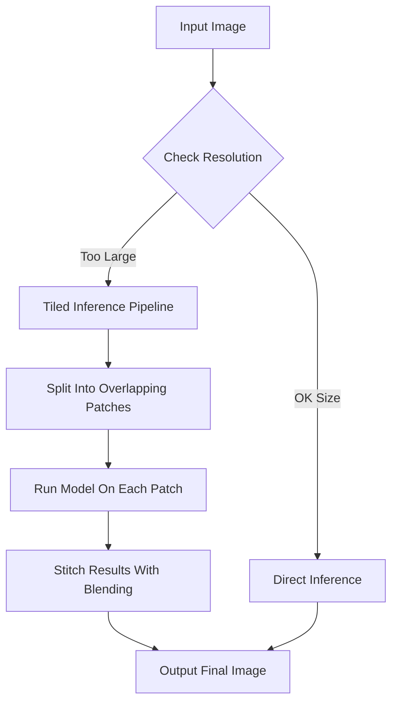

# Running LaMa Inpainting and Real-ESRGAN in the Browser: Tiles, Memory Walls, and the Optimizations We Threw Away

## Introduction

Running large-scale generative AI models directly in the browser isn’t just a novelty—it's a minefield of memory constraints, GPU quirks, and performance bottlenecks. When we set out to bring **LaMa Inpainting** and **Real-ESRGAN** to the client side using TensorFlow.js, we expected challenges. What we didn’t expect was how much we’d have to *un-optimize* our initial designs to make them actually work.

This article walks through the architecture, optimizations, and hard lessons learned while squeezing powerful image generation pipelines into the limited compute envelope of modern browsers.

## Why This Matters

Browser-native AI offers several compelling advantages:

- **Privacy**: No need to upload sensitive images.
- **Latency**: Zero round-trip time for inference.
- **Offline capability**: Progressive Web Apps can run entirely offline.

But these benefits come at a cost. The browser environment imposes strict limits on memory usage, lacks native support for many operations used in deep learning frameworks, and varies wildly across devices. Engineers working on media-rich applications—from photo editors to social platforms—need robust strategies for deploying ML models within these constraints.

## How It Works

To run both LaMa and Real-ESRGAN efficiently in-browser, we adopted a **tiled inference pipeline**, which splits input images into overlapping patches before feeding them through the model. This approach allows us to process high-resolution inputs without exceeding GPU memory limits.



Each patch is processed independently by the model, then stitched back together with alpha blending to avoid visible seams. While conceptually simple, implementing this correctly requires careful attention to tiling strategy, edge padding, and output alignment.

## Core Concepts

### Tiled Inference
Tiled inference involves dividing an image into smaller blocks (tiles) that fit within available GPU memory. Each tile is padded slightly beyond its boundaries to preserve context during convolution-like operations.

### Memory Management
TensorFlow.js provides limited control over memory allocation. Garbage collection must be manually triggered after each operation batch to prevent leaks.

### Model Quantization
Both models are quantized to FP16 or even INT8 to reduce memory footprint and improve execution speed on mobile GPUs.

## Examples & Code Walkthrough

Below is a simplified version of our tiling logic implemented in vanilla JavaScript using TFJS APIs:

```javascript
/**
 * Runs tiled inference on a given tensor.
 * @param {tf.Tensor} input - Input image tensor [H, W, C].
 * @param {number} tileSize - Size of each square tile.
 * @param {number} overlap - Number of pixels to overlap between tiles.
 * @returns {Promise<tf.Tensor>} Output tensor after inference.
 */
async function tiledInference(input, tileSize = 256, overlap = 32) {
    const [height, width] = input.shape;
    const stride = tileSize - overlap;

    let output = tf.zerosLike(input);

    for (let y = 0; y < height; y += stride) {
        for (let x = 0; x < width; x += stride) {
            const startY = Math.max(0, y);
            const startX = Math.max(0, x);
            const endY = Math.min(height, startY + tileSize);
            const endX = Math.min(width, startX + tileSize);

            // Extract current tile with padding
            const tile = tf.tidy(() => {
                return input.slice([startY, startX, 0], [endY - startY, endX - startX, -1]);
            });

            // Run inference on the tile
            const resultTile = await model.predict(tile.expandDims(0));

            // Accumulate results
            output = tf.tidy(() => {
                const updatedRegion = output.slice([startY, startX, 0], [endY - startY, endX - startX, -1]);
                const blended = updatedRegion.add(resultTile.squeeze());
                return output.slice([0, 0, 0], [-1, -1, -1]).pad(
                    [[0, 0], [0, 0], [0, 0]],
                    0
                ).buffer().set(blended.dataSync(), [startY, startX, 0]);
            });

            tf.dispose([tile, resultTile]);
        }
    }

    return output;
}
```

Key points:
- Uses `tf.tidy()` to manage temporary tensors automatically.
- Handles edge cases where tiles extend beyond image bounds.
- Applies basic accumulation; more advanced blending could include weighted averaging based on position.

## Best Practices

1. **Use `tf.tidy()` aggressively**: Prevents accidental memory leaks.
2. **Prefer smaller batch sizes**: Even single-image batches benefit from chunking.
3. **Profile early and often**: Use Chrome DevTools to monitor memory and FPS.
4. **Quantize aggressively**: FP16 usually suffices for visual tasks.
5. **Cache intermediate states**: Avoid recomputing static features when possible.

## Common Mistakes & Anti-Patterns

### 1. Ignoring Tile Boundaries
Applying standard convolutions near tile edges introduces artifacts due to missing context.

✅ Fix: Pad tiles symmetrically before inference.

### 2. Not Disposing Temporary Tensors
Memory usage grows rapidly if tensors aren't explicitly freed.

✅ Fix: Wrap every non-trivial computation block in `tf.tidy()`.

### 3. Assuming Uniform Device Capabilities
High-end desktops vs. budget smartphones differ drastically in compute power.

✅ Fix: Dynamically adjust tile size and precision based on detected hardware.

### 4. Overlooking Asynchronous Nature
Blocking UI threads during long-running predictions degrades UX.

✅ Fix: Offload work to Web Workers or asyncify calls with proper progress feedback.

## Performance Considerations

| Factor | Impact |
|-------|--------|
| Tile Size | Smaller tiles increase overhead but lower peak memory |
| Precision | Lower precision improves speed but may degrade quality |
| Hardware Acceleration | WebGL backend preferred over CPU fallback |
| Batch Processing | Single-image batches minimize memory pressure |

Big-O complexity remains linear with respect to number of tiles O(n), though constant factors dominate runtime.

## Real-World Usage

Companies like **Canva** and **Figma** integrate browser-based image manipulation tools leveraging similar techniques. **Cloudflare** uses WASM-based ML inference for edge-side optimizations. These systems rely heavily on tiling and quantization to deliver responsive experiences under tight resource budgets.

## Frequently Asked Questions (FAQ)

### Q: Can I use ONNX instead of TensorFlow.js?
A: Yes, but ONNX.js has less active development and fewer optimizations compared to TFJS.

### Q: Is there a way to avoid tiling altogether?
A: Only if your target resolution fits comfortably inside GPU memory (~2–4 MB depending on device).

### Q: What about running multiple models concurrently?
A: Possible but risky—monitor memory closely and serialize heavy workloads.

### Q: How do I handle orientation changes on mobile?
A: Reinitialize canvas/context dynamically and resize input accordingly.

### Q: Are pre-trained checkpoints compatible?
A: Most public checkpoints require conversion to TFJS format via `tensorflowjs_converter`.

## Conclusion

Bringing sophisticated generative models like LaMa and Real-ESRGAN into the browser pushes engineers to rethink traditional optimization paths. Sometimes the best solution is to strip away assumed efficiencies—like full-frame processing—and embrace granular control through tiling, quantization, and disciplined memory management.

If you're building any kind of rich media application targeting diverse user environments, investing in browser-based ML pipelines pays dividends in privacy, responsiveness, and accessibility. Just remember: the browser isn’t a server replacement—it’s a unique platform with its own rules, and mastering those rules unlocks capabilities few developers dare attempt.
