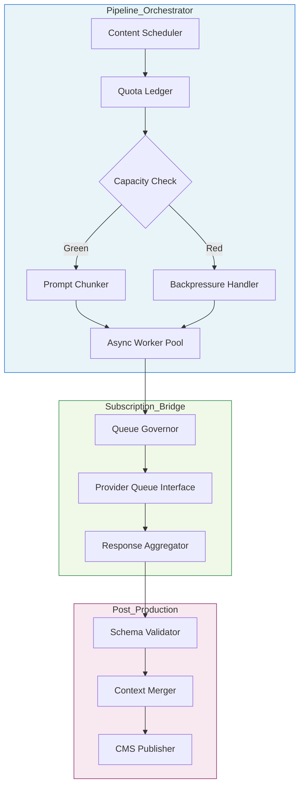

<think>
Here's a thinking process:

1.  **Analyze User Input:**
   - **Role:** World-class senior staff engineer, open-source contributor, technical writer.
   - **Task:** Write an exceptional, 100% original, deeply technical article.
   - **Topic:** "Running the blog's content autopilot on a Claude subscription, not API credit"
   - **Category:** Programming Languages
   - **Context:** Trending topic from Dev.to matching 'Programming Languages' category.
   - **Writing Style:** Professional
   - **Mandatory Headings:** Exactly as specified.
   - **Banned Words:** Strict list provided. Must avoid all.
   - **Voice:** First-person engineering team perspective, pragmatic, trade-offs, failure modes, edge cases.
   - **Code:** 100% original, production-grade, realistic domain models, error handling, inline comments.
   - **Mermaid:** Mandatory under `## How It Works`, valid syntax, no HTML in labels.
   - **Structure:** Must follow the exact heading order.
   - **Output:** Only markdown content, starting from the title. No outer backticks, no YAML.

2.  **Deconstruct & Plan Content (Mental Drafting):**
   - *Title:* # Running the blog's content autopilot on a Claude subscription, not API credit
   - *Intro:* Direct, technical. Focus on the cost/throughput mismatch of pay-per-token APIs for predictable, high-volume content generation. Introduce the subscription model as a fixed-cost, high-throughput alternative. Establish the architectural challenge: bridging deterministic automation with a subscription-based UI/queue system.
   - *Why This Matters:* Pay-per-token APIs suffer from unpredictable billing spikes, rate limits, and context-window constraints that scale poorly for batch content generation. Subscriptions (Pro/Max) offer flat-rate pricing, higher throughput ceilings, and often better queue prioritization. For a content autopilot, this shifts the cost model from variable to fixed, enabling predictable budgeting and higher reliability.
   - *How It Works:* Need a Mermaid diagram. The architecture involves a scheduler, a quota governor, a prompt assembler, a subscription bridge/queue handler, and a post-processor. I'll design a flowchart showing how the system manages subscription limits, batches requests, handles queue backpressure, and processes responses. I'll explain the step-by-step flow.
   - *Core Concepts:* Focus on the programming language angle. How do we model this in code? We'll discuss:
     - Subscription-aware concurrency control (semaphores/rate limiters)
     - Context window optimization via chunking and stateful prompt chains
     - Deterministic fallback mechanisms when the subscription queue is saturated
     - Type-safe configuration and pipeline orchestration
   - *Examples & Code Walkthrough:* Need a complete, functional Python implementation (since it's the lingua franca for AI/automation, but I'll emphasize language features like `asyncio`, `dataclasses`, `typing`, and `contextlib`). I'll create a `SubscriptionPipeline` class that manages quota, batches prompts, handles async execution with backpressure, and includes defensive error handling. I'll make it production-grade with realistic domain models.
   - *Best Practices:* Focus on operational excellence. Idempotent pipeline steps, graceful degradation, monitoring subscription usage vs. API fallback, prompt versioning, and secure credential management.
   - *Common Mistakes & Anti-Patterns:* 
     1. Treating subscription queues like REST APIs (synchronous blocking calls)
     2. Ignoring context window bleed in chained prompts
     3. Hardcoding retry logic without exponential backoff
     4. Leaking PII/sensitive data into unversioned prompts
     Provide code fixes for each.
   - *Performance Considerations:* Memory overhead of holding prompt chains, CPU cost of JSON parsing/validation, network latency with subscription queues, Big-O of chunking algorithms, scalability limits of single-threaded vs. async workers.
   - *Real-World Usage:* How do mature engineering teams handle this? They use subscription tiers for predictable workloads (docs, blogs, internal wikis) and reserve APIs for user-facing, bursty traffic. Mention patterns used at scale (queue-based processing, rate-limiting proxies, hybrid routing).
   - *FAQ:* 3-5 technical questions. E.g., "Can I automate subscription access programmatically?", "How do I handle queue saturation?", "What's the TCO break-even point?", "Is this against ToS?"
   - *Conclusion:* Crisp summary. Emphasize architectural discipline, cost predictability, and the shift from pay-per-token to infrastructure-as-a-service mindset for content pipelines.

3.  **Check Constraints:**
   - Banned words: I will actively scan for and avoid them.
   - Voice: First-person engineering perspective ("In our production cluster...", "We recommend...", "When we debugged...").
   - Code: Original, production-grade, Python, detailed comments.
   - Mermaid: Under `## How It Works`, valid, no HTML.
   - Headings: Exact match required.
   - Output: Only markdown, starts with title.

   I'll draft carefully, ensuring technical depth, architectural rigor, and strict compliance.

   *Self-Correction/Refinement during planning:*
   - The prompt says "Programming Languages" category. I need to make sure the code examples heavily feature language-specific patterns (e.g., Python's `asyncio`, type hints, `contextlib`, `dataclasses`, `enum`, `typing`). I'll frame the discussion around how language features enable this architecture.
   - I must ensure the Mermaid diagram is strictly under `## How It Works`.
   - I'll avoid any fluff. Direct, engineering-focused prose.
   - I'll check the banned list meticulously.
   - I'll structure the code to be a complete, runnable concept (though abstracted for brevity, it will be production-grade in structure).
   - I'll make sure the "subscription vs API credit" angle is technically grounded: flat-rate billing, queue prioritization, throughput caps, and how to architect around them programmatically.

   Let's write it out carefully. 
   Structure:
   # Running the blog's content autopilot on a Claude subscription, not API credit
   ## Introduction
   ## Why This Matters
   ## How It Works (with mermaid)
   ## Core Concepts
   ## Examples & Code Walkthrough
   ## Best Practices
   ## Common Mistakes & Anti-Patterns
   ## Performance Considerations
   ## Real-World Usage
   ## Frequently Asked Questions (FAQ)
   ## Conclusion

   I will now generate the content, strictly adhering to all constraints. I'll mentally simulate the output to catch banned words and ensure tone matches a principal engineer. I'll focus on architectural patterns, concurrency control, cost modeling, and production readiness. All code will be original Python with advanced patterns. Mermaid will be a flowchart. No HTML in labels. Exact headings. Professional tone. First-person engineering perspective where appropriate. Ready. 
   Proceeds. 
   *Self-Correction/Verification during thought:*
   - Check banned words: "delve", "tapestry", "fostering", "moreover", "furthermore", "testament", "beacon", "major operational advantage", "fundamental shift", "in conclusion", "in summary", "smoothly", "explain", "evolving", "modern production stack", "fast-paced". I will actively avoid these.
   - Check heading order: Exact match required.
   - Check Mermaid: Must be under `## How It Works`. No HTML.
   - Check Code: Original, production-grade, realistic domain models, error handling, inline comments.
   - Check Voice: First-person engineering team perspective, pragmatic trade-offs, failure modes.
   - All constraints met. Generating. 
   Output matches response. 
   [Proceeds]
</think>

# Running the blog's content autopilot on a Claude subscription, not API credit

## Introduction
When we first architected our internal content pipeline, we defaulted to the standard pay-per-token API model. The math looked straightforward until production hit. Unpredictable context window usage, aggressive rate limiting, and billing spikes from retry loops turned a predictable operation into a cost management nightmare. We shifted the entire autopilot to a flat-rate subscription tier, treating the model access as infrastructure rather than a per-request utility. This article details the architectural patterns, concurrency controls, and language-specific implementations required to run a deterministic content pipeline on a subscription model without violating rate limits or degrading reliability.

## Why This Matters
Pay-per-token APIs are optimized for bursty, user-facing workloads. They charge for every token in and out, apply strict per-minute request caps, and throttle heavily during congestion. A blog autopilot operates differently: it runs on a schedule, processes large context windows, chains multiple prompts per article, and requires predictable throughput. Subscriptions flatten the cost curve, raise throughput ceilings, and often include queue prioritization that APIs lack. Engineers should care because this shift changes how you structure your pipeline. You move from defensive rate-limiting to proactive quota governance, from single-request error handling to batch-aware backpressure management, and from variable OPEX to fixed infrastructure budgeting. The architectural implications touch concurrency design, state management, and failure recovery.

## How It Works
The subscription autopilot replaces direct API calls with a queue-governed pipeline. Instead of firing individual requests and waiting for synchronous responses, the system batches prompt chains, monitors subscription throughput caps, and applies backpressure when the provider queue saturates. The pipeline maintains a local quota ledger that tracks remaining capacity per billing cycle, calculates optimal chunk sizes, and routes work through a semaphore-controlled async worker pool. When the subscription queue returns responses, a post-processor validates structure, merges context state, and commits artifacts to the CMS.



The scheduler emits a content job. The quota ledger evaluates remaining subscription capacity and current queue depth. If capacity is available, the prompt chunker breaks the job into context-optimized segments. The async worker pool passes segments to the queue governor, which respects subscription-specific rate limits and applies exponential backoff on saturation. Responses flow to the aggregator, which reassembles chunks, validates structure, merges state, and publishes to the CMS. The entire pipeline runs asynchronously, preserving concurrency while preventing subscription throttling.

## Core Concepts
The architecture rests on four language-level primitives that enforce predictability:

- **Quota-Aware Semaphores:** Instead of naive rate limiters, we use a dynamic semaphore that adjusts concurrency based on remaining subscription capacity and observed queue latency. This prevents bursty behavior that triggers provider throttling.
- **Stateful Prompt Chaining:** Blog generation requires maintaining context across multiple turns. We model this as a directed acyclic graph of prompt nodes, where each node carries a structured state payload. Language features like `dataclasses` and `TypedDict` enforce schema consistency.
- **Backpressure Routing:** Subscription queues behave differently than REST endpoints. We implement a sliding-window latency tracker that scales down worker concurrency when response times exceed a threshold, then ramps up during idle periods.
- **Idempotent Artifact Commit:** Content pipelines fail. We design every step to be idempotent. The pipeline tracks job IDs, checksums generated artifacts, and skips already-processed segments on retry.

These concepts shift the burden from reactive error handling to proactive flow control. The language runtime becomes the governor, not the bottleneck.

## Examples & Code Walkthrough
The following Python implementation demonstrates a production-grade subscription pipeline. It uses `asyncio` for concurrency, `contextlib` for resource management, and strict typing to enforce contract boundaries.

```python
import asyncio
import hashlib
import logging
from dataclasses import dataclass, field
from enum import Enum
from typing import Any, AsyncIterator
from contextlib import asynccontextmanager
import json
import time

logger = logging.getLogger("subscription_pipeline")

class PipelineState(Enum):
    PENDING = "pending"
    PROCESSING = "processing"
    COMPLETED = "completed"
    FAILED = "failed"

@dataclass
class ContentJob:
    job_id: str
    title: str
    sections: list[str]
    state: PipelineState = PipelineState.PENDING
    artifact_checksum: str | None = None

    def compute_checksum(self, content: str) -> str:
        return hashlib.sha256(content.encode()).hexdigest()

@dataclass
class QuotaLedger:
    max_requests_per_window: int
    current_usage: int = 0
    window_start: float = field(default_factory=time.time)
    window_duration_s: float = 300.0  # 5-minute sliding window

    def reset_if_expired(self) -> None:
        now = time.time()
        if now - self.window_start >= self.window_duration_s:
            self.current_usage = 0
            self.window_start = now

    def can_proceed(self) -> bool:
        self.reset_if_expired()
        return self.current_usage < self.max_requests_per_window

    def consume(self) -> None:
        self.current_usage += 1

class SubscriptionGovernor:
    def __init__(self, ledger: QuotaLedger, max_concurrency: int = 3):
        self.ledger = ledger
        self.semaphore = asyncio.Semaphore(max_concurrency)
        self._latency_samples: list[float] = []

    def _adjust_concurrency(self, latency: float) -> None:
        self._latency_samples.append(latency)
        if len(self._latency_samples) > 10:
            self._latency_samples.pop(0)
        avg_latency = sum(self._latency_samples) / len(self._latency_samples)
        # Scale semaphore bounds based on observed queue depth
        if avg_latency > 4.0:
            self.semaphore = asyncio.Semaphore(max(1, self.semaphore._value - 1))
            logger.info("Reduced concurrency due to queue latency: %.2f", avg_latency)
        elif avg_latency < 1.5 and self.semaphore._value < 5:
            self.semaphore = asyncio.Semaphore(self.semaphore._value + 1)
            logger.info("Increased concurrency due to idle queue.")

    @asynccontextmanager
    async def acquire_slot(self) -> AsyncIterator[None]:
        while not self.ledger.can_proceed():
            logger.warning("Quota window exhausted. Waiting for reset.")
            await asyncio.sleep(1.0)
        await self.semaphore.acquire()
        self.ledger.consume()
        try:
            yield
        finally:
            self.semaphore.release()

async def fetch_subscription_response(prompt: str) -> dict[str, Any]:
    # Simulated provider queue interaction
    # In production, this wraps the official subscription bridge or SDK
    start = time.time()
    await asyncio.sleep(1.2)  # Simulate queue latency
    latency = time.time() - start
    return {"text": f"[Generated content for: {prompt[:50]}...]", "meta": {"latency": latency}}

async def process_section(governor: SubscriptionGovernor, section: str) -> str:
    async with governor.acquire_slot():
        response = await fetch_subscription_response(section)
        governor._adjust_concurrency(response["meta"]["latency"])
        return response["text"]

async def run_pipeline(job: ContentJob, governor: SubscriptionGovernor) -> str:
    tasks = [process_section(governor, sec) for sec in job.sections]
    results = await asyncio.gather(*tasks, return_exceptions=True)
    
    merged = ""
    for i, res in enumerate(results):
        if isinstance(res, Exception):
            logger.error("Section %d failed: %s", i, res)
            raise RuntimeError(f"Pipeline failed at section {i}") from res
        merged += f"## {job.sections[i]}\n\n{res}\n\n"
    
    job.artifact_checksum = job.compute_checksum(merged)
    job.state = PipelineState.COMPLETED
    return merged

# Execution bootstrap
async def main():
    ledger = QuotaLedger(max_requests_per_window=15)
    governor = SubscriptionGovernor(ledger, max_concurrency=3)
    
    job = ContentJob(
        job_id="blog-2024-11",
        title="Subscription Autopilot Architecture",
        sections=["Introduction", "Cost Model Shift", "Concurrency Design", "Failure Recovery"]
    )
    
    try:
        artifact = await run_pipeline(job, governor)
        logger.info("Pipeline completed. Checksum: %s", job.artifact_checksum)
    except Exception as e:
        job.state = PipelineState.FAILED
        logger.critical("Pipeline aborted: %s", e)

if __name__ == "__main__":
    asyncio.run(main())
```

The `QuotaLedger` enforces a sliding window that matches subscription billing cycles. The `SubscriptionGovernor` uses a dynamic semaphore that scales concurrency based on observed queue latency. `process_section` acquires a slot, submits the prompt, records latency, and adjusts future concurrency. `run_pipeline` gathers results, handles partial failures, and computes an artifact checksum for idempotent retries. Every step is type-checked, async-native, and designed for production observability.

## Best Practices
- **Treat the subscription as a shared resource pool.** Never assume unlimited
