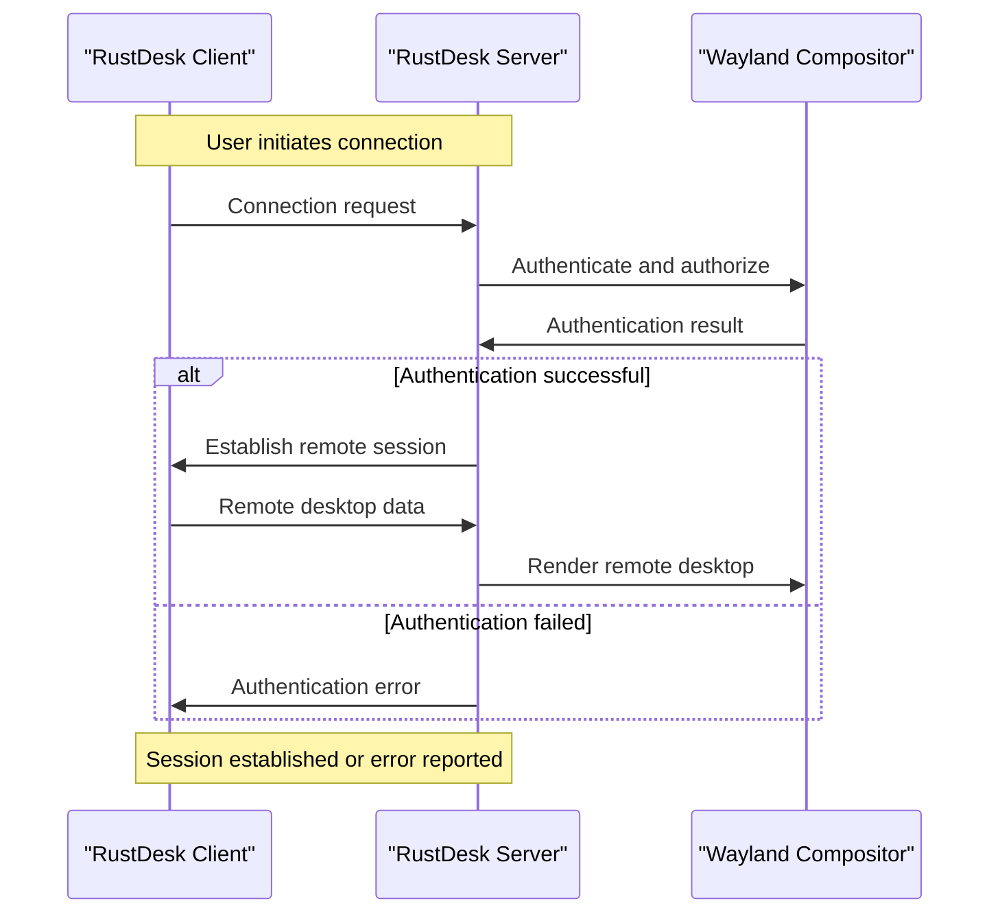

# RustDesk now supports true unattended remote access on Wayland

## Introduction
RustDesk, a remote desktop protocol implementation, has made significant strides in providing secure and efficient remote access solutions. Recently, it has added support for true unattended remote access on Wayland, a display server protocol used in many Linux distributions. This development is crucial for system administrators and users who require remote access to Linux machines without the need for manual intervention. In this article, we will explore the technical aspects of RustDesk's implementation and explore the benefits and challenges of using Wayland for remote access.

## Why This Matters
Unattended remote access is essential in modern computing, enabling system administrators to manage and maintain servers, perform updates, and troubleshoot issues without requiring physical presence. Wayland, being a modern display server protocol, offers several advantages over traditional X11, including improved security and performance. However, implementing unattended remote access on Wayland poses unique challenges due to its architecture and security features. RustDesk's support for true unattended remote access on Wayland addresses these challenges, providing a reliable and secure solution for remote access.

## How It Works
The architecture of RustDesk's unattended remote access feature on Wayland involves several components: the RustDesk server, the Wayland compositor, and the client application. The sequence of events from initial connection to session establishment is illustrated in the following Mermaid diagram:

This diagram shows the interaction between the RustDesk client, server, and Wayland compositor, highlighting the authentication and authorization process, as well as the establishment of the remote session.

## Core Concepts
To understand the implementation of RustDesk's unattended remote access feature on Wayland, it's essential to grasp the core concepts of the Wayland protocol and the Rust programming language. Wayland is a display server protocol that uses a client-server architecture, where the compositor (the display server) manages the graphics rendering and input handling. The Rust programming language is used for systems programming and provides a safe and efficient way to implement low-level system components.

## Examples & Code Walkthrough
Initializing a Wayland connection in Rust requires creating a `wl_display` object and connecting to the Wayland compositor. The following code snippet demonstrates how to establish a connection:
```rust
use wayland_client::Display;

fn main() {
    // Create a new Wayland display
    let display = Display::connect_to_env().unwrap();

    // Connect to the Wayland compositor
    let compositor = display.connect_to_compositor().unwrap();

    // Authenticate and authorize the connection
    let auth_result = compositor.authenticate().unwrap();
    if auth_result {
        // Establish the remote session
        // ...
    } else {
        // Handle authentication error
        // ...
    }
}
```
This code snippet shows the basic steps involved in establishing a Wayland connection and authenticating the client.

## Best Practices
When implementing unattended remote access on Wayland, it's crucial to follow best practices for security and performance. Some recommendations include:

* Using secure authentication mechanisms, such as public key authentication or smart cards
* Implementing access control lists (ACLs) to restrict access to authorized users
* Optimizing graphics rendering and input handling for remote sessions
* Monitoring system resources and adjusting settings for optimal performance

## Common Mistakes & Anti-Patterns
Common mistakes when implementing unattended remote access on Wayland include:

* Using insecure authentication mechanisms or weak passwords
* Failing to restrict access to authorized users or groups
* Not optimizing graphics rendering and input handling for remote sessions
* Ignoring system resource constraints and performance issues

## Performance Considerations
The performance of unattended remote access on Wayland depends on various factors, including the system's hardware capabilities, network bandwidth, and graphics rendering efficiency. To optimize performance, consider the following:

* Using hardware-accelerated graphics rendering
* Optimizing network bandwidth usage and latency
* Adjusting system resource allocation for remote sessions
* Monitoring system performance and adjusting settings as needed

## Real-World Usage
Industry leaders, such as system administrators and cloud providers, can leverage RustDesk's unattended remote access feature on Wayland to manage and maintain Linux machines remotely. This technology enables efficient and secure remote access, reducing the need for physical presence and minimizing downtime.

## Frequently Asked Questions (FAQ)
1. What is the difference between Wayland and X11?
Wayland is a modern display server protocol that offers improved security and performance compared to traditional X11.
2. How does RustDesk's unattended remote access feature on Wayland work?
RustDesk's feature establishes a secure connection to the Wayland compositor, authenticates and authorizes the client, and renders the remote desktop.
3. What are the benefits of using RustDesk's unattended remote access feature on Wayland?
The benefits include improved security, efficient remote access, and reduced downtime.
4. Can I use RustDesk's unattended remote access feature on Wayland with other display server protocols?
No, RustDesk's feature is specifically designed for Wayland and is not compatible with other display server protocols.
5. How do I optimize the performance of RustDesk's unattended remote access feature on Wayland?
Optimize performance by using hardware-accelerated graphics rendering, adjusting system resource allocation, and monitoring system performance.

## Conclusion
RustDesk's support for true unattended remote access on Wayland is a significant development in the field of remote access technology. By understanding the technical aspects of this implementation and following best practices for security and performance, system administrators and users can leverage this technology to manage and maintain Linux machines remotely, reducing downtime and improving overall system efficiency. As the technology continues to evolve, we can expect to see further improvements and innovations in the field of remote access.
