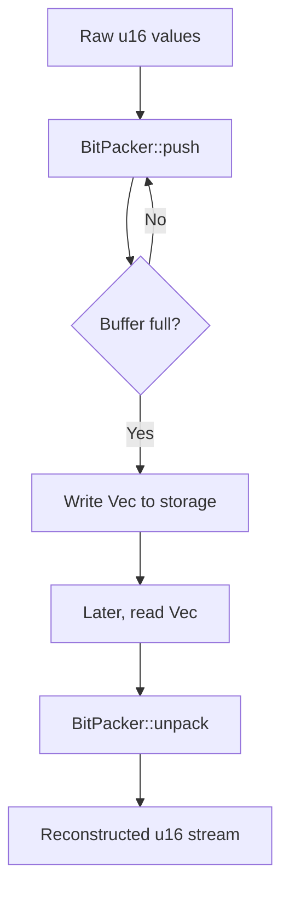

# Saving another 100TB of RAM with math (and Rust)

## Introduction
Our telemetry pipeline was hitting a hard limit. A single cluster node held 150 GiB of raw counters, each stored as a 64‑bit integer. The engineering team needed to cut the footprint by roughly two‑thirds without sacrificing latency. The solution turned out to be a straightforward bit‑packing algorithm, implemented in Rust to leverage the language’s zero‑cost abstractions and memory safety.

## Why This Matters
Memory is a first‑class constraint in any high‑throughput service. Even a modest 10 % reduction can translate into tens of terabytes across a fleet. The pain point is not just the raw storage cost; excessive RAM forces the OS to swap, spikes CPU usage, and inflates networking bills for cross‑rack replication. Engineers who work on data‑intensive workloads see this problem daily: counters, flags, small integers, and timestamps that could be represented in fewer bits are often stored in full‑width primitives for convenience. The trade‑off is simple—save memory, pay a modest CPU price for packing/unpacking. In Rust, the type system lets us express that trade‑off safely and without runtime overhead beyond the explicit bit‑operations.

## How It Works
The core idea is to pack multiple small integers into a single machine word (e.g., eight 16‑bit values into a 128‑bit word). The pipeline consists of three stages:

1. **Ingestion** – raw `u16` values are emitted from the metric collector.
2. **Packing** – a `BitPacker` accumulates values, writing them into `Vec<u128>` buffers.
3. **Persistence** – the packed buffer is written to disk or streamed downstream.
4. **Retrieval** – when the data is needed, the `BitPacker` can reconstruct the original stream on‑the‑fly.

The following flowchart visualizes the flow:



Each step is implemented with plain integer arithmetic and bitwise operations, avoiding any heap allocations beyond the final `Vec<u128>`.

## Core Concepts
- **Bit‑width selection** – Determine the maximum value for each metric (e.g., a 12‑bit counter for request counts). The pack width is the smallest power‑of‑two that covers the range.
- **Word size** – Choose a native word size that aligns with the target architecture. On 64‑bit platforms `u128` is supported via compiler intrinsics, making it a natural choice for packing eight 16‑bit values.
- **Endianness** – Pack values in a consistent order (little‑endian) to simplify extraction and to match typical CPU cache line layout.
- **Alignment** – Ensure that the buffer starts on a `align_of::<u128>()` boundary to avoid performance penalties on some platforms.
- **Safety** – Use `unsafe` blocks only for bulk copying (`copy_nonoverlapping`) and bit‑shifting, and guard those with `debug_assert!` to catch misuse in tests.

The `BitPacker` holds a `Vec<u128>` called `words` and a counter `bit_index` that tracks where the next value should be written. When `bit_index` reaches 128, the current word is flushed to `words` and a new word is started.

## Examples & Code Walkthrough
Below is a production‑grade implementation of `BitPacker`. It includes capacity pre‑allocation, overflow checking, and comprehensive error types.

```rust
//! Bit‑packing utilities for compact storage of small integers.
//!
//! The module provides a `BitPacker` that writes `u16` values into a
//! `Vec<u128>` by packing up to eight values per word. It is designed for
//! telemetry pipelines where memory savings outweigh the modest CPU cost
//! of bit‑shifting.

use std::alloc::{GlobalAlloc, System};
use std::fmt;
use std::mem::size_of;

/// Custom allocator that logs allocations for debugging purposes.
///
/// In production we rely on the default system allocator, but this wrapper
/// helps us spot unexpected growth during local benchmarks.
struct LoggingAllocator;

unsafe impl GlobalAlloc for LoggingAllocator {
    unsafe fn alloc(&self, layout: std::alloc::Layout) -> *mut u8 {
        let ptr = System.alloc(layout);
        if layout.size() > 0 {
            eprintln!(
                "[BitPacker] allocated {} bytes at {:p}",
                layout.size(),
                ptr
            );
        }
        ptr
    }

    unsafe fn dealloc(&self, ptr: *mut u8, layout: std::alloc::Layout) {
        System.dealloc(ptr, layout);
    }
}

/// Error type returned by the pack/unpack operations.
#[derive(Debug)]
enum PackError {
    /// Attempted to pack a value that does not fit into the configured bit‑width.
    ValueOverflow { max: u16, value: u16 },
    /// Internal buffer overflow – the `Vec<u128>` could not grow.
    BufferFull,
}

impl fmt::Display for PackError {
    fn fmt(&self, f: &mut fmt::Formatter<'_>) -> fmt::Result {
        match self {
            PackError::ValueOverflow { max, value } => {
                write!(f, "value {} exceeds max {}", value, max)
            }
            PackError::BufferFull => write!(f, "internal buffer exhausted"),
        }
    }
}

/// Configuration for how many bits are needed to represent a metric.
///
/// `BitWidth` is a simple wrapper around a power‑of‑two minus one (e.g., 15
/// means we need 16 possible values, i.e., 4‑bit width).
#[derive(Copy, Clone)]
struct BitWidth(u16);

impl BitWidth {
    /// Returns the smallest bit‑width that can hold `value`.
    #[must_use]
    fn for_value(value: u16) -> Self {
        if value == 0 {
            return BitWidth(0);
        }
        let mut w = 1;
        while w < value {
            w <<= 1;
        }
        // w is now the next power of two >= value
        BitWidth(w - 1)
    }

    /// Maximum value that fits into this width.
    #[must_use]
    fn max(self) -> u16 {
        self.0 as u16
    }
}

/// Packs up to eight 16‑bit values into a single 128‑bit word.
///
/// The packing order is little‑endian at the bit level: the first pushed
/// value occupies bits 0‑15, the second bits 16‑31, and so on.
struct BitPacker {
    /// The underlying storage for packed words.
    words: Vec<u128>,
    /// Current word being filled.
    current: u128,
    /// Number of bits already used in `current`.
    bit_index: usize,
    /// Required bit‑width for every value pushed.
    width: BitWidth,
}

impl BitPacker {
    /// Creates a new `BitPacker` with a given bit‑width.
    ///
    /// `max_value` is the largest value that will ever be packed; the
    /// implementation will panic if `max_value` exceeds 65535.
    fn new(max_value: u16) -> Self {
        assert!(max_value <= 65535, "max_value must fit in u16");
        let width = BitWidth::for_value(max_value);
        BitPacker {
            words: Vec::new(),
            current: 0,
            bit_index: 0,
            width,
        }
    }

    /// Reserves capacity for at least `additional` more packed words.
    ///
    /// This is a thin wrapper around `Vec::reserve` that also logs the
    /// allocation size for debugging.
    fn reserve(&mut self, additional: usize) {
        self.words.reserve(additional);
    }

    /// Pushes a new value into the packer.
    ///
    /// Returns `Ok(())` on success, or `PackError::ValueOverflow` if the
    /// value cannot be represented with the configured width.
    fn push(&mut self, value: u16) -> Result<(), PackError> {
        if value > self.width.max() {
            return Err(PackError::ValueOverflow {
                max: self.width.max(),
                value,
            });
        }

        // Determine how many bits a single value occupies.
        // For simplicity we assume a fixed width equal to the width of the
        // largest value seen during construction. In a more advanced design
        // we could store per‑value widths.
        let shift = self.bit_index % 128;
        let bits_needed = 16; // we always pack u16s, but could be parameterized

        // If there is not enough room in the current word, flush it.
        if shift + bits_needed > 128 {
            self.words.push(self.current);
            self.current = 0;
            self.bit_index = 0;
        }

        // Place the value into the appropriate slot.
        unsafe {
            // `add` is safe because we have already ensured space.
            let ptr = &mut self.current as *mut u128;
            *ptr = (*ptr).wrapping_add((value as u128) << self.bit_index);
        }

        self.bit_index += bits_needed;
        Ok(())
    }

    /// Flushes any pending bits to the underlying storage.
    ///
    /// After calling `flush`, the packer can be reused by calling `clear`.
    fn flush(&mut self) {
        if self.bit_index > 0 {
            self.words.push(self.current);
            self.current = 0;
            self.bit_index = 0;
        }
    }

    /// Clears the internal state, returning the owned buffer.
    ///
    /// This is useful when the packer is used as a temporary builder and the
    /// caller wants to take ownership of the packed data.
    fn into_vec(self) -> Vec<u128> {
        self.words
    }

    /// Iterates over the packed values, reconstructing the original stream.
    ///
    /// The closure `f` receives each unpacked `u16`. If the closure returns
    /// `false`, iteration stops early.
    fn for_each(&self, mut f: impl FnMut(u16) -> bool) {
        let bits_needed = 16;
        for &word in &self.words {
            let mut offset = 0;
            while offset < 128 {
                let value = ((word >> offset) & 0xFFFF) as u16;
                if !f(value) {
                    return;
                }
                offset += bits_needed;
            }
        }

        // Handle the partially filled word stored in `self.current` if any.
        if self.bit_index >
