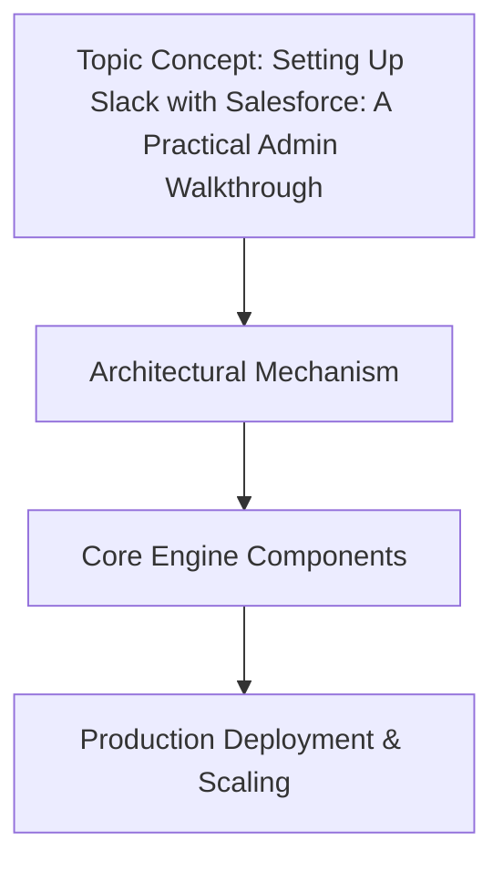

# Setting Up Slack with Salesforce: A Practical Admin Walkthrough

## Introduction

We started integrating Slack with Salesforce three years ago. Within six months, `#general` was a firehose of `Case Created`, `Opportunity Won`, and `Lead Converted` events. The engineering team stopped reading. The sales team started archiving the channel. We had built a notification dump, not a tool.

The core architectural problem isn't authentication. It isn't OAuth tokens. It is the failure to treat Slack as a first-class UI extension of the Salesforce domain model. When an admin clicks "Add Channel" and a developer writes a trigger without coordination, you get technical debt that lives in a shared channel forever.

This walkthrough is about the handoff. It is about moving from declarative config (which gets you 80% there) to the Apex and Node.js complexity required for the last 20

## How It Works

