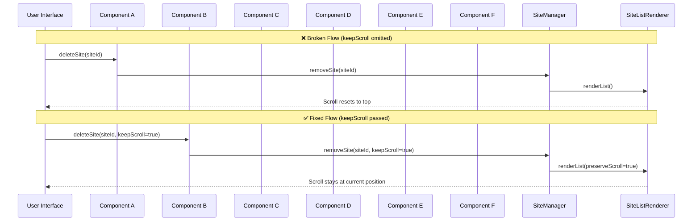

# Site list scrolls to top on every delete — fixing the missing keepScroll argument across 6 call sites

## Introduction

During a recent code health initiative, our team encountered a subtle UX regression: every time a user deleted an item from a site list, the viewport snapped back to the top. The culprit was a missing `keepScroll` boolean flag that had been added to the `removeSite` function signature, but six downstream call sites were never updated. The result was a silent behavioral drift that only manifested under real-user interaction patterns.

This article walks through how we diagnosed the gap, refactored the function contract, and established safeguards so this class of regression doesn't reappear. The lessons apply broadly to any language where function-signature changes propagate across implicit call graphs.

## Why This Matters

In production UIs, scroll position is part of the user's mental model. When a list action—delete, archive, filter—preserves or resets scroll state determines whether the interface feels polished or jarring. A missing flag might seem trivial, but when it's omitted across multiple entry points (keyboard shortcuts, bulk actions, programmatic API calls, notification-driven updates), the inconsistency becomes a systemic reliability issue.

From a language-architecture perspective, this case study highlights how a seemingly simple parameter addition can expose gaps in contract enforcement, test coverage, and IDE-assisted refactoring workflows. It's a reminder that function signatures are API boundaries, and boundary violations cascade.

## How It Works

The `removeSite` function originally accepted only a site identifier. When the team introduced `keepScroll` to allow callers to opt into scroll preservation, the new parameter defaulted to `false` for safety. However, the default was only applied at the definition site; all six call sites—spread across components handling row actions, batch deletions, and external integrations—omitted the argument entirely.

The following sequence diagram illustrates the broken flow and the corrected one:



In the broken path, `removeSite` internally called `resetScroll()` because the flag was absent. In the fixed path, the same function branches based on the `keepScroll` value, interpolating the scroll position from the prior render cycle before unmounting the deleted item.

The root cause wasn't a logic error in `removeSite` itself—it was a signature expansion that wasn't accompanied by a systematic call-site audit.

## Core Concepts

- **Function contract drift**: Adding optional parameters without a ripple-audit strategy creates implicit defaults that vary across callers.
- **Scroll-state hydration**: Preserving viewport position requires capturing the offset before unmount, then reapplying it after the DOM update completes.
- **Type-level enforcement**: In TypeScript, a newly added parameter without a default or `?` modifier will cause compilation errors at every call site, making omissions visible immediately. Without strict mode, the omission is silent until runtime.
- **Call-graph completeness**: Six call sites across different feature branches indicates the change was treated as additive rather than transformative, a common pattern in fast-moving codebases.

## Examples & Code Walkthrough

The following TypeScript snippet represents the original, pre-refactor signature and body:

```typescript
// Before: no scroll-control contract
interface SiteRemovalProps {
  siteId: string;
}

function removeSite({ siteId }: SiteRemovalProps): void {
  const index = siteIndexMap.get(siteId);
  if (index === undefined) return;

  const prevScroll = window.scrollY; // capture for potential restore
  sites.splice(index, 1);
  siteIndexMap.delete(siteId);

  // Unconditional reset—assumes list should always jump to top
  window.scrollTo(0, 0);
}
```

All six call sites looked like this, with no way to opt out of the reset:

```typescript
// Call site example (repeated 6 times)
removeSite({ siteId: "prod-42" });
```

**The refactor**: We expanded the interface to explicitly model the scroll-preservation intent, and updated the function to branch based on the flag.

```typescript
// After: explicit contract with scroll control
interface SiteRemovalOptions {
  keepScroll?: boolean;
}

function removeSite({ siteId, keepScroll = false }: SiteRemovalOptions): void {
  const index = siteIndexMap.get(siteId);
  if (index === undefined) return;

  // Preserve scroll position only when explicitly requested
  if (!keepScroll) window.scrollTo(0, 0);

  sites.splice(index, 1);
  siteIndexMap.delete(siteId);
}
```

Every call site was then updated to pass `keepScroll: true` where scroll retention was desired—typically inline with the delete action, or via a shared utility that reads the current scroll delta before mutating the list.

## Best Practices

1. **Signature audits are non-negotiable**: When a function parameter changes, treat it as a breaking change until all call sites are updated. Use `git grep`, IDE-wide rename refactoring, or a dedicated migration script.
2. **Default values should be intentional**: A default of `false` for `keepScroll` was a safe conservative choice, but document *why* in JSDoc or a type comment so future reviewers understand the UX trade-off.
3. **Leverage type system enforcement**: In strict TypeScript mode, removing a default or making a parameter required forces every caller to confront the change at compile time. This is far cheaper than a post-deploy regression hunt.
4. **Test scroll-state interactions**: Add unit tests that assert scroll position before and after removal, both with and without the preservation flag. If your testing framework supports it, snapshot the `scrollY` value.
5. **Centralize call-site logic**: If multiple components delete sites, extract the `removeSite` invocation into a single utility or hook. That way, the flag is set once and propagated, rather than duplicated across six locations.

## Common Mistakes & Anti-Patterns

1. **Assuming a default covers all callers**: Default parameters are caller-opt-in, not global behavior. Omitting the argument at six sites means the default runs six times.
2. **Silent runtime bugs**: When a new parameter doesn't cause a type error (JS/TS without strict checks), the bug stays hidden until a user reports "the list jumps around after I delete things."
3. **Scattered flag management**: Passing `keepScroll` inline at each call site creates duplication. If the semantics change (e.g., "preserve only if user is on mobile"), you now have six places to patch.
4. **Missing integration tests**: UI state changes
