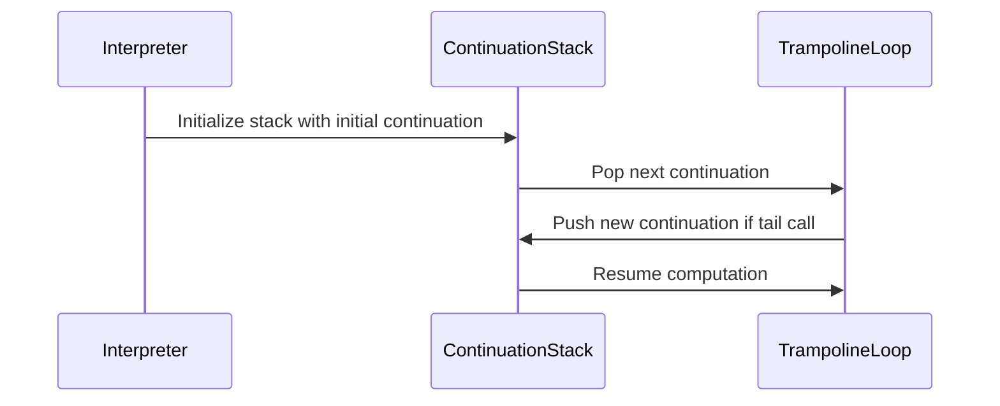

# Tail-Call Interpreters in Rust – Jimmy Ostler  

## Introduction  
Recursion is a powerful tool, but in systems programming, it comes with a critical flaw: unbounded stack growth. A poorly designed recursive function can crash your application with a stack overflow, leaving little room for recovery. Tail-call elimination—a technique that recycles stack frames for recursive calls—solves this problem. Yet Rust, a language built for performance and control, lacks built-in tail-call optimization (TCO). This article explores how Jimmy Ostler’s work on tail-call interpreters in Rust bridges this gap, enabling safe, efficient recursion in systems code.  

## Why This Matters  
Imagine implementing a parser for a DSL or a tree-walking algorithm in Rust. Without TCO, deep recursion risks stack exhaustion, forcing developers to switch to iterative loops or unsafe manual stack management. Jimmy Ostler’s approach to tail-call interpreters offers a middle ground: a runtime system that mimics TCO without compiler support. This is critical for embedded scripting, domain-specific languages (DSLs), or high-level abstractions embedded in performance-critical Rust code. By ensuring tail-call safety at the interpreter level, we gain the expressiveness of recursion without its pitfalls.  

## How It Works  
The core idea is to replace the call stack with an explicit stack of *continuations*—functions representing the remaining computation after a call. Instead of pushing new frames onto the OS stack, the interpreter manages these continuations in a loop, effectively simulating tail calls. Let’s break this down with a Mermaid diagram:  



Here, the interpreter processes a continuation stack rather than relying on the OS stack. When a tail call occurs, the new function’s continuation replaces the current one in the stack. The loop (`TrampolineLoop`) iterates until the final result is returned. This eliminates unbounded stack growth while preserving the syntax and semantics of recursion.  

## Core Concepts  
### Explicit Stack  
The interpreter maintains a `Vec<Cont>` (continuation) that acts as a manual stack. Each continuation captures the state after a call, allowing the interpreter to "jump" back to it after execution.  

### Continuations  
A continuation is a closure over the remaining computation. For example, after evaluating an expression, the interpreter might hold a continuation that resumes evaluation of a larger expression or returns a value.  

### Trampoline  
Instead of recursive function calls, the interpreter returns a `Step` enum (`Continue(Thunk)` or `Done(T)`). The loop processes these steps iteratively, avoiding actual function calls and stack growth.  

## Examples & Code Walkthrough  
Here’s a simplified τ-Lang interpreter demonstrating these ideas:  

```rust  
// Evaluation context  
struct Env(HashMap<String, Value>);  

// Continuation enum  
enum Cont {  
    Call { func: String, args: Vec<Value>, k: Box<Cont> },  
    Return(Value),  
}  

// Interpreter loop  
fn interpret(mut cont: Cont, env: Env) -> Value {  
    loop {  
        match cont {  
            Cont::Call { func, args, k } => {  
                // Evaluate function application  
                let result = apply_function(func, args, env);  
                cont = *k; // Tail call: replace current continuation  
            }  
            Cont::Return(v) => return v,  
        }  
    }  
}  
```  

In this code:  
- `apply_function` evaluates a function call and returns a value.  
- When a tail call occurs (e.g., `return` or recursive call), the new continuation (`k`) replaces the current one.  
- The loop ensures no stack growth, as continuations are processed iteratively.  

## Best Practices  
1. **Enforce Tail Calls**: Design your language or DSL to require tail calls for recursion. Non-tail calls should trigger errors or require manual stack management.  
2. **Optimize Continuations**: Avoid redundant state in continuations. For example, capture only necessary variables in closures.  
3. **Error Handling**: Treat stack overflow as a logic error, not a runtime panic. Return `Result<T, Error>` to let callers handle failures gracefully.  

## Common Mistakes & Anti-Patterns  
- **Ignoring Tail Call Rules**: Allowing non-tail recursion in a tail-call-safe interpreter defeats the purpose. Always audit your language’s grammar.  
- **Leaky Continuations**: Capturing large environments or closures in continuations bloats memory. Keep continuations minimal.  
- **Forgetting to Box Continuations**: Using `Box<Cont>` ensures heap allocation for continuations, preventing stack allocation limits.  

## Performance Considerations  
The explicit stack approach trades OS stack efficiency for controlled memory usage. Each continuation is heap-allocated, but this avoids stack overflows. CPU overhead from the loop is minimal compared to the cost of stack management in recursive calls. For high-throughput scenarios, benchmark against iterative implementations, but the safety benefits often justify the trade-off.  

## Real-World Usage  
Jimmy Ostler’s work has inspired projects like embedded scripting engines in Rust (e.g., `tauri` or `wasm-bindgen` bindings). Tail-call interpreters are also used in DSLs for configuration or domain modeling, where recursion depth is unpredictable but correctness is critical.  

## Frequently Asked Questions (FAQ)  
**Q: Why not use a language with built-in TCO?**  
A: Rust’s performance and safety model make it ideal for systems code. Tail-call interpreters let you leverage recursion safely where languages like Haskell or Scala might be overkill.  

**Q: Can this approach handle non-tail calls?**  
A: No—non-tail calls require actual stack frames. This interpreter enforces tail-call discipline to stay safe.  

**Q: Is this faster than manual iteration?**  
A: It depends. The loop overhead is low, but manual iteration might be faster for simple cases. Use profiling to decide.  

## Conclusion  
Tail-call interpreters in Rust aren’t a silver bullet, but they solve a critical problem: safe recursion in systems programming. By managing continuations explicitly, we reclaim the elegance of recursion without sacrificing stack safety. Jimmy Ostler’s contribution shows that with careful design, Rust can support functional patterns at runtime—proving that safety and performance aren’t mutually exclusive. For engineers building DSLs, embedded interpreters, or high-level abstractions, this pattern is a powerful tool.
