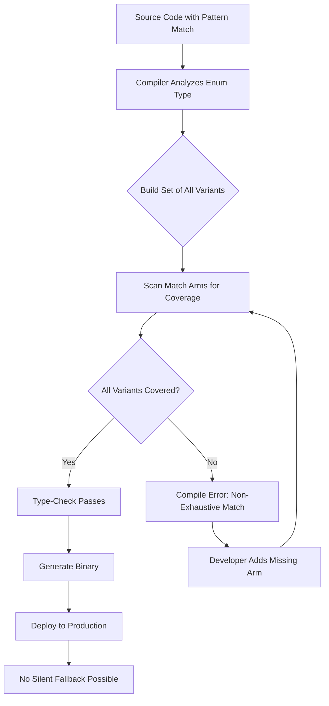

# The check that could not fail

## Introduction

Last year, a teammate merged a PR that added `crypto_wallet` to our payment method enum. The `switch` statement in our dispatch logic got a new `case`, but the `default` branch silently routed the unknown method to the credit card processor. We discovered the bug six weeks later when a customer's ETH donation was charged a 2.9% Visa fee. No test caught it — our test suite never exercised that path.

That bug is the kind that haunts you at 2 AM. Not because it's clever, but because it's *boring*. A missing branch on a new enum value. A silent fallback that does the wrong thing with zero signal.

What if the language itself made this class of bug *impossible*?

This article is about checks that cannot fail — compile-time guarantees that eliminate entire categories of runtime errors before your code ever leaves your machine. We'll walk through Rust's exhaustive pattern matching and TypeScript's `never` type, see how they work under the hood, and talk about when (and when not) to reach for them.

## Why This Matters

Every year, production incidents trace back to the same root cause: a code path that wasn't handled. It's not a null pointer or a race condition — it's a missing branch. A new enum member that slipped through an incomplete `switch`. An unrecognized status code that defaulted to "success."

Runtime checks — assertions, guards, `if` branches with a fallback — all share the same fatal flaw: they only run when the code executes, and only for the inputs the test suite happened to cover. If you add a new enum variant and nobody writes a test for it, the fallback path becomes your production bug.

Compile-time checks flip this equation entirely. The compiler *refuses* to produce a binary unless every possible case is accounted for. The check doesn't depend on test coverage, CI pipeline timing, or whether someone remembered to add a test case after the PR review. It's baked into the build itself.

For teams shipping high-throughput systems — payment processors, protocol implementations, distributed state machines — this isn't a nice-to-have. It's a structural defense against the most common and most expensive class of software defect.

## How It Works

The core mechanism is straightforward in principle: the compiler maintains a set of all possible values a variable can hold, then verifies that every value in that set is handled by the code under analysis. When the set of unhandled values is empty, the check passes. When it's not, the build fails.

Here's the architectural flow:



Let's walk through what happens step by step:

1. **Type resolution.** The compiler inspects the enum definition and builds a complete list of its variants. For Rust's `NetworkPacket`, that's `Handshake`, `DataChunk`, `Disconnect`, and `KeepAlive`. For a TypeScript union type like `"http" | "websocket" | "grpc" | "sse"`, the compiler tracks all four string literals.

2. **Pattern analysis.** The compiler walks through every `match` arm (Rust) or `switch` case (TypeScript with `never` narrowing) and subtracts the handled variants from the set of uncovered ones.

3. **Coverage check.** If the uncovered set is empty, compilation proceeds. If any variant remains unhandled, the compiler emits an error and refuses to produce the binary.

4. **Build-time enforcement.** Because this happens during compilation — before the code ever runs — there is no scenario where an unhandled variant slips into production. The check literally cannot fail unless the developer intentionally suppresses it (and even then, the compiler warns you).

The key insight is this: the compiler acts as a proof engine. It doesn't just *check* your code; it *proves* that certain failure paths don't exist in the compiled artifact. That's a fundamentally different guarantee than anything you get from runtime testing.

## Core Concepts

### Exhaustiveness Checking

Exhaustiveness checking is the compiler's ability to verify that a pattern match handles every possible value of a sum type (also called a tagged union or variant type). In languages without this feature, a match expression can silently ignore cases — or worse, fall through to a default that does something incorrect.

In Rust, exhaustiveness checking is a first-class language guarantee. The `match` keyword is the only way to destructure an enum, and the compiler demands that every variant is covered. There is no `default` case that can silently swallow unhandled variants.

### The `never` (Bottom) Type

The `never` type represents a value that can never exist. In TypeScript, it's the type of expressions that always throw, always loop forever, or always return early. When you use `never` in a type narrowing context, you're essentially saying: "If I've handled every other case, the remaining value *cannot* exist — and if it does, that's a type error."

This is what makes TypeScript's exhaustive checking work. After you've covered every member of a union type in a `switch` statement, the narrowed type of the unmatched variable becomes `never`. Assigning `never` to anything (or using it in a return type) triggers a compile error if the union has been extended with new members.

### Sum Types vs. Product Types

Understanding the difference matters here. A **product type** (like a struct or object) combines fields — a value has *all* of them simultaneously. A **sum type** (like an enum or union) presents alternatives — a value is *exactly one* of the variants. Exhaustiveness checking applies to sum types because the set of alternatives is finite and known at compile time.

### The Compiler as Proof Assistant

When you write an exhaustive match in Rust, you're not just writing code — you're writing a proof. The proof says: "For every possible state this variable can be in, I have defined behavior." The compiler verifies that proof. If the proof is incomplete, the build fails. This is the same principle behind formal verification tools like Coq or Agda, except it's built into everyday language syntax.

## Examples & Code Walkthrough

### Rust: Network Packet Dispatcher

Here's a realistic scenario — a high-throughput network dispatcher where every packet type *must* be handled explicitly, or the code simply won't compile.

```rust
/// Represents every wire-level packet type our protocol handles.
enum NetworkPacket {
    Handshake {
        client_id: u64,
        protocol_version: u8,
        capabilities: Vec<String>,
    },
    DataChunk {
        stream_id: u32,
        payload: Vec<u8>,
        sequence_number: u64,
    },
    Disconnect {
        client_id: u64,
        reason: DisconnectReason,
    },
    KeepAlive {
        client_id: u64,
        timestamp_ms: u128,
    },
    RateLimit {
        client_id: u64,
        retry_after_ms: u64,
    },
}

#[derive(Debug)]
enum DisconnectReason {
    Timeout,
    AuthFailure,
    ClientInitiated,
    ServerShutdown,
}

/// Determines how the router should handle each packet.
enum RoutingDecision {
    InitSession { client_id: u64, version: u8 },
    ForwardToStream { stream_id: u32, bytes: usize },
    TearDown { client_id: u64, reason: String },
    RefreshSession { client_id: u64 },
    ApplyRateLimit { client_id: u64, retry_after_ms: u64 },
}

fn route_packet(packet: NetworkPacket) -> RoutingDecision {
    match packet {
        NetworkPacket::Handshake {
            client_id,
            protocol_version,
            ..
        } => RoutingDecision::InitSession {
            client_id,
            version: protocol_version,
        },
        NetworkPacket::DataChunk {
            stream_id,
            payload,
            ..
        } => RoutingDecision::ForwardToStream {
            stream_id,
            bytes: payload.len(),
        },
        NetworkPacket::Disconnect { client_id, reason } => {
            RoutingDecision::TearDown {
                client_id,
                reason: format!("{:?}", reason),
            }
        }
        NetworkPacket::KeepAlive { client_id, .. } => {
            RoutingDecision::RefreshSession { client_id }
        }
        NetworkPacket::RateLimit {
            client_id,
            retry_after_ms,
        } => RoutingDecision::ApplyRateLimit {
            client_id,
            retry_after_ms,
        },
    }
}
```

Now imagine a teammate adds a new variant — say, `NetworkPacket::PriorityPing { client_id: u64, priority: u8 }`. The compiler immediately flags every `match` expression over `NetworkPacket` as non-exhaustive. The build breaks. The team can't ship until the new variant is handled in every dispatcher, router, and serializer.

This is the check that could not fail — not because it's clever, but because the compiler enforces it as a hard constraint on the build artifact.

### TypeScript: Exhaustive Dispatch with `never`

TypeScript doesn't have built-in exhaustiveness checking for `switch` statements, but you can achieve the same effect using the `never` type as a type-level assertion.

```typescript
type TransportLayer = "http" | "websocket" | "grpc" | "sse";

interface ConnectionConfig {
    transport: TransportLayer;
    endpoint: string;
    timeoutMs: number;
    retries: number;
}

interface Connector {
    send(buffer: Uint8Array): Promise<number>;
    close(): void;
}

class HttpConnector implements Connector {
    constructor(private config: ConnectionConfig) {}

    async send(buffer: Uint8Array): Promise<number> {
        const response = await fetch(this.config.endpoint, {
            method: "POST",
            body: buffer,
            signal: AbortSignal.timeout(this.config.timeoutMs),
        });
        return response.status;
    }

    close(): void {
        // HTTP is stateless per-request; no persistent connection to close.
    }
}

class WebSocketConnector implements Connector {
    private ws: WebSocket | null = null;

    constructor(private config: ConnectionConfig) {}

    async send(buffer: Uint8Array): Promise<number> {
        if (!this.ws || this.ws.readyState !== WebSocket.OPEN) {
            this.ws = new WebSocket(this.config.endpoint);
        }
        this.ws.send(buffer);
        return buffer.length;
    }

    close(): void {
        this.ws?.close();
    }
}

class GrpcConnector implements Connector {
    constructor(private config: ConnectionConfig) {}

    async send(buffer: Uint8Array): Promise<number> {
        // gRPC client send logic here.
        return buffer.length;
    }

    close(): void {
        // Cleanup gRPC channel.
    }
}

class SseConnector implements Connector {
    constructor(private config: ConnectionConfig) {}

    async send(buffer: Uint8Array): Promise<number> {
        // Server-Sent Events send logic.
        return buffer.length;
    }

    close(): void {
        // Close SSE connection.
    }
}

function createConnector(config: ConnectionConfig): Connector {
    switch (config.transport) {
        case "http":
            return new HttpConnector(config);
        case "websocket":
            return new WebSocketConnector(config);
        case "grpc":
            return new GrpcConnector(config);
        case "sse":
            return new SseConnector(config);
        default:
            // This line is the exhaustiveness check.
            // If `TransportLayer` ever gains a new member,
            // TypeScript will reduce `config.transport` in the
            // default branch to `never`, and this assignment will
            // produce a type error.
            const _exhaustiveCheck: never = config.transport;
            return _exhaustiveCheck;
    }
}
```

Here's what happens when a teammate adds `"quic"` to the `TransportLayer` type:

1. TypeScript re-evaluates the `switch` statement.
2. The `default` branch now receives a value of type `"quic"`, which is not `never`.
3. The assignment `const _exhaustiveCheck: never = config.transport` produces a type error: `Type '"quic"' is not assignable to type 'never'`.
4. The build fails. The developer is forced to add a `case "quic":` arm before the code can compile.

The `never` check is the guardrail. It doesn't prevent the mistake — it makes the mistake impossible to ignore.

## Best Practices

**Use sealed unions when possible.** In TypeScript, use `as const` assertions or literal union types to prevent external code from extending your type surface unexpectedly. In Rust, leverage the `non_exhaustive` attribute intentionally — only mark enums as non-exhaustive when you genuinely want to allow downstream extension without breaking builds.

**Treat compiler errors as first-class CI output.** If your build pipeline doesn't surface exhaustiveness errors prominently, they get ignored. Make sure your CI fails fast and clearly on type errors. A missed exhaustiveness check is functionally identical to the bug it prevents.

**Don't use `never` as a crutch for lazy type design.** The `never` pattern in TypeScript only works when the union type is *closed* — meaning no one can add new members without touching the type definition. If your `TransportLayer` is open-ended (e.g., dynamically registered), the `never` check becomes meaningless. Prefer explicit configuration registries or plugin systems with their own validation.

**Write tests for the *behavior* of each arm, not just the coverage of each variant.** Exhaustiveness checking guarantees you handle every case. It doesn't guarantee your handling is correct. A match arm that returns an error for every variant compiles fine but is probably wrong.

**Document the *why* behind each match arm.** When a future developer adds a new enum variant, they'll need to understand what each existing arm does so they can write a correct handler for the new variant. Brief inline comments go a long way.

## Common Mistakes & Anti-Patterns

### 1. Using `default` to Silence Exhaustiveness Errors

In Rust, you can't use a wildcard `_` in a `match` that's supposed to be exhaustive — the compiler will warn you. But in TypeScript, developers sometimes add a `default` branch that just logs a warning and returns a fallback connector. This defeats the entire purpose of the `never` check. The `default` branch becomes a place where bugs go to die silently.

**Fix:** Remove the `default` branch entirely. Let the TypeScript compiler tell you exactly which variant is missing. If you genuinely need a fallback (e.g., for plugin-extensible types), make the fallback explicit and auditable.

### 2. Overusing Non-Exhaustive Enums

In Rust, marking an enum as `#[non_exhaustive]` lets downstream crates add new variants without breaking your `match` statements. This is useful for public APIs where you can't control consumer code, but it's dangerous when used internally. If your team owns the enum, keep it exhaustive — the compiler will keep you honest.

**Fix:** Reserve `#[non_exhaustive]` for public library APIs. In internal code, keep enums exhaustive and let the compiler enforce coverage.

### 3. Confusing Exhaustiveness with Correctness
