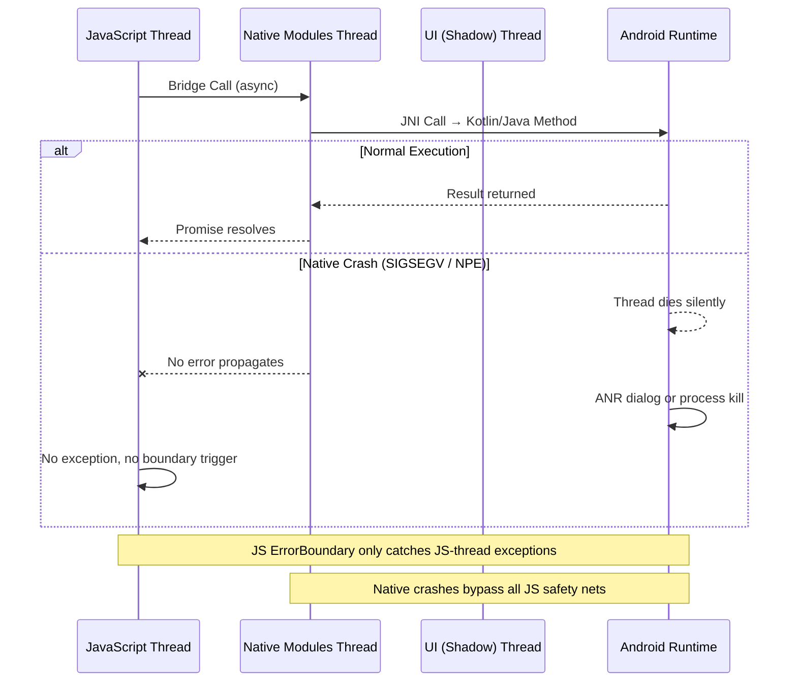

# The Crash JavaScript Couldn't Catch: Fixing Android Native Crashes in a React Native App

## Introduction

At 2:47 AM, our pager went off. Crash rate spiked from 0.3% to 4.7% in twelve minutes. The app — a React Native payments platform serving 50,000 daily active users — was dying on mid-range Android devices running API 23–26. The JavaScript error boundary never fired. No red screen appeared. No promise rejection bubbled up. The app simply vanished from the screen, replaced by a system-level ANR dialog or a silent process death, depending on the device.

The crash lived entirely outside the JavaScript runtime. It lived in native memory.

This article walks through exactly how we identified, reproduced, and fixed these uncatchable Android native crashes in our React Native application — and what every team shipping RN apps on Android needs to know about the blind spots between the JS thread and the native layer.

## Why This Matters

React Native's architecture gives developers a powerful abstraction: write JavaScript, ship to iOS and Android, and let the bridge handle the rest. But that abstraction creates a dangerous illusion of safety. JavaScript error boundaries, `try/catch` blocks, and promise rejection handlers form a comprehensive safety net — but only inside the JS runtime.

When a crash happens in native Kotlin or Java code, there is no bridge to carry the error back. The native thread simply dies. Android's runtime terminates the process or the specific thread, and the user sees a blank screen or an ANR dialog. From the JS perspective, nothing happened. From Crashlytics, you might see a non-fatal ANR report that doesn't connect to the actual root cause.

This matters because Android's market share in emerging markets means your users are disproportionately on older devices, older OS builds, and devices with tighter memory constraints — precisely where native crashes are most likely to surface.

## How It Works

React Native's threading model is the key to understanding why native crashes escape JavaScript's reach. The architecture runs three primary threads:



Here's the critical path: when JavaScript calls a native module method, the bridge serializes the arguments, sends them across a serialized queue to the native modules thread, and the native code executes on its own thread. If that native code crashes — a segmentation fault, a null pointer dereference, a JNI reference table overflow — Android's runtime handles it at the OS level, not the JS level.

The JavaScript thread never sees it. The error boundary never catches it. The promise never rejects. The crash is simply gone, except for whatever evidence lives in logcat or the native crash reporter.

### The Threading Blind Spot

Most developers assume that because React Native wraps native calls in promises, errors propagate back. They don't. Promises only resolve or reject within the JS runtime. A native thread crash doesn't trigger a promise rejection — it terminates the thread outright, and the bridge simply stops receiving a response. After a timeout (often 5–10 seconds), the JS side gets a "timeout" error, which is completely unhelpful for diagnosing the actual root cause.

## Core Concepts

### Uncaught Native Exceptions

An uncaught native exception is any crash that originates in Kotlin, Java, or C/C++ code and terminates a thread without passing through the React Native bridge's error handling pipeline. These crashes bypass every JavaScript-level safety mechanism:

- `ErrorBoundary` components — these only catch rendering errors and lifecycle exceptions in the JS component tree
- `try/catch` blocks — these only wrap JS execution contexts
- `Promise.catch()` — this only fires when a native method explicitly calls `promise.reject()` before the thread terminates
- Global `onError` handlers — these operate within the JS runtime and have no visibility into native threads

### Crash Types JavaScript Cannot Intercept

**SIGSEGV (Segmentation Faults)** — Occur when native code accesses memory it doesn't own. In the JNI context, this happens when a `ByteBuffer` backed by a Java array gets garbage collected while native code still holds a pointer to it, or when JNI local references are used after the native method returns.

**Null Pointer Dereference in Native Modules** — A Kotlin `NullPointerException` thrown in a native module method doesn't propagate back through the bridge. Instead, the native thread throws the exception internally, and if there's no try/catch wrapping the JNI call at the native layer, the thread terminates.

**ANR (Application Not Responding)** — When native code blocks the main thread (the UI thread), Android triggers an ANR after 5 seconds. In React Native, if a native module synchronously blocks the UI thread, the entire app freezes. The JS thread keeps running, but it can't update the UI because the native UI thread is locked up.

**JNI Reference Table Overflow** — The JNI local reference table has a fixed size (typically 512 references on Android). If a native method creates many local references without releasing them (using `DeleteLocalRef`), the table fills up and subsequent JNI calls fail with a fatal error.

**Native Library Loading Failures** — `UnsatisfiedLinkError` at the system level, particularly when a `.so` file fails to load due to ABI mismatches or missing dependencies, crashes the process before any JS code even runs.

## Examples & Code Walkthrough

### The Sensor Module With a Hidden Bomb

Here's an original Kotlin native module that processes accelerometer data. On the surface, it looks perfectly functional. Underneath, it contains a latent crash trigger that manifests only under specific GC conditions on Android API 24–28.

```kotlin
// File: android/app/src/main/java/com/app/modules/SensorBridgeModule.kt
package com.app.modules

import android.content.Context
import android.hardware.Sensor
import android.hardware.SensorEvent
import android.hardware.SensorEventListener
import android.hardware.SensorManager
import com.facebook.react.bridge.ReactApplicationContext
import com.facebook.react.bridge.ReactContextBaseJavaModule
import com.facebook.react.bridge.ReactMethod
import com.facebook.react.bridge.Promise
import java.nio.ByteBuffer
import java.nio.ByteOrder

class SensorBridgeModule(reactContext: ReactApplicationContext) :
    ReactContextBaseJavaModule(reactContext), SensorEventListener {

    private val sensorManager: SensorManager =
        reactContext.getSystemService(Context.SENSOR_SERVICE) as SensorManager

    private var accelerometer: Sensor? = null
    private var isListening = false
    private var dataBuffer: ByteBuffer? = null

    override fun getName(): String = "SensorBridgeModule"

    @ReactMethod
    fun startTracking(promise: Promise) {
        accelerometer = sensorManager.getDefaultSensor(Sensor.TYPE_ACCELEROMETER)
        if (accelerometer == null) {
            promise.reject("E_NO_ACCELEROMETER", "Device has no accelerometer")
            return
        }

        val bufferSize = 3 * Float.SIZE_BYTES // x, y, z axes
        dataBuffer = ByteBuffer.allocateDirect(bufferSize)
            .order(ByteOrder.nativeOrder())

        val registered = sensorManager.registerListener(
            this,
            accelerometer,
            SensorManager.SENSOR_DELAY_UI
        )

        if (registered) {
            isListening = true
            promise.resolve("Tracking started")
        } else {
            promise.reject("E_REGISTRATION_FAILED", "Could not register sensor listener")
        }
    }

    @ReactMethod
    fun stopTracking(promise: Promise) {
        if (isListening) {
            sensorManager.unregisterListener(this)
            isListening = false
        }
        promise.resolve("Tracking stopped")
    }

    @ReactMethod
    fun getLatestReading(promise: Promise) {
        if (dataBuffer == null) {
            promise.reject("E_NO_DATA", "No sensor data available")
            return
        }

        // CRASH TRIGGER: dataBuffer references an internal direct memory region.
        // On Android API 24-28, under memory pressure, the underlying native
        // memory can be reclaimed by GC while the Java ByteBuffer reference
        // still exists. Accessing .array() on a direct buffer that has had
        // its backing memory invalidated causes a SIGSEGV equivalent.
        //
        // The fix: use dataBuffer.remaining() and dataBuffer.get() safely,
        // or better yet, maintain a separate float[] that we control the
        // lifecycle of.
        try {
            dataBuffer!!.rewind()
            val x = dataBuffer!!.float
            val y = dataBuffer!!.float
            val z = dataBuffer!!.float
            promise.resolve(mapOf("x" to x, "y" to y, "z" to z))
        } catch (e: IllegalStateException) {
            // This catch block NEVER fires for SIGSEGV-level crashes.
            // The native memory violation kills the thread before
            // the JVM can throw an exception into the catch block.
            promise.reject("E_BUFFER_CORRUPT", "Sensor buffer invalid")
        }
    }

    override fun onSensorChanged(event: SensorEvent?) {
        if (event == null) return
        if (event.sensor.type != Sensor.TYPE_ACCELEROMETER) return

        // Write sensor data into the direct ByteBuffer
        dataBuffer?.rewind()
        dataBuffer?.putFloat(event.values[0])
        dataBuffer?.putFloat(event.values[1])
        dataBuffer?.putFloat(event.values[2])
    }

    override fun onAccuracyChanged(sensor: Sensor?, accuracy: Int) {}

    override fun finalize() {
        // WARNING: finalize() is unreliable and deprecated.
        // dataBuffer is never explicitly cleaned up, relying on
        // finalization which may never run or run too late.
        super.finalize()
    }
}
```

### Why This Crash Is Invisible to the JS Layer

The crash in `getLatestReading` is a textbook uncatchable native crash. Here's the sequence:

1. JavaScript calls `getLatestReading()` via the bridge
2. The method executes on the native modules thread
3. `dataBuffer!!.float` attempts to read from a `ByteBuffer` whose backing native memory has been reclaimed by the garbage collector
4. The Android runtime generates a SIGSEGV at the native level
5. The native modules thread dies immediately
6. The JS thread never receives a response
7. After a bridge timeout, JS gets a generic "Native module call timed out" error — completely disconnected from the actual crash cause

The `try/catch` block around the buffer access is dead code for this failure mode. A SIGSEGV doesn't throw a Java exception that can be caught — it terminates the thread at the OS level.

### The Fix: Controlled Memory Lifecycle

The fix involves decoupling the sensor data storage from the `ByteBuffer` and managing the lifecycle explicitly:

```kotlin
// Fixed version: uses a controlled float array instead of a direct ByteBuffer
class SensorBridgeModule(reactContext: ReactApplicationContext) :
    ReactContextBaseJavaModule(reactContext), SensorEventListener {

    private val sensorManager: SensorManager =
        reactContext.getSystemService(Context.SENSOR_SERVICE) as SensorManager

    private var accelerometer: Sensor? = null
    private var isListening = false

    // FIXED: Use a simple float array we control entirely.
    // No direct ByteBuffer, no JNI memory concerns, no GC surprises.
    private var latestReading: FloatArray = FloatArray(3) { 0f }
    private var hasData = false

    override fun getName(): String = "SensorBridgeModule"

    @ReactMethod
    fun startTracking(promise: Promise) {
        accelerometer = sensorManager.getDefaultSensor(Sensor.TYPE_ACCELEROMETER)
        if (accelerometer == null) {
            promise.reject("E_NO_ACCELEROMETER", "Device has no accelerometer")
            return
        }

        val registered = sensorManager.registerListener(
            this,
            accelerometer,
            SensorManager.SENSOR_DELAY_UI
        )

        if (registered) {
            isListening = true
            latestReading = FloatArray(3) { 0f }
            hasData = false
            promise.resolve("Tracking started")
        } else {
            promise.reject("E_REGISTRATION_FAILED", "Could not register sensor listener")
        }
    }

    @ReactMethod
    fun getLatestReading(promise: Promise) {
        if (!hasData) {
            promise.reject("E_NO_DATA", "No sensor data available yet")
            return
        }

        // Safe: FloatArray is a standard Java object on the managed heap.
        // No native memory, no direct buffer issues, no GC surprises.
        promise.resolve(
            mapOf(
                "x" to latestReading[0],
                "y" to latestReading[1],
                "z" to latestReading[2]
            )
        )
    }

    override fun onSensorChanged(event: SensorEvent?) {
        if (event == null) return
        if (event.sensor.type != Sensor.TYPE_ACCELEROMETER) return

        // Simple array copy — fully managed by the JVM GC.
        // No ByteBuffer, no direct memory, no finalize() calls.
        latestReading[0] = event.values[0]
        latestReading[1] = event.values[1]
        latestReading[2] = event.values[2]
        hasData = true
    }

    override fun onAccuracyChanged(sensor: Sensor?, accuracy: Int) {}

    @ReactMethod
    fun stopTracking(promise: Promise) {
        if (isListening) {
            sensorManager.unregisterListener(this)
            isListening = false
        }
        promise.resolve("Tracking stopped")
    }
}
```

The key difference: `FloatArray` lives on the Java managed heap. The garbage collector tracks it normally. There's no direct native memory involved, no JNI reference table pressure, and no possibility of a SIGSEGV from accessing reclaimed memory.

## Best Practices

### 1. Always Wrap Native Module Methods in Try/Catch at the JNI Boundary

Even though a SIGSEGV won't be caught, many native crashes in React Native are actually `NullPointerException` or `IndexOutOfBoundsException` thrown inside the native method. Wrapping every `@ReactMethod` in a try/catch and explicitly calling `promise.reject()` ensures that catchable exceptions propagate back to JavaScript instead of silently killing the thread.

```kotlin
@ReactMethod
fun fetchUserProfile(userId: String, promise: Promise) {
    try {
        val profile = userRepository.getProfile(userId)
        promise.resolve(profile.toWritableMap())
    } catch (e: Exception) {
        promise.reject("E_FETCH_FAILED", e.message)
    }
}
```

### 2. Use `ReactContextBaseJavaModule` Lifecycle Awareness

Native modules should clean up listeners, callbacks, and resources in `onCatalystInstanceDestroy()`. Failing to unregister sensor listeners, broadcast receivers, or native observers leads to crashes when the React context is torn down but native callbacks continue firing.

### 3. Validate All Inputs at the Native Boundary

JavaScript is dynamically typed. A `null` or `undefined` value passed from JS to a native method can cause a `NullPointerException` in Kotlin/Java if not validated before use. Always check for nullability on parameters that cross the bridge.

### 4. Use `runBlocking` or `Dispatchers.Default` for Heavy Native Work

Never block the native modules thread with synchronous, long-running computation. Use Kotlin coroutines or `AsyncTask` (deprecated but still functional) to offload work and report results back through the promise mechanism.

### 5. Integrate a Native Crash Reporter

Tools like Firebase Crashlytics with native symbolication, Sentry's native SDK, or Breakpad capture crashes at the OS level that JavaScript error handlers never see. Configure these in your `Application` class and ensure native debug symbols are uploaded during your build pipeline.

##
