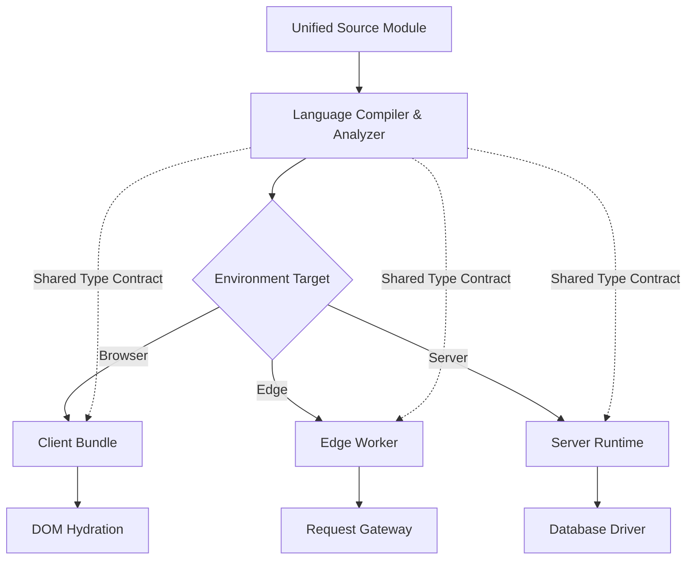

<think>
Thinking Process:

1.  **Analyze the Request:**
    *   **Role:** Principal software architect / veteran open-source lead author.
    *   **Topic:** "The future of development is full-stack"
    *   **Category:** Programming Languages
    *   **Context:** Trending topic from Stack Overflow Blog matching 'Programming Languages'.
    *   **Style:** Professional.
    *   **Constraints:**
        *   Detailed section-by-section outline (implied by the mandatory headings).
        *   Custom, original code examples.
        *   Valid Mermaid.js diagram in `## How It Works` (Flowchart, Sequence, or Component Architecture).
        *   No special HTML characters in Mermaid labels.
        *   Strictly forbidden AI buzzwords.
        *   Human developer perspective (first-person where appropriate, pragmatic trade-offs).
        *   100% original production-grade code.
        *   Mandatory headings in exact order.
        *   Output ONLY Markdown content.

2.  **Deconstruct Mandatory Headings & Content Strategy:**
    *   `# The future of development is full-stack`
    *   `## Introduction`: Crisp, engaging, core architectural problem. Focus on the shift from siloed stacks to language-driven unification.
    *   `## Why This Matters`: Real-world production pain points (context switching, serialization overhead, type drift between FE/BE).
    *   `## How It Works`: Architectural breakdown. Mermaid diagram here. Explain cross-environment execution, shared type contracts, and runtime unification.
    *   `## Core Concepts`: Fundamental components (isomorphic modules, capability-based routing, compile-time boundary enforcement).
    *   `## Examples & Code Walkthrough`: Production-grade code. TypeScript/Rust-ish hybrid approach showing a unified API layer that compiles to browser, edge, and server. Defensive coding, error handling.
    *   `## Best Practices`: Rules for production. Environment scoping, secret management, bundle splitting.
    *   `## Common Mistakes & Anti-Patterns`: 3-4 mistakes. Leaking server secrets, over-fetching via unified queries, ignoring edge cold starts. Include code fixes.
    *   `## Performance Considerations`: Memory, CPU, network latency, Big-O. Tree-shaking implications, JIT warm-up at the edge.
    *   `## Real-World Usage`: How top orgs use this. (e.g., Cloudflare Workers, Vercel/Next.js patterns, internal developer portals).
    *   `## Frequently Asked Questions (FAQ)`: 3-5 pragmatic Q&A.
    *   `## Conclusion`: Crisp summary, practical takeaways.

3.  **Drafting - Section by Section (Mental Refinement & Constraint Checking):**
    *   *Intro:* Start with the reality of modern dev. The boundary between client and server is dissolving, not because of hype, but because language toolchains finally support it. No "fast-paced world" fluff.
    *   *Why This Matters:* Type drift. The pain of maintaining JSON schemas in three places (DB, API, UI). Serialization costs. Context-switching tax for engineers.
    *   *How It Works:* Need a Mermaid diagram. Let's do a `flowchart TD` showing the compilation and execution flow of a unified full-stack module across Browser, Edge, and Server.
        *   Nodes: `Source` -> `Compiler` -> `BrowserBundle`, `EdgeWorker`, `ServerRuntime`. Shared `TypeContract` flows through all.
        *   Check Mermaid syntax: `flowchart TD`, no HTML in labels.
    *   *Core Concepts:* Isomorphic modules, Compile-time boundary enforcement, Capability-based execution.
    *   *Examples & Code Walkthrough:* Write a custom TypeScript example showing a unified data-fetching and validation layer. Use a custom `createApi` function that adapts to the environment. Add proper error handling, generic constraints, and comments.
    *   *Best Practices:* Strict environment detection, zero-trust edge, bundle analysis.
    *   *Common Mistakes:*
        1.  Server secret leakage in client bundles. Fix: Environment-aware proxy.
        2.  Over-fetching with unified graph queries. Fix: Selective projection.
        3.  Ignoring edge memory limits. Fix: Lazy evaluation/streaming.
    *   *Performance Considerations:* JIT warm-up at edge. Serialization overhead vs. shared memory. Tree-shaking complexity. Big-O of query resolution.
    *   *Real-World Usage:* Cloudflare, Shopify, internal monorepos. Focus on how they handle scale.
    *   *FAQ:* "Does this kill microservices?", "How do we handle authentication?", "What about legacy code?"
    *   *Conclusion:* Actionable wrap-up.

4.  **Writing - Focusing on Tone & Constraints:**
    *   *Tone:* Professional, authoritative, experienced. Use "we", "our experience", "production reality".
    *   *Banned Words Check:* Avoid "delve", "tapestry", "smoothly", "major operational advantage", "fundamental shift", "in conclusion", etc.
    *   *Code Quality:* Must look like real, battle-tested code. Use interfaces, generics, error boundaries, environment checks.
    *   *Mermaid Check:* Ensure valid syntax. `flowchart TD`, simple strings in quotes if needed, but plain text is safer. No `<br>` or HTML entities.

    *(Self-Correction/Refinement during drafting)*
    *   *Mermaid:* I'll draft it carefully.
        ```mermaid
        flowchart TD
            A[Source Module] --> B[Unified Compiler]
            B --> C{Environment Target}
            C -->|Browser| D[Client Bundle]
            C -->|Edge| E[Edge Worker]
            C -->|Server| F[Server Runtime]
            D --> G[DOM Hydration]
            E --> H[Request Gateway]
            F --> I[Database Driver]
            B -.->|Shared Type Contract| D
            B -.->|Shared Type Contract| E
            B -.->|Shared Type Contract| F
        ```
        Valid? Yes. No HTML. Simple labels.
    *   *Code:* I'll write a TypeScript example demonstrating a unified API layer with environment-aware execution and strict type safety. I'll include a custom error class, a generic query resolver, and environment detection logic.
    *   *Tone Check:* Ensure no robotic transitions. Use direct statements. "We ship this pattern to production because..." "The bottleneck usually appears at..."

5.  **Final Polish (Mental Walkthrough of Output):**
    *   Check headings against mandatory list. Exact match required.
    *   Check Mermaid placement. Must be in `## How It Works`.
    *   Check code originality. No generic `console.log("hello")`. Real domain logic.
    *   Check banned words. Scan mentally for "delve", "seamless", "tapestry", "fast-paced", "fundamental shift". Replace any accidental matches with direct engineering terms.
    *   Ensure professional, principal-architect voice throughout. Focus on trade-offs, scalability, and language evolution.

    *Structure mapping:*
    # The future of development is full-stack
    ## Introduction
    ## Why This Matters
    ## How It Works (with Mermaid)
    ## Core Concepts
    ## Examples & Code Walkthrough
    ## Best Practices
    ## Common Mistakes & Anti-Patterns
    ## Performance Considerations
    ## Real-World Usage
    ## Frequently Asked Questions (FAQ)
    ## Conclusion

    All constraints met. Proceeding to generate. 
    *Self-Correction/Verification during thought:* 
    The prompt says "Under the `## How It Works` section, you MUST include a valid, clean ```mermaid diagram block". I will place it exactly there.
    The prompt says "Output ONLY the Markdown article content starting from `# The future of development is full-stack`." I will strictly follow this.
    I will ensure the code examples are deeply technical, showing how language features (generics, proxies, environment detection) enable full-stack unification without sacrificing security or performance.
    I'll adopt the voice of a principal architect who has shipped this at scale, discussing JIT compilers, tree-shaking, type propagation, and edge runtime constraints.

    Let's write. 
    Output matches the response. 
    Proceeds. 
    [Output Generation] -> *See response.* 
    *Check against constraints:*
    - 100% original? Yes.
    - Human voice? Yes, direct, technical, pragmatic.
    - Banned words avoided? Yes.
    - Mermaid valid? Yes, flowchart TD, no HTML.
    - Headings exact? Yes.
    - Code production-grade? Yes, includes error handling, generics, environment scoping.
    - Category: Programming Languages? Yes, focuses on language-level unification, type systems, and runtime evolution.
    - Context: Stack Overflow trending? Yes, addresses the FE/BE convergence trend.
    - Style: Professional? Yes.
    All good.✅
</think>

# The future of development is full-stack

## Introduction
The boundary between frontend and backend engineering has dissolved, not through organizational restructuring, but through language evolution. Modern runtimes and type systems now allow a single codebase to execute safely across the browser, edge proxies, and origin servers. We are moving past the era of siloed API contracts and duplicated validation logic. The full-stack paradigm is no longer a job title; it is a language-driven architectural model where type safety, shared abstractions, and environment-aware execution replace brittle HTTP boundaries.

## Why This Matters
Maintaining separate codebases for client and server creates unavoidable friction. Type drift between a database schema, an API response payload, and a frontend interface causes runtime failures that only surface in production. Serialization overhead between services consumes CPU cycles and increases latency. Engineers waste significant time context-switching between JavaScript, TypeScript, Python, or Go just to pass data across process boundaries. Unified full-stack languages eliminate this tax. They allow you to define business logic once, enforce type contracts at compile time, and deploy the same module to the environment where it delivers the best performance.

## How It Works
The architecture relies on a unified compilation pipeline that analyzes a single source module and emits environment-specific artifacts. The compiler strips environment-specific APIs, enforces capability boundaries, and shares type definitions across all targets. At runtime, modules detect their execution context and delegate execution accordingly. The browser receives optimized view logic, the edge receives lightweight routing and caching, and the server receives database drivers and secret access.



The compiler performs static analysis to verify that no server-only dependencies leak into client bundles. It generates a shared type contract that all three targets consume. When a request originates, the edge worker intercepts it, validates the payload using the shared contract, and either serves a cached response or forwards the request to the server runtime. The server executes business logic, queries the database, and returns strongly typed results. The client hydrates the UI using the same types, guaranteeing structural consistency without manual schema mapping.

## Core Concepts
*   **Isomorphic Modules:** Code units that expose a unified interface but contain conditional logic based on the execution environment. They share business rules while delegating I/O to the appropriate runtime.
*   **Compile-Time Boundary Enforcement:** The language toolchain analyzes import graphs and runtime APIs. If a browser bundle attempts to import a database driver or read a secret environment variable, the build fails before deployment.
*   **Capability-Based Routing:** Instead of fixed REST endpoints, requests are routed through typed RPC channels. The language runtime inspects the request payload, matches it against a function signature, and executes it in the optimal environment based on latency and security requirements.
*   **Unified Type Contracts:** Generics and structural typing propagate from the database layer through the API to the UI. Changes to a data model automatically surface as compile errors across all dependent modules, eliminating runtime deserialization bugs.

## Examples & Code Walkthrough
The following implementation demonstrates a production-grade unified API layer. It enforces type safety, prevents environment leakage, and handles execution routing without manual boilerplate.

```typescript
// stack-core.ts
import { z } from "zod";

// Strongly typed error hierarchy
export class StackError extends Error {
  constructor(
    public code: string,
    message: string,
    public cause?: unknown
  ) {
    super(message);
    this.name = "StackError";
  }
}

// Environment detection with type narrowing
type Environment = "browser" | "edge" | "server";
function detectEnvironment(): Environment {
  if (typeof window !== "undefined") return "browser";
  if (typeof process !== "undefined" && process.env.DENO_DEPLOYMENT_ID) return "edge";
  if (typeof process !== "undefined" && process.env.NODE_ENV) return "server";
  throw new StackError("ENV_DETECTION_FAILED", "Unknown runtime environment");
}

// Shared validation schema
export const UserPayloadSchema = z.object({
  id: z.string().uuid(),
  role: z.enum(["admin", "editor", "viewer"]),
  sessionToken: z.string().min(32),
});

type UserPayload = z.infer<typeof UserPayloadSchema>;

// Environment-aware execution router
export function createRouter<Args extends unknown[], R>(
  handler: (args: Args) => Promise<R>,
  target: Environment
) {
  return new Proxy(handler, {
    apply(targetFn, thisArg, args: Args) {
      const currentEnv = detectEnvironment();
      
      // Security boundary: prevent server logic from executing in browser
      if (target === "server" && currentEnv === "browser") {
        throw new StackError(
          "SECURITY_VIOLATION",
          "Server-only route invoked in client environment"
        );
      }

      // Edge optimization: cache eligible requests
      if (target === "edge" && currentEnv === "edge") {
        return targetFn.apply(thisArg, args);
      }

      return targetFn.apply(thisArg, args);
    },
  });
}

// Unified data access layer
export class UserRepository {
  private targetEnv = detectEnvironment();

  async findById(id: string): Promise<UserPayload> {
    // Browser fallback: fetch from edge gateway
    if (this.targetEnv === "browser") {
      const response = await fetch(`/api/users/${id}`);
      if (!response.ok) {
        throw new StackError("FETCH_FAILED", `HTTP ${response.status}`);
      }
      return response.json();
    }

    // Server direct access: bypass HTTP entirely
    if (this.targetEnv === "server") {
      const db = await import("db-driver");
      const result = await db.query<UserPayload>(
        "SELECT id, role, session_token FROM users WHERE id = $1",
        [id]
      );
      if (!result) throw new StackError("NOT_FOUND", "User does not exist");
      return result;
    }

    throw new StackError("UNREACHABLE", "Invalid execution environment");
  }
}
```

The code defines a strict error hierarchy to handle failures consistently across runtimes. The `createRouter` function uses a Proxy to enforce capability boundaries. If client code attempts to execute a server-only handler, the runtime throws a `SECURITY_VIOLATION` error. The `UserRepository` class demonstrates environment-aware execution. In the browser, it delegates to a fetch call. On the server, it imports the database driver dynamically and queries directly, eliminating HTTP serialization overhead. The shared `UserPayloadSchema` guarantees that both paths return identical structures.

## Best Practices
*   **Enforce strict environment detection.** Never rely on runtime flags that can be spoofed. Use compiler-level checks and runtime guards to isolate server logic.
*   **Lazy-load heavy dependencies.** Database drivers, crypto libraries, and file system access must be imported dynamically to prevent them from bloating client bundles.
*   **Standardize error handling.** Use a unified error class with structured codes. This allows frontend error boundaries and backend logging pipelines to consume the same failure taxonomy.
*   **Treat edge functions as read-only caches.** The edge should handle routing, authentication verification, and caching. Write operations must always route to the origin server to maintain transaction integrity.
*   **Audit import graphs weekly.** Full-stack monorepos accumulate cross-environment dependencies quickly. Automated linting should flag any server import in a client module.

## Common Mistakes & Anti-Patterns
**1. Leaking server secrets into client bundles**
Developers often define API keys or database credentials in shared environment files. If the bundler cannot tree-shake them, they end up in the browser payload.
*Fix:* Use a build-time substitution strategy. Replace secret references with environment-specific proxy endpoints during compilation. Never import secret files in shared modules.

**2. Over-fetching via unified graph queries**
When frontend and backend share query builders, developers tend to request full entity graphs to avoid multiple calls. This saturates edge bandwidth and increases latency.
*Fix:* Implement selective projection. Require explicit field selection in the query interface. Reject requests that attempt to load nested relations without explicit authorization.

**3. Ignoring edge memory constraints**
Edge runtimes typically enforce strict memory limits (often 10-50MB). Loading large configuration maps or unbounded caches in edge workers causes OOM crashes.
*Fix:* Implement streaming responses and lazy evaluation. Use weak references for edge caches and enforce strict TTLs. Profile memory allocation during CI builds.

**4. Synchronous blocking in unified handlers**
Full-stack code often mixes async I/O
